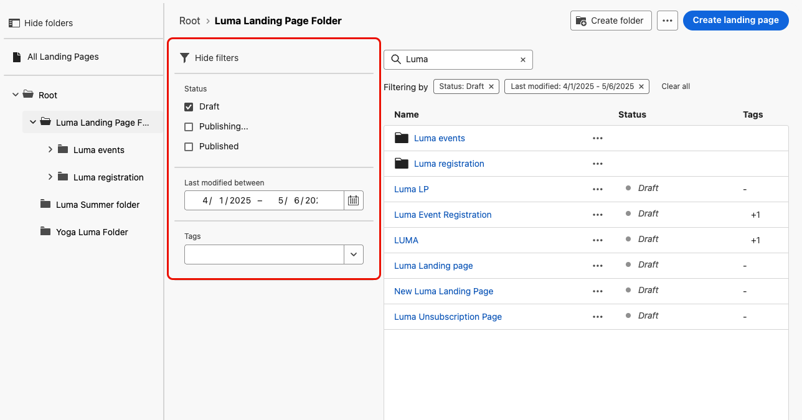

# Create and publish landing pages {#create-lp}

>[!CAUTION]
>
>The use of landing pages is currently available in early access to select users only. If you want to leverage this feature, contact your Adobe account executive.

## Access landing pages {#access-landing-pages}

**[!UICONTROL Journey Management]****[!UICONTROL Landing pages]**

**[!UICONTROL Landing Pages]** You can filter them based on their status or modification date.

## Creación de una página de destino {#create-landing-page}

The steps to create a landing page are as follows.

1. **[!UICONTROL Create landing page]**

   

1. Add a title. You can add a description if needed.

   

1. Select a preset.

   

   >[!NOTE]
   >
   >

1. Haga clic en **[!UICONTROL Create]**.

1. The primary page and its properties display. 

   

1. Click the + icon to add a subpage. 

   

## Configure the primary page {#configure-primary-page}

The primary page is the page that is immediately displayed to the users after they click the link to your landing page, such as from an email or a website.

To define the primary page settings, follow the steps below.

1. **[!UICONTROL Primary page]**

1. Edit the content of your page using the content designer. 

   

1. Define your landing page URL. The first part of the URL requires the domain delegation to be performed. It is pre-filled and cannot be edited through the user interface. 

   >[!CAUTION]
   >
   >The landing page URL must be unique.

   

1. You can define an expiry date for your page. In that case, you must select an action upon page expiry:

   * **[!UICONTROL Redirect URL]**
   * **[!UICONTROL Custom page]**
   * **[!UICONTROL Browser error]**

   

   <!--1. In the **[!UICONTROL Additional data]** section, define a **[!UICONTROL Key]** and the corresponding **[!UICONTROL Parameter value]**. // you can define how the data entered in the landing page is managed once it has been submitted by a user??-->

1. **[!UICONTROL Subscription list]**

   

1.  

   

   **[!UICONTROL Create journey]****[!UICONTROL Journey Management]****[!UICONTROL Journeys]**

## Configure subpages {#configure-subpages}

You can add up to 2 subpages. For example, you can create a &#39;thank you&#39; page that will display once the users submit the form, and you can define an error page that will be called if a problem occurs with the landing page.

To define the subpage settings, follow the steps below.

1. **[!UICONTROL Subpage 1]**

1. Edit the content of your page using the content designer. 

1. Define your landing page URL. The first part of the URL requires the domain delegation to be performed. It is pre-filled and cannot be edited through the user interface. 

   >[!CAUTION]
   >
   >The landing page URL must be unique.

## Test the landing page {#test-landing-page}

Once your landing page settings and content have been defined, you can use test profiles to preview it. 

>[!CAUTION]
>
>You need to have test profiles available to be able to preview your messages and send proofs. 

1. **[!UICONTROL Preview & test]**

   

   >[!NOTE]
   >
   >**[!UICONTROL Preview]**

1. **[!UICONTROL Preview & test]**

   

   The steps to select test profiles are the same as when testing a message. Se detallan en [esta sección](../messages/preview.md#select-test-profiles).

1. **[!UICONTROL Preview]****[!UICONTROL Open preview]**

   

1. The preview of your landing page opens in a new tab. Personalized elements are replaced by the selected test profile data.

   

1. Select other test profiles to preview the rendering for each variant of your landing page.

## Comprobación de alertas {#check-alerts}

While you are creating your landing page, alerts warn you when you need to take important actions before publishing.

Alerts are displayed on top right of the screen, as shown below:

>[!NOTE]
>
>If you do not see this button, no alert has been detected.

Two types of alerts can happen:

* ****<!--For example, a message will display if -->

* **** For example, you will get a warning if the primary page URL is missing.

<!--All possible warnings and errors are detailed [below](#alerts-and-warnings).-->

>[!CAUTION]
>
> ****

<!--The settings and elements checked by the system are listed below. You will also find information on how to adapt your configuration to resolve the corresponding issues.

**Warnings**:

* 

**Errors**:

* 

>[!CAUTION]
>
> To be able to publish your message, you need to resolve all **error** alerts.
-->

## Publish the landing page {#publish-landing-page}

Once your landing page is ready, you can publish it to make it available for use in a message.

>[!CAUTION]
>
>Before publishing, check and resolve alerts. [Más información](#check-alerts)

**[!UICONTROL Published]**

[!DNL Journey Optimizer]

>[!NOTE]
>
>You can monitor your landing page impacts through specific reports. [Más información](lp-report.md)

