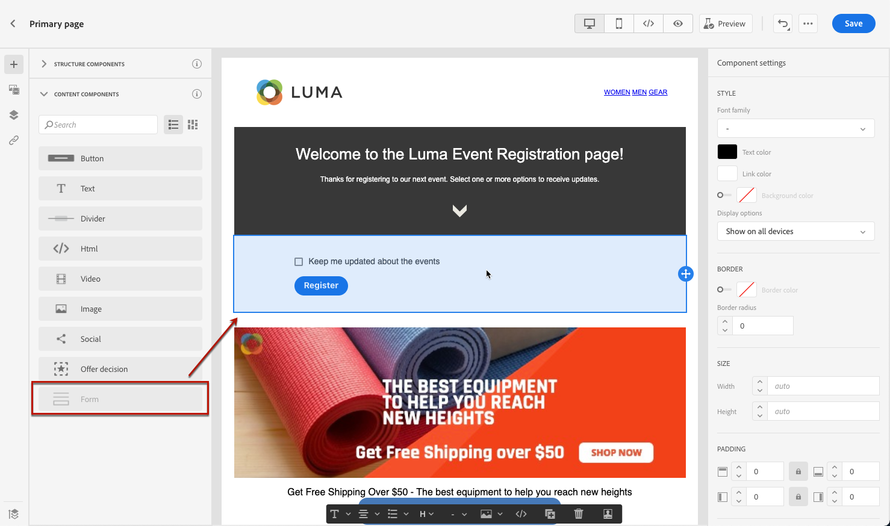
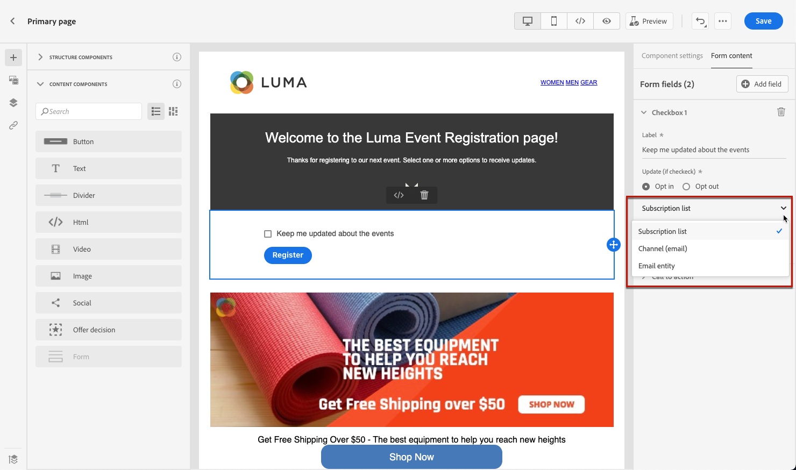
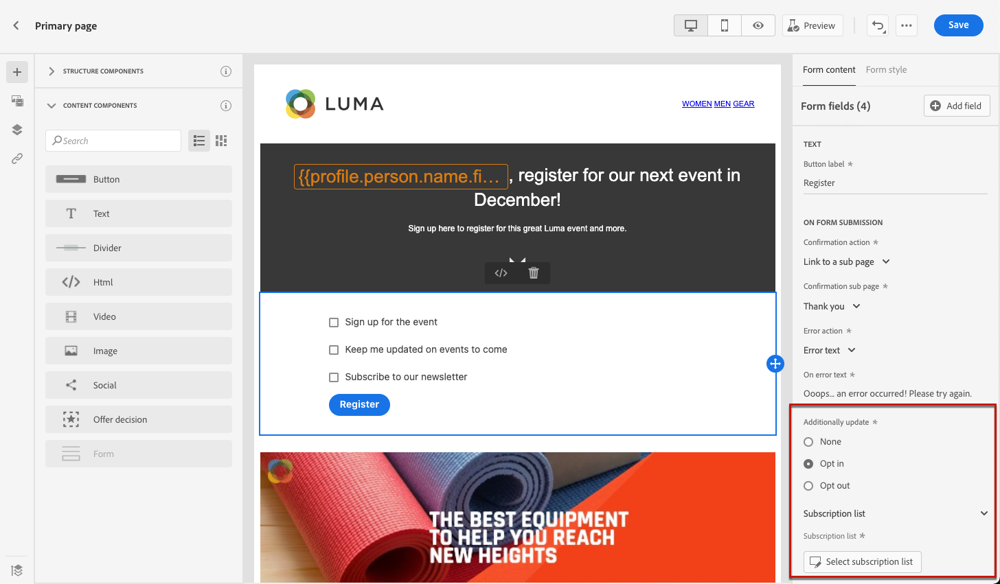
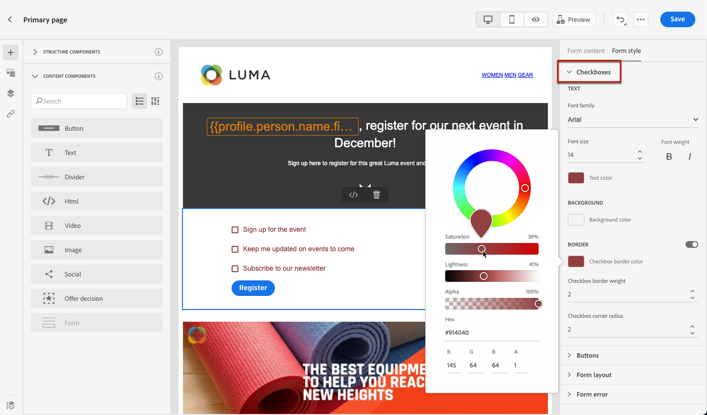
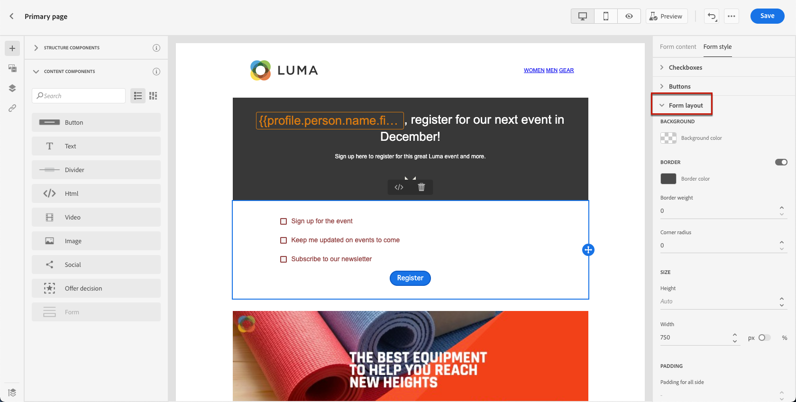

# Diseño del contenido de la página de aterrizaje {#design-lp-content}

Para empezar a crear contenido para el aterrizaje [página principal](create-lp.md#configure-primary-page) o [subpágina](create-lp.md#configure-subpages), pase el ratón sobre el contenido de la página principal y haga clic en **[!UICONTROL Open Designer]**. También puede hacer clic en el botón correspondiente desde la paleta derecha.

Desde allí puede:

* **Diseño de la página de aterrizaje desde cero** a través de la interfaz del diseñador de contenido y aproveche las imágenes de [Adobe Experience Manager Assets Essentials](../messages/assets-essentials.md). Aprenda a diseñar su contenido o a utilizar plantillas integradas [en esta sección](../messages/create-email-content.md).

* **HTML sin procesar de código o pegado** directamente en el diseñador de contenido. Aprenda a codificar su propio contenido [en esta sección](../messages/existing-content.md#import-raw-html-code).

* **Importar contenido de HTML existente** desde un archivo o una carpeta .zip. Obtenga información sobre cómo importar contenido [en esta sección](../messages/existing-content.md#import-html-content-from-file).

>[!NOTE]
>
>El diseñador de contenido de páginas de aterrizaje es similar al diseñador de correo electrónico. Más información sobre [diseño de contenido con [!DNL Journey Optimizer]](../messages/design-emails.md).

## Definición del contenido específico de una página de aterrizaje {#define-lp-specific-content}

Para definir contenido específico que permita a los usuarios seleccionar y enviar sus opciones desde la página de aterrizaje, siga los pasos a continuación.

1. Arrastre y suelte el elemento específico de la página de aterrizaje **[!UICONTROL Form]** de la paleta izquierda al espacio de trabajo principal.

   

   >[!NOTE]
   >
   >La variable **[!UICONTROL Form]** solo se puede utilizar una vez en la misma página.

1. Selecciónelo. La variable **[!UICONTROL Form content]** se muestra en la paleta derecha para permitirle editar los distintos campos del formulario.

   

   >[!NOTE]
   >
   >Cambie a la **[!UICONTROL Form style]** para editar los estilos del contenido del componente del formulario en cualquier momento. [Más información](#define-lp-styles)

1. En el **[!UICONTROL Checkbox 1]** , puede editar la etiqueta correspondiente a esta casilla de verificación.

1. Defina si esta casilla de verificación debe incluir o excluir usuarios: ¿aceptan recibir comunicaciones o piden que no se les contacte más?

   

1. Elija lo que se actualizará entre las tres siguientes opciones:

   

   * **[!UICONTROL Subscription list]**: Debe seleccionar la lista de suscripción que se actualizará si el perfil selecciona esta casilla de verificación. Más información sobre [listas de suscripción](subscription-list.md).

      

   * **[!UICONTROL Channel (email)]**: La inclusión o exclusión se aplica a todo el canal. Por ejemplo, si un perfil que decide excluirse tiene dos direcciones de correo electrónico, ambas se excluirán de todas las comunicaciones.

   * **[!UICONTROL Email identity]**: La opción de inclusión o exclusión solo se aplica a la dirección de correo electrónico que se utilizó para acceder a la página de aterrizaje. Por ejemplo, si un perfil tiene dos direcciones de correo electrónico, solo el que se utilizó para la inclusión recibirá comunicaciones de su marca.

1. Haga clic en **[!UICONTROL Add field]** > **[!UICONTROL Checkbox]** para agregar otra casilla de verificación. Repita los pasos anteriores para definir sus propiedades.

   

1. Una vez agregadas todas las casillas de verificación deseadas, haga clic en **[!UICONTROL Call to action]** para expandir la sección correspondiente. Permite definir el comportamiento del botón en la variable **[!UICONTROL Form]** componente.

   

1. Defina lo que sucederá al hacer clic en el botón :

   * **[!UICONTROL Redirect URL]**: Introduzca la dirección URL de la página a la que se redirigirá a los usuarios.
   * **[!UICONTROL Confirmation text]**: Escriba el texto de confirmación que se mostrará.
   * **[!UICONTROL Link to a subpage]**: Configure un [subpágina](create-lp.md#configure-subpages) y selecciónela en la lista desplegable que se muestra.

   

1. Defina lo que sucederá al hacer clic en el botón en caso de que se produzca un error:

   * **[!UICONTROL Redirect URL]**: Introduzca la dirección URL de la página a la que se redirigirá a los usuarios.
   * **[!UICONTROL Error text]**: Escriba el texto del error que se mostrará. Puede obtener una vista previa del texto del error al definir la variable [estilos de formulario](#define-lp-styles).

   * **[!UICONTROL Link to a subpage]**: Configure un [subpágina](create-lp.md#configure-subpages) y selecciónela en la lista desplegable que se muestra.

   

1. Si desea realizar más actualizaciones al enviar el formulario, seleccione **[!UICONTROL Opt in]** o **[!UICONTROL Opt out]** y defina si desea actualizar una lista de suscripción, el canal o solo la dirección de correo electrónico utilizada.

   

1. Guarde el contenido y haga clic en la flecha situada junto al nombre de la página para volver al [propiedades de página de aterrizaje](create-lp.md#configure-primary-page).

   

<!--Will the name Email Designer be kept if you can also design LP with the same tool? > To modify in Messages section > content designer or Designer-->

## Definir estilos de formulario de una página de aterrizaje {#define-lp-styles}

1. Para modificar los estilos del contenido del componente del formulario, cambie en cualquier momento a la función **[!UICONTROL Form style]** pestaña .

   

1. Expanda el **[!UICONTROL Checkboxes]** para definir el aspecto de las casillas de verificación y el texto correspondiente. Por ejemplo, puede ajustar la familia o el tamaño de la fuente y el color del borde de la casilla de verificación.

   

1. Expanda el **[!UICONTROL Buttons]** para modificar el aspecto del botón en el formulario de componentes. Por ejemplo, puede añadir un borde, editar el color de la etiqueta al pasar el ratón por encima o ajustar la alineación del botón.

   

   Puede obtener una vista previa de algunos ajustes, como el color de la etiqueta del botón al pasar el ratón por encima del ratón **[!UICONTROL Preview]** botón. Obtenga más información sobre la prueba de páginas de aterrizaje [here](create-lp.md#test-landing-page).

   

1. Expanda el **[!UICONTROL Form layout]** para editar los ajustes del diseño, como el color de fondo, el relleno o el margen.

   

1. Expanda el **[!UICONTROL Form error]** para ajustar la visualización del mensaje de error que se muestra en caso de que se produzca un problema. Marque la opción correspondiente para obtener una vista previa del texto del error en el formulario.

   

