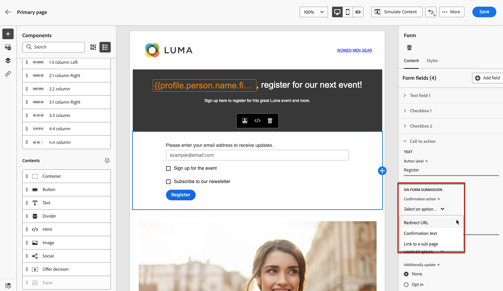

# Definición del contenido específico de una página de aterrizaje {#lp-content}

Para definir contenido específico que permita a los usuarios seleccionar y enviar sus opciones desde la página de aterrizaje, use la variable **[!UICONTROL Formulario]** componente. Para ello, siga los pasos que aparecen a continuación.

>[!NOTE]
>
>También puede crear una página de aterrizaje de pulsaciones sin **[!UICONTROL Formulario]** componente. En ese caso, la página de aterrizaje se mostrará a los usuarios, pero no se les pedirá que envíen ningún formulario. Esto puede resultar útil si solo desea mostrar una página de aterrizaje sin requerir ninguna acción por parte de los destinatarios, como la inclusión o la exclusión, o si desea proporcionar información que no requiera la entrada del usuario.

## Uso del componente de formulario {#use-form-component}

1. Arrastre y suelte el elemento específico de la página de aterrizaje **[!UICONTROL Formulario]** de la paleta izquierda al espacio de trabajo principal.

   

   >[!NOTE]
   >
   >La variable **[!UICONTROL Formulario]** solo se puede utilizar una vez en la misma página.

1. Selecciónelo. La variable **[!UICONTROL Contenido del formulario]** se muestra en la paleta derecha para permitirle editar los distintos campos del formulario.

   

   >[!NOTE]
   >
   >Cambie a la **[!UICONTROL Estilo de formulario]** para editar los estilos del contenido del componente del formulario en cualquier momento. [Más información](#define-lp-styles)

1. En el **[!UICONTROL Casilla de verificación 1]** , puede editar la etiqueta correspondiente a esta casilla de verificación.

1. Defina si esta casilla de verificación debe incluir o excluir usuarios: ¿aceptan recibir comunicaciones o piden que no se les contacte más?

   

   Seleccione entre las tres opciones siguientes:

   * **[!UICONTROL Opt-in si está marcado]**: los usuarios deben marcar la casilla de verificación para aceptar (adhesión).
   * **[!UICONTROL Exclusión si está marcada]**: los usuarios deben marcar la casilla para eliminar su consentimiento (exclusión).
   * **[!UICONTROL Opt-in si está activado, opt-out si no está activado]**: esta opción le permite insertar una sola casilla de verificación para la inclusión/exclusión. Los usuarios deben marcar la casilla de verificación para el consentimiento (inclusión) y desmarcar para eliminar su consentimiento (exclusión).

1. Elija lo que se actualizará entre las tres siguientes opciones:

   

   * **[!UICONTROL Lista de suscripciones]**: Debe seleccionar la lista de suscripción que se actualizará si el perfil selecciona esta casilla de verificación. Más información sobre [listas de suscripción](subscription-list.md).

      

   * **[!UICONTROL Canal (correo electrónico)]**: La inclusión o exclusión se aplica a todo el canal. Por ejemplo, si un perfil que decide excluirse tiene dos direcciones de correo electrónico, ambas se excluirán de todas las comunicaciones.

   * **[!UICONTROL Identidad del correo electrónico]**: La opción de inclusión o exclusión solo se aplica a la dirección de correo electrónico que se utilizó para acceder a la página de aterrizaje. Por ejemplo, si un perfil tiene dos direcciones de correo electrónico, solo el que se utilizó para la inclusión recibirá comunicaciones de su marca.

1. Haga clic en **[!UICONTROL Añadir campo]** > **[!UICONTROL Casilla de verificación]** para agregar otra casilla de verificación. Repita los pasos anteriores para definir sus propiedades.

   

1. Una vez agregadas todas las casillas de verificación deseadas, haga clic en **[!UICONTROL Llamada a acción]** para expandir la sección correspondiente. Permite definir el comportamiento del botón en la variable **[!UICONTROL Formulario]** componente.

   

1. Defina lo que sucederá al hacer clic en el botón :

   * **[!UICONTROL Dirección URL de redireccionamiento]**: Introduzca la dirección URL de la página a la que se redirigirá a los usuarios.
   * **[!UICONTROL Texto de confirmación]**: Escriba el texto de confirmación que se mostrará.
   * **[!UICONTROL Vínculo a una subpágina]**: Configure un [subpágina](create-lp.md#configure-subpages) y selecciónela en la lista desplegable que se muestra.

   

1. Defina lo que sucederá al hacer clic en el botón en caso de que se produzca un error:

   * **[!UICONTROL Dirección URL de redireccionamiento]**: Introduzca la dirección URL de la página a la que se redirigirá a los usuarios.
   * **[!UICONTROL Texto de error]**: Escriba el texto del error que se mostrará. Puede obtener una vista previa del texto del error al definir la variable [estilos de formulario](#define-lp-styles).

   * **[!UICONTROL Vínculo a una subpágina]**: Configure un [subpágina](create-lp.md#configure-subpages) y selecciónela en la lista desplegable que se muestra.

   

1. Si desea realizar más actualizaciones al enviar el formulario, seleccione **[!UICONTROL Opt-in]** o **[!UICONTROL Exclusión]** y defina si desea actualizar una lista de suscripción, el canal o solo la dirección de correo electrónico utilizada.

   

1. Guarde el contenido y haga clic en la flecha situada junto al nombre de la página para volver al [propiedades de página de aterrizaje](create-lp.md#configure-primary-page).

   

## Definir estilos de formulario de una página de aterrizaje {#lp-form-styles}

1. Para modificar los estilos del contenido del componente del formulario, cambie en cualquier momento a la función **[!UICONTROL Estilo de formulario]** pestaña .

   

1. Expanda el **[!UICONTROL Casillas de verificación]** para definir el aspecto de las casillas de verificación y el texto correspondiente. Por ejemplo, puede ajustar la familia o el tamaño de la fuente y el color del borde de la casilla de verificación.

   

1. Expanda el **[!UICONTROL Botones]** para modificar el aspecto del botón en el formulario de componentes. Por ejemplo, puede añadir un borde, editar el color de la etiqueta al pasar el ratón por encima o ajustar la alineación del botón.

   

   Puede obtener una vista previa de algunos ajustes, como el color de la etiqueta del botón al pasar el ratón por encima del ratón **[!UICONTROL Vista previa]** botón. Obtenga más información sobre la prueba de páginas de aterrizaje [here](create-lp.md#test-landing-page).

   

1. Expanda el **[!UICONTROL Diseño de formulario]** para editar los ajustes del diseño, como el color de fondo, el relleno o el margen.

   

1. Expanda el **[!UICONTROL Error de formulario]** para ajustar la visualización del mensaje de error que se muestra en caso de que se produzca un problema. Marque la opción correspondiente para previsualizar el texto del error en el formulario.

   

## Usar contexto de página principal {#use-primary-page-context}

Puede utilizar datos contextuales procedentes de otra página dentro de la misma página de aterrizaje.

Por ejemplo, si vincula una casilla de verificación<!-- or the submission of the page--> a [lista de suscripción](subscription-list.md) en la página de aterrizaje principal, puede utilizar esa lista de suscripción en la subpágina &quot;gracias&quot;.

Supongamos que vincula dos casillas de verificación en la página principal a dos listas de suscripción diferentes. Si un usuario se suscribe a uno de estos, desea mostrar un mensaje específico al enviar el formulario, según la casilla de verificación que haya seleccionado.

Para ello, siga los pasos que aparecen a continuación:

1. En la página principal, vincule cada casilla a la lista de suscripción correspondiente. [Más información](#use-form-component).

   

1. En la subpágina, coloque el puntero del ratón donde desee insertar el texto y seleccione **[!UICONTROL Añadir personalización]** de la barra de herramientas contextual.

   

1. En el **[!UICONTROL Editar personalización]** ventana, seleccione **[!UICONTROL Atributos contextuales]** > **[!UICONTROL Páginas de aterrizaje]** > **[!UICONTROL Contexto de página principal]** > **[!UICONTROL Suscripción]**.

1. Se muestran todas las listas de suscripción seleccionadas en la página principal. Seleccione los elementos relevantes utilizando el icono + .

   

1. Agregue las condiciones relevantes utilizando las funciones de ayuda del editor de expresiones. [Más información](../personalization/functions/functions.md)

   

   >[!CAUTION]
   >
   >Si hay un carácter especial como un guión en la expresión, debe omitir el texto, incluido el guión.

1. Guarde los cambios.

Ahora, cuando los usuarios seleccionan una de las casillas de verificación, el mensaje correspondiente a la casilla seleccionada se muestra al enviar el formulario.

>[!NOTE]
>
>Si un usuario selecciona las dos casillas de verificación, se mostrarán ambos textos.

<!--
## Use landing page additional data {#use-additional-data}

When [configuring the primary page](create-lp.md#configure-primary-page), you can create additional data to enable storing information when the landing page is being submitted.

>[!NOTE]
>
>This data may not be visible to users who visit the page.

If you defined one or more keys with their corresponding values when [configuring the primary page](create-lp.md#configure-primary-page), you can leverage these keys in the content of your primary page and subpages using the [Expression editor](../personalization/personalization-build-expressions.md).

///When you reuse the same text on a page, this enables you to dynamically change that text if needed, without going through each occurrence.

For example, if you define the company name as a key, you can quickly update it everywhere (on all the pages of a given landing page) by changing it only once in the [primary page settings](create-lp.md#configure-primary-page).///

To leverage these keys in a landing page, follow the steps below:

1. When configuring the primary page, define a key and its corresponding value in the **[!UICONTROL Additional data]** section. [Learn more](create-lp.md#configure-primary-page)

    

1. When editing your primary page with the designer, place the pointer of your mouse where you want to insert your key and select **[!UICONTROL Add personalization]** from the contextual toolbar.

    

1. In the **[!UICONTROL Edit Personalization]** window, select **[!UICONTROL Contextual attributes]** > **[!UICONTROL Landing Pages]** > **[!UICONTROL Additional Context]**.

    

1. All the keys that you created when configuring the primary page are listed. Select the key of your choice using the + icon.

    

1. Save your changes and repeat the steps above as many times as needed.

    

    You can see that the personalization item corresponding to your key is now displayed everywhere you inserted it.
-->