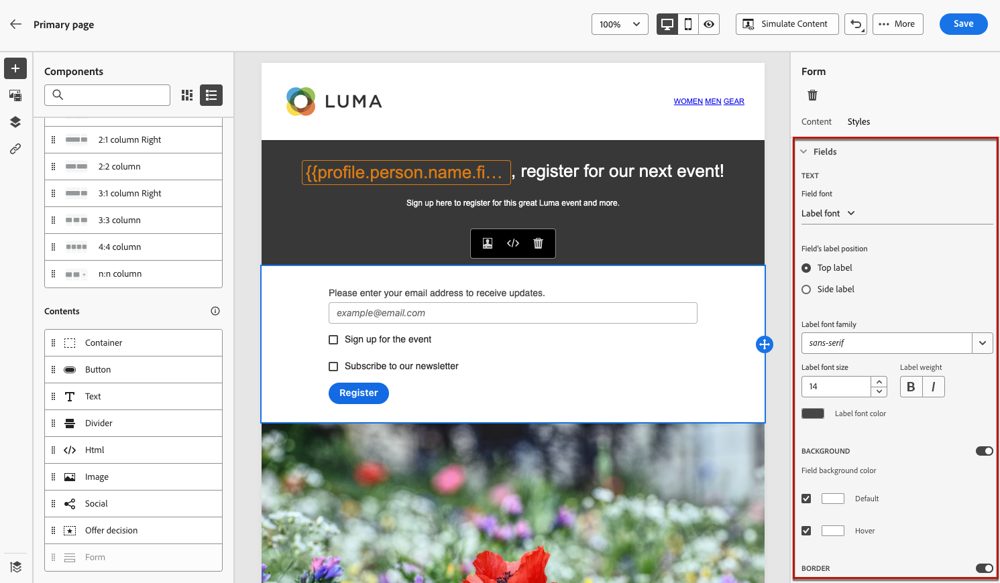

# Definición del contenido específico de la página de destino {#lp-content}

>[!CONTEXTUALHELP]
>id="ac_lp_components"
>title="Uso de componentes del contenido"
>abstract="Los componentes de contenido son marcadores de posición de contenido vacíos que se pueden utilizar para crear el diseño de una página de destino. Para definir contenido específico que permita a los usuarios seleccionar y enviar sus opciones, utilice el componente de formulario."
>additional-url="https://experienceleague.adobe.com/es/docs/journey-optimizer/using/channels/email/design-email/add-content/content-components#add-content-components" text="Añadir componentes de contenido"

Para diseñar el contenido de la página de aterrizaje, puede utilizar los mismos componentes que para un correo electrónico. [Más información](../email/content-components.md#add-content-components)

Para diseñar contenido específico que permita a los usuarios seleccionar y enviar sus opciones, [use el componente de formulario](#use-form-component) y defina sus [estilos específicos de página de aterrizaje](#lp-form-styles).

>[!NOTE]
>
>También puede crear una página de aterrizaje de pulsación sin un componente **[!UICONTROL Form]**. En ese caso, la página de aterrizaje se mostrará a los usuarios, pero no es necesario que envíen ningún formulario. Esto puede resultar útil si solo desea mostrar una página de aterrizaje sin requerir ninguna acción por parte de los destinatarios, como la inclusión o la exclusión, o si desea proporcionar información que no requiera la entrada del usuario.

Con el diseñador de contenido de página de aterrizaje, también puede aprovechar los datos contextuales procedentes de la página principal en una subpágina. [Más información](#use-primary-page-context)

## Uso del componente del formulario {#use-form-component}

>[!CONTEXTUALHELP]
>id="ac_lp_formfield"
>title="Definir los campos del componente de formulario"
>abstract="Defina cómo verán y enviarán sus opciones los destinatarios desde la página de destino."
>additional-url="https://experienceleague.adobe.com/es/docs/journey-optimizer/using/landing-pages/landing-pages-design/lp-content#lp-form-styles" text="Definir estilos de formulario de una página de destino"

>[!CONTEXTUALHELP]
>id="ac_lp_submission"
>title="Qué sucede al hacer clic en el botón"
>abstract="Defina lo que sucederá cuando los usuarios envíen el formulario de página de destino."

Para definir contenido específico que permita a los usuarios seleccionar y enviar sus opciones desde la página de aterrizaje, use el componente **[!UICONTROL Formulario]**. Para ello, siga los pasos que aparecen a continuación.

1. Arrastre y suelte el componente **[!UICONTROL Formulario]** específico de la página de aterrizaje de la paleta izquierda en el área de trabajo principal.

   

   >[!NOTE]
   >
   >El componente **[!UICONTROL Form]** solo se puede usar una vez en la misma página.

1. Selecciónelo. La pestaña **[!UICONTROL Contenido del formulario]** se muestra en la paleta derecha para permitirle editar los diferentes campos del formulario.

   

   >[!NOTE]
   >
   >Cambie a la pestaña **[!UICONTROL Estilos]** en cualquier momento para editar los estilos del contenido del componente del formulario. [Más información](#define-lp-styles)

1. Desde la sección **[!UICONTROL Casilla de verificación 1]**, puede editar la etiqueta correspondiente a esta casilla de verificación.

1. Defina si esta casilla de verificación incluye o excluye a los usuarios: ¿aceptan recibir comunicaciones o piden que ya no se les contacte?

   

   Seleccione entre las tres opciones siguientes:

   * **[!UICONTROL Adhesión si está marcada]**: los usuarios deben marcar la casilla para dar su consentimiento (inclusión).
   * **[!UICONTROL Exclusión si está marcada]**: los usuarios deben marcar la casilla para eliminar su consentimiento (exclusión).
   * **[!UICONTROL Adhesión si está marcada, exclusión si no está marcada]**: esta opción le permite insertar una sola casilla de verificación para la inclusión/exclusión. Los usuarios deben marcar la casilla de verificación para el consentimiento (inclusión) y desmarcar para eliminar su consentimiento (exclusión).

1. Elija lo que desea actualizar entre las tres opciones siguientes:

   

   * **[!UICONTROL Lista de suscripción]**: debe seleccionar la lista de suscripción que se actualizará si el perfil selecciona esta casilla de verificación. Más información sobre [listas de suscripción](subscription-list.md).

     <!---->

   * **[!UICONTROL Canal (correo electrónico)]**: la inclusión o exclusión se aplica a todo el canal. Por ejemplo, si un perfil que se excluye tiene dos direcciones de correo electrónico, ambas se excluirán de todas las comunicaciones.

   * **[!UICONTROL Identidad del correo electrónico]**: la opción de inclusión u exclusión solo se aplica a la dirección de correo electrónico que se utilizó para acceder a la página de aterrizaje. Por ejemplo, si un perfil tiene dos direcciones de correo electrónico, solo la que se utilizó para la inclusión recibirá comunicaciones de su marca.

1. Haga clic en **[!UICONTROL Agregar campo]** > **[!UICONTROL Casilla]** para agregar otra casilla de verificación. Repita los pasos anteriores para definir sus propiedades.

   

1. También puede agregar **[!UICONTROL Campo de texto]**.

   

   * Escriba la **[!UICONTROL Etiqueta]** que se mostrará sobre el campo del formulario.

   * Escriba un texto de **[!UICONTROL marcador de posición]**. Se muestra dentro del campo antes de que el usuario rellene el campo.

   * Marque la opción **[!UICONTROL Hacer que el campo de formulario sea obligatorio]** si es necesario. En ese caso, la página de aterrizaje solo se puede enviar si el usuario ha rellenado este campo. Si no se rellena un campo obligatorio, aparece un mensaje de error cuando el usuario envía la página.

   

1. Una vez que haya agregado todas las casillas de verificación y/o campos de texto deseados, haga clic en **[!UICONTROL Call to action]** para expandir la sección correspondiente. Permite definir el comportamiento del botón en el componente **[!UICONTROL Form]**.

   

1. Defina lo que sucederá al hacer clic en el botón:

   * **[!UICONTROL URL de redireccionamiento]**: escriba la dirección URL de la página a la que se redirigirá a los usuarios.
   * **[!UICONTROL Texto de confirmación]**: escriba el texto de confirmación que se mostrará.
   * **[!UICONTROL Vínculo a una subpágina]**: configure una [subpágina](create-lp.md#configure-subpages) y selecciónela en la lista desplegable que se muestra.

   

1. Defina lo que sucederá al hacer clic en el botón en caso de que se produzca un error:

   * **[!UICONTROL URL de redireccionamiento]**: escriba la dirección URL de la página a la que se redirigirá a los usuarios.
   * **[!UICONTROL Texto de error]**: escriba el texto de error que se mostrará. Puede obtener una vista previa del texto del error al definir [estilos de formulario](#define-lp-styles).

   * **[!UICONTROL Vínculo a una subpágina]**: configure una [subpágina](create-lp.md#configure-subpages) y selecciónela en la lista desplegable que se muestra.

   

1. Si desea realizar actualizaciones adicionales al enviar el formulario, seleccione **[!UICONTROL Adherirse]** o **[!UICONTROL Excluirse]** y defina si desea actualizar una lista de suscripción, el canal o solo la dirección de correo electrónico utilizada.

   

1. Guarde el contenido y haga clic en la flecha situada junto al nombre de la página para volver a las [propiedades de la página de aterrizaje](create-lp.md#configure-primary-page).

   

## Definir estilos de formulario de una página de destino {#lp-form-styles}

1. Para modificar los estilos del contenido del componente del formulario, cambie en cualquier momento a la pestaña **[!UICONTROL Estilo]**.

   

1. La sección **[!UICONTROL Campos]** se expande de forma predeterminada y le permite editar el aspecto del campo de texto, como la fuente de la etiqueta y el marcador de posición, la posición de la etiqueta, el color de fondo del campo o el borde del campo.

   

1. Expanda la sección **[!UICONTROL Casillas de verificación]** para definir el aspecto de las casillas de verificación y el texto correspondiente. Por ejemplo, puede ajustar la familia o el tamaño de la fuente o el color del borde de la casilla de verificación.

   

1. Expanda la sección **[!UICONTROL Botones]** para modificar el aspecto del botón en el formulario componente. Por ejemplo, puede cambiar la fuente, agregar un borde, editar el color de la etiqueta al pasar el ratón por encima o ajustar la alineación del botón.

   

   Puede obtener una vista previa de algunos de los ajustes, como el color de la etiqueta del botón al pasar el ratón por encima, usando el botón **[!UICONTROL Simular contenido]**. Obtenga más información acerca de las páginas de aterrizaje de prueba [aquí](create-lp.md#test-landing-page).

   <!---->

1. Expanda la sección **[!UICONTROL Diseño del formulario]** para editar la configuración del diseño, como el color de fondo, el relleno o el margen.

   

1. Expanda la sección **[!UICONTROL Error de formulario]** para ajustar la visualización del mensaje de error que se muestra en caso de que se produzca un problema. Marque la opción correspondiente para previsualizar el texto de error en el formulario.

   

## Usar contexto de página principal {#use-primary-page-context}

Puede utilizar datos contextuales procedentes de otra página dentro de la misma página de aterrizaje.

Por ejemplo, si vincula una casilla de verificación <!-- or the submission of the page--> a una [lista de suscripción](subscription-list.md) en la página de aterrizaje principal, puede utilizar esa lista de suscripción en la subpágina &quot;gracias&quot;.

Supongamos que vincula dos casillas de verificación en la página principal a dos listas de suscripción diferentes. Si un usuario se suscribe a uno de estos, desea mostrar un mensaje específico al enviar el formulario, en función de la casilla de verificación que haya seleccionado.

Para ello, siga los pasos a continuación:

1. En la página principal, vincule cada casilla de verificación del componente **[!UICONTROL Form]** a la lista de suscripción correspondiente. [Más información](#use-form-component).

   

1. En la subpágina, coloque el puntero del mouse (ratón) donde desee insertar el texto y seleccione **[!UICONTROL Agregar personalización]** en la barra de herramientas contextual.

   

1. En la ventana **[!UICONTROL Editar personalización]**, seleccione **[!UICONTROL Atributos contextuales]** > **[!UICONTROL Páginas de aterrizaje]** > **[!UICONTROL Contexto de página principal]** > **[!UICONTROL Suscripción]**.

1. Se muestran todas las listas de suscripción seleccionadas en la página principal. Seleccione los elementos relevantes mediante el icono +.

   

1. Añada las condiciones relevantes mediante las funciones de ayuda del editor de personalización. [Más información](../personalization/functions/functions.md)

   

   >[!CAUTION]
   >
   >Si hay un carácter especial como un guión en la expresión, debe omitir el texto, incluido el guión.

1. Guarde los cambios.

Ahora, cuando los usuarios seleccionan una de las casillas de verificación,

el mensaje correspondiente a la casilla de verificación seleccionada se muestra al enviar el formulario.

<!---->

>[!NOTE]
>
>Si un usuario selecciona las dos casillas de verificación, se mostrarán ambos textos.

<!--
## Use landing page additional data {#use-additional-data}

When [configuring the primary page](create-lp.md#configure-primary-page), you can create additional data to enable storing information when the landing page is being submitted.

>[!NOTE]
>
>This data may not be visible to users who visit the page.

If you defined one or more keys with their corresponding values when [configuring the primary page](create-lp.md#configure-primary-page), you can leverage these keys in the content of your primary page and subpages using the [personalization editor](../personalization/personalization-build-expressions.md).

///When you reuse the same text on a page, this enables you to dynamically change that text if needed, without going through each occurrence.

For example, if you define the company name as a key, you can quickly update it everywhere (on all the pages of a given landing page) by changing it only once in the [primary page settings](create-lp.md#configure-primary-page).///

To leverage these keys in a landing page, follow the steps below:

1. When configuring the primary page, define a key and its corresponding value in the **[!UICONTROL Additional data]** section. [Learn more](create-lp.md#configure-primary-page)

    

1. When editing your primary page with the designer, place the pointer of your mouse where you want to insert your key and select **[!UICONTROL Add personalization]** from the contextual toolbar.

    

1. In the **[!UICONTROL Edit Personalization]** window, select **[!UICONTROL Contextual attributes]** > **[!UICONTROL Landing Pages]** > **[!UICONTROL Additional Context]**.

    

1. All the keys that you created when configuring the primary page are listed. Select the key of your choice using the + icon.

    

1. Save your changes and repeat the steps above as many times as needed.

    

    You can see that the personalization item corresponding to your key is now displayed everywhere you inserted it.
-->