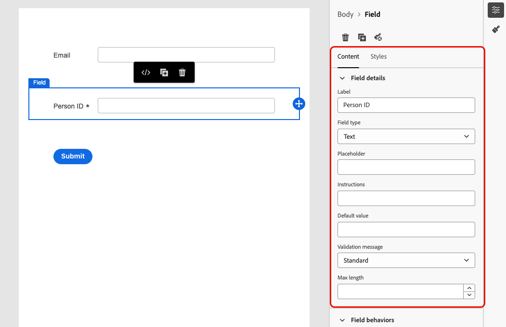
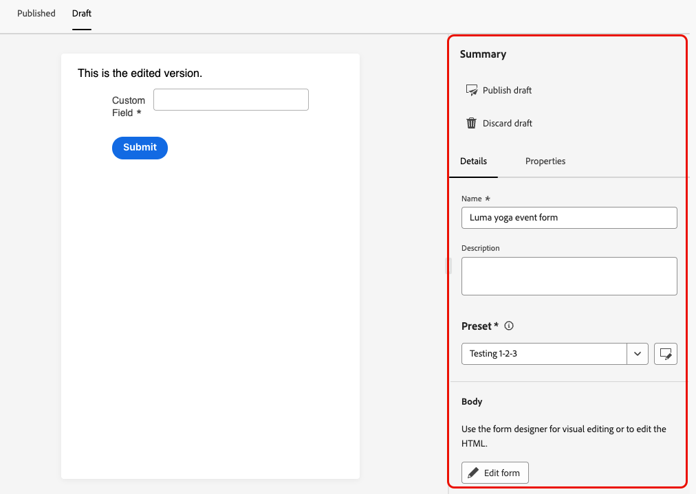

# Uso de formularios en las páginas de aterrizaje {#lp-forms}

>[!AVAILABILITY]
>
>Esta capacidad tiene disponibilidad limitada. Póngase en contacto con su representante de Adobe para obtener acceso.

Para capturar datos de perfil con sus páginas de aterrizaje de [!DNL Journey Optimizer] y enriquecer los conjuntos de datos de [!DNL Experience Platform], puede aprovechar los formularios en sus páginas de aterrizaje.

## Crear un ajuste preestablecido de formulario {#create-form-preset}

>[!CONTEXTUALHELP]
>id="ajo_lp_form_connection"
>title="Seleccione el extremo que desea utilizar"
>abstract="Defina el punto final de flujo continuo al que se envían los datos al enviar el formulario."
>additional-url="https://experienceleague.adobe.com/en/docs/experience-platform/sources/ui-tutorials/create/streaming/http" text="Creación de una conexión de flujo continuo HTTP API"

>[!CONTEXTUALHELP]
>id="ajo_lp_form_dataset"
>title="Selección de un conjunto de datos"
>abstract="Defina un conjunto de datos en el que se almacenarán y reflejarán las respuestas del formulario. Puede escribir para buscar un conjunto de datos específico o seleccionarlo en la lista."

Antes de poder crear un formulario, debe crear un ajuste preestablecido dedicado en el que seleccione el punto final de conexión al que se envían los datos de envío del formulario y el conjunto de datos al que se almacenarán los datos capturados mediante el formulario.

Cuando los datos aterrizan en el extremo de flujo continuo, se vinculan con la información del conjunto de datos. Mediante las conexiones de origen/destino generadas y el flujo de origen, los datos se insertan en el conjunto de datos.

Al crear un ajuste preestablecido:

* Puede configurar varios ajustes preestablecidos utilizando diferentes combinaciones de conjuntos de datos y conexiones de flujo continuo.
* El mismo conjunto de datos o conexión de flujo continuo se puede reutilizar en varios ajustes preestablecidos.
* Cada conexión de flujo continuo genera automáticamente recursos como:
   * **Conexión de Source** - donde se originan los datos.
   * **Conexión de destino** - donde se almacenan o consumen los datos.
   * **Flujo de Source**: la canalización que mueve datos de la conexión de origen a [!DNL Experience Platform], y administra la asignación, la transformación y la validación.

>[!NOTE]
>
> Para acceder y editar los ajustes preestablecidos del formulario, debe tener el permiso **[!UICONTROL Administrar ajustes preestablecidos del formulario]** en la zona protegida de producción. Obtenga más información acerca de los permisos en [esta sección](../administration/high-low-permissions.md#administration-permissions).<!--TBC-->

1. Para obtener acceso al inventario de **[!UICONTROL Ajustes preestablecidos de formulario]**, seleccione **[!UICONTROL Administración]** > **[!UICONTROL Canales]** >**[!UICONTROL Configuración de formulario]** en el menú de la izquierda.

1. Haga clic en **[!UICONTROL Crear ajuste preestablecido de formulario]**.

1. Actualice el nombre para recuperarlo más fácilmente y añada una descripción si es necesario.

   {width=80%}

1. Seleccione la **[!UICONTROL conexión de transmisión]** que se usará para ese formulario. Este es el punto final de streaming al que se envían los datos al enviar el formulario.

   >[!NOTE]
   >
   >Obtenga más información sobre cómo crear una conexión de origen de flujo continuo en la [documentación de Experience Platform](https://experienceleague.adobe.com/en/docs/experience-platform/sources/ui-tutorials/create/streaming/http){target="_blank"}.

1. Seleccione un **[!UICONTROL conjunto de datos]** para vincularlo con el formulario. Aquí es donde se almacenan y reflejan las respuestas del formulario. Puede escribir para buscar un conjunto de datos específico o seleccionarlo en la lista.

   >[!NOTE]
   >
   >Actualmente solo hay [!DNL Adobe Experience Platform] conjuntos de datos disponibles para su selección. Solo se puede seleccionar un conjunto de datos a la vez.

1. Haga clic en **[!UICONTROL Publicar]**. El ajuste preestablecido ya está listo para utilizarse en un formulario.

## Acceso y administración de formularios {#access-forms}

Para acceder a la lista del formulario, seleccione **[!UICONTROL Administración de contenido]** > **[!UICONTROL Forms]** en el menú de la izquierda.

Se muestran todos los formularios existentes. Puede filtrar los formularios en función de su estado, fecha de creación o modificación.

## Creación y diseño de un formulario {#create-form}

>[!CONTEXTUALHELP]
>id="ajo_lp_form_preset"
>title="Seleccionar un ajuste preestablecido"
>abstract="Elija un ajuste preestablecido que contenga la conexión que se va a utilizar y un conjunto de datos predefinido para el formulario."
>additional-url="https://experienceleague.adobe.com/en/docs/journey-optimizer/using/content-management/landing-pages/lp-forms#create-form-preset" text="Crear un ajuste preestablecido de formulario"

Para crear un formulario, siga los pasos a continuación.

1. En la lista **[!UICONTROL Forms]**, haga clic en **[!UICONTROL Crear formulario]**.

1. Añada un nombre. Puede agregar una descripción si es necesario.

   

1. Seleccione un **[!UICONTROL ajuste preestablecido]** que contenga la conexión que se utilizará y un conjunto de datos predefinido para el formulario. [Aprenda a crear un ajuste preestablecido de formulario](#create-form-preset)

1. Haga clic en **[!UICONTROL Crear]**. Se abre el diseñador de formularios, que le permite agregar estructuras y contenido [componentes](../email/content-components.md#add-content-components) para generar su contenido. Puede usar los componentes [Texto](../email/content-components.md#text) y **[!UICONTROL Campo]**.

1. Para capturar los datos y atributos de perfil, agregue campos específicos al formulario. [Más información](#define-fields)

1. Configure y diseñe estos campos. [Más información](#configure-fields)

1. Puede ajustar el diseño, el estilo y las dimensiones del formulario según sea necesario mediante el panel **[!UICONTROL Estilos]**. [Más información sobre el estilo](../email/get-started-email-style.md)

1. Una vez configurados todos los campos, haz clic en **[!UICONTROL Guardar y cerrar]**.

1. Configure la página de agradecimiento. [Descubra cómo](#thank-you-page)

1. **[!UICONTROL Publicar]** el formulario para que esté disponible para su selección en páginas de aterrizaje.

### Definir campos específicos {#define-fields}

Para agregar campos específicos al formulario, arrastre y suelte una estructura en el lienzo y arrastre un componente **[!UICONTROL Field]** dentro.<!--**[!UICONTROL Select field attribute]** or **[!UICONTROL Add custom field]**.-->

A continuación, seleccione una de las siguientes opciones:

>[!BEGINTABS]

>[!TAB Seleccionar atributo de campo]

Utilice esta opción para seleccionar un atributo basado en el esquema del conjunto de datos vinculado al formulario.

>[!NOTE]
>
>El conjunto de datos se define en el ajuste preestablecido seleccionado para el formulario. [Más información](#create-form-preset)

{width=100%}

Por ejemplo, puede establecer el correo electrónico y el ID de persona. Cuando los usuarios rellenan estos campos, la información introducida se guarda en el conjunto de datos seleccionado.

{width=55%}

Para asignar los datos recopilados con un perfil, seleccione un campo de identidad de perfil. Los campos de identidad están marcados como **[!UICONTROL Obligatorio]** en la lista de atributos; puede filtrarlos.

{width=65%}

>[!TAB Agregar campo personalizado]

Con esta opción, puede definir un campo libre sin asignarlo a un campo del conjunto de datos vinculado.

{width=85%}

>[!ENDTABS]

### Configuración y diseño de un campo {#configure-fields}

Una vez seleccionado un atributo de campo o agregado un campo personalizado, puede ajustar aún más sus detalles, así como su comportamiento, al enviar el formulario.

1. En la sección **[!UICONTROL Detalles del campo]** de la pestaña **[!UICONTROL Contenido]** de la derecha, puede especificar los siguientes elementos según sea necesario:

   * Ajuste la **[!UICONTROL Etiqueta]** para que quede claro para los destinatarios del formulario.
   * Cambie **[!UICONTROL Field type]** según sus necesidades. Puede ser una casilla de verificación, moneda, fecha, control deslizante, URL, etc.

     >[!NOTE]
     >
     >Los demás detalles de campo pueden variar según el tipo de campo seleccionado.

   * Agregar un **[!UICONTROL marcador de posición]**.<!--To explain-->
   * Especificar **[!UICONTROL instrucciones]**.<!--How will they be displayed in the form? To explain-->
   * Escriba un **[!UICONTROL valor predeterminado]** que se mostrará antes de que los usuarios del formulario rellenen el campo.
   * Puede definir un **[!UICONTROL mensaje de validación]** personalizado.
   * Establezca una **[!UICONTROL longitud máxima]**. Se muestra un mensaje de error si los destinatarios del formulario superan el límite al rellenar el campo.

   {width=85%}

1. En la sección **[!UICONTROL Comportamientos de campo]**, puede definir lo siguiente:

   * Seleccione **[!UICONTROL Obligatorio]** para que este campo sea obligatorio. Si los usuarios no rellenan el campo, no pueden enviar el formulario.
   * Seleccione **[!UICONTROL Sensible]** para que el campo distinga mayúsculas de minúsculas. <!--To confirm - do you mean retain capitalization when added to the dataset?-->
   * Seleccione **[!UICONTROL Rellenado previamente habilitado]** para rellenar el campo de la información de perfil si está disponible.<!--Even for a custom field, or a field not mapped to a profile? What happens if no data is available?-->
   * Seleccione **[!UICONTROL Habilitar máscara de entrada]** para reemplazar la entrada de los usuarios por caracteres genéricos. Puede usar *9* para indicar cualquier número, *a* para indicar cualquier letra o * para indicar cualquier número o letra.<!--Not sure how you define that in the form-->

   {width=75%}

### Configuración de la página de agradecimiento {#thank-you-page}

>[!CONTEXTUALHELP]
>id="ajo_lp_forms_thankyou_page"
>title="Página de agradecimientos"
>abstract="Configure lo que sucede cuando alguien rellena o reenvía el formulario."

En la sección **[!UICONTROL Página de agradecimiento]**, configure lo que sucede cuando un usuario rellena el formulario.

{width=70%}

Configure una de las siguientes acciones:

* **[!UICONTROL Permanecer en la página]**: esta opción mantiene al visitante en la misma página cuando se envía el formulario.
* **[!UICONTROL Página de aterrizaje]**: seleccione una [página de aterrizaje](create-lp.md) publicada a la que se redirija al usuario después de enviar el formulario.
* **[!UICONTROL Dirección URL externa]**: escriba la dirección URL completa que desee como página de seguimiento. Una vez que el usuario ha enviado el formulario, se le dirige a la dirección URL especificada.
* **[!UICONTROL Redirección condicional]**: configure reglas para mostrar dinámicamente diferentes acciones de seguimiento basadas en las respuestas del formulario.

  Puede definir una regla para cada audiencia específica. Por ejemplo, puede mostrar una página de aterrizaje específica para residentes de EE. UU., otra página para residentes de Canadá, etc. Finalmente, configure una acción predeterminada para los usuarios que no entren en ninguna regla que haya definido.

  >[!NOTE]
  >
  >Las condiciones definidas en una regla se leen secuencialmente.

  {width=40%}

## Edición de un formulario publicado {#edit-form}

Una vez publicado un formulario, aún puede editarlo. Siga los pasos a continuación.

1. Acceda a la [lista de formularios](#access-forms) y seleccione un formulario publicado.

1. Haga clic en el botón **[!UICONTROL Editar formulario]**.

   {width=90%}

1. Se creará una nueva versión del formulario con el estado de borrador. Haga clic en **[!UICONTROL Crear versión de borrador]**.

1. Actualice el formulario según sea necesario y haga clic en **[!UICONTROL Guardar]**. El formulario tiene ahora el estado **[!UICONTROL Publicado (con borrador)]**:

   * La versión actual sigue teniendo el estado **[!UICONTROL Publicado]** hasta que publique la versión actualizada.

   * La versión actualizada tiene el estado **[!UICONTROL borrador]**.

1. Cuando vuelva al resumen del formulario, podrá desplazarse entre las dos versiones.

   {width=70%}

1. En la sección **[!UICONTROL Borrador]**, puede publicar o descartar el borrador, así como editar los detalles o el contenido del formulario.

   {width=75%}

## Aprovechamiento del formulario en una página de aterrizaje {#leverage-form-in-lp}

Ahora puede incrustar este formulario en una página de aterrizaje para capturar los datos correspondientes a los atributos definidos en el formulario y guardarlos en el conjunto de datos seleccionado. Siga los pasos a continuación.

1. Cree una página de aterrizaje. [Descubra cómo](create-lp.md#create-landing-page)

1. Seleccione **[!UICONTROL Captura de datos]** como tipo de página de aterrizaje y haga clic en **[!UICONTROL Crear]**.

   {width=65%}

1. Configure la página principal. [Descubra cómo](create-lp.md#configure-primary-page)

1. Abra [el diseñador de la página de aterrizaje](design-lp.md).

1. Arrastre y suelte un **[!UICONTROL componente de estructura]** en el contenido. Arrastre y suelte un componente **[!UICONTROL Form]** en esa estructura.

   >[!NOTE]
   >
   >Solo se pueden seleccionar formularios publicados en una página de aterrizaje.

1. En la sección **[!UICONTROL Incrustar formulario]**, seleccione el formulario que ha creado.

   

   >[!NOTE]
   >
   >Puede actualizar el formulario seleccionado mediante el botón **[!UICONTROL Editar formulario]**. El formulario se abrirá en una nueva pestaña. Los pasos para editar el contenido del formulario son los mismos que se describen en [esta sección](#create-form).

1. En la sección **[!UICONTROL Tipo de seguimiento]**, configure lo que sucede cuando un usuario rellena el formulario:

   * Elija **[!UICONTROL Formulario definido]** para seleccionar la acción definida en el formulario incrustado. [Más información](#thank-you-page)

   * También puede seleccionar una [página de aterrizaje](create-lp.md) publicada a la que se redireccione al usuario después de enviar el formulario.

   * O defina una **[!UICONTROL URL externa]** como la página de seguimiento a la que se dirigirá a los usuarios cuando envíen el formulario.

1. Guarde y pruebe la página de aterrizaje. [Descubra cómo](create-lp.md#test-landing-page)

Una vez que la página de aterrizaje es [publicada](create-lp.md#publish-landing-page) y se usa en un recorrido, cuando los usuarios rellenan el formulario, la información introducida se incorpora en el conjunto de datos seleccionado.

>[!NOTE]
>
>Si cancela la publicación de un formulario que se utiliza en una página de aterrizaje, edita este formulario y lo vuelve a publicar, la página de aterrizaje siempre utiliza la última versión publicada del formulario.
