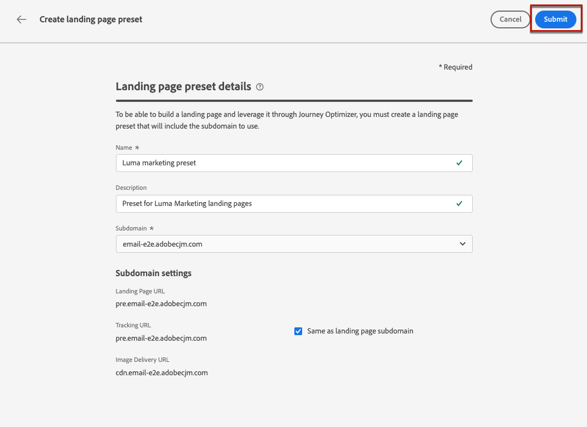

# Definir ajustes preestablecidos de página de aterrizaje {#lp-presets}

>[!CONTEXTUALHELP]
>id="ajo_admin_config_lp_subdomain_header"
>title="Crear ajustes preestablecidos de la página de aterrizaje"
>abstract="Para crear una página de aterrizaje y aprovecharla mediante Journey Optimizer, debe crear un ajuste preestablecido de página de aterrizaje que incluya el subdominio que se va a utilizar."

Al [crear una página de aterrizaje](../landing-pages/create-lp.md#create-a-lp), debe seleccionar un ajuste preestablecido de página de aterrizaje para poder generar la página de aterrizaje y aprovecharla a través de **[!DNL Journey Optimizer]**.

## Acceder a ajustes preestablecidos de página de aterrizaje {#access-lp-presets}

Para acceder a los ajustes preestablecidos de la página de aterrizaje, siga los pasos a continuación.

1. Acceda al menú **[!UICONTROL Administración]** > **[!UICONTROL Canales]**.

1. Seleccione **[!UICONTROL Marca]** > **[!UICONTROL Ajustes preestablecidos de página de aterrizaje]**.

   

1. Haga clic en cualquier etiqueta preestablecida para acceder a los detalles del ajuste preestablecido de la página de aterrizaje.

   

## Crear ajustes preestablecidos de la página de aterrizaje {#lp-create-preset}

Para crear un ajuste preestablecido de página de aterrizaje, siga los pasos a continuación.

>[!NOTE]
>
>Para poder crear un ajuste preestablecido, asegúrese de haber configurado previamente al menos un subdominio de página de aterrizaje. [Descubra cómo](lp-subdomains.md)

1. Acceda al menú **[!UICONTROL Administración]** > **[!UICONTROL Canales]** y, a continuación, seleccione **[!UICONTROL Marca]** > **[!UICONTROL Ajustes preestablecidos de página de aterrizaje]**.

1. Seleccione **[!UICONTROL Crear ajuste preestablecido de página de aterrizaje]**.

   

1. Introduzca un nombre y una descripción para el ajuste preestablecido.

   >[!NOTE]
   >
   > Los nombres deben comenzar por una letra (A-Z). Solo puede contener caracteres alfanuméricos. También puede utilizar caracteres de guion bajo `_`, punto`.` y guión `-`.

1. Seleccione un subdominio de página de aterrizaje de la lista desplegable.

   

   >[!NOTE]
   >
   >Para poder seleccionar un subdominio, asegúrese de que ha configurado previamente al menos un subdominio de página de aterrizaje. [Descubra cómo](#lp-subdomains)

   Se muestra la configuración correspondiente al subdominio seleccionado.

1. Si desea seleccionar el subdominio de página de aterrizaje para la URL de seguimiento, marque la opción **[!UICONTROL Igual que el subdominio de página de aterrizaje]**. [Más información sobre el seguimiento](../email/message-tracking.md)

   

   Por ejemplo, si la dirección URL de la página de aterrizaje es &quot;pages.mail.luma.com&quot; y la dirección URL de seguimiento es &quot;data.mail.luma.com&quot;, puede elegir &quot;pages.mail.luma.com&quot; para utilizarlo como subdominio de seguimiento.

1. Haga clic en **[!UICONTROL Enviar]** para confirmar la creación del ajuste preestablecido de página de aterrizaje. <!--You can also save the preset as draft and resume its configuration later on.-->

   <!---->

1. Una vez creado el ajuste preestablecido de página de aterrizaje, se muestra en la lista con el estado **[!UICONTROL Activo]**. Está listo para utilizarse para sus páginas de aterrizaje.

   

Ya está listo para [crear páginas de aterrizaje](../landing-pages/create-lp.md) en [!DNL Journey Optimizer].
<!--
>[!NOTE]
>
>Learn how to create channel surfaces for push notifications and emails in [this section](channel-surfaces.md).-->

**Temas relacionados**:

* [Introducción a las páginas de aterrizaje](../landing-pages/get-started-lp.md)
* [Creación de una página de aterrizaje](../landing-pages/create-lp.md#create-a-lp)
