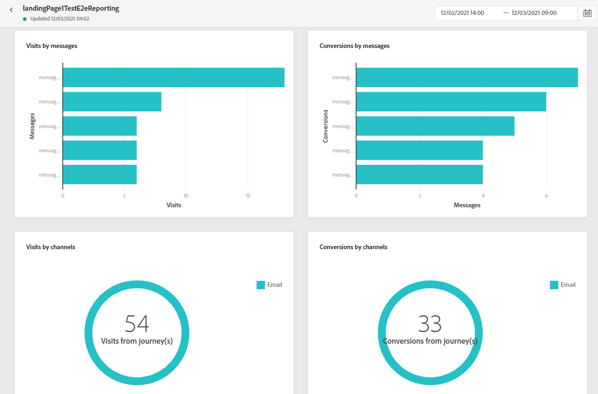

# Informe de página de aterrizaje {#lp-report}

El informe de página de aterrizaje muestra detalles sobre el impacto de las páginas de aterrizaje. Hay dos tipos de informes disponibles:

* La variable **[!UICONTROL Live report]** para medir y visualizar el éxito de las páginas de aterrizaje solo en las últimas 24 horas.

* La variable **[!UICONTROL Global report]** para medir y visualizar el éxito de las páginas de aterrizaje durante un período de tiempo seleccionado.

Para acceder a los informes, seleccione **Activo** o **[!UICONTROL Global report]** del menú avanzado de la página de aterrizaje seleccionada.

## Informe activo de la página de aterrizaje {#lp-live}

La variable **[!UICONTROL Landing page performance]** La utilidad detalla la información principal relativa al mensaje en las últimas 24 horas a través de los KPI:

* **[!UICONTROL Total visits]**: Número total de visitas a la página de aterrizaje desde un recorrido u otras fuentes, incluidas las visitas múltiples de un destinatario.

* **[!UICONTROL Conversions]**: Número de personas que interactuaron con la página de aterrizaje, por ejemplo, suscritas a un formulario.

* **[!UICONTROL Bounces]**: Número de personas que no interactuaron con la página de aterrizaje y que no completaron la acción de suscribirse.

La variable **[!UICONTROL Visit sources]** representa la forma en que los visitantes acceden a su página de aterrizaje:

* **[!UICONTROL Journey(s)]**: Número de visitas a la página de aterrizaje procedentes de un recorrido.

* **[!UICONTROL Other sources]**: Número de visitas a la página de aterrizaje procedentes de una fuente externa en lugar de un recorrido.

La variable **[!UICONTROL Top clicked links]** identifica la interacción de los visitantes con la página de aterrizaje:

* **[!UICONTROL Clicks]**: Número de veces que se hizo clic en un contenido en la página de aterrizaje.

La variable **[!UICONTROL Journey(s)]** representa el número de visitas a la página de aterrizaje desde un recorrido.

La variable **[!UICONTROL Other sources]** representa el número de visitas a la página de aterrizaje desde un origen externo en lugar de un recorrido.

La variable **[!UICONTROL Visits by messages]** / **[!UICONTROL Conversions by messages]** los gráficos representan el número total de visitas y personas que interactuaron correctamente con la página de aterrizaje en las últimas 24 horas, según los mensajes enviados.

La variable **[!UICONTROL Visits by channels]** / **[!UICONTROL Conversions by channels]** los gráficos representan el número total de visitas y personas que interactuaron correctamente con la página de aterrizaje en las últimas 24 horas, según los canales.

## Informe global de la página de aterrizaje {#lp-global}

La variable **[!UICONTROL Number of visits]** y **[!UICONTROL Number of visits over time]** las utilidades permiten ver el impacto de la página de aterrizaje durante el período de tiempo seleccionado mediante un gráfico y KPI con las siguientes métricas:

* **[!UICONTROL Total visits]**: Número total de visitas a la página de aterrizaje procedentes de recorridos y fuentes externas, incluidas las visitas múltiples de un destinatario.

* **[!UICONTROL Unique visitors]**: Número de personas que visitaron la página de aterrizaje y no se tienen en cuenta las visitas múltiples de un destinatario.

La variable **[!UICONTROL Landing page performance]** La utilidad detalla la información principal relativa al mensaje a través de los KPI:

* **[!UICONTROL Conversion rate]**: Número de personas que interactuaron con la página de aterrizaje, por ejemplo, suscritas a un formulario, en relación con el número total de visitas.

* **[!UICONTROL Bounce rate]**: Número de personas que no interactuaron con la página de aterrizaje y no completaron la acción de suscribirse, en relación con el número total de visitas.

La variable **[!UICONTROL Visit sources]** representa la forma en que los visitantes acceden a su página de aterrizaje:

* **[!UICONTROL Journey(s)]**: Número de visitas a la página de aterrizaje procedentes de un recorrido.

* **[!UICONTROL Other sources]**: Número de visitas a la página de aterrizaje procedentes de una fuente externa en lugar de un recorrido.

La variable **[!UICONTROL Top clicked links]** identifica la interacción de los visitantes con la entrega:

* **[!UICONTROL Clicks]**: Número de veces que se hizo clic en un contenido en la página de aterrizaje.

* **[!UICONTROL Click rate]**: Porcentaje de clics en la página de aterrizaje.

La variable **[!UICONTROL Journey(s)]** representa el número de visitas a la página de aterrizaje desde un recorrido:

* **[!UICONTROL Visits]**: Número de visitas a la página de aterrizaje, incluidas las visitas múltiples de un destinatario.

La variable **[!UICONTROL Other sources]** representa el número de visitas a la página de aterrizaje desde un origen externo en lugar de un recorrido.

La variable **[!UICONTROL Visits by messages]** / **[!UICONTROL Conversions by messages]** los gráficos representan el número total de visitas y personas que interactuaron correctamente con la página de aterrizaje durante el periodo correspondiente en función de los mensajes enviados.

La variable **[!UICONTROL Visits by channels]** / **[!UICONTROL Conversions by channels]** los gráficos representan el número total de visitas y personas que interactuaron correctamente con la página de aterrizaje durante el periodo correspondiente en función de los canales.
