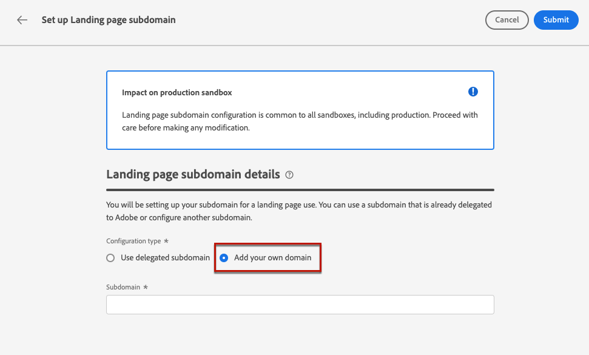

# Configurar subdominios de página de aterrizaje {#lp-subdomains}

>[!CONTEXTUALHELP]
>id="ajo_admin_subdomain_lp_header"
>title="Delegar un subdominio de página de aterrizaje"
>abstract="Se configurará el subdominio para su uso en una página de aterrizaje. Puede utilizar un subdominio que ya esté delegado en Adobe o configurar otro subdominio."

>[!CONTEXTUALHELP]
>id="ajo_admin_subdomain_lp"
>title="Delegar un subdominio de página de aterrizaje"
>abstract="Debe configurar un subdominio para utilizarlo en las páginas de aterrizaje, ya que lo necesitará para crear un ajuste preestablecido de página de aterrizaje. Puede utilizar un subdominio ya delegado a Adobe o configurar un nuevo subdominio."
>additional-url="https://experienceleague.adobe.com/es/docs/journey-optimizer/using/content-management/landing-pages/lp-configuration/lp-presets#lp-create-preset" text="Crear ajustes preestablecidos de la página de aterrizaje"

>[!CONTEXTUALHELP]
>id="ajo_admin_config_lp_subdomain"
>title="Crear ajustes preestablecidos de la página de aterrizaje"
>abstract="Para poder crear un ajuste preestablecido de página de aterrizaje, asegúrese de haber configurado previamente al menos un subdominio de página de aterrizaje para seleccionarlo en la lista de nombres de subdominio."
>additional-url="https://experienceleague.adobe.com/es/docs/journey-optimizer/using/content-management/landing-pages/lp-configuration/lp-presets#lp-create-preset" text="Crear ajustes preestablecidos de la página de aterrizaje"

## Introducción a los subdominios de página de aterrizaje {#gs-lp-subdomains}

Para poder [crear ajustes preestablecidos de página de aterrizaje](lp-presets.md), debe configurar los subdominios que utilizará para las páginas de aterrizaje.

Puede utilizar un subdominio que ya se haya delegado a Adobe o configurar otro. Obtenga más información acerca de la delegación de subdominios a Adobe en [esta sección](../configuration/delegate-subdomain.md).

La configuración del subdominio de página de aterrizaje es **común a todos los entornos**. Por lo tanto:

* Para acceder y editar subdominios de página de aterrizaje, debe tener el permiso **[!UICONTROL Administrar subdominios de página de aterrizaje]** en la zona protegida de producción.

* Cualquier modificación en un subdominio de página de aterrizaje también afecta a las zonas protegidas de producción.

## Usar un subdominio existente {#lp-use-existing-subdomain}

Para utilizar un subdominio que ya se haya delegado a Adobe, siga los pasos a continuación:

1. Acceda al menú **[!UICONTROL Administración]** > **[!UICONTROL Canales]** y seleccione **[!UICONTROL Configuración de la página de aterrizaje]** > **[!UICONTROL Subdominios de la página de aterrizaje]**.

1. Haga clic en **[!UICONTROL Configurar subdominio]**.

   

1. Seleccione **[!UICONTROL Usar dominio delegado]** de la sección **[!UICONTROL Tipo de configuración]**.

   

1. Introduzca el prefijo que se mostrará en la dirección URL de la página de aterrizaje.

   Solo se permiten caracteres alfanuméricos y guiones.

1. Seleccione un subdominio delegado de la lista.

   No puede seleccionar un subdominio que ya se esté utilizando como subdominio de página de aterrizaje.

   <!--Capital letters are not allowed in subdomains. TBC by PM-->

   

   Tenga en cuenta que no puede utilizar varios subdominios delegados del mismo dominio principal. Por ejemplo: si &quot;marketing1.yourcompany.com&quot; ya se ha delegado a Adobe para sus páginas de aterrizaje, no podrá utilizar &quot;marketing2.yourcompany.com&quot;. Sin embargo, como se admiten subdominios de varios niveles en las páginas de aterrizaje, puede continuar utilizando un subdominio de &quot;marketing1.yourcompany.com&quot; (como &quot;email.marketing1.yourcompany.com&quot;) o un dominio principal diferente.

   >[!CAUTION]
   >
   >Si selecciona un dominio delegado a Adobe mediante el [método CNAME](../configuration/delegate-subdomain.md#cname-subdomain-delegation), debe crear el registro DNS en su plataforma de alojamiento. Para generar el registro DNS, el proceso es el mismo que al configurar un nuevo subdominio de página de aterrizaje. Aprenda en [esta sección](#lp-configure-new-subdomain).

1. Haga clic en **[!UICONTROL Enviar]**.

1. Una vez enviado, el subdominio se muestra en la lista con el estado **[!UICONTROL Procesando]**. Para obtener más información sobre los estados de los subdominios, consulte [esta sección](../configuration/about-subdomain-delegation.md#access-delegated-subdomains).<!--Same statuses?-->

   

   Antes de poder usar ese subdominio para enviar mensajes, debe esperar hasta que Adobe realice las comprobaciones necesarias, que pueden tardar **hasta cuatro horas**.<!--Learn more in [this section](delegate-subdomain.md#subdomain-validation).-->

1. Una vez que las comprobaciones son correctas, el subdominio obtiene el estado **[!UICONTROL Success]**. Está listo para utilizarse para crear ajustes preestablecidos de página de aterrizaje.

## Configuración de un nuevo subdominio {#lp-configure-new-subdomain}

>[!CONTEXTUALHELP]
>id="ajo_admin_lp_subdomain_dns"
>title="Generar el registro DNS coincidente"
>abstract="Para configurar un nuevo subdominio de página de aterrizaje, debe copiar la información del servidor de nombres de Adobe que se muestra en la interfaz de Journey Optimizer y pegarla en la solución de alojamiento de dominios para generar el registro DNS coincidente. Una vez realizadas las comprobaciones correctamente, el subdominio está listo para utilizarse para crear ajustes preestablecidos de página de aterrizaje."

Para configurar un nuevo subdominio, siga los pasos a continuación.

1. Acceda al menú **[!UICONTROL Administración]** > **[!UICONTROL Canales]** y seleccione **[!UICONTROL Configuración de la página de aterrizaje]** > **[!UICONTROL Subdominios de la página de aterrizaje]**.

1. Haga clic en **[!UICONTROL Configurar subdominio]**.

1. Seleccione **[!UICONTROL Agregar su propio dominio]** de la sección **[!UICONTROL Tipo de configuración]**.

   

1. Especifique el subdominio que desea delegar.

   >[!CAUTION]
   >
   >* No puede utilizar un subdominio de página de aterrizaje existente.
   >
   >* No se permiten mayúsculas en los subdominios.

   No se permite delegar un subdominio no válido a Adobe. Asegúrese de introducir un subdominio válido que sea propiedad de su organización, como marketing.yourcompany.com.

   Para las páginas de aterrizaje, se admiten subdominios de varios niveles. Por ejemplo, puede utilizar &quot;email.marketing.yourcompany.com&quot;.

1. Se muestra el registro que se va a colocar en los servidores DNS. Copie este registro o descargue un archivo CSV y, a continuación, vaya a la solución de alojamiento de dominios para generar el registro DNS correspondiente.

1. Asegúrese de que se ha generado un registro DNS en la solución de alojamiento de dominios. Si todo está configurado correctamente, marque la casilla &quot;Confirmo...&quot; y luego haga clic en **[!UICONTROL Enviar]**.

   

   Al configurar un nuevo subdominio de página de aterrizaje, siempre apunta a un registro CNAME.

1. Una vez enviada la delegación del subdominio, este se muestra en la lista con el estado **[!UICONTROL Procesando]**. Para obtener más información sobre los estados de los subdominios, consulte [esta sección](../configuration/about-subdomain-delegation.md#access-delegated-subdomains).<!--Same statuses?-->

   Antes de poder usar ese subdominio en sus páginas de aterrizaje, debe esperar hasta que Adobe realice las comprobaciones necesarias, que pueden tardar **hasta cuatro horas**.<!--Learn more in [this section](#subdomain-validation).-->

1. Una vez que las comprobaciones son correctas, el subdominio obtiene el estado **[!UICONTROL Success]**. Está listo para utilizarse para crear ajustes preestablecidos de página de aterrizaje.

   Tenga en cuenta que el subdominio se marcará como **[!UICONTROL Error]** si no crea el registro de validación en la solución de alojamiento.

## Anular la delegación de un subdominio {#undelegate-subdomain}

Si desea desdelegar un subdominio de página de aterrizaje, póngase en contacto con su representante de Adobe.

Sin embargo, debe realizar varios pasos en la interfaz de usuario antes de ponerse en contacto con Adobe.

>[!NOTE]
>
>Solo puede anular la delegación de subdominios con el estado **[!UICONTROL Correcto]**. Los subdominios con los estados **[!UICONTROL Borrador]** y **[!UICONTROL Error]** simplemente se pueden eliminar de la interfaz de usuario.

Primero, realice los siguientes pasos en [!DNL Journey Optimizer]:

1. Cancele la publicación de todas las páginas de aterrizaje asociadas con el subdominio. [Descubra cómo](create-lp.md#access-landing-pages)

1. Desactive todas las configuraciones de canal asociadas con el subdominio. [Descubra cómo](../configuration/channel-surfaces.md#deactivate-a-surface)

<!--
1. If the landing page subdomain is using an email subdomain that was [already delegated](#lp-use-existing-subdomain) to Adobe, undelegate the email subdomain. [Learn how](../configuration/delegate-subdomain.md#undelegate-subdomain)

1. Stop the active campaigns associated with the subdomains. [Learn how](../campaigns/modify-stop-campaign.md#stop)

1. Stop the active journeys associated with the subdomains. [Learn how](../building-journeys/end-journey.md#stop-journey)
-->

Una vez finalizado, póngase en contacto con el representante de Adobe con el subdominio que desee desdelegar.

Una vez que Adobe administra la solicitud, el dominio no delegado ya no se muestra en la página de inventario de subdominios.

>[!CAUTION]
>
>Después de anular la delegación de un subdominio:
>
>   * No puede reactivar las configuraciones de canal que utilizaban ese subdominio.
>
>   * No puede volver a delegar el subdominio exacto a través de la interfaz de usuario. Si desea hacerlo, póngase en contacto con su representante de Adobe.