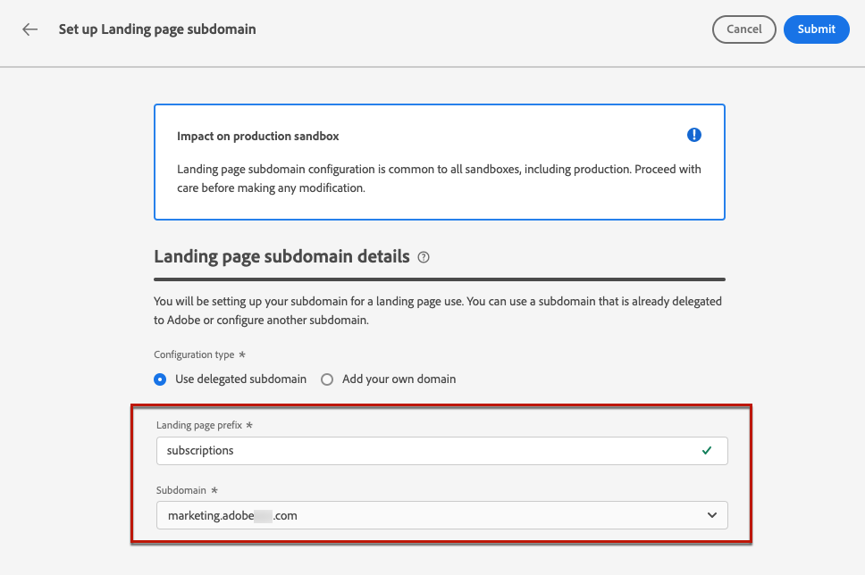
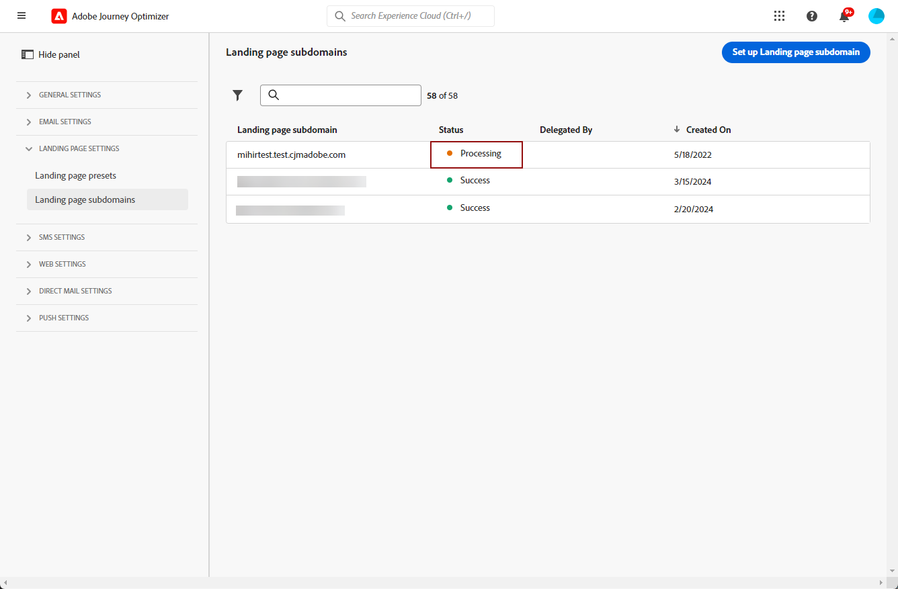

# Configurar subdominios de página de aterrizaje {#lp-subdomains}

>[!CONTEXTUALHELP]
>id="ajo_admin_subdomain_lp_header"
>title="Delegar un subdominio de página de aterrizaje"
>abstract="Se configurará el subdominio para su uso en una página de aterrizaje. Puede utilizar un subdominio que ya esté delegado en Adobe o configurar otro subdominio."

>[!CONTEXTUALHELP]
>id="ajo_admin_subdomain_lp"
>title="Delegar un subdominio de página de aterrizaje"
>abstract="Debe configurar un subdominio para utilizarlo en las páginas de aterrizaje, ya que lo necesitará para crear un ajuste preestablecido de página de aterrizaje. Puede utilizar un subdominio ya delegado a Adobe o configurar un nuevo subdominio."
>additional-url="https://experienceleague.adobe.com/docs/journey-optimizer/using/landing-pages/lp-configuration/lp-presets.html?lang=es#lp-create-preset" text="Crear ajustes preestablecidos de la página de aterrizaje"

>[!CONTEXTUALHELP]
>id="ajo_admin_config_lp_subdomain"
>title="Crear ajustes preestablecidos de la página de aterrizaje"
>abstract="Para poder crear un ajuste preestablecido de página de aterrizaje, asegúrese de haber configurado previamente al menos un subdominio de página de aterrizaje para seleccionarlo en la lista de nombres de subdominio."
>additional-url="https://experienceleague.adobe.com/docs/journey-optimizer/using/landing-pages/lp-configuration/lp-presets.html?lang=es#lp-create-preset" text="Crear ajustes preestablecidos de la página de aterrizaje"

Para poder hacer lo siguiente [crear ajustes preestablecidos de página de aterrizaje](lp-presets.md), debe configurar los subdominios que utilizará para las páginas de aterrizaje.

Puede utilizar un subdominio que ya esté delegado al Adobe o puede configurar otro subdominio. Obtenga más información sobre la delegación de subdominios al Adobe en [esta sección](../configuration/delegate-subdomain.md).

>[!CAUTION]
>
>La configuración del subdominio de página de aterrizaje es común a todos los entornos. Por lo tanto:
>
>* Para acceder y editar subdominios de página de aterrizaje, debe tener **[!UICONTROL Administrar subdominios de página de aterrizaje]** en la zona protegida de producción.
>
> * Cualquier modificación en un subdominio de página de aterrizaje también afectará a las zonas protegidas de producción.

## Usar un subdominio existente {#lp-use-existing-subdomain}

Para utilizar un subdominio que ya se haya delegado al Adobe, siga los pasos a continuación.

1. Acceda a la **[!UICONTROL Administration]** > **[!UICONTROL Canales]** menú, luego seleccione **[!UICONTROL Configuración de correo electrónico]** > **[!UICONTROL Subdominios de página de aterrizaje]**.

   

1. Clic **[!UICONTROL Configuración del subdominio]**.

   

1. Seleccionar **[!UICONTROL Usar dominio delegado]** desde el **[!UICONTROL Tipo de configuración]** sección.

   

1. Introduzca el prefijo que se mostrará en la dirección URL de la página de aterrizaje.

   >[!NOTE]
   >
   >Solo se permiten caracteres alfanuméricos y guiones.

1. Seleccione un subdominio delegado de la lista.

   >[!NOTE]
   >
   >No puede seleccionar un subdominio que ya se esté utilizando como subdominio de página de aterrizaje.

   <!--Capital letters are not allowed in subdomains. TBC by PM-->

   

   Tenga en cuenta que no puede utilizar varios subdominios delegados del mismo dominio principal. Por ejemplo, si &quot;marketing1.yourcompany.com&quot; ya se ha delegado al Adobe para sus páginas de aterrizaje, no podrá utilizar &quot;marketing2.yourcompany.com&quot;. Sin embargo, como se admiten subdominios de varios niveles en las páginas de aterrizaje, puede continuar utilizando un subdominio de &quot;marketing1.yourcompany.com&quot; (como &quot;email.marketing1.yourcompany.com&quot;) o un dominio principal diferente.

   >[!CAUTION]
   >
   >Si selecciona un dominio delegado al Adobe mediante la variable [método CNAME](../configuration/delegate-subdomain.md#cname-subdomain-delegation), debe crear el registro DNS en su plataforma de alojamiento. Para generar el registro DNS, el proceso es el mismo que al configurar un nuevo subdominio de página de aterrizaje. Descubra cómo en [esta sección](#lp-configure-new-subdomain).

1. Haga clic en **[!UICONTROL Enviar]**.

1. Una vez enviado, el subdominio se muestra en la lista con el **[!UICONTROL Procesando]** estado. Para obtener más información sobre los estados de los subdominios, consulte [esta sección](../configuration/about-subdomain-delegation.md#access-delegated-subdomains).<!--Same statuses?-->

   

   >[!NOTE]
   >
   >Antes de poder utilizar ese subdominio para enviar mensajes, debe esperar hasta que el Adobe realice las comprobaciones necesarias, que pueden tardar hasta cuatro horas.<!--Learn more in [this section](delegate-subdomain.md#subdomain-validation).-->

1. Una vez realizadas las comprobaciones correctamente, el subdominio obtiene el **[!UICONTROL Correcto]** estado. Está listo para utilizarse para crear ajustes preestablecidos de página de aterrizaje.

## Configuración de un nuevo subdominio {#lp-configure-new-subdomain}

>[!CONTEXTUALHELP]
>id="ajo_admin_lp_subdomain_dns"
>title="Generar el registro DNS coincidente"
>abstract="Para configurar un nuevo subdominio de página de aterrizaje, debe copiar la información del servidor de nombres de Adobe que se muestra en la interfaz de Journey Optimizer y pegarla en la solución de alojamiento de dominios para generar el registro DNS coincidente. Una vez realizadas las comprobaciones correctamente, el subdominio está listo para utilizarse para crear ajustes preestablecidos de página de aterrizaje."

Para configurar un nuevo subdominio, siga los pasos a continuación.

1. Acceda a la **[!UICONTROL Administration]** > **[!UICONTROL Canales]** menú, luego seleccione **[!UICONTROL Configuración de correo electrónico]** > **[!UICONTROL Subdominios de página de aterrizaje]**.

1. Clic **[!UICONTROL Configuración del subdominio]**.

1. Seleccionar **[!UICONTROL Añadir su propio dominio]** desde el **[!UICONTROL Tipo de configuración]** sección.

   

1. Especifique el subdominio que desea delegar.

   >[!CAUTION]
   >
   >No puede utilizar un subdominio de página de aterrizaje existente.
   >
   >No se permiten mayúsculas en los subdominios.

   No se permite delegar un subdominio no válido al Adobe. Asegúrese de introducir un subdominio válido que sea propiedad de su organización, como marketing.yourcompany.com.

   >[!NOTE]
   >
   >Para las páginas de aterrizaje, se admiten subdominios de varios niveles. Por ejemplo, puede utilizar &quot;email.marketing.yourcompany.com&quot;.

1. Se muestra el registro que se va a colocar en los servidores DNS. Copie este registro o descargue un archivo CSV y, a continuación, vaya a la solución de alojamiento de dominios para generar el registro DNS correspondiente.

1. Asegúrese de que se ha generado un registro DNS en la solución de alojamiento de dominios. Si todo está configurado correctamente, marque la casilla &quot;Confirmo...&quot; y luego haga clic en **[!UICONTROL Enviar]**.

   

   >[!NOTE]
   >
   >Al configurar un nuevo subdominio de página de aterrizaje, siempre señalará a un registro CNAME.

1. Una vez enviada la delegación del subdominio, este se muestra en la lista con el **[!UICONTROL Procesando]** estado. Para obtener más información sobre los estados de los subdominios, consulte [esta sección](../configuration/about-subdomain-delegation.md#access-delegated-subdomains).<!--Same statuses?-->

   >[!NOTE]
   >
   >Antes de poder utilizar ese subdominio para sus páginas de aterrizaje, debe esperar hasta que el Adobe realice las comprobaciones necesarias, que pueden tardar hasta cuatro horas.<!--Learn more in [this section](#subdomain-validation).-->

1. Una vez realizadas las comprobaciones correctamente, el subdominio obtiene el **[!UICONTROL Correcto]** estado. Está listo para utilizarse para crear ajustes preestablecidos de página de aterrizaje.

   Observe que el subdominio se marcará como **[!UICONTROL Error]** si no puede crear el registro de validación en la solución de alojamiento.
