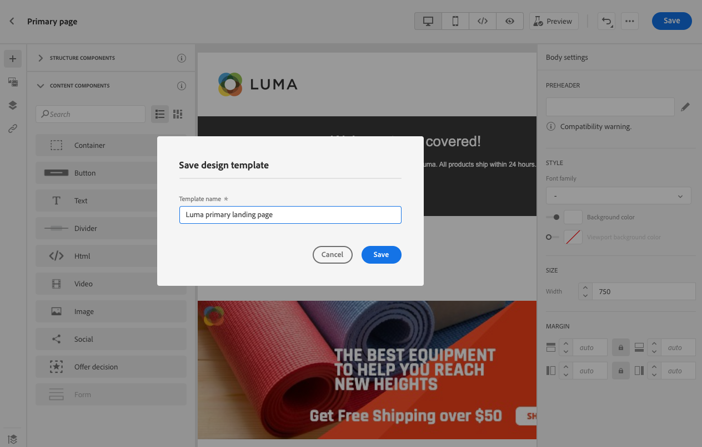

# Trabajar con plantillas de página de aterrizaje {#work-with-templates}

## Guardar una página como plantilla {#save-as-template}

Una vez que haya diseñado el [contenido de la página de aterrizaje](lp-content.md), puede guardarla para su reutilización futura. Para realizar esto, siga los pasos a continuación.

1. Haga clic en los puntos suspensivos en la parte superior derecha de la pantalla.

1. Select **[!UICONTROL Guardar plantilla de diseño]** en el menú desplegable.

   

1. Añada un nombre para esta plantilla.

   

1. Haga clic en **[!UICONTROL Guardar]**.

La próxima vez que cree una página de aterrizaje, puede utilizar esta plantilla para crear su contenido. Obtenga información sobre cómo en la [sección](#use-saved-template) más abajo.

## Usar una plantilla guardada {#use-saved-template}

1. Abra el [diseñador de contenido de página de aterrizaje](design-lp.md). Se muestra la lista de todas las plantillas guardadas anteriormente.

1. Puede ordenarlas **[!UICONTROL Por nombre]**, **[!UICONTROL Última modificación]** y **[!UICONTROL Última creación]**.

   

1. Seleccione la plantilla que desee en la lista.

1. Una vez seleccionadas, puede desplazarse entre todas las plantillas guardadas con las flechas derecha e izquierda.

   

1. Haga clic en **[!UICONTROL Usar esta página de aterrizaje]**.

1. Edite el contenido según sus preferencias con el diseñador de páginas de aterrizaje.

>[!NOTE]
>
>Las plantillas de página principales y las plantillas de subpágina se administran por separado, lo que significa que no puede usar una plantilla de página principal para crear una subpágina y viceversa.
