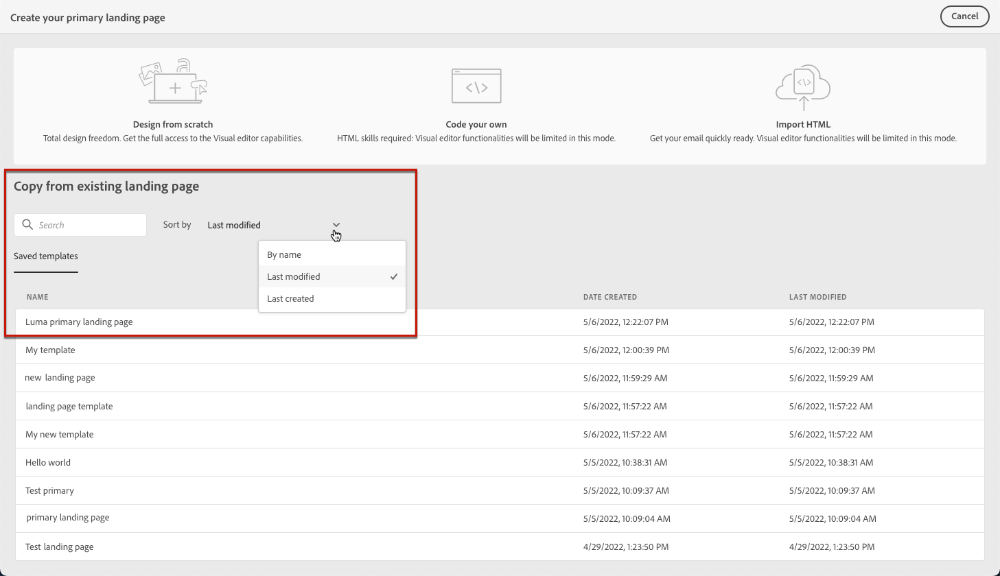

# Trabajo con plantillas de la página de destino {#work-with-templates}

## Guardar una página como plantilla {#save-as-template}

Una vez que hayas diseñado el [contenido de la página de aterrizaje](lp-content.md), puedes guardarlo para reutilizarlo en el futuro. Para realizar esto, siga los pasos a continuación.

1. Haga clic en los puntos suspensivos en la parte superior derecha de la pantalla.

1. Seleccione **[!UICONTROL Guardar como plantilla de contenido]** en el menú desplegable.

   

1. Añada un nombre para esta plantilla.

   

1. Haga clic en **[!UICONTROL Guardar]**.

La próxima vez que cree una página de aterrizaje, puede utilizar esta plantilla para crear su contenido. Aprenda a hacerlo en la [sección](#use-saved-template) a continuación.

## Uso de una plantilla guardada {#use-saved-template}

1. Abra [el diseñador de contenido de la página de aterrizaje](design-lp.md). Se muestra la lista de todas las plantillas guardadas anteriormente.

1. Puede ordenarlas **[!UICONTROL Por nombre]**, **[!UICONTROL Última modificación]** y **[!UICONTROL Última creación]**.

   

1. Seleccione la plantilla que desee en la lista.

1. Una vez seleccionadas, puede desplazarse entre todas las plantillas guardadas con las flechas derecha e izquierda.

   

1. Haga clic en **[!UICONTROL Usar esta plantilla]**.

1. Edite el contenido como desee con el diseñador de páginas de aterrizaje.

>[!NOTE]
>
>Las plantillas de página principal y las plantillas de subpágina se administran por separado, lo que significa que no puede utilizar una plantilla de página principal para crear una subpágina y viceversa.
