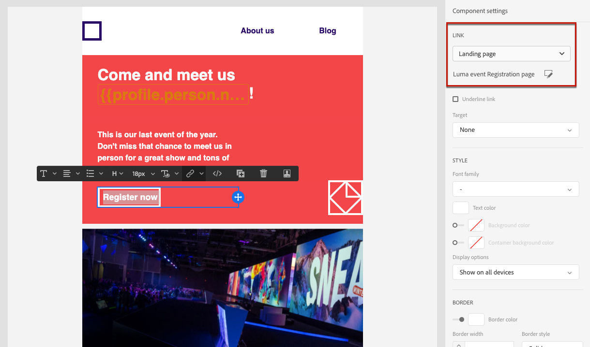

# Casos de uso de la página de aterrizaje

A continuación se muestran algunos ejemplos de cómo puede utilizar [!DNL Journey Optimizer] páginas de aterrizaje para que sus clientes no reciban ninguna o parte de sus comunicaciones.

<!--The main use cases are:
* Subscription to a service
* Opt-in
* Opt-out-->

## Suscripción a un servicio {#subscription-to-a-service}

Uno de los casos de uso más comunes consiste en invitar a sus clientes a [suscripción a un servicio](subscription-list.md) (como un boletín o un evento) a través de una página de aterrizaje. Los pasos principales se presentan en el gráfico siguiente:

Por ejemplo, supongamos que organiza un evento el mes que viene y desea iniciar una campaña de registro de eventos<!--to keep your customers that are interested updated on that event-->. Para ello, se envía un correo electrónico que incluye un vínculo a una página de aterrizaje que permite a los destinatarios registrarse en este evento. Los usuarios que se registren se agregarán a la lista de suscripción que haya creado con este fin.

### Configurar página de aterrizaje

1. Cree la lista de suscripción del registro de eventos, que almacenará los usuarios registrados. Obtenga información sobre cómo crear una lista de suscripción [here](subscription-list.md#define-subscription-list).

   

1. [Crear una página de aterrizaje](create-lp.md) para permitir que los destinatarios se registren en el evento.

1. Configuración del registro [página de aterrizaje principal](create-lp.md#configure-primary-page).

1. Al diseñar la variable [contenido de la página de aterrizaje](design-lp.md), seleccione la lista de suscripción que ha creado para actualizarla con los perfiles que seleccionan la casilla de verificación de registro.

   

1. Cree una página de agradecimiento que se mostrará a sus destinatarios una vez que envíen el formulario de registro. Obtenga información sobre cómo configurar subpáginas de aterrizaje [here](create-lp.md#configure-subpages).

   

1. [Publicación](create-lp.md#publish) la página de aterrizaje.

1. [Creación de un mensaje de correo electrónico](../create-message.md) para anunciar que el registro está abierto para su evento.

1. [Inserción de un vínculo](../message-tracking.md#insert-links) en el contenido del mensaje. Select **[!UICONTROL Landing page]** como el **[!UICONTROL Link type]** y seleccione [página de aterrizaje](create-lp.md#configure-primary-page) que ha creado para el registro.

   

1. Guarde el contenido y [publique el mensaje](../publish-manage-message.md).

1. Envíe su mensaje a través de un [recorrido](../building-journeys/journey.md) para dirigir el tráfico a la página de aterrizaje de registro.

   

   Una vez que reciban el correo electrónico, si los destinatarios hacen clic en el vínculo a la página de aterrizaje, se les dirigirá a la página de agradecimiento y se añadirán a la lista de suscripción.

### Enviar un correo electrónico de confirmación {#send-confirmation-email}

Además, puede enviar un correo electrónico de confirmación a los destinatarios que se hayan registrado en el evento. Para ello, siga los pasos a continuación.

1. Crear otro [recorrido](../building-journeys/journey.md). Puede hacerlo directamente desde la página de aterrizaje haciendo clic en el **[!UICONTROL Create journey]** botón. Obtenga más información [aquí](create-lp.md#configure-primary-page)

   

1. Despliegue el **[!UICONTROL Events]** categoría y suelte a **[!UICONTROL Segment Qualification]** actividad en el lienzo. Obtenga más información [aquí](../building-journeys/segment-qualification-events.md)

1. Haga clic en el **[!UICONTROL Segment]** y seleccione la lista de suscripción que ha creado.

   

1. Seleccione el correo electrónico de confirmación que desee y envíelo a través del recorrido .

   

Todos los usuarios que se hayan registrado para el evento recibirán el correo electrónico de confirmación.

<!--The event registration's subscription list tracks the profiles who registered and you can send them targeted event updates.-->

## Exclusión {#opt-out}

Para permitir que sus destinatarios cancelen la suscripción a sus comunicaciones, puede incluir un vínculo a una página de aterrizaje de exclusión en sus correos electrónicos.

Obtenga más información sobre la administración del consentimiento de los destinatarios y por qué esto es importante en [esta sección](../consent.md).

### Administración de exclusiones {#opt-out-management}

Proporcionar a los destinatarios la capacidad de cancelar su suscripción a la recepción de comunicaciones de una marca es un requisito legal. Obtenga más información sobre la legislación aplicable en la [documentación del Experience Platform](https://experienceleague.adobe.com/docs/experience-platform/privacy/regulations/overview.html#regulations){target=&quot;_blank&quot;}.

Por lo tanto, siempre debe incluir un **enlace para cancelar la suscripción** en cada correo electrónico enviado a los destinatarios:

* Al hacer clic en este vínculo, los destinatarios se dirigen a una página de aterrizaje que incluye un botón para confirmar la exclusión.
* Al hacer clic en el botón de exclusión, los datos de perfil se actualizarán con esta información.

### Configuración de la exclusión {#configure-opt-out}

Para permitir que los destinatarios de un mensaje cancelen la suscripción de sus comunicaciones a través de una página de aterrizaje, siga los pasos a continuación.

1. Cree su [página de aterrizaje](create-lp.md). Uso del específico de la página de aterrizaje **[!UICONTROL Form]** , defina un **[!UICONTROL Opt-out]** y elija actualizar **[!UICONTROL Channel (email)]**: el perfil que marca la casilla de exclusión de la página de aterrizaje se excluirá de todas las comunicaciones. [Más información](design-lp.md)

   <!--You can also build your own landing page and host it on the third-party system of your choice. To keep?-->

1. [Cree un mensaje](../create-message.md) en [!DNL Journey Optimizer].

1. Seleccione texto en el contenido y [insertar un vínculo](../message-tracking.md#insert-links) con la barra de herramientas contextual. También puede utilizar un vínculo en un botón.

   

1. Seleccione **[!UICONTROL Landing page]** en la lista desplegable **[!UICONTROL Link type]**.

1. Seleccione el [página de aterrizaje](create-lp.md#configure-primary-page) que ha creado para la exclusión.

   

1. Haga clic en **[!UICONTROL Save]**.

1. Guarde el contenido y [publique el mensaje](../publish-manage-message.md).

1. Envíe su mensaje a través de un [recorrido](../building-journeys/journey.md).

1. Una vez recibido el mensaje, si el destinatario hace clic en el vínculo para cancelar la suscripción, se muestra la página de aterrizaje.

   <!---->

1. Si el destinatario hace clic en el vínculo de exclusión de la página de aterrizaje, los datos del perfil se actualizan y no reciben comunicaciones de la marca a menos que se vuelvan a suscribir.

   <!--The opted-out recipient is then redirected to a confirmation message screen indicating that opting out was successful.-->

   <!---->

Para comprobar que se ha actualizado la opción del perfil correspondiente, vaya a Experience Platform y acceda al perfil seleccionando un área de nombres de identidad y un valor de identidad correspondiente. Obtenga más información en la [documentación del Experience Platform](https://experienceleague.adobe.com/docs/experience-platform/profile/ui/user-guide.html#getting-started){target=&quot;_blank&quot;}.

En la pestaña **[!UICONTROL Attributes]**, puede ver que el valor de **[!UICONTROL choice]** ha cambiado a **[!UICONTROL no]**.

<!--

### Other ways to opt out

You can also enable your recipients to unsubscribe whithout using landing pages.

* **One-click opt-out**

    You can add a one-click opt-out link into your email content. This will enable your recipients to quickly unsubscribe from your communications, without being redirected to a landing page where they need to confirm opting out. [Learn more](../message-tracking.md#one-click-opt-out-link)

* **Unsubscribe link in header**

    If the recipients' email client supports displaying an unsubscribe link in the email header, emails sent with [!DNL Journey Optimizer] automatically include this link. [Learn more](../consent.md#unsubscribe-email)
-->
