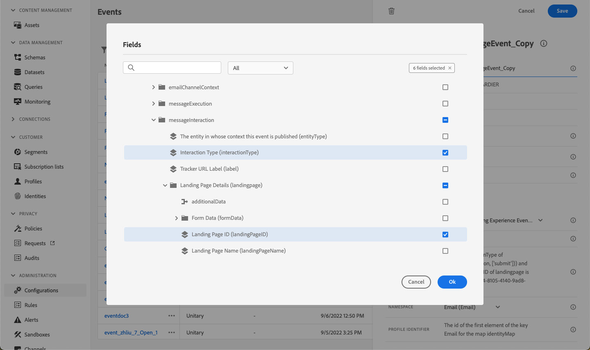

# Casos de uso de página de aterrizaje {#lp-use-cases}

A continuación se muestran algunos ejemplos de cómo puede usar las páginas de aterrizaje de [!DNL Journey Optimizer] para que sus clientes acepten su inclusión/exclusión en la recepción de algunas o todas sus comunicaciones.

## Suscripción a un servicio {#subscription-to-a-service}

Uno de los casos de uso más comunes consiste en invitar a tus clientes a [suscribirse a un servicio](subscription-list.md) (como una newsletter o un evento) a través de una página de aterrizaje. Los pasos principales se presentan en el siguiente gráfico:

Por ejemplo, supongamos que organiza un evento el mes que viene y que desea iniciar una campaña de registro de eventos <!--to keep your customers that are interested updated on that event-->. Para ello, va a enviar un correo electrónico con un vínculo a una página de aterrizaje que permitirá a sus destinatarios registrarse en este evento. Los usuarios que se registren se agregarán a la lista de suscripción que haya creado para este fin.

### Configuración de una página de aterrizaje {#set-up-lp}

Para configurar una página de aterrizaje para el registro de eventos, debe crear una lista de suscripción, diseñar la página de aterrizaje con un formulario de registro y configurar las páginas y configuraciones necesarias. Siga estos pasos:

1. Cree la lista de suscripción del registro de eventos, que almacenará a los usuarios registrados. Obtenga información sobre cómo crear una lista de suscripción [aquí](subscription-list.md#define-subscription-list).

   

1. [Crea una página de aterrizaje](create-lp.md) para permitir que tus destinatarios se registren en tu evento.

   

1. Configure la [página de aterrizaje principal](create-lp.md#configure-primary-page) de registro.

1. Al diseñar el [contenido de la página de aterrizaje](design-lp.md), seleccione la lista de suscripción que creó para actualizarla con los perfiles que seleccionan la casilla de verificación de registro.

   

1. Cree una página de &quot;agradecimiento&quot; que se muestre a los destinatarios una vez que envíen el formulario de registro. Aprenda a configurar las subpáginas de aterrizaje [aquí](create-lp.md#configure-subpages).

   

1. [Publicar](create-lp.md#publish-landing-page) la página de aterrizaje.

1. En un [recorrido](../building-journeys/journey.md), agregue una actividad **Correo electrónico** para dirigir el tráfico a la página de aterrizaje de registro.

   

1. [Diseña el correo electrónico](../email/get-started-email-design.md) para anunciar que el registro ya está abierto para tu evento.

1. [Inserte un vínculo](../email/message-tracking.md#insert-links) en el contenido del mensaje. Seleccione **[!UICONTROL Página de aterrizaje]** como **[!UICONTROL Tipo de vínculo]** y elija la [página de aterrizaje](create-lp.md#configure-primary-page) que creó para el registro.

   

   >[!NOTE]
   >
   >Para poder enviar el mensaje, asegúrese de que la página de aterrizaje seleccionada aún no haya caducado. Aprenda a actualizar la fecha de caducidad [en esta sección](create-lp.md#configure-primary-page).

   Una vez que reciban el correo electrónico, si los destinatarios hacen clic en el vínculo a la página de aterrizaje, se les dirigirá a la página &quot;gracias&quot; y se les añadirá a la lista de suscripción.

### Enviar un correo electrónico de confirmación {#send-confirmation-email}

Además, puede enviar un correo electrónico de confirmación a los destinatarios que se registraron en el evento. Para ello, siga los pasos que aparecen a continuación.

1. Crear otro [recorrido](../building-journeys/journey.md). Puede hacerlo directamente desde la página de aterrizaje haciendo clic en el botón **[!UICONTROL Crear recorrido]**. [Más información](create-lp.md#configure-primary-page)

   

1. Despliegue la categoría **[!UICONTROL Events]** y suelte una actividad **[!UICONTROL Audience Qualification]** en el lienzo. [Más información](../building-journeys/audience-qualification-events.md)

1. Haga clic en el campo **[!UICONTROL Audiencia]** y seleccione la lista de suscripción que ha creado.

   

1. Añada un correo electrónico de confirmación de su elección y envíelo a través del recorrido.

   

Todos los usuarios que se hayan registrado en su evento recibirán el correo electrónico de confirmación.

<!--The event registration's subscription list tracks the profiles who registered and you can send them targeted event updates.-->

## Página de aterrizaje de exclusión {#opt-out}

Para permitir que los destinatarios cancelen su suscripción a las comunicaciones, puede incluir en sus correos electrónicos un vínculo a una página de aterrizaje de exclusión.

>[!NOTE]
>
>Obtenga más información acerca de cómo administrar el consentimiento de los destinatarios y por qué esto es importante en [esta sección](../privacy/opt-out.md).

### Administración de exclusiones {#opt-out-management}

Proporcionar a los destinatarios la capacidad de cancelar la suscripción a la recepción de comunicaciones de una marca es un requisito legal. Obtenga más información acerca de la legislación aplicable en la [Documentación de Experience Platform](https://experienceleague.adobe.com/docs/experience-platform/privacy/regulations/overview.html?lang=es#regulations){target="_blank"}.

Por lo tanto, siempre debe incluir un **enlace para cancelar la suscripción** en cada correo electrónico enviado a los destinatarios:

* Al hacer clic en este vínculo, los destinatarios se dirigen a una página de destino que incluye un botón para confirmar la exclusión.
* Al hacer clic en el botón de exclusión, los datos de perfil se actualizan con esta información.

### Configuración de la exclusión de correo electrónico {#configure-opt-out}

Para permitir que los destinatarios de un correo electrónico cancelen su suscripción a las comunicaciones a través de una página de aterrizaje, siga los pasos a continuación:

1. Cree su página de aterrizaje. [Más información](create-lp.md)

1. Defina la página principal. [Más información](create-lp.md#configure-primary-page)

1. [Diseña](design-lp.md) el contenido de la página principal: usa el componente **[!UICONTROL Formulario]** específico de la página de aterrizaje, define una casilla de verificación de **[!UICONTROL exclusión]** y elige actualizar **[!UICONTROL Canal (correo electrónico)]**: el perfil que marca la casilla de exclusión en tu página de aterrizaje se excluirá de todas tus comunicaciones.

   

   <!--You can also build your own landing page and host it on the third-party system of your choice.-->

1. Agregue una confirmación [subpágina](create-lp.md#configure-subpages) que se mostrará a los usuarios que envíen el formulario.

   

   >[!NOTE]
   >
   >Asegúrese de hacer referencia a la subpágina en la sección **[!UICONTROL Call to action]** de la página principal del componente **[!UICONTROL Form]**. [Más información](design-lp.md)

1. Una vez que haya configurado y definido el contenido de sus páginas, [publique](create-lp.md#publish-landing-page) la página de aterrizaje.

1. [Crear un mensaje de correo electrónico](../email/get-started-email-design.md) en un recorrido.

1. Seleccione texto en el contenido e [inserte un vínculo](../email/message-tracking.md#insert-links) mediante la barra de herramientas contextual. También puede utilizar un vínculo en un botón.

1. Seleccione **[!UICONTROL Página de aterrizaje]** de la lista desplegable **[!UICONTROL Tipo de vínculo]** y seleccione la [página de aterrizaje](create-lp.md#configure-primary-page) que creó para la exclusión.

   

   >[!NOTE]
   >
   >Para poder enviar el mensaje, asegúrese de que la página de aterrizaje seleccionada aún no haya caducado. Aprenda a actualizar la fecha de caducidad [en esta sección](create-lp.md#configure-primary-page).

1. Publique y ejecute el recorrido. [Más información](../building-journeys/journey.md).

1. Una vez recibido el mensaje, si un destinatario hace clic en el vínculo para cancelar la suscripción del correo electrónico, se muestra la página de aterrizaje.

   

   >[!WARNING]
   >
   >Al hacer clic en el vínculo unsubscribe del correo electrónico, solo se abre la página de aterrizaje. El destinatario debe **enviar el formulario haciendo clic en el botón de exclusión de la página de aterrizaje** para completar la cancelación de la suscripción y actualizar el consentimiento de su perfil.

   Si el destinatario marca la casilla y envía el formulario:

   * El destinatario excluido se redirige a la pantalla de mensaje de confirmación.

   * Los datos del perfil se actualizan y no recibirán comunicaciones de su marca a menos que se vuelva a suscribir.

Para comprobar que se ha actualizado la opción del perfil correspondiente, vaya a Experience Platform y acceda al perfil seleccionando un espacio de nombres de identidad y un valor de identidad correspondiente. Obtenga más información en la [Documentación de Experience Platform](https://experienceleague.adobe.com/docs/experience-platform/profile/ui/user-guide.html?lang=es#getting-started){target="_blank"}.

En la ficha **[!UICONTROL Atributos]**, puede ver que el valor de **[!UICONTROL choice]** ha cambiado a **[!UICONTROL no]**.

La información de exclusión se almacena en el **conjunto de datos del servicio de consentimiento**. [Más información sobre los conjuntos de datos](../data/get-started-datasets.md)

>[!NOTE]
>
>Si el método de combinación para la directiva de combinación predeterminada de [Adobe Experience Platform](https://experienceleague.adobe.com/docs/experience-platform/profile/home.html?lang=es){target="_blank"} **[!UICONTROL Perfiles]** es la **[!UICONTROL Prioridad del conjunto de datos]**, asegúrese de habilitar el **[!UICONTROL conjunto de datos del servicio de consentimiento de AJO]** y de priorizarlo en la directiva de combinación. [Más información](https://experienceleague.adobe.com/docs/experience-platform/profile/merge-policies/ui-guide.html?lang=es#dataset-precedence-profile){target="_blank"}
>
>Incluso si no se han agregado lotes a este conjunto de datos, seguirá conteniendo la información de inclusión/exclusión.

**Ver también:**

* [Opción de exclusión en un clic](../email/email-opt-out.md#one-click-opt-out)
* [Vínculo de no participación en el encabezado del correo electrónico](../email/email-opt-out.md#unsubscribe-header)

<!--

### Other ways to opt out

You can also enable your recipients to unsubscribe whithout using landing pages.

* **One-click opt-out**

    You can add a one-click opt-out link into your email content. This will enable your recipients to quickly unsubscribe from your communications, without being redirected to a landing page where they need to confirm opting out. [Learn more](../privacy/opt-out.md#opt-out-personalization)

* **Unsubscribe link in header**

    If the recipients' email client supports displaying an unsubscribe link in the email header, emails sent with [!DNL Journey Optimizer] automatically include this link. [Learn more](../email/email-opt-out.md#unsubscribe-header)

-->

## Aproveche el evento de envío de página de aterrizaje {#leverage-lp-event}

Puede utilizar la información enviada en una página de aterrizaje para realizar más acciones. Por ejemplo, si un usuario se suscribe a una lista de suscripción determinada, puede aprovechar esa información para enviar un correo electrónico recomendando otras listas de suscripción a ese usuario.

Para ello, debe crear un [evento unitario basado en reglas](../event/about-creating.md) basado en el **[!UICONTROL Esquema de evento de experiencia de seguimiento de correo electrónico de AJO]** que contenga la información de envío y [usar este evento en un recorrido](../building-journeys/general-events.md).

>[!NOTE]
>
>Cuando trabaje con eventos de envío de página de aterrizaje, tenga en cuenta que es posible que el campo del evento `interactionType` no siempre refleje con precisión la acción del usuario específica. Para determinar con precisión si un usuario ha optado por no participar, se ha suscrito o ha realizado otra acción, compruebe siempre los atributos de perfil reales (como las preferencias de consentimiento) o los valores de los campos de formulario en lugar de depender únicamente del evento `interactionType`.

<!--DETAILED STEPS TBC:

Follow the steps below.

1. Go to **[!UICONTROL Administration]** > **[!UICONTROL Configurations]**, and in the **[!UICONTROL Events]** section, select **[!UICONTROL Manage]**.

    

1. The list of events displays. Select **[!UICONTROL Create Event]**.

    

1. The event configuration pane opens on the right side of the screen. Configure a rule-based unitary event. [Learn more](../event/about-creating.md)

1. Define the schema: select **[!UICONTROL AJO Email Tracking Experience Event Schema v.1]** (available by default in [!DNL Journey Optimizer]).

    

1. In the **[!UICONTROL Fields]** section, select the following elements:

    * **[!UICONTROL _experience]** > **[!UICONTROL customerJourneyManagement]** > **[!UICONTROL messageInteraction]** > **[!UICONTROL Interaction Type]**
    
    * **[!UICONTROL _experience]** > **[!UICONTROL customerJourneyManagement]** > **[!UICONTROL messageInteraction]** > **[!UICONTROL Landing Page Details]** > **[!UICONTROL Landing Page ID]**

    

1. Click inside the **[!UICONTROL Event ID condition]** field. Using the simple personalization editor, define the condition for the **[!UICONTROL Interaction Type]** and **[!UICONTROL Landing Page ID]** fields. This will be used by the system to identify the events that will trigger your journey.

    

    >[!NOTE]
    >
    >To find the landing page ID, you can insert the landing page as a link into an email and select the source code from the contextual toolbar to display the landing page information.
    >
    >

1. Save your changes.

1. Create a [journey](../building-journeys/journey.md). You can do it directly from the landing page by clicking the **[!UICONTROL Create journey]** button. Learn more [here](create-lp.md#configure-primary-page)

    

1. In the journey, unfold the **[!UICONTROL Events]** category and drop the event that you created into the canvas. Learn more [here](../building-journeys/audience-qualification-events.md)

    

1. Unfold the **[!UICONTROL Actions]** category and drop an email action into the canvas.

    

///How do you use the information from the event to send an email to the users? -->
