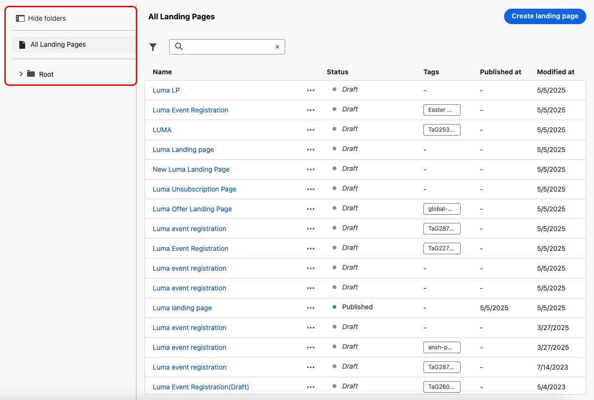
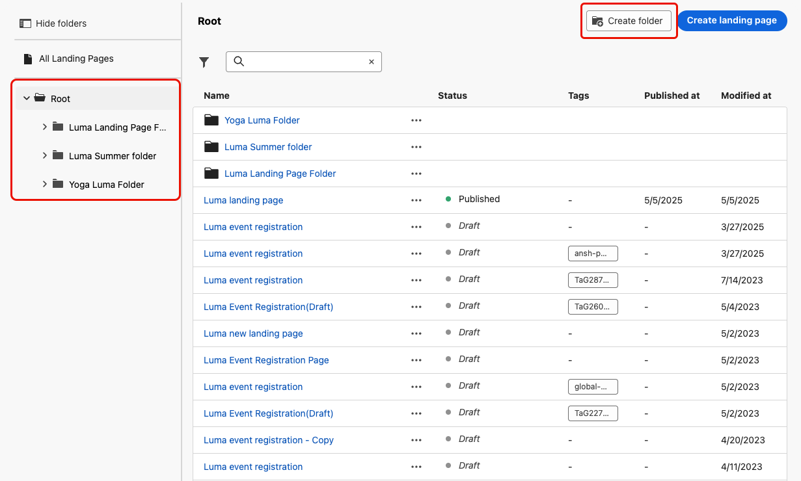
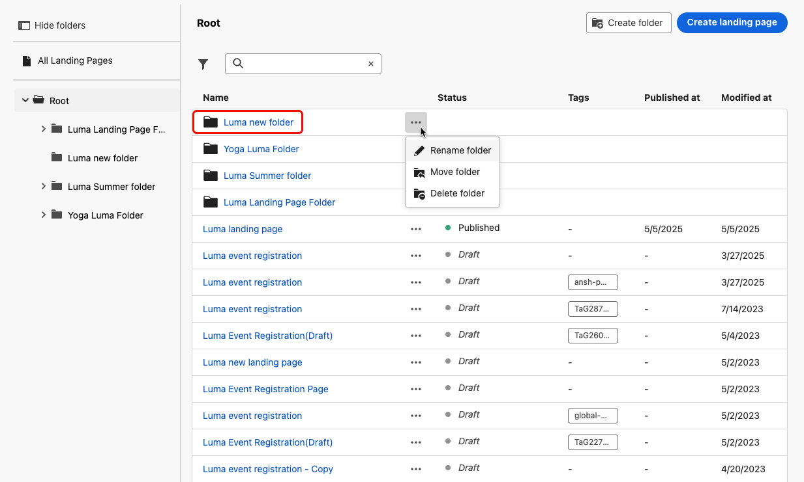

# Administrar las páginas de aterrizaje {#manage-lp}

## Acceso a páginas de aterrizaje {#access-landing-pages}

Para acceder a la lista de páginas de aterrizaje, seleccione **[!UICONTROL Administración de contenido]** > **[!UICONTROL Páginas de aterrizaje]** en el menú de la izquierda.

Se muestran todas las páginas de aterrizaje existentes.

El panel de la izquierda le permite organizar las páginas de aterrizaje en carpetas. De forma predeterminada, se muestran todos los elementos. Al seleccionar una carpeta, solo se muestran las páginas de aterrizaje y las carpetas incluidas en la carpeta seleccionada. [Más información](#folders)

Para encontrar un elemento específico, empiece a escribir un nombre en el campo de búsqueda. Cuando se selecciona una [carpeta](#folders), la búsqueda se aplica a todas las páginas de aterrizaje o carpetas en el primer nivel de jerarquía de esa carpeta<!--(not nested items)-->.

Puede filtrar las páginas de aterrizaje según su estado, fecha de modificación o etiquetas.

En esta lista, puede hacer clic en los tres puntos junto a una página de aterrizaje y seleccionar la acción que desee:

* Para [páginas de aterrizaje publicadas](create-lp.md#publish-landing-page), accede al [informe de página de aterrizaje](../reports/lp-report-global-cja.md) y a [informe de las últimas 24 horas](../reports/lp-report-live.md).

* **Eliminar** y **Cancelar la publicación** de una página de aterrizaje. No puede eliminar una página de aterrizaje [publicada](create-lp.md#publish-landing-page). Para eliminarlo, primero debe cancelar la publicación.

  >[!CAUTION]
  >
  >Si cancela la publicación de una página de aterrizaje a la que se hace referencia en un mensaje, el vínculo a la página de aterrizaje se interrumpirá y los usuarios recibirán una página de error si intentan acceder a ella.

* **Duplicar** cualquier página de aterrizaje.

* Editar las [etiquetas](../start/search-filter-categorize.md#tags) asociadas a una página de aterrizaje.

* Mueva la página de aterrizaje a una carpeta. [Más información](#folders)

## Uso de carpetas para administrar páginas de aterrizaje {#folders}

>[!CONTEXTUALHELP]
>id="ajo_lp_folders"
>title="Organice las páginas de aterrizaje en carpetas"
>abstract="Utilice carpetas para clasificar y administrar sus páginas de aterrizaje según las necesidades de su organización."

Para navegar fácilmente por las páginas de aterrizaje, puede utilizar carpetas para organizarlas de forma más eficaz en una jerarquía estructurada. Esto le permite clasificar y administrar los elementos según las necesidades de su organización.

1. Haga clic en el botón **[!UICONTROL Todas las páginas de aterrizaje]** para mostrar todos los elementos creados anteriormente sin la agrupación de carpetas.

   

1. Haga clic en la carpeta **[!UICONTROL Root]** para mostrar todas las carpetas creadas.

   >[!NOTE]
   >
   >Si aún no ha creado carpetas, se muestran todas las páginas de aterrizaje.

1. Haga clic en cualquier carpeta dentro de la carpeta **[!UICONTROL Root]** para mostrar su contenido.

1. Al hacer clic en la carpeta **[!UICONTROL Root]** o en cualquier otra carpeta, se muestra el botón **[!DNL Create folder]**. Selecciónelo.

   

1. Escriba un nombre para la nueva carpeta y haga clic en **[!UICONTROL Guardar]**. La nueva carpeta se muestra dentro de la carpeta **[!UICONTROL Root]** o dentro de la carpeta seleccionada actualmente.

1. Puede hacer clic en el botón **[!UICONTROL Más acciones]** para cambiar el nombre de la carpeta o eliminarla.

   

1. Con el botón **[!UICONTROL Más acciones]**, también puede mover páginas de aterrizaje a otra carpeta existente.

1. Ahora puede desplazarse a la carpeta que acaba de crear. Cada nueva página de aterrizaje que [cree](create-lp.md#create-landing-page.md) desde aquí se guardará en la carpeta actual.

   
