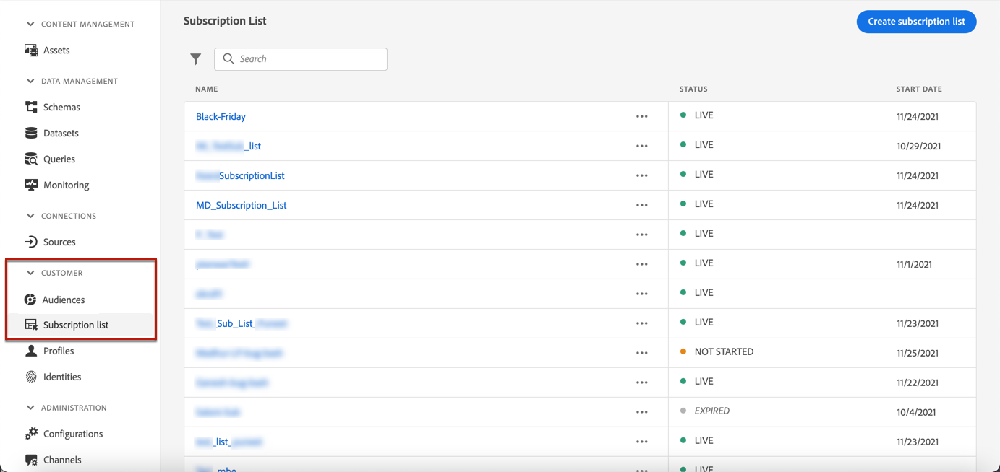
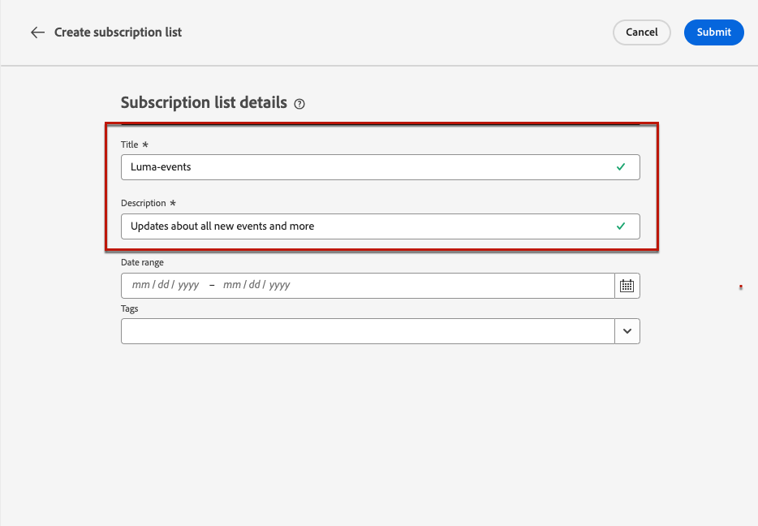

# Listas de suscripciones {#create-subscription-list}

>[!CONTEXTUALHELP]
>id="ajo_subscription_list"
>title="Configurar una lista de suscripción"
>abstract="Cree una lista de suscripción para recopilar perfiles que hayan optado por recibir comunicaciones sobre un asunto o evento específico. "
>additional-url="https://experienceleague.adobe.com/es/docs/journey-optimizer/using/content-management/landing-pages/subscription-list#define-subscription-list" text="Creación de una lista de suscripción"

Un servicio de suscripción se refiere a los bienes y servicios de marketing proporcionados a los clientes que han elegido recibir comunicaciones sobre un tema/evento/interés/etc específico. de forma continua. En [!DNL Journey Optimizer], estos clientes aceptados se recopilan en una lista de suscripción.

Se puede utilizar un servicio de suscripción para:

* un boletín informativo, por ejemplo: &quot;Running series&quot;
* un evento, por ejemplo: &quot;Summit 2021&quot;
* un seminario web, por ejemplo: &quot;Más información sobre la criptografía&quot;.
* un interés en un determinado producto/deporte/servicio/etc., por ejemplo: &quot;Interesado en comprar una casa en los próximos 12 meses&quot;
* una preferencia sobre cómo recibir notificaciones, por ejemplo: &quot;Recibir notificaciones de nuevas canciones por correo electrónico&quot;

Los perfiles se pueden agregar a una lista de suscripción mediante una [página de aterrizaje](create-lp.md). Se presenta un ejemplo en [esta sección](lp-use-cases.md#subscription-to-a-service).

## Creación de una lista de suscripción {#define-subscription-list}

Para crear una lista de suscripción, siga los pasos a continuación.

1. Para acceder a las listas de suscripción, seleccione **[!UICONTROL Cliente]** > **[!UICONTROL Lista de suscripción]**.

   

1. Seleccione el botón **[!UICONTROL Crear lista de suscripción]**.

   

1. Añada un título y una descripción. Estos campos son obligatorios.

   

   >[!CAUTION]
   >
   >Actualmente no puede usar el espaciado ni escribir un nombre que ya exista para otra lista de suscripción en el campo **[!UICONTROL Título]**.

1. Puede definir una fecha de inicio y una fecha de finalización.

   

1. Seleccione o cree etiquetas Adobe Experience Platform en el campo **[!UICONTROL Etiquetas]** para categorizar la página de aterrizaje y mejorar la búsqueda. [Más información](../start/search-filter-categorize.md#tags)

1. Haga clic en **[!UICONTROL Guardar]**.

## Uso de una lista de suscripción {#use-subscription-lists}

Una vez creada la lista de suscripción, puede:

* Adición de perfiles a la lista de suscripción

  Puede invitar a personas a **unirse a la lista**, suscribiéndose a un boletín o registrándose en un evento. También puede **enviar mensajes personalizados** a los suscriptores.

  Por ejemplo, para invitar a una audiencia a registrarse en un evento o suscribirse a un boletín, puede enviarles un mensaje con un vínculo a una página de aterrizaje para que se unan al evento o se suscriban. Los perfiles que realizan la inclusión a través del formulario de página de aterrizaje se agregan a la lista de suscripción que ha creado para este fin.

* Envío de mensajes a los suscriptores

  También puede utilizar las listas de suscripción como audiencias al crear recorridos y añadir personalización.

  Por ejemplo, cuando un cliente se suscribe a un servicio de streaming, puede almacenar en déclencheur el envío inmediato de una serie de correos electrónicos de bienvenida, lo que le anima a iniciar sesión en la aplicación por primera vez y establecer sus preferencias de visualización.

Aprenda a utilizar su lista de suscripción en [este caso de uso](lp-use-cases.md#subscription-to-a-service).

## Examen de las listas de suscripción {#browse-subscription-lists}

La lista muestra todas las listas de suscripción creadas. Puede filtrarlos en función de la fecha de creación o de modificación, y de su estado.

Los estados posibles son los siguientes:

* **[!UICONTROL No iniciado]**: ha definido una fecha de inicio posterior al día actual. Los perfiles suscritos aún no recibirán comunicaciones relacionadas con esta lista de suscripción.
* **[!UICONTROL Activo]**: el día actual está comprendido entre la fecha de inicio y la fecha de finalización de la lista de suscripción o no ha definido las fechas de finalización/inicio, lo que significa que la lista de suscripción siempre está activa.
* **[!UICONTROL Caducado]**: se pasó la fecha de finalización, por lo que la lista de suscripción ya no es válida. Ningún perfil suscrito recibirá más comunicaciones relacionadas con esta lista de suscripción.

## Monitorización de las listas de suscripción {#monitor-subscription-lists}

Puede monitorizar el impacto de su lista de suscripciones mediante informes dedicados. Puede acceder a dos tipos de informes:

* Informe en directo de la lista de suscripciones

  Los informes en directo, a los que se puede acceder desde la pestaña Últimas 24 horas, muestran los eventos que han tenido lugar en las últimas 24 horas, con un intervalo de tiempo mínimo de dos minutos desde que se produjo el evento. [Más información](../reports/subscription-report-live.md)

* Lista de suscripciones Todos los informes de tiempo, con Customer Journey Analytics

  Estos informes se centran en los eventos que se produjeron hace al menos dos horas y abarcan los eventos que se producen durante un período de tiempo seleccionado. El **informe de suscripciones** ofrece información esencial sobre las suscripciones y bajas de perfiles asociadas con listas particulares, lo que le ayuda a comprender la eficacia de diferentes campañas e iniciativas de suscripción para impulsar la participación y las conversiones. [Más información](../reports/subscription-report-global-cja.md)
