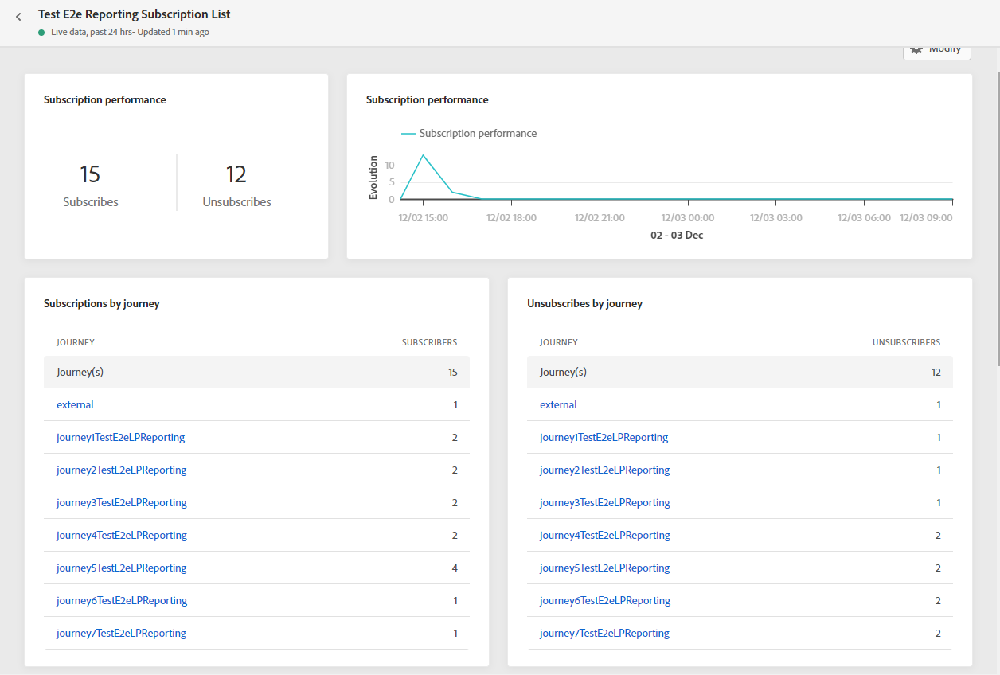

# Informe de suscripción {#subscription-report}

El informe de suscripción muestra detalles sobre la actividad de sus suscriptores. Hay dos tipos de informes disponibles:

* La variable **[!UICONTROL Live report]** para medir y visualizar las suscripciones y bajas de suscripción de sus envíos solo durante las últimas 24 horas.

* La variable **[!UICONTROL Global report]** para medir y visualizar las suscripciones y bajas de suscripción de los envíos durante un período de tiempo seleccionado.

Para acceder a los informes, seleccione **Activo** o **[!UICONTROL Global report]** del menú avanzado de la lista de suscripción seleccionada.

## Informe de suscripción en directo {#subscription-live}

La variable **[!UICONTROL Subscription performance]** KPI y **[!UICONTROL Subscriptions by journey]**/**[!UICONTROL Unsubscribes by journey]** las tablas detallan la información principal relativa a la participación de los visitantes en la página de aterrizaje. Las tablas y los KPI contienen los datos disponibles relacionados con la página de aterrizaje, como:

* **[!UICONTROL Subscribes]**: Número total de suscripciones en las últimas 24 horas.

* **[!UICONTROL Unsubscribes]**: Número total de bajas de suscripción en las últimas 24 horas.

La variable **[!UICONTROL Subscription performance]** gráfico muestra la evolución de las suscripciones en las últimas 24 horas.

La variable **Suscripciones: desglose** y **Cancelación de suscripciones: desglose** los gráficos representan el número total de personas que se suscribieron o cancelaron la suscripción en las últimas 24 horas, según los mensajes, las páginas de aterrizaje y los canales.

## Informe global de suscripción {#subscription-global}

La variable **[!UICONTROL Subscription performance]** KPI y **[!UICONTROL Subscriptions by journey]**/**[!UICONTROL Unsubscribes by journey]** las tablas detallan la información principal relativa a la participación de los visitantes en la página de aterrizaje. Las tablas y los KPI contienen los datos disponibles relacionados con la página de aterrizaje, como:

* **[!UICONTROL Subscribes]**: Número total de suscripciones durante el periodo correspondiente.

* **[!UICONTROL Unsubscribes]**: Número total de bajas de suscripción durante el periodo correspondiente.

La variable **[!UICONTROL Subscription performance]** gráfico muestra la evolución de las suscripciones durante el periodo correspondiente.

La variable **Suscripciones: desglose** y **Cancelación de suscripciones: desglose** representan el número total de personas que se suscribieron o cancelaron la suscripción durante el período de tiempo seleccionado en función de los mensajes, las páginas de aterrizaje y los canales.
