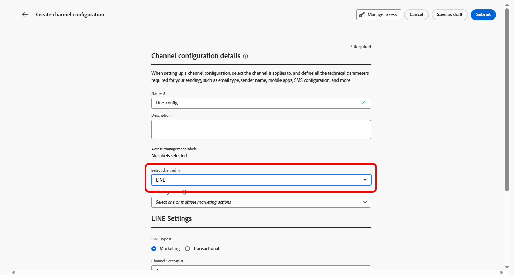

# Configuración del canal de LINE en Journey Optimizer {#line-configuration}

1. Acceda al menú **[!UICONTROL Canales]** > **[!UICONTROL Configuración general]** > **[!UICONTROL Configuraciones de canal]** y luego haga clic en **[!UICONTROL Crear configuración de canal]**.

   

1. Introduzca un nombre y una descripción (opcional) para la configuración y, a continuación, seleccione el canal que desea configurar.

   >[!NOTE]
   >
   > Los nombres deben comenzar por una letra (A-Z). Solo puede contener caracteres alfanuméricos. También puede utilizar caracteres de guion bajo `_`, punto `.` y guion `-`.

1. Para asignar etiquetas de uso de datos principales o personalizadas a la configuración, puedes seleccionar **[!UICONTROL Administrar acceso]**. [Más información sobre el Control de acceso de nivel de objeto (OLAC)](../administration/object-based-access.md).

1. Seleccione el canal **LINE**.

   

1. Seleccione **[!UICONTROL Acciones de marketing]** para asociar directivas de consentimiento a los mensajes que usan esta configuración. Todas las políticas de consentimiento asociadas con la acción de marketing se aprovechan para respetar las preferencias de los clientes. [Más información](../action/consent.md#surface-marketing-actions)

1. Seleccione el tipo de mensaje para la configuración:

   * **Marketing**: Para mensajes promocionales, como promociones semanales de una tienda minorista. Estos mensajes requieren el consentimiento del usuario y deben cumplir con la política de LINE con respecto a las inclusiones de usuarios.
   * **Transaccional**: para mensajes no comerciales, como confirmaciones de pedidos, notificaciones de restablecimiento de contraseña o actualizaciones de envíos. Estos mensajes se pueden enviar incluso a usuarios que han cancelado la suscripción a comunicaciones de marketing, pero están estrictamente limitados a contextos transaccionales específicos.

1. Seleccione su **[!UICONTROL configuración de canal]**.

   Póngase en contacto con su representante de Adobe para configurar su **[!UICONTROL configuración de canal]**.

   

1. Seleccione el **[!UICONTROL ID de usuario de LINE]** que desee asignar. Este es el identificador utilizado para vincular mensajes a usuarios individuales dentro del canal LINE.

1. Escriba su **[!UICONTROL nombre de remitente]**, como el nombre de su marca.

1. Envíe los cambios.

Ahora puede seleccionar la configuración al crear el mensaje de LINE.

## Configuración de la API de configuración del canal LINE {#line-api}

Esta API establece los ajustes de canal que almacenan los detalles de autorización y configuración necesarios para conectarse a la API de mensajería LINE. Esta configuración permite a Adobe Journey Optimizer autenticar y enviar mensajes a través de LINE con las credenciales proporcionadas.

**Extremo**

```
POST https://platform.adobe.io/journey/imp/config/channel-settings
```

| Nombre del encabezado | Descripción |
|-|-|
| Autorización | Token de usuario de su cuenta técnica |
| x-api-key | ID de cliente de Adobe Developer Console |
| x-gw-ims-org-id | Su ID de la organización IMS |
| x-sandbox-name | Nombre de la zona protegida, por ejemplo, prod |
| Content-Type | Debe ser application/json |


**Cuerpo de solicitud**

```json
{
    "name": "your_defined_name",
    "channelRegistryId": "line",
    "channel": "line",
    "channelSettings": {
        "channelId": "your_line_channel_id",
        "channelSecret": "your_line_channel_secret"
    }
}
```

**Respuesta de configuración de canal**

```json
{
"id": "3603ed66-ae86-42b8-8a90-d4b4e54e7c3b",
"name": "your_defined_name",
"channelRegistryId": "line",
"channel": "line",
"channelSettings": {
    "channelId": "your_line_channel_id",
    "channelSecret": "your_line_channel_secret"
    },
    "channelPublicationId": "v1_line",
    "createdAt": "2025-07-30T12:00:00.000Z",
    "modifiedAt": "2025-07-30T12:00:00.000Z",
    "isFromLatestVersion": true,
    "_etag": "\"eab98d24-18af-48ae-90f9-e59d4f8cfb2b\""
}
```
