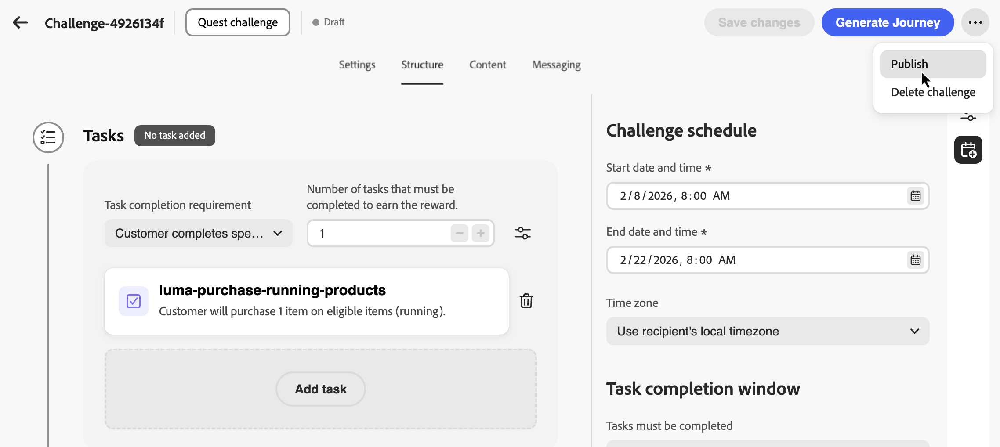
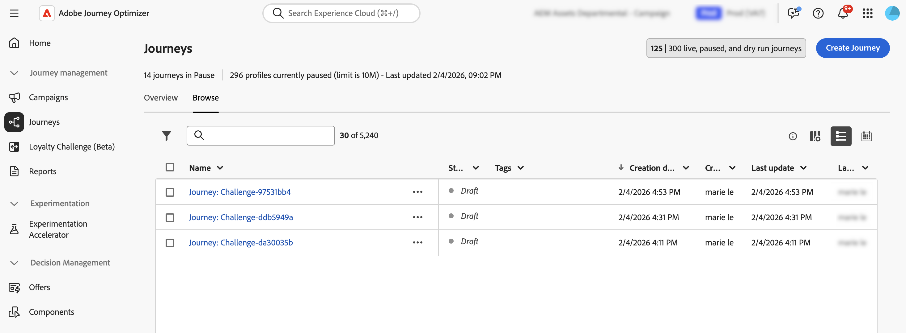

# Crear desafíos {#create-challenges}

>[!BEGINSHADEBOX]

**Tabla de contenido**

[Introducción a los retos de fidelización](get-started.md)

<table style="table-layout:fixed">
<tr style="border: 0;">
<td style="vertical-align:top;">

**Crear y administrar desafíos**

* [Acceder y administrar desafíos y tareas](access-loyalty-challenges.md)
* **Crear desafíos** ◀︎ **Usted está aquí**
* [Creación de tareas](create-tasks.md)
* [Monitorización del rendimiento del desafío de fidelidad](loyalty-reporting.md)

</td>
<td style="vertical-align:top;">

**Configurar e integrar**

* [Configuración de desafíos de lealtad](loyalty-admin.md)
* [Guía de definición de recompensa](reward-definition-guide.md)
* [Guía del transformador de eventos](event-transformer-guide.md)
* [Datos y conjuntos de datos de fidelización](loyalty-data-and-datasets.md)
* [Referencia de API de retos de fidelización](https://developer.adobe.com/journey-optimizer-apis/references/loyalty-challenges){target="_blank"}

</td>
</tr>
</table>

>[!ENDSHADEBOX]

>[!AVAILABILITY]
>
>Esta característica se encuentra actualmente en **versión beta privada**. Para obtener información detallada acerca del ciclo de lanzamiento y las fases de disponibilidad, consulte [Ciclo de lanzamiento de Journey Optimizer](../rn/releases.md).

Esta página cubre el proceso completo de creación de un desafío de fidelidad, desde la selección del tipo de desafío y la configuración de la configuración, estructura, contenido y mensajería hasta la generación y publicación del recorrido que ofrece el desafío a sus clientes.

La creación de un desafío implica los siguientes pasos:

1. **[Crear el desafío](#create-the-challenge)**: seleccione un tipo de desafío y abra el editor de desafíos.
1. **[Configurar opciones](#settings)**: defina el nombre del desafío, la audiencia, la programación, las reglas de inclusión y los límites de repetición.
1. **[Configurar estructura](#structure)** — Agregar tareas y recompensas (no aplicable para Traer sus propios desafíos de datos).
1. **[Configurar contenido](#configure-content-cards)** *(opcional)*: defina cómo aparecerán los miembros el desafío mediante una tarjeta de contenido o una experiencia basada en código.
1. **[Configurar mensajes](#configure-messaging)** *(opcional)*: configure mensajes de canal para las fases de inicio, en curso y finalización.
1. **[Publicar el desafío](#launch)**: haga que el desafío esté disponible para la generación de recorridos.
1. **[Genera y publica el recorrido](#launch)**: Déclencheur el recorrido generado automáticamente que entrega el desafío a los clientes.

## Creación del desafío {#create-the-challenge}

1. Vaya a **[!UICONTROL Desafíos de fidelidad (Beta)]** en Journey Optimizer.

1. Seleccione la ficha **[!UICONTROL Desafíos]** y seleccione **[!UICONTROL Crear desafío]**.

   

1. Elija el tipo de desafío:

   * **[!UICONTROL Estándar]**: los clientes completan cualquier número especificado de tareas en cualquier orden\
     *Ejemplo: completar 3 de 5 tareas disponibles*

   * **[!UICONTROL Streak]**: Los clientes completan la misma tarea varias veces de forma consecutiva\
     *Ejemplo: Realizar una compra en 7 días consecutivos*

   * **[!UICONTROL Secuencial]**: Los clientes completan tareas en un orden definido\
     *Ejemplo: compra → revisión → uso compartido (debe completarse en esta secuencia)*

   * **[!UICONTROL Trae tus propios datos]**: selecciona **[!UICONTROL Trae tus propios datos]** cuando quieras que el marco del desafío, como las tareas y las recompensas, se combine a partir de tu integración de datos de Desafíos de fidelidad. Cuando se selecciona este tipo, la ficha **[!UICONTROL Estructura]** es de sólo lectura. Configure **[!UICONTROL Configuración]**, **[!UICONTROL Contenido]** y **[!UICONTROL Mensajería]** del mismo modo que otros tipos de desafío.

     >[!AVAILABILITY]
     >
     >El tipo de desafío **[!UICONTROL Traer tus propios datos]** está disponible actualmente para un conjunto restringido de organizaciones y estará disponible de forma más amplia en una versión futura.

   Después de seleccionar un tipo de desafío, el editor de desafíos se abre con estas fichas: **[!UICONTROL Configuración]**, **[!UICONTROL Estructura]**, **[!UICONTROL Contenido]** y **[!UICONTROL Mensajería]**. Comience por **[!UICONTROL Configuración]** para definir los detalles del desafío, la audiencia, la programación y las reglas. Luego configura **[!UICONTROL Estructura]** (tareas y recompensas) para todos los tipos excepto **[!UICONTROL Trae tus propios datos]**.

## Configurar opciones de desafío {#settings}

En la ficha **[!UICONTROL Configuración]**, configure las propiedades de nivel de desafío: quién puede participar, cuándo se ejecuta el desafío, cómo pueden incluirse los miembros y obtener progreso, y metadatos opcionales.

### Detalles del reto {#challenge-details}

>[!CONTEXTUALHELP]
>id="ajo_loyalty_challenge_properties"
>title="Detalles del reto"
>abstract="Defina el nombre y la descripción del reto. El ID del reto se asigna automáticamente cuando se crea el reto y se puede copiar para uso de API o integración."

1. En la sección **[!UICONTROL Detalles del desafío]**, defina lo siguiente:

   * **[!UICONTROL Nombre]**: escriba un nombre descriptivo para el desafío. Este nombre aparece en el inventario de desafíos.
   * **[!UICONTROL Identificador de desafío]**: Identificador único asignado cuando se crea el desafío. Utilice el control de copia para hacer referencia a este ID en API o sistemas externos.
   * **[!UICONTROL Descripción]**: escriba una descripción que explique el propósito y los objetivos del desafío.

   

### Público {#audience}

>[!CONTEXTUALHELP]
>id="ajo_loyalty_challenge_audience"
>title="Público"
>abstract="Elija quién puede participar en el reto. Añada un público de Adobe Experience Platform o deje el público vacío para que todos los miembros de lealtad sean aptos. Opcionalmente, se requiere la finalización de otros retos como requisitos previos."

Defina quién puede participar en su desafío de fidelidad.

1. En la sección **[!UICONTROL Audiencia]**, seleccione **[!UICONTROL Agregar audiencia]** para limitar el desafío a una audiencia específica de Adobe Experience Platform. [Aprenda a trabajar con audiencias](../audience/about-audiences.md).

   

1. En **[!UICONTROL Requisitos previos del desafío]**, seleccione **[!UICONTROL Requerir finalización del desafío]** para restringir la elegibilidad a los miembros que ya hayan completado uno o más desafíos seleccionados.

### Programación {#schedule}

>[!CONTEXTUALHELP]
>id="ajo_loyalty_challenge_schedule"
>title="Programación del desafío"
>abstract="Defina cuándo se activará el reto utilizando la fecha y la hora de inicio y finalización y una zona horaria. En la ventana de finalización de tareas, seleccione cuándo pueden los clientes completar las tareas durante el periodo del reto."

Configure cuándo se ejecuta el desafío:

1. En la sección **[!UICONTROL Programar]**, establezca:

   * **[!UICONTROL Fecha y hora de inicio]**: Cuando el desafío esté disponible para los clientes.
   * **[!UICONTROL Fecha y hora de finalización]**: cuando caduca el desafío y ya no acepta nuevas finalizaciones.
   * **[!UICONTROL Zona horaria]**: La zona horaria usada para la programación de desafío.

   

1. En **[!UICONTROL Ventana de finalización de tareas]**, elija cuándo los clientes pueden completar las tareas:

   * **[!UICONTROL En cualquier momento durante el desafío]**: los clientes pueden completar las tareas en cualquier momento entre las fechas de inicio y finalización del desafío.
   * **[!UICONTROL Durante horas específicas del día]**: Restrinja la finalización de tareas a horas diarias específicas estableciendo **[!UICONTROL Hora de inicio]** y **[!UICONTROL Hora de finalización]**.

### Reglas {#rules}

Configure cómo se incluyen los miembros, cuándo se contabiliza el progreso de la tarea para el desafío y cuántas veces se puede completar el desafío.

* **[!UICONTROL déclencheur de inclusión]**:

  * **[!UICONTROL Método de inclusión]**: elija si los clientes se unen al desafío manualmente o mediante un déclencheur de eventos.
  * **[!UICONTROL Evento]**: para la inclusión basada en eventos, seleccione el evento de inclusión de déclencheur. Los administradores pueden hacer clic en el botón  para crear una definición de evento. [Aprenda a configurar definiciones de eventos](loyalty-admin.md#event-definitions)

* **[!UICONTROL Iniciar el seguimiento del progreso]**:

  * **[!UICONTROL Comienza el seguimiento del progreso de la tarea]**: elige cuándo se contabilizan las finalizaciones de la tarea para el progreso del desafío. Por ejemplo, seleccione **[!UICONTROL Cuando comience el desafío (después de la inclusión)]**, de modo que el progreso comience después de que el miembro se incorpore y el desafío esté activo.

    Puede desvincular cuándo los miembros pueden ver un desafío y a partir de cuándo se realiza un seguimiento del progreso. Por ejemplo, puede aparecer una tarjeta de desafío y aceptar inclusiones antes de que las finalizaciones de las tareas empiecen a contar hacia el progreso en una fecha posterior.

  * **[!UICONTROL Inicio]**: cuando elija una opción de inicio personalizada, establezca la fecha y la hora en que comienza el seguimiento del progreso.

* **[!UICONTROL Límites de repetición]**:

  * **[!UICONTROL El desafío se puede completar]**: elige si el desafío se puede completar una o varias veces. Por ejemplo, **[!UICONTROL Una vez]** o un número definido de finalizaciones.

  * **[!UICONTROL Número de veces que se puede completar]**: cuando se habilita la repetición, especifique cuántas veces un miembro puede completar el desafío.

* **[!UICONTROL Requisitos de finalización]** *(solo desafíos estándar)*:

  * **[!UICONTROL Completar en una sola transacción]**: cuando está habilitada, los clientes deben completar todas las tareas dentro de una sola transacción. Cuando está desactivada, las tareas se pueden completar en transacciones independientes.

### Metadatos personalizados {#custom-metadata}

En la sección **[!UICONTROL Metadatos personalizados]**, seleccione **[!UICONTROL Agregar par clave/valor]** para agregar metadatos personalizados. Utilice metadatos para el seguimiento o la integración con sistemas externos.

## Configuración de la estructura de desafíos {#structure}

En la ficha **[!UICONTROL Estructura]**, defina las tareas que los clientes deben completar y las recompensas que ganan. Esta pestaña no se usa para **[!UICONTROL Traer tus propios datos]** desafíos.

### Añadir tareas {#add-tasks}

>[!CONTEXTUALHELP]
>id="ajo_loyalty_challenge_tasks"
>title="Tareas"
>abstract="Seleccione las tareas que desea realizar para completar el desafío. A continuación, configure cómo se completa el desafío: las opciones disponibles dependen del tipo de desafío (estándar, racha o secuencial)."

Las tareas definen las acciones específicas que los clientes deben completar para obtener recompensas. Puede configurar tipos de tareas (compras, gastos o eventos personalizados), cantidades, filtros de productos y otros atributos.

Para añadir tareas al desafío, siga estos pasos:

1. En la sección **[!UICONTROL Tareas]**, seleccione **[!UICONTROL Agregar tarea]**.

   

1. Se abre **[!UICONTROL Inventario de tareas]**. Seleccione una o más tareas de la lista y seleccione **[!UICONTROL Agregar]**. Para crear una tarea nueva, seleccione **[!UICONTROL Nuevo]**. [Aprenda a crear y configurar tareas](create-tasks.md).

1. Especifique cuándo se considera completado el desafío. La configuración disponible depende del tipo de desafío:

   +++Desafíos estándar

   En el menú desplegable **[!UICONTROL Requisito para finalizar la tarea]**, elija entre:

   * **[!UICONTROL El cliente elige 1 tarea para completar]** - *Los clientes pueden seleccionar y completar cualquier tarea para obtener recompensas*
   * **[!UICONTROL El cliente completa una cantidad específica de tareas]** - *Los clientes deben completar una cantidad definida de tareas. Especifique el número requerido de tareas para completar.*

   +++

   +++Racha de desafíos

   En el menú desplegable **[!UICONTROL Tipo de transmisión]**, elija entre:

   * **Consecutivo**: los clientes deben completar la tarea en días consecutivos sin pausas. *Ejemplo: comprar el lunes, martes o miércoles, si falta un día se rompe la raya.*

   * **No consecutiva**: los clientes pueden completar la tarea con espacios entre finalizaciones. *Ejemplo: complete 7 compras en más de 30 días, con descansos permitidos.*

   En el campo **[!UICONTROL Longitud de la racha]**, especifique cuántas veces se debe completar la tarea. *Ejemplo: establecido en 7 para una &quot;racha de compra de 7 días&quot;.*

   +++

   +++Desafíos secuenciales

   En el menú desplegable **[!UICONTROL Requisito para finalizar la tarea]**, elija entre:

   * **[!UICONTROL El cliente elige 1 tarea para completar]** - *Los clientes pueden seleccionar y completar cualquier tarea para obtener recompensas*
   * **[!UICONTROL El cliente completa una cantidad específica de tareas]** - *Los clientes deben completar una cantidad definida de tareas en el orden exacto que usted defina. Si falta o se omite una tarea, se interrumpe la secuencia. Especifique el número requerido de tareas para completar*

   +++

Después de agregar tareas al desafío, configure las recompensas que los clientes ganarán por completarlas.

### Configuración de recompensas {#rewards}

>[!CONTEXTUALHELP]
>id="ajo_loyalty_challenge_rewards"
>title="Recompensas"
>abstract="Elija cuándo ganan puntos los clientes: cuando completan todo el desafío o en los hitos de la tarea a medida que progresan. Seleccione su proveedor de recompensas (su solución de lealtad que administra puntos y recompensas) y luego establezca las cantidades: un solo total para la finalización completa o valores por tarea para los hitos, activando las recompensas solo para las tareas que desee pagar."

Las recompensas son los puntos de lealtad o los beneficios que los clientes reciben por completar los desafíos.

Para configurar cuándo y cómo se entregan las recompensas:

1. En el menú desplegable **[!UICONTROL Entrega de recompensas]**, elija cuándo entregar las recompensas:

   * **[!UICONTROL Entregar recompensas cuando se complete el desafío]**: Premios cuando los clientes completen el desafío completo\
     *Ejemplo: otorga 100 puntos después de completar las 5 tareas*

   * **[!UICONTROL Entregar recompensas en hitos de finalización de tareas a medida que se avanza el desafío]**: Las recompensas se incrementan a medida que los clientes completan tareas individuales (solo están disponibles para desafíos que requieren más de una tarea)\
     *Ejemplo: otorga 10 puntos después de la tarea 1, 20 puntos después de la tarea 2 y 50 puntos después de la tarea 3*

1. Seleccione a su proveedor de recompensas. Esta es su solución de fidelidad que administra los puntos y recompensas del cliente. Los proveedores de recompensas se crean en el menú **[!UICONTROL Administrador de fidelidad]** antes de que usted cree desafíos. [Aprenda a configurar proveedores de recompensas](loyalty-admin.md#reward-providers)

   

1. Configure los importes de recompensa en función del método de entrega seleccionado:

   +++Entregar recompensas cuando se complete el desafío

   Especifique el importe total de recompensa que se proporcionará cuando los clientes completen el desafío completo.

   *En el ejemplo siguiente, se otorgan 100 puntos a los clientes al completar el desafío.*

   

   +++

   +++Entregar recompensas en los hitos de finalización de tarea

   Especifique los importes de recompensa para los hitos de finalización de tarea. Esta opción le permite crear recompensas progresivas que aumentan la motivación del cliente a medida que este avanza en el desafío.

   Para cualquier tarea en la que desee entregar un premio, active la opción de recompensa y especifique cuántos puntos se otorgarán cuando los clientes completen esa tarea específica. Puede optar por recompensar sólo determinadas finalizaciones de tareas; por ejemplo, si tiene 10 tareas, puede recompensar sólo las tareas 1, 5 y 10.

   *En el ejemplo siguiente, a los clientes se les otorgan 10 puntos al completar la primera tarea y luego 50 puntos adicionales después de completar la segunda tarea.*

   

   +++

Después de configurar la estructura de desafíos con tareas y recompensas, puede configurar de forma opcional cómo se representa el desafío para los clientes. Si no necesita contenido de desafío, omita este paso y continúe directamente a [Configurar mensajes](#configure-messaging).

## Configuración del contenido de desafío (opcional) {#configure-content-cards}

>[!CONTEXTUALHELP]
>id="ajo_loyalty_challenge_content"
>title="Contenido"
>abstract="Configure cómo se representa el desafío en ubicaciones en las que los miembros socio accedan a los desafíos y realicen un seguimiento de su progreso. Utilice la acción Añadir para elegir Tarjeta de contenido para mostrar una experiencia de estilo tarjeta o Experiencia basada en código para entregar contenido a través de su propia implementación personalizada."

La pestaña **[!UICONTROL Contenido]** controla cómo se representa el desafío en ubicaciones donde los miembros socio acceden a los desafíos y hacen un seguimiento de su progreso.

Para configurar el contenido de desafío:

1. Vaya a la pestaña **[!UICONTROL Contenido]** y haga clic en **[!UICONTROL Agregar acción]**.

1. Elija el tipo de acción:

   * **[!UICONTROL Tarjeta de contenido]**: muestra el desafío como una experiencia de estilo tarjeta en los dispositivos del cliente. Seleccione una **[!UICONTROL configuración de canal]** y haga clic en **[!UICONTROL Editar contenido]** para diseñar y personalizar la tarjeta. [Más información sobre las tarjetas de contenido](../content-card/create-content-card.md).
   * **[!UICONTROL Experiencia basada en código]**: Ofrece contenido de desafío a través de su propia implementación personalizada mediante el canal basado en código de Journey Optimizer. Seleccione una **[!UICONTROL configuración de canal]** y haga clic en **[!UICONTROL Editar contenido]** para definir el contenido. [Más información sobre las experiencias basadas en código](../code-based/create-code-based.md).

   

   Puede añadir varias acciones para representar el desafío en diferentes superficies.

Después de configurar el contenido, configure la mensajería para atraer a los clientes a lo largo del ciclo de vida del desafío.

### Configurar la mensajería {#configure-messaging}

>[!CONTEXTUALHELP]
>id="ajo_loyalty_challenge_messaging"
>title="Mensajes"
>abstract="La mensajería ayuda a la participación en todo el ciclo de vida del desafío. En la pestaña Mensajería, añada mensajes para cada fase: Lanzamiento (anunciar el desafío e invitar a los participantes a unirse), En curso (mantener a los participantes comprometidos y completar tareas) y Finalización (celebrar la finalización y notificar a los participantes de sus recompensas). Para cada fase, haga clic en el botón Add message, elija un canal, seleccione una configuración de canal y, a continuación, seleccione Edit para diseñar el contenido del mensaje."

Configure mensajes multicanal para atraer a los clientes en etapas clave del ciclo de vida del desafío. La mensajería es opcional, pero se recomienda para maximizar la participación del cliente.

Vaya a la pestaña **[!UICONTROL Mensajería]** y configure los mensajes para cada fase del ciclo vital:

* **[!UICONTROL Launch]**: Anuncia el desafío e invita a los participantes a unirse.
* **[!UICONTROL En curso]**: Mantenga a los participantes comprometidos y completando tareas.
* **[!UICONTROL Fin]**: Celebre la finalización y notifique a los participantes de sus recompensas.

Para cada fase, haga clic en el botón Agregar mensaje (**[!UICONTROL Agregar mensaje de inicio]**, **[!UICONTROL Agregar mensaje en curso]** o **[!UICONTROL Agregar mensaje de desafío finalizado]**) y elija un canal.

Seleccione la **[!UICONTROL configuración del canal]** asociada y haga clic en **[!UICONTROL Editar]** para diseñar el contenido del mensaje.

| Canal | Descripción |
|---|---|
| **[!UICONTROL En la aplicación]** | Muestre un mensaje dentro de su aplicación móvil o web. [Acerca de los mensajes en la aplicación](../in-app/get-started-in-app.md) · [Diseñar un mensaje en la aplicación](../in-app/design-in-app.md) |
| **[!UICONTROL Correo electrónico]** | Enviar una notificación por correo electrónico. [Acerca del correo electrónico](../email/get-started-email.md) · [Diseñar contenido de correo electrónico](../email/get-started-email-design.md) |
| **[!UICONTROL Notificación push]** | Envíe una notificación push a dispositivos móviles. [Acerca de las notificaciones push](../push/get-started-push.md) · [Diseño de una notificación push](../push/design-push.md) |
| **[!UICONTROL Tarjeta de contenido]** | Envíe un mensaje persistente de estilo tarjeta en la aplicación o en la superficie web. [Acerca de las tarjetas de contenido](../content-card/get-started-content-card.md) · [Diseña una tarjeta de contenido](../content-card/design-content-card.md) |
| **[!UICONTROL Experiencia basada en código]** | Ofrezca contenido a través de una implementación personalizada utilizando el canal basado en código de AJO. [Acerca de las experiencias basadas en código](../code-based/get-started-code-based.md) · [Crear una experiencia basada en código](../code-based/create-code-based.md) |
| **[!UICONTROL Acción personalizada]** | Almacenar en déclencheur un sistema externo o un extremo personalizado. [Acerca de las acciones personalizadas](../action/about-custom-action-configuration.md) |

El desafío está ahora completamente configurado con su configuración, estructura, contenido y mensajería. Para iniciarlo, debe publicar el desafío y su recorrido asociado.

## Lanzamiento del desafío {#launch}

Tiene dos opciones para lanzar el desafío:

* **[!UICONTROL Desafío de publicación]** (disponible en el menú **[!UICONTROL ...]**): utilice esta opción para publicar el desafío sin generar un recorrido. Esto le permite probar, previsualizar y simular la experiencia de desafío antes de la entrega. Los clientes no recibirán el desafío hasta que genere y publique un recorrido.

* **[!UICONTROL Generar Recorrido]**: utilice esta opción para publicar automáticamente el desafío y crear el recorrido que organizará su envío de desafío a los clientes.

### Publicación del desafío {#publish-challenge}

1. Revise la configuración de desafío para asegurarse de que se completan todos los campos obligatorios.

1. Haga clic en el icono  junto al botón **[!UICONTROL Generar Recorrido]** y seleccione **[!UICONTROL Publicar]**.

   

   Se le redirigirá al inventario de desafíos. El desafío ahora aparece con un estado **[!UICONTROL Publicado]**.

   Cuando esté listo para enviar el desafío a los clientes, puede generar el recorrido asociado. Para obtener más información, vea [Generar el recorrido](#generate-journey).

### Generación del recorrido {#generate-journey}

1. Revise la configuración de desafío para asegurarse de que se completan todos los campos obligatorios.

1. Seleccione **[!UICONTROL Generar Recorrido]** para publicar automáticamente el desafío y crear el recorrido que organizará la entrega del desafío.

   

   Aparecerá un mensaje de confirmación. Haga clic en **[!UICONTROL Abrir Recorrido]** para ir directamente al recorrido generado o en **[!UICONTROL Reconocer]** para descartarlo y acceder al recorrido más tarde.

   >[!IMPORTANT]
   >
   >Cualquier cambio en el desafío debe realizarse en el editor del Reto de fidelización y requerirá que genere un nuevo recorrido. Cualquier trabajo realizado directamente en el recorrido de desafío existente se perderá si realiza cambios en el desafío.

1. Abra el recorrido generado y publíquelo. El recorrido aparece en estado **Draft** con el formato de nombre *&quot;Recorrido: [Nombre del desafío]&quot;* y se puede acceder a él desde:

   * El mensaje de confirmación del paso anterior: haga clic en **[!UICONTROL Abrir Recorrido]**.
   * El inventario **desafíos** — usa el vínculo de columna **[!UICONTROL Recorrido]** junto al desafío.
   * El **inventario de recorridos**: busque el recorrido por su nombre.

   Una vez publicado, el recorrido se inicia automáticamente en la fecha de inicio del desafío especificada. [Más información sobre cómo publicar un recorrido](../building-journeys/publish-journey.md).

   

1. Una vez que el desafío esté activo, monitorice los KPI del programa, los resultados del desafío y las métricas de nivel de tarea en los [informes de desafío de lealtad](loyalty-reporting.md). También puede supervisar el envío de mensajes en el [informe de recorrido](../reports/journey-global-report-cja.md).
