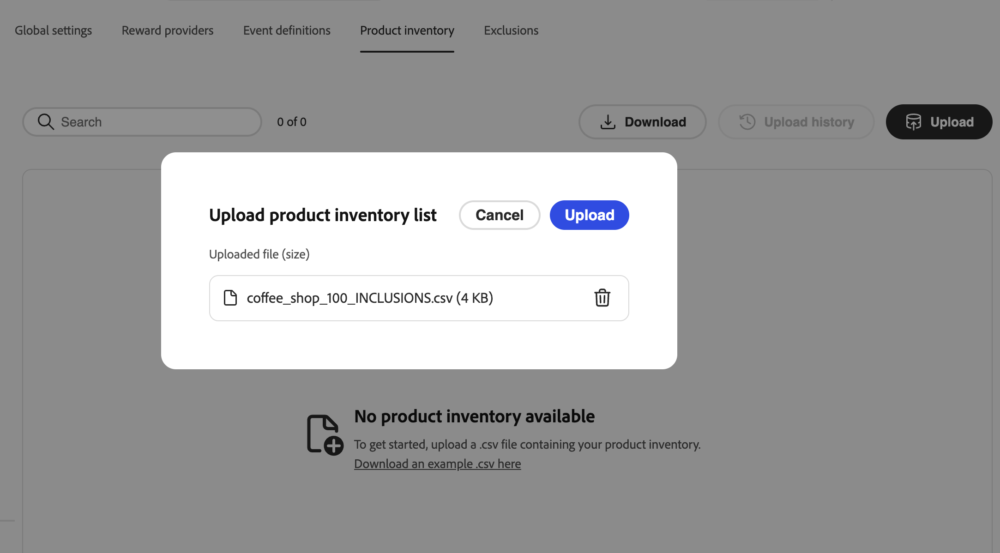
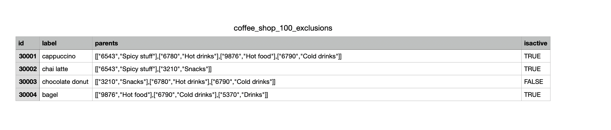

# Configuración de desafíos de lealtad {#loyalty-admin}

<!-- Unpublished draft: Loyalty Admin UI documentation is not validated for Experience League. This page uses hide: true until review. -->

>[!BEGINSHADEBOX]

**Tabla de contenido**

[Introducción a los retos de fidelización](get-started.md)

<table style="table-layout:fixed">
<tr style="border: 0;">
<td style="vertical-align:top;">

**Crear y administrar desafíos**

* [Acceder y administrar desafíos y tareas](access-loyalty-challenges.md)
* [Crear desafíos](create-challenges.md)
* [Creación de tareas](create-tasks.md)
* [Monitorización del rendimiento del desafío de fidelidad](loyalty-reporting.md)

</td>
<td style="vertical-align:top;">

**Configurar e integrar**

* **Configurar desafíos de lealtad** ◀︎ **Usted está aquí**
* [Datos y conjuntos de datos de fidelización](loyalty-data-and-datasets.md)
* [Referencia de API de retos de fidelización](https://developer.adobe.com/journey-optimizer-apis/references/loyalty-challenges){target="_blank"}

</td>
</tr>
</table>

>[!ENDSHADEBOX]

>[!AVAILABILITY]
>
>Esta característica se encuentra actualmente en **versión beta privada**. Para obtener información detallada acerca del ciclo de lanzamiento y las fases de disponibilidad en [!DNL Journey Optimizer], consulte [ciclo de lanzamiento](../rn/releases.md).

## Información general {#access-loyalty-admin}

La configuración de Retos de fidelidad conecta a [!DNL Journey Optimizer] con sus sistemas de fidelidad externos al configurar el cumplimiento de recompensas, la asignación de eventos, el inventario de productos y las exclusiones antes de que los especialistas en marketing creen desafíos.

>[!NOTE]
>
>La configuración de Desafíos de fidelización requiere acceso de administrador a su instancia de [!DNL Journey Optimizer], además de los permisos necesarios para Desafíos de fidelización. Póngase en contacto con el administrador de Adobe para obtener acceso.

Para abrir la interfaz de configuración, seleccione el menú **[!UICONTROL Administrador de fidelización]** en el panel de navegación izquierdo. La interfaz está organizada en pestañas:

* **Configuración global**: seleccione el área de nombres de Experience Platform para su programa. [Aprenda a configurar las opciones globales](#global-settings)
* **Proveedores de recompensas**: conecte las API que cumplen las recompensas cuando los clientes progresan o completan desafíos. [Aprenda a configurar proveedores de recompensas](#reward-providers)
* **Definiciones de eventos**: asigne eventos de experiencia entrantes a actividades utilizadas en **[!UICONTROL eventos personalizados]** tareas. [Aprenda a configurar definiciones de eventos](#event-definitions)
* **Inventario de productos** — Cargar asignaciones de artículos a grupos para usarlas en las reglas de elegibilidad de tareas. [Aprenda a configurar el inventario de productos](#product-inventory)
* **Exclusiones** — Cargar exclusiones de grupo y artículo de toda la organización para la configuración de tareas. [Obtenga información sobre cómo configurar exclusiones](#exclusions)

## Configuración global {#global-settings}

>[!CONTEXTUALHELP]
>id="ajo_loyalty_admin_global_settings"
>title="Configuración global"
>abstract="La configuración global define la configuración en el nivel de organización de los Retos de fidelidad, incluido el área de nombres de identidad que se utiliza para identificar a los miembros en distintos eventos y desafíos."

Abra la pestaña **[!UICONTROL Configuración global]** y seleccione el [área de nombres de identidad](https://experienceleague.adobe.com/es/docs/experience-platform/identity/features/namespaces) de Adobe Experience Platform para desafíos de fidelidad en la lista desplegable **[!UICONTROL Área de nombres]**. Este área de nombres debe coincidir con la forma en que se identifican los perfiles de miembro en los datos.


➡️ [Aprenda a trabajar con áreas de nombres de identidad](https://experienceleague.adobe.com/es/docs/experience-platform/identity/features/namespaces){target="_blank"}

## Proveedores de recompensa {#reward-providers}

>[!CONTEXTUALHELP]
>id="ajo_loyalty_admin_reward_providers"
>title="Proveedores de recompensa"
>abstract="Un proveedor de recompensas define el sistema externo que [!DNL Journey Optimizer] llama para entregar las recompensas cuando los clientes completan los desafíos. Configure el extremo del proveedor, las definiciones de recompensa, la configuración de proxy y la autenticación para cada integración."

>[!CONTEXTUALHELP]
>id="ajo_loyalty_admin_reward_providers_connection"
>title="Conexión del proveedor de recompensas"
>abstract="Configure cómo se conecta [!DNL Journey Optimizer] a su API de recompensas: nombre del proveedor, descripción, dirección URL del extremo y encabezados HTTP necesarios para las llamadas de cumplimiento."

>[!CONTEXTUALHELP]
>id="ajo_loyalty_admin_reward_providers_details"
>title="Definiciones de recompensa"
>abstract="Las definiciones de recompensa especifican cada tipo de recompensa que este proveedor puede emitir (por ejemplo, puntos o estrellas) y la carga útil [!DNL Journey Optimizer] envía cuando se cumplen las recompensas."

>[!CONTEXTUALHELP]
>id="ajo_loyalty_admin_reward_providers_proxy"
>title="Recompensar proxy"
>abstract="Opcionalmente, puede enrutar las llamadas de cumplimiento a través de un servidor proxy en lugar de enviarlas directamente a su punto final de API de recompensa. Configure el host, el puerto, las credenciales y si el proxy está activado. El valor de las credenciales suele ser: `{ "userName": "test", "password": "xxxx" }`"

Un **proveedor de recompensas** le dice a [!DNL Journey Optimizer] a dónde enviar las llamadas de cumplimiento cuando se registra el progreso del desafío o se completa un desafío. Por ejemplo, una API que acredita puntos de lealtad o estrellas a una cuenta de miembro.

Para crear un proveedor de recompensas, siga estos pasos:

1. Abra la pestaña **[!UICONTROL Proveedores de recompensas]** y seleccione **[!UICONTROL Crear proveedor de recompensas]**.

   

1. Escriba un **[!UICONTROL Nombre]** y **[!UICONTROL Descripción]**.

1. En el campo **[!UICONTROL URL]**, introduzca el extremo de API que recibe las solicitudes de cumplimiento.

1. Agregue **[!UICONTROL encabezados]** según sea necesario para su API (por ejemplo, claves de API o tipos de contenido).

1. Configure los recursos asociados a su proveedor de recompensas. Expanda cada sección siguiente para ver los detalles de los campos:

   +++Definiciones de recompensa

   Añada una entrada por tipo de recompensa que admita su proveedor (por ejemplo, puntos de programa, estrellas o crédito monetario). Para cada definición:

   * Escriba un **[!UICONTROL Nombre]** y **[!UICONTROL Descripción]**.
   * Especifique si la definición es **[!UICONTROL Habilitado]**.
   * Cambie **[!UICONTROL Default]** para marcar una definición como predeterminada para este proveedor.
   * Defina la **carga útil** enviada con las llamadas de cumplimiento.

   

   +++

   +++Recompensar proxy

   Enrute las llamadas de cumplimiento a través de un servidor intermedio en lugar de enviarlas directamente al extremo. En las pantallas del proveedor de recompensas y **[!UICONTROL Crear proxy]**, use el campo **[!UICONTROL Credenciales]** para la autenticación de proxy.

   * Escriba un **[!UICONTROL Nombre]** y **[!UICONTROL Descripción]**.
   * Escriba **[!UICONTROL Host]** y **[!UICONTROL Puerto]**.
   * Especifique si el proxy está **[!UICONTROL Habilitado]**.
   * En **[!UICONTROL Credenciales]**, escriba el nombre de usuario y la contraseña del proxy como JSON. El valor de las credenciales suele tener este aspecto:

     ```json
     { "userName": "test", "password": "xxxx" }
     ```

   

   +++

   +++Generador de tokens de autenticación

   Utilícelo cuando su API requiera un token de portador o una autenticación similar.

   * Escriba un **[!UICONTROL Nombre]** y **[!UICONTROL Descripción]**.
   * En **[!UICONTROL Tipo de autenticación]**, escriba el tipo de autenticación (por ejemplo, Portador).
   * Seleccione el método HTTP (por ejemplo, POST).
   * Escriba la dirección URL del extremo del token y la **[!UICONTROL clave de token]** en la respuesta (por ejemplo, `access_token`).
   * Especifique si el generador de tokens de autenticación está **[!UICONTROL habilitado]**.
   * Añada los encabezados que requiera el extremo de token.

   [!DNL Journey Optimizer] utiliza esta configuración para obtener un token nuevo antes de cada llamada a la API de recompensa.

   

   +++

1. Seleccione **[!UICONTROL Crear proveedor de recompensas]**. El proveedor y todos los recursos configurados se guardan juntos.

Después de guardar, el proveedor aparece en la lista de proveedores de recompensas. Los especialistas en marketing pueden seleccionarlo al configurar las recompensas por desafío. [Aprenda a configurar las recompensas por desafío](create-challenges.md#rewards)

Para editar un proveedor de recompensas, abra la pestaña **[!UICONTROL Proveedores de recompensas]**, seleccione el proveedor y actualice los campos in situ. Los cambios en las definiciones de recompensa, los proxies y los generadores de tokens de autenticación se guardan automáticamente al actualizarlos.

>[!NOTE]
>
>**[!UICONTROL Trae tus propios datos]** desafíos para lograr recompensas a través de tu propia integración de datos. Los proveedores de recompensas configurados aquí no se aplican a esos desafíos. [Aprenda a crear sus propios desafíos de datos](create-challenges.md#create-the-challenge)

## Definiciones de eventos {#event-definitions}

>[!CONTEXTUALHELP]
>id="ajo_loyalty_admin_event_definitions"
>title="Definiciones de eventos"
>abstract="Las definiciones de eventos indican a [!DNL Journey Optimizer] cómo identificar e interpretar los datos de eventos entrantes a partir de los orígenes externos. Cada definición asigna un tipo de evento específico, como una compra o un registro, para que el sistema pueda rastrear el progreso del cliente hacia las tareas de desafío."

>[!CONTEXTUALHELP]
>id="ajo_loyalty_admin_event_schema"
>title="Esquema de evento y transformador"
>abstract="Cuando su organización envíe eventos en un formato JSON personalizado, utilice **[!UICONTROL Esquema]** para validar la carga útil y **[!UICONTROL Transformador]** (por ejemplo, una expresión JSONata) para asignar campos al formato que espera Loyalty Challenges."

>[!CONTEXTUALHELP]
>id="ajo_loyalty_admin_event_identification"
>title="Identificación de eventos"
>abstract="Especifique cómo [!DNL Journey Optimizer] reconoce el evento en las cargas entrantes mediante una ruta de identificador, valores de identificador, un ID de esquema XDM o una combinación de estos campos."

**[!UICONTROL Las definiciones de eventos]** indican a [!DNL Journey Optimizer] qué eventos de experiencia de Adobe Experience Platform entrantes se deben procesar. Por ejemplo, una compra o un registro de entrada en el hotel. Los especialistas en marketing hacen referencia a estas definiciones cuando crean **[!UICONTROL tareas de evento personalizado]** en el generador de tareas. Los eventos que no coinciden con ninguna definición se omiten.

Cuando su organización envía eventos en su propio formato JSON, **[!UICONTROL Esquema]** y **[!UICONTROL Transformador]** ayudan a [!DNL Journey Optimizer] a validar la carga útil, analizarla y decidir si realizar el seguimiento de la actividad.

Para crear una definición de evento, siga estos pasos:

1. Abra la ficha **[!UICONTROL Definiciones de eventos]** y cree una nueva definición.

   

1. Escriba un **[!UICONTROL Nombre]** para el evento (por ejemplo, `Coffee purchase`). Los especialistas en marketing ven este nombre al configurar una tarea de **[!UICONTROL Custom event]**.

1. Especifique cómo [!DNL Journey Optimizer] reconoce el evento en las cargas entrantes. Proporcione una **[!UICONTROL ruta de identificador]**, un **[!UICONTROL identificador de esquema XDM]** o ambos:

   * **[!UICONTROL Ruta de acceso del identificador]**: ruta de acceso a un campo de la carga útil (por ejemplo, `data.memberId`). Utilícelo cuando haga coincidir eventos por valores en la carga útil.
   * **[!UICONTROL Valores de identificador]**: valores en la ruta de identificador que deben estar presentes para que coincida esta definición.
   * **[!UICONTROL ID de esquema XDM]**: ID del esquema XDM de Experience Platform para este tipo de evento. Utilícelo cuando los eventos se capturan en un esquema conocido.

1. Si es necesario, pegue cadenas en **[!UICONTROL Schema]** y **[!UICONTROL Transformer]**:

   * **[!UICONTROL Esquema]**: cadena de validación para la carga útil entrante.
   * **[!UICONTROL Transformador]**: expresión de transformación (por ejemplo, JSONata) que asigna la carga útil al formato que espera Loyalty Challenges.

1. Guarde la definición del evento. Aparece en la lista **[!UICONTROL Definiciones de eventos]** y está disponible cuando los especialistas en marketing crean **[!UICONTROL eventos personalizados]** tareas. [Aprenda a crear tareas](create-tasks.md#choose-activity)

## Inventario de productos {#product-inventory}

>[!CONTEXTUALHELP]
>id="ajo_loyalty_admin_product_inventory"
>title="Inventario de productos"
>abstract="Cargue un archivo CSV que asigne identificadores de elementos a grupos de productos. Los especialistas en marketing pueden hacer referencia a estos grupos al configurar artículos aptos en las tareas de compra y gasto sin introducir cada ID de artículo."

La pestaña **[!UICONTROL Inventario de productos]** agrupa los elementos del catálogo para que los especialistas en marketing puedan asignarlos a tareas sin especificar cada ID de elemento. Cargue un **archivo CSV** que asigne cada identificador de elemento a uno o más **grupos de productos** (el mismo elemento puede pertenecer a varios grupos). Los grupos importados están disponibles al configurar la idoneidad de la tarea. [Aprenda a crear tareas](create-tasks.md)

Para cargar un archivo de inventario de productos, siga estos pasos:

1. Prepare un archivo CSV que asigne cada identificador de elemento a uno o varios grupos de productos. Expanda la sección siguiente para ver un ejemplo.

   +++Ejemplo de CSV del inventario de productos

   

   +++

1. Abra la ficha **[!UICONTROL Inventario de productos]**.

1. Seleccione **[!UICONTROL Cargar]** y elija su archivo CSV.

   

1. Revise los datos importados en la lista de inventario. La lista muestra una fila por elemento. La columna **[!UICONTROL Grupos incluidos en]** muestra cada grupo de productos para ese artículo como una píldora o varias píldoras cuando el artículo pertenece a varios grupos.

   

1. Para ver todos los elementos de un grupo de productos, selecciona la píldora de ese grupo en la columna **[!UICONTROL Grupos incluidos en]** de cualquier fila. La vista de detalles del grupo enumera todos los elementos del grupo.

   

1. Abra **[!UICONTROL Historial de carga]** para ver las cargas de CSV anteriores.

## Exclusiones {#exclusions}

>[!CONTEXTUALHELP]
>id="ajo_loyalty_admin_exclusions"
>title="Exclusiones"
>abstract="Cargue un archivo CSV que defina los elementos de catálogo y los grupos excluidos en todo el programa. Los grupos de exclusión importados aparecen cuando los especialistas en marketing configuran elementos aptos y exclusiones en las tareas."

La pestaña **[!UICONTROL Exclusions]** define los elementos y grupos de catálogo que se excluyen en todo el programa, de modo que los especialistas en marketing no tienen que enumerar las mismas exclusiones en cada tarea. Cargue un **archivo CSV** que asigne cada identificador de elemento a uno o más **grupos de exclusión** (el mismo elemento puede pertenecer a varios grupos).

Después de la importación, los elementos y grupos excluidos aparecerán en el generador de tareas cuando los especialistas en marketing configuren **[!UICONTROL artículos y exclusiones aptos]**. [Aprenda a definir elementos aptos y exclusiones en las tareas](create-tasks.md#eligible-items-exclusions)

Para cargar exclusiones, siga estos pasos:

1. Prepare un archivo CSV que asigne cada identificador de elemento a uno o varios grupos de exclusión. Expanda la sección siguiente para ver un ejemplo.

   +++Ejemplo de CSV de exclusiones

   

   +++

1. Abra la ficha **[!UICONTROL Exclusiones]**.

1. Seleccione **[!UICONTROL Cargar]** y elija su archivo CSV.

   

1. Revise los datos importados en la lista de exclusiones. La lista muestra una fila por elemento. La columna **[!UICONTROL Grupos incluidos en]** muestra todos los grupos de exclusión de ese artículo en forma de píldora o de varias píldoras cuando el artículo pertenece a varios grupos.

<!-- SCREENSHOT: Exclusions list after CSV upload -->

1. Para ver todos los elementos de un grupo de exclusión, seleccione la píldora de ese grupo en la columna **[!UICONTROL Grupos incluidos en]** de cualquier fila. La vista de detalles del grupo enumera todos los elementos del grupo.

<!-- SCREENSHOT: Exclusion group details -->

1. Abra **[!UICONTROL Historial de carga]** para ver las cargas de CSV anteriores.
