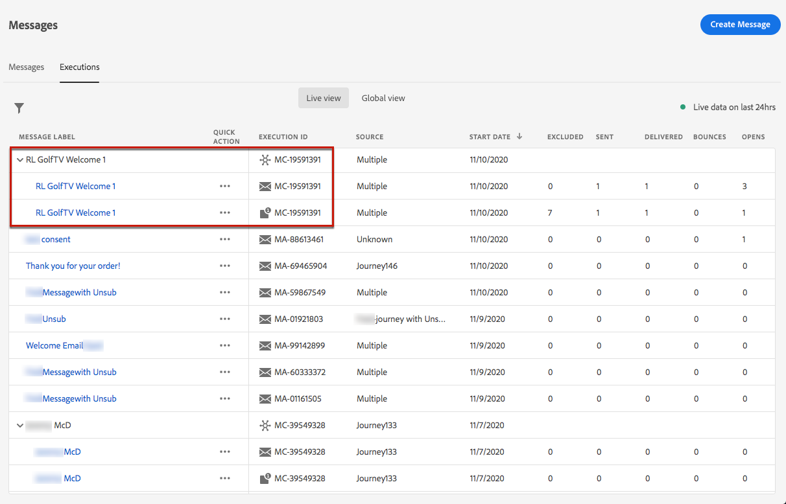

# Monitorización de mensajes {#monitor-message-execution}

Para asegurarse de que los mensajes se ejecutan, envían y envían correctamente, [!DNL Journey Optimizer] ofrece capacidades para supervisar los mensajes que se publican y activan actualmente. Puede ver el rendimiento de sus mensajes en recorridos <!--and APIs--> en tiempo real desde la lista **[!UICONTROL Executions]**.

Para acceder a esta lista, en la página de inicio **[!DNL Journey Optimizer]**, seleccione **[!UICONTROL Messages]** y haga clic en la pestaña **[!UICONTROL Executions]**.

Esta ficha proporciona dos vistas: **[!UICONTROL Live view]** y **[!UICONTROL Global view]**.

* La pestaña **[!UICONTROL Live view]** proporciona una **información general en tiempo real de todos los mensajes ejecutados** activados por uno o más [recorridos](building-journeys/journey.md) **solo en las últimas 24 horas**.

   

   Esta lista se actualiza automáticamente cada sesenta segundos. Si no se ha producido ninguna ejecución en las últimas 24 horas para un mensaje específico, todas las columnas mostrarán valores nulos (0) para ese mensaje.

* La pestaña **[!UICONTROL Global view]** proporciona una **descripción general de todos los mensajes ejecutados** activados por uno o más [recorridos](building-journeys/journey.md) **desde la fecha de inicio del mensaje**.

   

   Esta lista se actualiza automáticamente cada noventa minutos. Los datos se acumulan con el tiempo desde cada fecha de inicio de mensaje.

Si un recorrido publica un mensaje pero aún no lo ha activado, no aparece en ninguna de las pestañas. Solo se enumeran los siguientes elementos:
* Mensajes que se han activado, pero que aún no se han iniciado (pendientes).
* Mensajes que se han activado y que se están ejecutando (en curso).

<!--For multichannel messages, one row per channel is displayed for each message. STILL VALID? looks like NOT-->

>[!NOTE]
>
>Si se ha utilizado un mensaje en varios recorridos, se muestra una fila por recorrido para cada ejecución.

<!---->

<!--If a message has been used in several journeys, the **[!UICONTROL Source]** column displays **[!UICONTROL Multiple]**.-->

De forma predeterminada, los mensajes se muestran a partir de la fecha de ejecución más reciente. Haga clic en el icono **[!UICONTROL Filters]** para buscar en los mensajes según el canal, la fecha de inicio o la fecha de finalización.

La segunda columna <!--**[!UICONTROL Quick action]**-->permite abrir el [mensaje](create-message.md) correspondiente y acceder al [Informe activo](reports/live-report.md) si está en el **[!UICONTROL Live view]** o al [Informe global](reports/global-report.md) si está en el **[!UICONTROL Global view]**.

Para cada ejecución de mensaje, se muestran varios indicadores:

* **[!UICONTROL Message label]**: Título del mensaje que definió al  [crear el mensaje](create-message.md). El ID de ejecución, que se genera automáticamente, se muestra entre paréntesis.

   <!--**[!UICONTROL Execution ID]**: Automatically generated identifier.
  **[!UICONTROL Source]**: Name of the journey leveraging that message.-->

* **[!UICONTROL Journey - Version - Action]**: Nombre del recorrido que aprovecha el mensaje, la versión del recorrido y la etiqueta de la acción que aprovecha el mensaje en el recorrido.

* **[!UICONTROL Status]**: Estado de ejecución del mensaje.  <!--List all the possible statuses? For now only Live status? The user cannot stop or cancel the execution. TBC by Fred-->

* **[!UICONTROL Start date]**: Fecha y hora en que se ejecutó el mensaje desde el recorrido.

   <!--Targeted: Number of targeted profiles for each message execution. To come?-->

* **[!UICONTROL Excluded]**: Número de perfiles que se han excluido del objetivo inicial debido a reglas de exclusión.

* **[!UICONTROL Sent]**: Número de mensajes que se han enviado.

* **[!UICONTROL Delivered]**: Número de mensajes entregados correctamente en el buzón del destinatario (correo electrónico) o en el dispositivo (push) sin generar un rechazo o ningún otro error de envío.

* **[!UICONTROL Bounces]**: Número de mensajes que no se pueden enviar debido a un error de entrega. [Obtenga más información sobre las devoluciones](suppression-list.md).

* **[!UICONTROL Opens]**: Número de mensajes que se han abierto.

* **[!UICONTROL Clicks]**: Número de clics en los vínculos de un correo electrónico.

   >[!NOTE]
   >
   >Los clics no existen para las notificaciones push: cuando un usuario hace clic en una notificación push, abre la aplicación, que solo puede considerarse como una apertura.

* **[!UICONTROL Errors]**: Número de mensajes que no se pueden enviar debido a un error técnico.

* **[!UICONTROL Spam complaints]**: Número de mensajes marcados como correo no deseado por los destinatarios. [Obtenga más información sobre las quejas](https://experienceleague.adobe.com/docs/deliverability-learn/deliverability-best-practice-guide/metrics-for-deliverability/complaints.html#metrics-for-deliverability).

Al hacer clic en cada hipervínculo, se abrirá la vista de resumen del mensaje correspondiente. [Obtenga más información sobre los mensajes](create-message.md).
