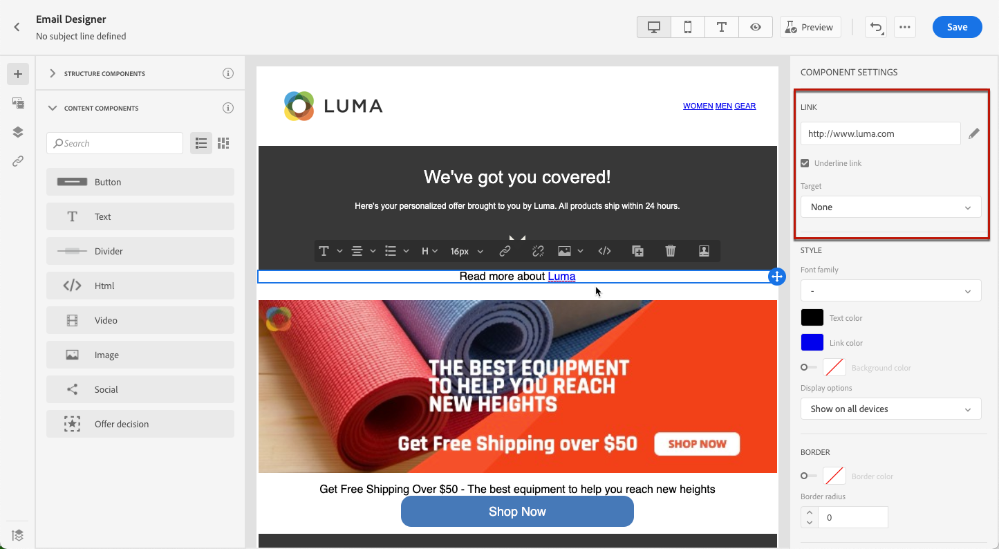
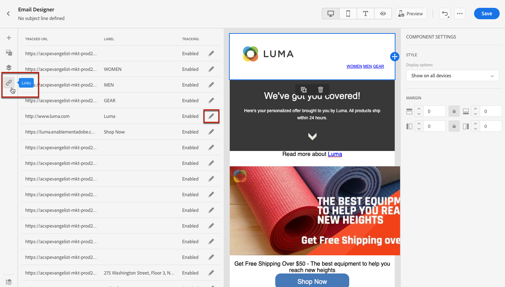

# Adición de vínculos y seguimiento de mensajes {#tracking}

Uso [!DNL Journey Optimizer] para añadir vínculos al contenido y realizar un seguimiento de los mensajes enviados para controlar el comportamiento de los destinatarios.

## Habilitar el seguimiento {#enable-tracking}

Puede habilitar el seguimiento a nivel de mensaje de correo electrónico comprobando la variable **[!UICONTROL Open Tracking for email]** y/o **[!UICONTROL Click Tracking for email]** opciones [crear el mensaje](create-message.md).

>[!NOTE]
>
>Ambas opciones están habilitadas de forma predeterminada.

Esto le permite hacer un seguimiento del comportamiento de sus destinatarios a través de:

* **[!UICONTROL Open Tracking for email]**: Mensajes que se han abierto.
* **[!UICONTROL Click Tracking for email]**: Haga clic en los vínculos de un correo electrónico.

## Insert links {#insert-links}

Al diseñar un mensaje, puede agregar vínculos al contenido.

>[!NOTE]
>
>When [el seguimiento está habilitado](#enable-tracking), se rastrearán todos los vínculos incluidos en el contenido del mensaje.

Para insertar vínculos en el contenido del correo electrónico, siga los pasos a continuación:

1. Seleccione un elemento y haga clic en **[!UICONTROL Insert link]** de la barra de herramientas contextual.

   

1. Elija el tipo de vínculo que desea crear:

   * **[!UICONTROL External link]**: Inserte un vínculo a una URL externa.

   * **[!UICONTROL Unsubscription link]**: Inserte un vínculo para cancelar la suscripción a la recepción de comunicaciones de su marca. Obtenga más información sobre la administración de exclusiones en [esta sección](consent.md#opt-out-management).

   * **[!UICONTROL Mirror page]**: Inserte un vínculo para mostrar el contenido del correo electrónico en un explorador web. Obtenga más información en [esta sección](#mirror-page).

   * **[!UICONTROL Opt-out]**: Inserte un vínculo para permitir a los usuarios cancelar rápidamente la suscripción a sus comunicaciones sin necesidad de confirmar la exclusión. Obtenga más información en [esta sección](#one-click-opt-out-link).

   

1. Puede personalizar los vínculos. Obtenga más información sobre las direcciones URL personalizadas en [esta sección](personalization/personalization-syntax.md#perso-urls).

1. Guarde los cambios.

1. Una vez creado el vínculo, puede modificarlo desde el **[!UICONTROL Component settings]** a la derecha.

   * Haga clic en el icono de lápiz para editar el vínculo.
   * Puede elegir subrayar el vínculo o no marcando la opción correspondiente.

   

## Vínculo a una página espejo {#mirror-page}

La página espejo es una página HTML accesible en línea mediante un navegador web. Su contenido es idéntico al del correo electrónico.

Para añadir un vínculo a una página espejo en el correo electrónico, [insertar un vínculo](#insert-links) y seleccione **[!UICONTROL Mirror page]** como tipo de vínculo.

La página espejo se crea automáticamente.

>[!NOTE]
>
>No se puede editar el vínculo generado automáticamente.

Una vez enviado el correo electrónico, cuando los destinatarios hacen clic en el vínculo de la página espejo, el contenido del correo electrónico se muestra en su navegador web predeterminado.

>[!NOTE]
>
>En el [prueba](preview.md#send-proofs) enviado a los perfiles de prueba, el vínculo a la página espejo no está activo. Solo se activa en los mensajes finales.

El período de retención de una página espejo es de 60 días. Después de ese retraso, la página espejo ya no estará disponible.

## Vínculo de no participación de un clic {#one-click-opt-out-link}

To enable your recipients to quickly unsubscribe from receiving communications from your brand, you can insert a one-click opt-out link into your email content. Esta capacidad evita que los usuarios se redirijan a una página de aterrizaje donde necesitan confirmar su elección, lo que acelera el proceso de cancelación de suscripción.

Para añadir un vínculo de no participación en el correo electrónico, siga los pasos a continuación.

1. [Insert a link](#insert-links) and select **[!UICONTROL Opt-out]** as the type of link.

   

1. Select how you want to apply the opting out: at the channel, identity, or subscription level.

   

   * **[!UICONTROL Channel]**: The opt-out applies to future messages sent to the profile&#39;s target (i.e. email address) for the current channel. Si hay varios objetivos asociados a un perfil, la exclusión se aplica a todos los destinos (es decir, direcciones de correo electrónico) del perfil de ese canal.
   * **[!UICONTROL Identity]**: La exclusión se aplica a los mensajes futuros enviados al destinatario específico (es decir, la dirección de correo electrónico) que se estén utilizando para el mensaje actual.
   * **[!UICONTROL Subscription]**: La exclusión se aplica a mensajes futuros asociados a una lista de suscripción específica. Esta opción solo se puede seleccionar si el mensaje actual está asociado con una lista de suscripción.

1. Introduzca la dirección URL de la página de aterrizaje a la que se redirigirá al usuario una vez cancelada la suscripción. Esta página solo está aquí para confirmar que la exclusión se ha realizado correctamente.

   

   Puede personalizar los vínculos. Learn more on personalized URLs in [this section](personalization/personalization-syntax.md).

1. Guarde los cambios.

Una vez enviado el mensaje, si los destinatarios hacen clic en el vínculo de exclusión, se excluyen inmediatamente.

## Administrar seguimiento {#manage-tracking}

La variable [Diseñador de correo electrónico](create-email-content.md) le permite administrar las direcciones URL rastreadas, como editar el tipo de seguimiento para cada vínculo.

1. Haga clic en el **[!UICONTROL Links]** del panel izquierdo para mostrar la lista de todas las direcciones URL del contenido de las que se realizará un seguimiento.

   Esta lista permite tener una vista centralizada y localizar cada URL en el contenido del correo electrónico.

1. To edit a link, click the corresponding pencil icon.

   

1. You can modify the **[!UICONTROL Tracking Type]** if needed:

   

   Para cada URL rastreada, puede establecer el modo de seguimiento en uno de estos valores:

   * **[!UICONTROL Tracked]**: Activa el seguimiento en esta dirección URL.
   * **[!UICONTROL Opt out]**: Considera esta URL como una URL de exclusión o de baja.
   * **[!UICONTROL Mirror page]**: Considera que esta URL es una URL de página espejo.
   * **[!UICONTROL Never]**: Nunca activa el seguimiento de esta dirección URL. <!--This information is saved: if the URL appears again in a future message, its tracking is automatically deactivated.-->

El número de mensajes que se han abierto y el número de vínculos en los que se ha hecho clic se enumeran en la variable [Ficha Ejecuciones](message-monitoring.md).

Los informes de aperturas y clics están disponibles en la [Informe de Email Live](reports/email-live-report.md) y en el [Informe global de correo electrónico](reports/email-global-report.md).
