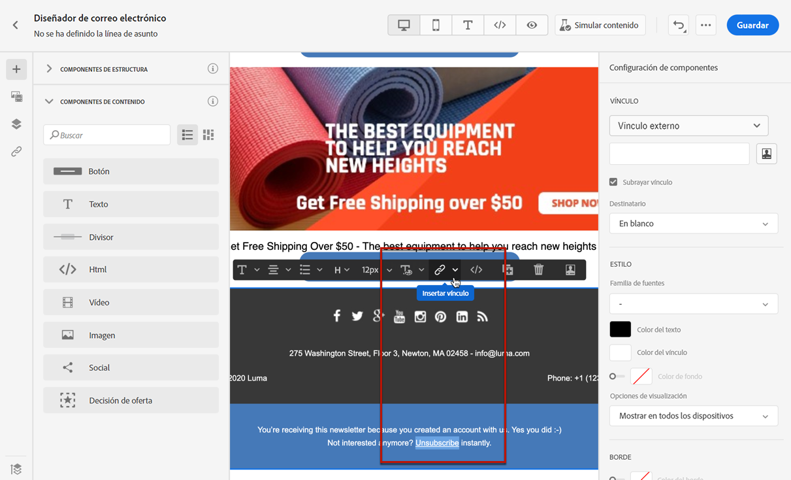
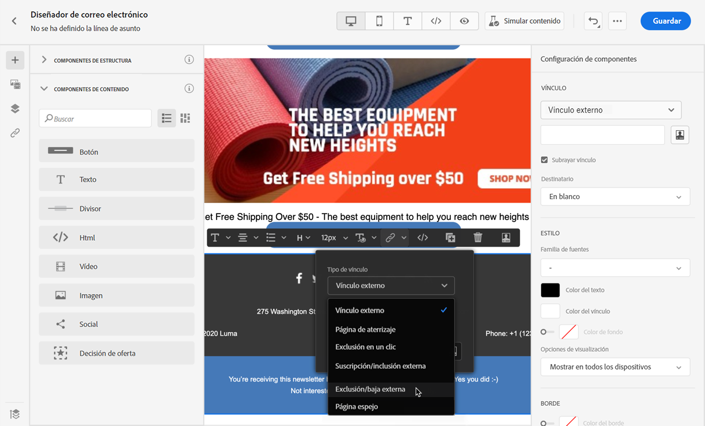
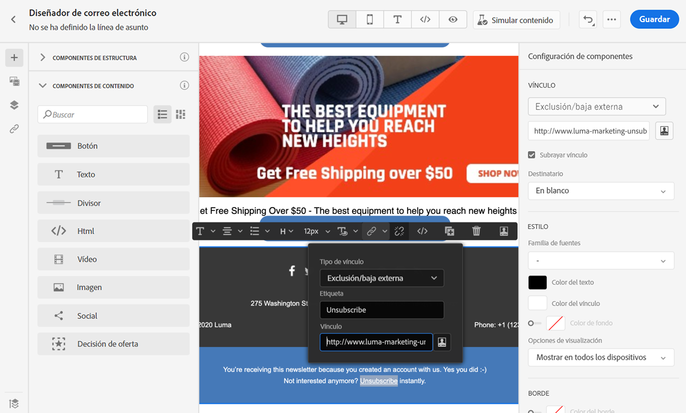
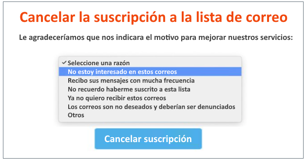
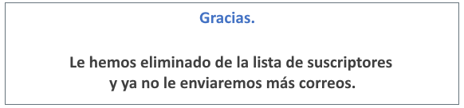
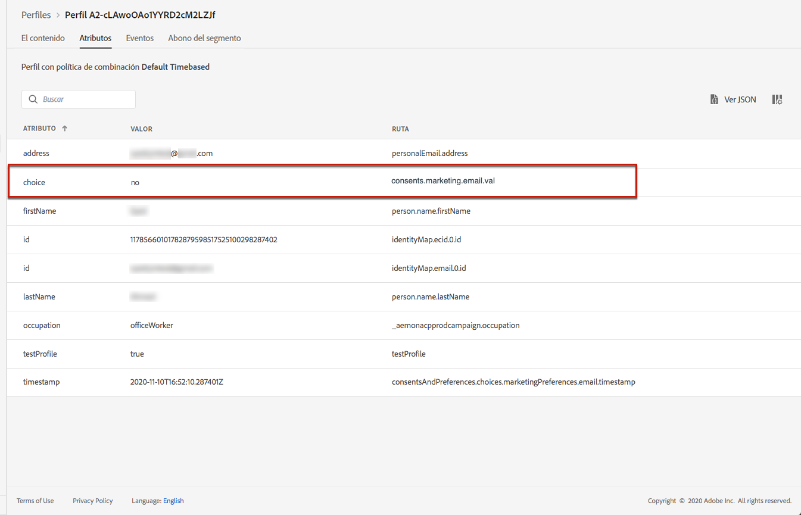
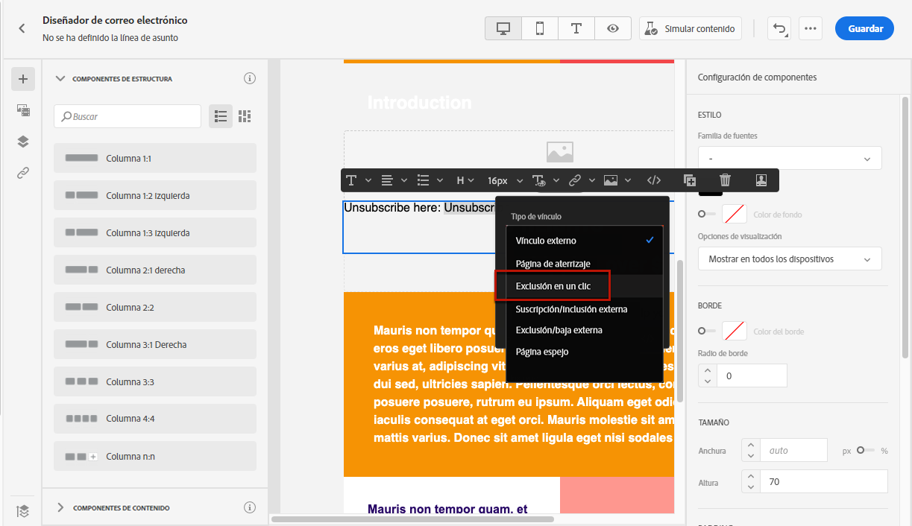
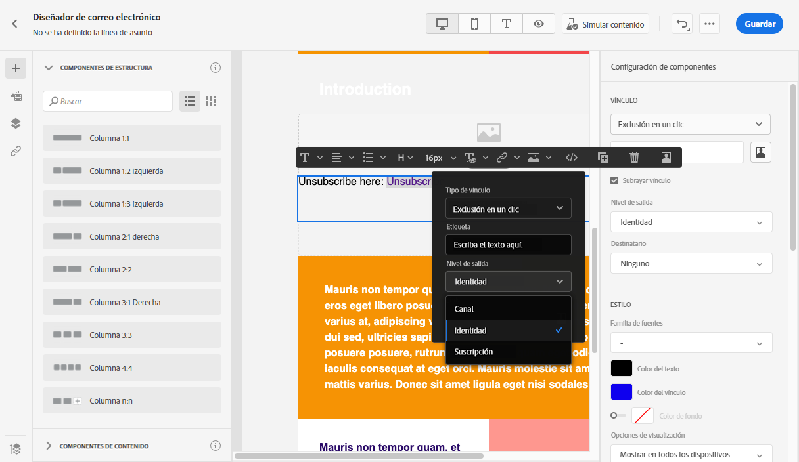
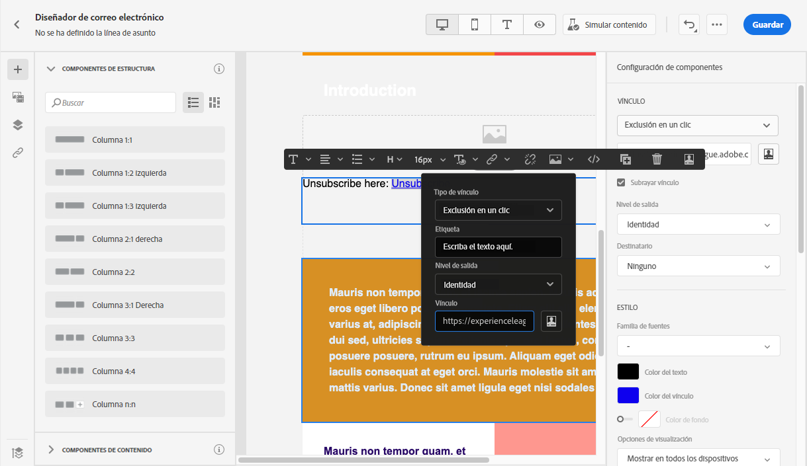

# Administración del consentimiento {#consent}

Utilice [!DNL Journey Optimizer] para hacer un seguimiento del consentimiento de los destinatarios para fines de comunicación y comprender cómo desean interactuar con su marca administrando sus preferencias y suscripciones.

Las regulaciones como el RGPD establecen que debe cumplir con requisitos específicos antes de poder utilizar la información de sujetos de datos. Además, estos deben poder modificar su consentimiento en cualquier momento.

**¿Por qué es importante?**

* El incumplimiento de estas regulaciones conlleva riesgos legales para su marca.
* Le ayuda a evitar enviar comunicaciones no solicitadas a sus destinatarios, lo que podría hacer que marquen sus mensajes como correo no deseado y dañar su reputación.

Obtenga más información sobre la administración de la privacidad y las regulaciones aplicables en la [Documentación de Experience Platform](https://experienceleague.adobe.com/docs/experience-platform/privacy/home.html?lang=es){target=&quot;_blank&quot;}.

>[!NOTE]
>
>En [!DNL Journey Optimizer], el Experience Platform gestiona el consentimiento [Esquema de consentimiento](https://experienceleague.adobe.com/docs/experience-platform/xdm/field-groups/profile/consents.html){target=&quot;_blank&quot;}. De forma predeterminada, el valor del campo de consentimiento está vacío y se trata como consentimiento para recibir sus comunicaciones. Puede modificar este valor predeterminado al incorporar uno de los posibles valores enumerados [here](https://experienceleague.adobe.com/docs/experience-platform/xdm/data-types/consents.html#choice-values){target=&quot;_blank&quot;}.

## Administración de exclusión de correo electrónico {#opt-out-management}

Proporcionar a los destinatarios la capacidad de cancelar la suscripción a la recepción de comunicaciones de una marca es un requisito legal. Obtenga más información acerca de la legislación aplicable en la [Documentación de Experience Platform](https://experienceleague.adobe.com/docs/experience-platform/privacy/regulations/overview.html?lang=es#regulations){target=&quot;_blank&quot;}.

Por lo tanto, siempre debe incluir un **enlace para cancelar la suscripción** en cada correo electrónico enviado a los destinatarios:

* Al hacer clic en este vínculo, se dirige a los destinatarios a una página de aterrizaje para confirmar la exclusión.
* Después de confirmar su elección, los datos de los perfiles se actualizarán con esta información.

### Exclusión externa {#opt-out-external-lp}

Para ello, puede insertar un vínculo a una página de aterrizaje externa en un correo electrónico para permitir a los usuarios cancelar la suscripción y evitar recibir comunicaciones de su marca.

#### Adición de un vínculo de no participación {#add-unsubscribe-link}

Primero debe añadir un vínculo de cancelación de suscripción a un mensaje. Para realizar esto, siga los pasos a continuación:

1. Cree su propia página de aterrizaje de baja.

1. Alójelo en el sistema de terceros que elija.

1. [Cree un mensaje](create-message.md) en [!DNL Journey Optimizer].

1. Seleccione texto en el contenido y [insertar un vínculo](message-tracking.md#insert-links) con la barra de herramientas contextual.

   

1. Seleccione **[!UICONTROL External Opt-out/Unsubscription]** en la lista desplegable **[!UICONTROL Link type]**.

   

1. En el **[!UICONTROL Link]** pegue el vínculo en la página de aterrizaje de terceros.

   

1. Haga clic en **[!UICONTROL Save]**.

1. Guarde el contenido y [publique el mensaje](publish-manage-message.md).

#### Implementación de una llamada de API para la exclusión {#opt-out-api}

Para que los destinatarios se excluyan cuando envíen su elección desde la página de aterrizaje, debe implementar una **Llamada de API de suscripción** mediante Adobe I/O para actualizar las preferencias de los perfiles correspondientes.

Esta llamada del POST de Adobe I/O es la siguiente:

Extremo: platform.adobe.io/journey/imp/consent/preferences

Parámetros de consulta:

* **params**: contiene la carga útil cifrada
* **sig**: firma
* **pid**: ID de perfil cifrado

Estos tres parámetros se incluyen en la dirección URL de la página de aterrizaje de terceros que se envía al destinatario:


Requisitos de encabezado:

* x-api-key
* x-gw-ims-org-id
* x-sandbox-name
* authorization (token de usuario de su cuenta técnica)

Cuerpo de la solicitud:

```
{
   "marketing": [
       {
            "type": "email",           
            "choice": "no",          
            "scope": "channel"       
        }
    ],
 
}
```

[!DNL Journey Optimizer] utilizará estos parámetros para actualizar la elección del perfil correspondiente a través de la llamada de Adobe I/O.

#### Enviar el mensaje con el vínculo de cancelación de suscripción {#send-message-unsubscribe-link}

Una vez configurado el vínculo de cancelación de suscripción a la página de aterrizaje e implementado la llamada de API, el mensaje está listo para enviarse.

1. Envíe el mensaje, incluido el vínculo a través de un [recorrido](../building-journeys/journey.md).

1. Una vez recibido el mensaje, si el destinatario hace clic en el vínculo para cancelar la suscripción, se muestra la página de aterrizaje.

   

1. Si el destinatario envía el formulario (aquí, pulsando el botón **Cancelar suscripción** en la página de aterrizaje), los datos de perfil se actualizan a través de la variable [llamada de Adobe I/O](#opt-out-api).

1. El destinatario excluido se redirige a la pantalla de mensaje de confirmación para indicar que la exclusión se ha realizado correctamente.

   

   Como resultado, este usuario no recibirá comunicaciones de su marca a menos que se vuelva a suscribir.

1. Para comprobar que se ha actualizado la opción del perfil correspondiente, vaya a Experience Platform y acceda al perfil seleccionando un área de nombres de identidad y un valor de identidad correspondiente. Obtenga más información en la [Documentación de Adobe Experience Platform](https://experienceleague.adobe.com/docs/experience-platform/profile/ui/user-guide.html?lang=es#getting-started){target=&quot;_blank&quot;}.

   

   En la pestaña **[!UICONTROL Attributes]**, puede ver que el valor de **[!UICONTROL choice]** ha cambiado a **[!UICONTROL no]**.

### Opción de exclusión en un clic {#one-click-opt-out}

Dado que muchos clientes buscan un proceso más sencillo para cancelar la suscripción, también puede añadir un vínculo de no participación en un solo clic al contenido del correo electrónico. Este vínculo permite a los destinatarios cancelar rápidamente la suscripción a sus comunicaciones, sin ser redirigidos a una página de aterrizaje donde necesiten confirmar su elección, lo que acelera el proceso de cancelación de suscripción.

Para añadir un vínculo de no participación en el correo electrónico, siga los pasos a continuación.

1. [Inserción de un vínculo](message-tracking.md#insert-links) y seleccione **[!UICONTROL One click Opt-out]** como tipo de vínculo.

   

1. Seleccione cómo desea aplicar la exclusión: en el nivel de canal, identidad o suscripción.

   

   * **[!UICONTROL Channel]**: La exclusión se aplica a mensajes futuros enviados al destinatario del perfil (es decir, la dirección de correo electrónico) para el canal actual. Si hay varios objetivos asociados a un perfil, la exclusión se aplica a todos los destinos (es decir, direcciones de correo electrónico) del perfil de ese canal.
   * **[!UICONTROL Identity]**: La exclusión se aplica a los mensajes futuros enviados al destinatario específico (es decir, la dirección de correo electrónico) que se estén utilizando para el mensaje actual.
   * **[!UICONTROL Subscription]**: La exclusión se aplica a mensajes futuros asociados a una lista de suscripción específica. Esta opción solo se puede seleccionar si el mensaje actual está asociado con una lista de suscripción.

1. Introduzca la dirección URL de la página de aterrizaje a la que se redirigirá al usuario una vez cancelada la suscripción. Esta página solo está aquí para confirmar que la exclusión se ha realizado correctamente.

   

   Puede personalizar los vínculos. Obtenga más información sobre las direcciones URL personalizadas en [esta sección](../personalization/personalization-syntax.md).

1. Guarde los cambios.

Una vez que el mensaje se envía a través de un [recorrido](../building-journeys/journey.md), si un destinatario hace clic en el vínculo de no participación, su perfil se excluye inmediatamente.

### Vínculo de cancelación de suscripción en el encabezado del mensaje {#unsubscribe-email}

Si el cliente de correo electrónico de los destinatarios admite la visualización de un vínculo de cancelación de suscripción en el encabezado del correo electrónico, los correos electrónicos enviados con [!DNL Journey Optimizer] incluyen automáticamente este vínculo.

Por ejemplo, el vínculo de cancelación de suscripción se mostrará así en Gmail:


Según el cliente de correo electrónico, hacer clic en el vínculo de cancelación de suscripción del encabezado tendrá uno de los siguientes impactos:

* El perfil correspondiente se excluye inmediatamente y esta opción se actualiza en Experience Platform. Obtenga más información en la [Documentación de Experience Platform](https://experienceleague.adobe.com/docs/experience-platform/profile/ui/user-guide.html#getting-started){target=&quot;_blank&quot;}.

* Tiene el mismo efecto que hacer clic en el vínculo de cancelación de la suscripción del contenido del correo electrónico: se redirige al destinatario a una página de aterrizaje, que incluye un botón para confirmar la exclusión. Obtenga más información sobre la administración de exclusiones en [esta sección](#opt-out-management).

## Administración de exclusiones push {#push-opt-out-management}

Los destinatarios push pueden cancelar la suscripción a través de sus propios dispositivos.

Por ejemplo, al descargar o al usar la aplicación, pueden seleccionar detener las notificaciones. Del mismo modo, pueden cambiar la configuración de notificación a través del sistema operativo móvil.
