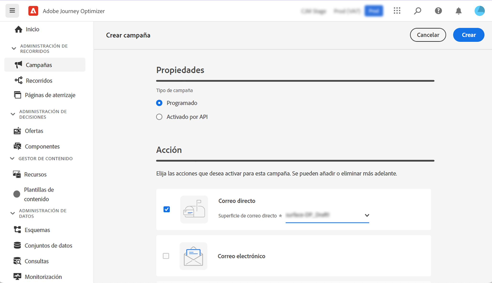
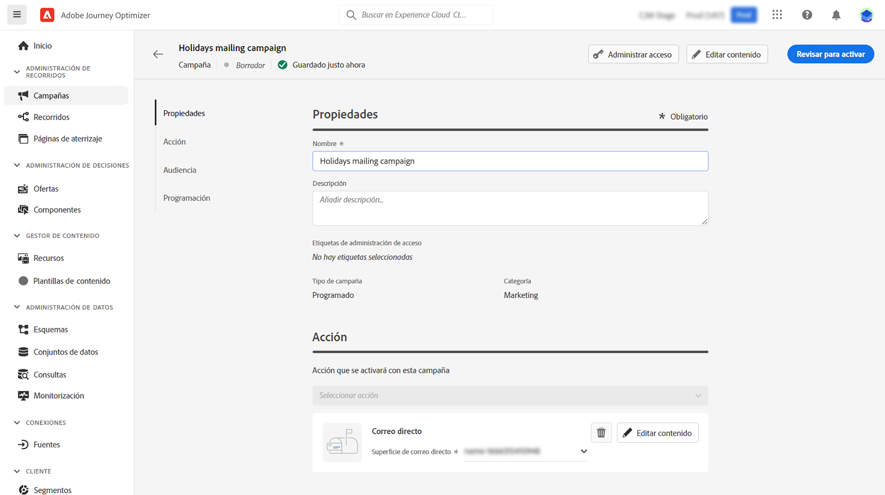
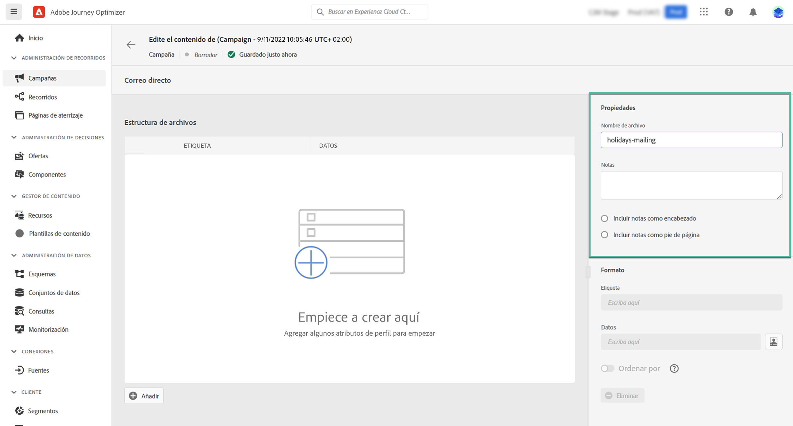
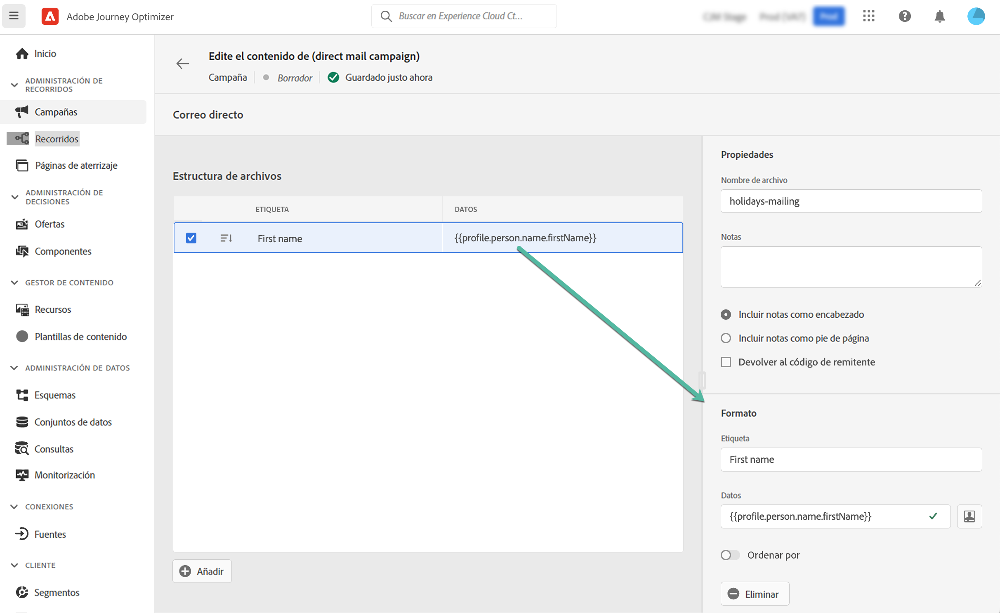
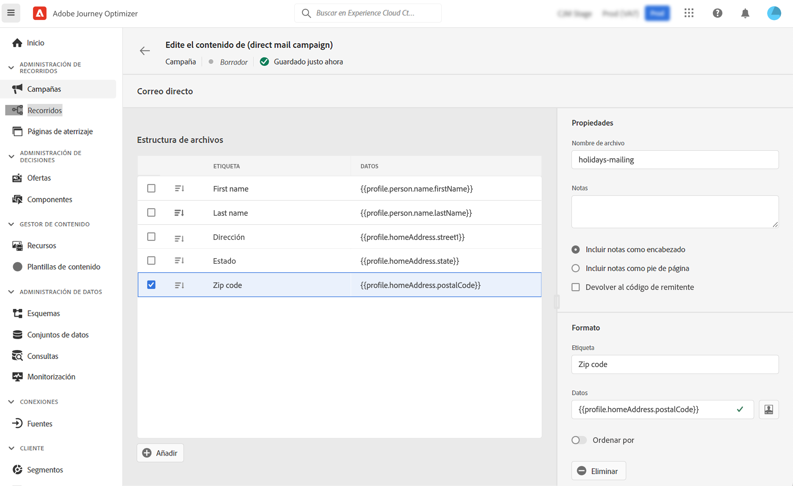

# Crear un mensaje de correo postal {#create-direct}

>[!CONTEXTUALHELP]
>id="ajo_direct_mail"
>title="Creación de correo postal"
>abstract="Cree mensajes de correo postal en campañas programadas y diseñe los archivos de extracción necesarios para que los proveedores de correo postal envíen correos a sus clientes."

El correo postal es un canal sin conexión que le permite personalizar y generar los archivos de extracción necesarios para que los proveedores de correo postal envíen correos a sus clientes.

Al crear un correo postal, Journey Optimizer genera un archivo que incluye todos los perfiles de destino y los datos seleccionados (dirección postal, atributos de perfil, por ejemplo). El proveedor de correo postal podrá recuperar ese archivo y se encargará del envío real.

Los mensajes de correo postal solo se pueden crear en el contexto de campañas programadas. No están disponibles para su uso en campañas activadas por API o en recorridos.

>[!IMPORTANT]
>
>Antes de enviar un mensaje de correo postal, asegúrese de haber configurado:
>
>1. A [configuración de enrutamiento de archivos](../configuration/direct-mail-configuration.md#file-routing-configuration) que especifica el servidor en el que se debe cargar y almacenar el archivo de extracción,
>1. A [superficie del mensaje de correo postal](../configuration/direct-mail-configuration.md#direct-mail-surface) que hará referencia a la configuración de enrutamiento del archivo.

## Crear el mensaje de correo postal {#create}

Los pasos para crear y enviar un mensaje de correo postal son los siguientes:

1. Cree una nueva campaña programada, seleccione **[!UICONTROL Correo postal]** como acción y seleccione la superficie del canal que desea utilizar. [Aprenda a crear una superficie de correo postal](../configuration/direct-mail-configuration.md#direct-mail-surface)

   

1. Haga clic en **[!UICONTROL Crear]** a continuación, defina la información básica de la campaña (nombre, descripción). [Obtenga información sobre cómo configurar una campaña](../campaigns/create-campaign.md)

   

1. Haga clic en el **[!UICONTROL Editar contenido]** para configurar el archivo de extracción y enviarlo a su proveedor de correo postal.

1. Defina el nombre del archivo de extracción en la variable **[!UICONTROL Nombre de archivo]** campo .

   A veces quizá deba añadir información al principio o al final del archivo de extracción. Para ello, utilice el **[!UICONTROL Notas]** a continuación, especifique si desea incluir la nota como encabezado o pie de página.

   <!--Click on the button to the right of the Output file field and enter the desired label. You can use personalization fields, content blocks and dynamic text (see Defining content). For example, you can complete the label with the delivery ID or the extraction date.-->

   

1. Utilice el área del lado izquierdo para definir la información que se mostrará como columnas en el archivo de extracción:

   1. Haga clic en el **[!UICONTROL Agregar]** para agregar una columna nueva y selecciónela en la lista.

   1. En el **[!UICONTROL Formato]** , especifique una etiqueta para la columna y defina los atributos de perfil que se mostrarán con la variable [Editor de expresiones](../personalization/personalization-build-expressions.md).

      

   1. Para ordenar el archivo de extracción mediante la columna seleccionada, cambie el **[!UICONTROL Ordenar por]** en. La variable **[!UICONTROL Ordenar por]** a continuación, se muestra junto a la etiqueta de la columna en la estructura de archivos.

1. Repita estos pasos para agregar tantas columnas como sea necesario para crear el archivo de extracción. Tenga en cuenta que puede agregar hasta 50 columnas.

   

   Puede eliminar una columna en cualquier momento seleccionándola y haciendo clic en el botón **[!UICONTROL Eliminar]** del **[!UICONTROL Formato]** para obtener más información.

1. Una vez definido el contenido de correo postal, complete la configuración de la campaña.

   Cuando se inicie la campaña, el archivo de extracción se generará automáticamente y se exportará al servidor especificado en la [configuración de enrutamiento de archivos](../configuration/direct-mail-configuration.md).
