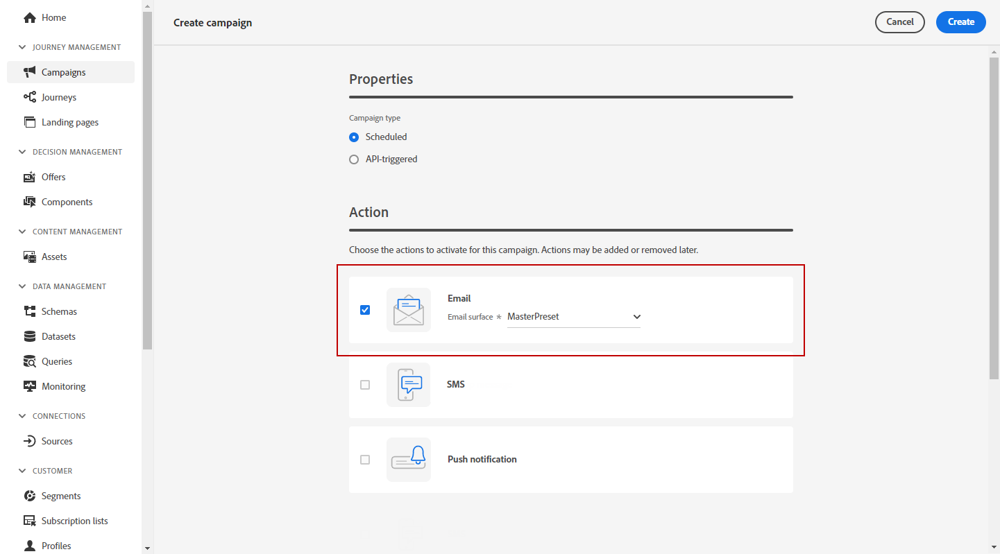

# Crear un correo electrónico {#create-email-bis}

Para crear un correo electrónico, siga los pasos a continuación.

## 1. Crear un correo electrónico en un recorrido o una campaña

Agregue un **[!UICONTROL Correo electrónico]** a un recorrido o a una campaña, y siga los pasos a continuación según su caso.

>[!BEGINTABS]

>[!TAB Añadir un correo electrónico a un recorrido]

1. Abra el recorrido y, a continuación, arrastre y suelte una **[!UICONTROL Correo electrónico]** de **[!UICONTROL Acciones]** de la paleta.

1. Proporcione información básica sobre el mensaje (etiqueta, descripción, categoría).

1. Elija la [superficie del correo electrónico] para usar.

   

Para obtener más información sobre cómo configurar un recorrido, consulte [esta página](../building-journeys/journey-gs.md).

>[!TAB Añadir un correo electrónico a una campaña]

1. Cree una nueva campaña programada o activada por la API y seleccione **[!UICONTROL Correo electrónico]** como su acción.

1. Elija la [superficie del correo electrónico] para usar.

   

1. Haga clic en **[!UICONTROL Crear]**.

1. Complete los pasos para crear una campaña de correo electrónico.

   

<!--
From the **[!UICONTROL Action]** section, specify if you want to track how your recipients react to your delivery: you can track email opens, and/or clicks on links and buttons in your email.

-->

Para obtener más información sobre cómo configurar una campaña, consulte [esta página](../campaigns/get-started-with-campaigns.md).

>[!ENDTABS]

## Definir el contenido del correo electrónico

1. En la pantalla de configuración de recorrido o de campaña, haga clic en el botón **[!UICONTROL Editar contenido]** para configurar el contenido del correo electrónico. [Más información]

   

1. En el **[!UICONTROL Encabezado]** de la sección **[!UICONTROL Editar contenido]** de **[!UICONTROL De nombre]**, **[!UICONTROL De correo electrónico]** y **[!UICONTROL CCO]** provienen de la superficie de correo electrónico seleccionada. [Más información] <!--check if same for journey-->

   

1. Puede añadir una línea de asunto. Escriba texto sin formato directamente en el campo correspondiente o utilice la variable [Editor de expresiones](../personalization/personalization-build-expressions.md) para personalizar la línea de asunto.

1. Haga clic en el **[!UICONTROL Editar cuerpo del correo electrónico]** para empezar a crear contenido con [!DNL Journey Optimizer] Diseñador de correo electrónico. [Más información]

   

   También puede hacer clic en el botón **[!UICONTROL Editor de código]** para codificar su propio contenido en el HTML sin formato utilizando la ventana emergente que se muestra.

   

   >[!NOTE]
   >
   >Si ya ha creado o importado contenido a través del Diseñador de correo electrónico, este contenido se mostrará en el HTML.

## Previsualización del correo electrónico

Una vez definido el contenido del mensaje, puede previsualizarlo para controlar la renderización del correo electrónico y comprobar la configuración de personalización con perfiles de prueba. [Más información]

También debe comprobar las alertas en la sección superior del editor.  Algunas de ellas son simples advertencias, pero otras pueden impedir que utilice el mensaje. [Más información](alerts.md).

## Validación del contenido del correo electrónico

Cuando el correo electrónico esté listo, complete la configuración de su [recorrido](../building-journeys/journey-gs.md) o [campaign](../campaigns/create-campaign.md) y activar para enviar el mensaje.

>[!NOTE]
>
>Para realizar un seguimiento del comportamiento de los destinatarios a través de aperturas de correo electrónico o interacciones, asegúrese de que las opciones dedicadas en la variable **[!UICONTROL Seguimiento]** están activadas en la sección [actividad de correo electrónico](../building-journeys/journeys-message.md) o en el correo electrónico [campaign](../campaigns/create-campaign.md).

También debe comprobar las alertas en la sección superior del editor.  Algunas de ellas son simples advertencias, pero otras pueden impedir que utilice el mensaje. [Más información](alerts.md)

