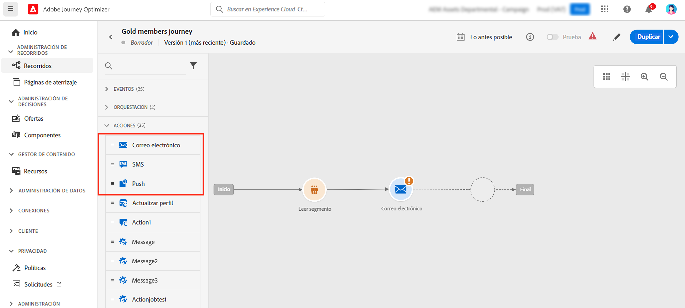
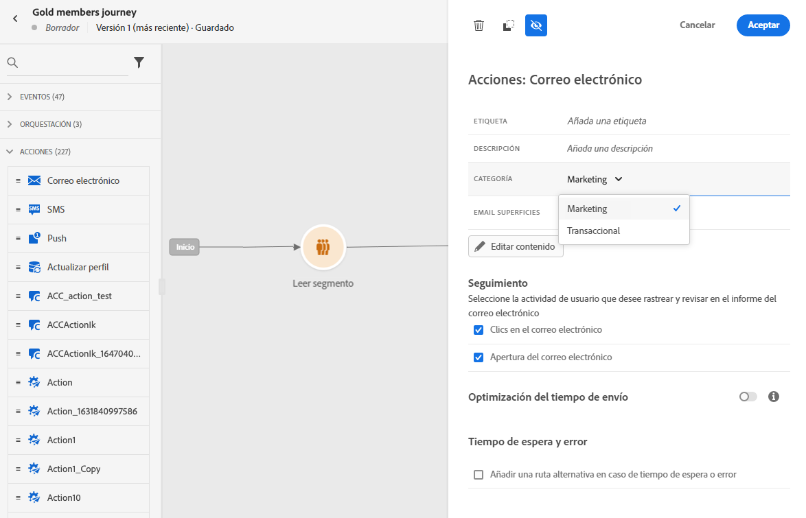
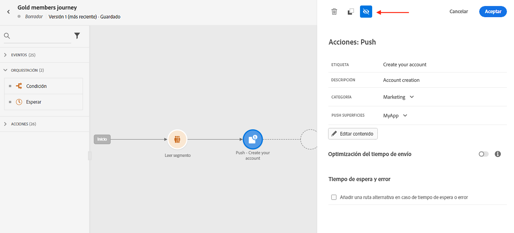
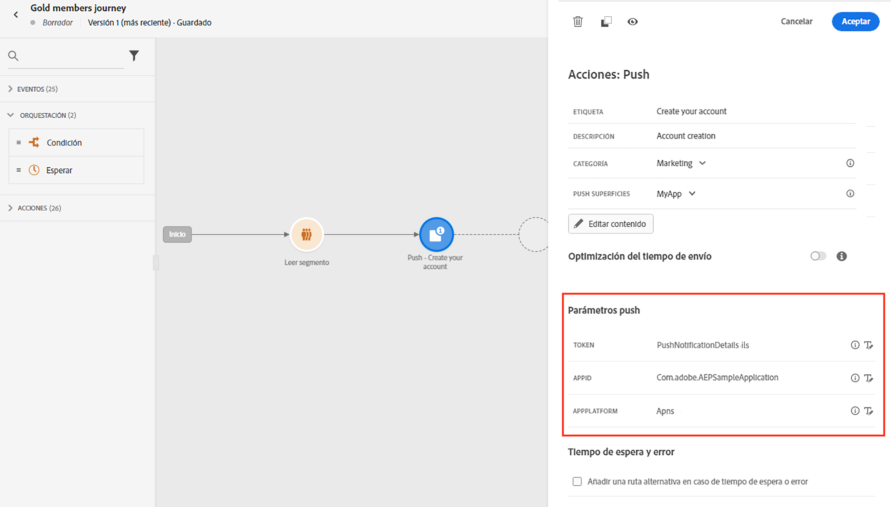
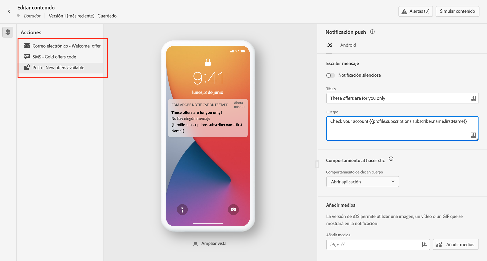
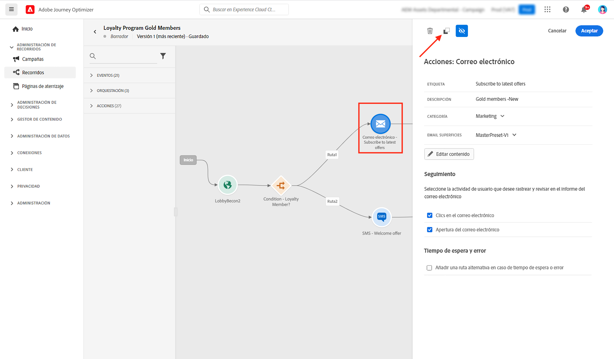
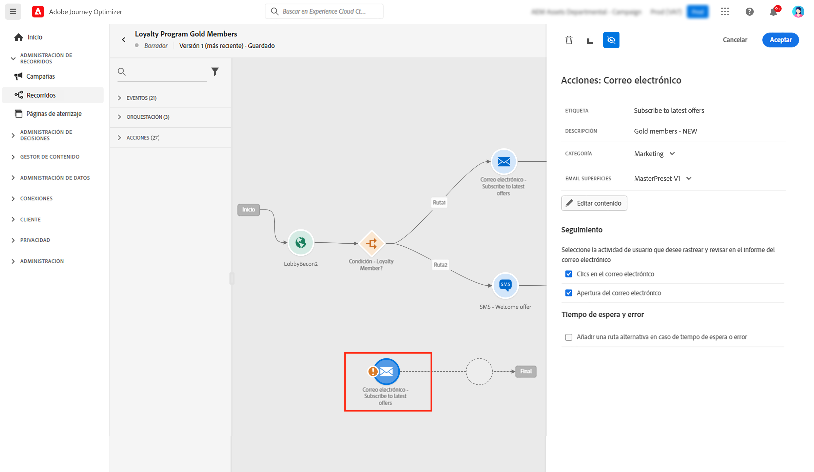
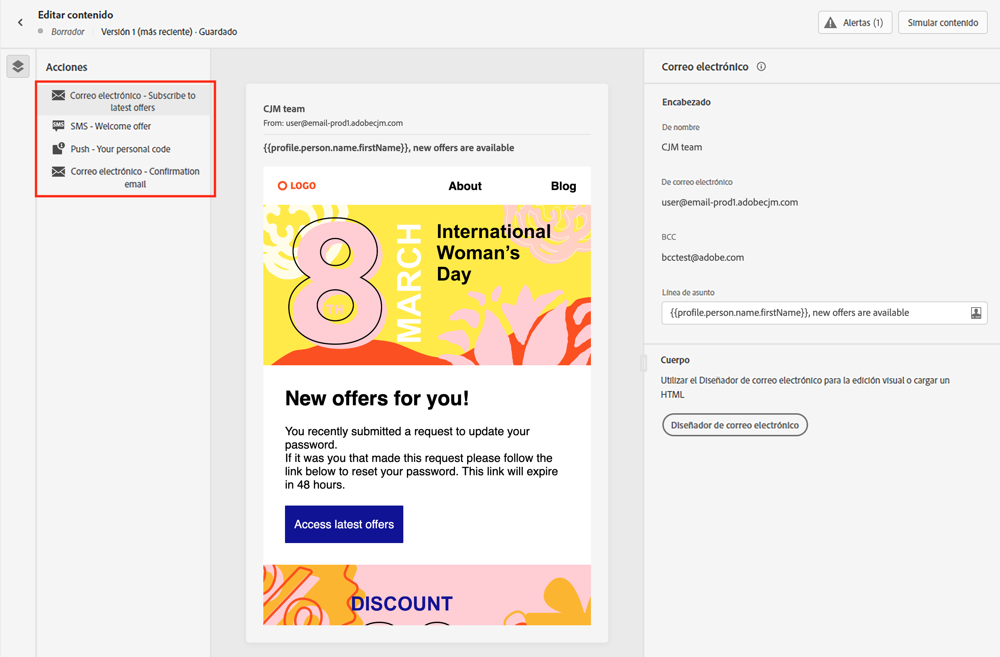
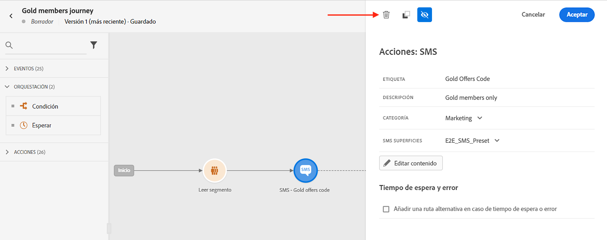

# Introducción a los mensajes {#get-started-messages}

>[!CONTEXTUALHELP]
>id="ajo_journey_message"
>title="Acciones de canal"
>abstract="Utilice acciones de canal para enviar un mensaje push, SMS o de correo electrónico."

Use [!DNL Journey Optimizer] para crear y enviar notificaciones push personalizadas, SMS y mensajes de correo electrónico. Todos los mensajes se pueden editar en línea como parte de una acción en el lienzo del recorrido.  Utilice la función Guardar como plantilla para reutilizar el contenido fácilmente. Puede hacer lo siguiente:

* Use las **funcionalidades de diseño de correo electrónico de [!DNL Journey Optimizer]** para crear o importar correos electrónicos adaptables.

* Aproveche **Adobe Experience Manager Assets Essentials** para enriquecer los correos electrónicos, crear y administrar su propia base de datos de activos.

* Encuentre **fotos de Adobe Stock** para crear su contenido y mejorar su diseño de correo electrónico.

* Mejore la experiencia de los clientes creando **notificaciones push, SMS y correos electrónicos** en función de sus atributos de perfil.

* **Envíe entregas** en función de estos contenidos y realice un seguimiento del comportamiento de los clientes.

>[!NOTE]
>
>Los usuarios pueden acceder, crear, editar o publicar recorridos según su perfil de producto. Obtenga más información sobre los permisos de usuario [en esta sección](../administration/permissions.md).

## Adición de mensajes a los recorridos{#messages-in-journeys}

>[!CONTEXTUALHELP]
>id="ajo_message_category"
>title="Categoría del mensaje"
>abstract="Seleccione Marketing para mensajes comerciales o Transaccional para los no comerciales, como confirmaciones de pedidos, notificaciones de restablecimiento de contraseña o información de entrega"

>[!CONTEXTUALHELP]
>id="ajo_message_surface"
>title="Superficie de canal"
>abstract="Una superficie de canal es una instancia de ese canal que tiene toda la configuración para enviar una acción correctamente a través de una campaña o un recorrido. Se define mediante un administrador del sistema."

Para añadir mensajes a los recorridos, solo tiene que añadir una actividad push, SMS o de correo electrónico en los lienzos de recorrido.

1. Inicie el recorrido con un [Evento](../building-journeys/general-events.md) o una actividad [Leer segmento](../building-journeys/read-segment.md).

1. En la sección **Acciones** de la paleta, arrastre y suelte una actividad de **correo electrónico**, **SMS** o **push** en el lienzo.

   

1. Introduzca una etiqueta y una descripción.

1. Seleccione el mensaje **[!UICONTROL Category]**: seleccione **Marketing** para mensajes comerciales o **Transaccional** para los no comerciales, como confirmaciones de pedidos, notificaciones de restablecimiento de contraseña o información de entrega

   >[!CAUTION]
   >
   >Si ha definido [reglas de frecuencia](../configuration/frequency-rules.md) para un canal y categoría específicos, se aplican automáticamente al mensaje al seleccionar ese canal y categoría. Actualmente, solo está disponible la categoría **[!UICONTROL Marketing]** para reglas de frecuencia.

   

   >[!CAUTION]
   >
   >Los mensajes de tipo Marketing deben incluir un [vínculo de no participación](../messages/consent.md#opt-out-management). Esto no es necesario para los mensajes transaccionales, ya que estos se pueden enviar a perfiles que cancelaron la suscripción a comunicaciones de marketing.

1. Seleccione el canal **[!UICONTROL Surface]** (es decir, el ajuste preestablecido de mensaje) que se utilizará para enviar el mensaje.

   Una superficie es una configuración que ha definido un [Administrador del sistema](../start/path/administrator.md). Contiene todos los parámetros técnicos para enviar el mensaje, como parámetros de encabezado, subdominio, aplicaciones móviles, etc. [Más información](../configuration/channel-surfaces.md).

   >[!CAUTION]
   >
   >Debe elegir una superficie de canal válida para la categoría de mensaje y el canal seleccionados.

   Puede acceder a la etiqueta, la descripción y la superficie del mensaje y modificarlos en cualquier momento mediante el botón **[!UICONTROL Properties]** en la interfaz de mensajes.

1. Creación del contenido del mensaje.

   Conozca los pasos detallados para crear el contenido del mensaje en la siguiente página:

   * [Crear un correo electrónico](create-email.md)
   * [Crear notificaciones push](create-push.md)
   * [Creación de un mensaje SMS](create-sms.md)

## Habilitación de la optimización del tiempo de envío{#sto-in-journeys}

Para las notificaciones push y de correo electrónico, puede activar la **[!UICONTROL Send-time optimization]**.

Use la **[!UICONTROL Send-time optimization]** para programar tiempos de envío personalizados para cada usuario y, así, aumentar las tasas de apertura y de clics de sus mensajes. [Más información](../messages/send-time-optimization.md).

## Parámetros avanzados{#adv-settings}

Los parámetros avanzados son de solo lectura y están ocultos de forma predeterminada.

Para acceder a los parámetros avanzados, haga clic en el icono **[!UICONTROL Show read-only fields]** en la parte superior del panel de mensajes.

Los parámetros avanzados se muestran en la parte inferior del panel de mensajes. Estos parámetros los define el [administrador del sistema](../start/path/administrator.md) en la [superficie del canal](../configuration/channel-surfaces.md) (es decir, el ajuste preestablecido de mensaje) asociado al mensaje.

Para las notificaciones push, puede mostrar los siguientes parámetros: Token, AppID, AppPlatform.

Para el correo electrónico, puede mostrar la dirección de correo electrónico principal.

Para un uso específico, puede anular estos valores en contextos concretos. Para forzar un valor, haga clic en el icono **Habilitar la sustitución de parámetros** a la derecha del campo. Esta opción puede resultar útil, por ejemplo, para lo siguiente:

* Pruebe un correo electrónico, puede añadir su dirección de correo electrónico. Después de publicar el recorrido, se le enviará el correo electrónico.
* Consulte la dirección de correo electrónico de los suscriptores de una lista. Obtenga más información en [este caso de uso](../building-journeys/message-to-subscribers-uc.md).

Haga clic en el mismo icono para restablecer al parámetro predeterminado.

## Examen de mensajes{#browse-message}

Cuando se utilizan varios mensajes en un recorrido, puede cambiar de uno a otro desde la pantalla **Editar contenido**.

Entonces, puede [comprobar las alertas](alerts.md) y [simular](../design/preview.md) cada contenido en una sola vista.

## Duplicar un mensaje {#duplicate-message}

Puede copiar un mensaje existente del lienzo de recorrido.

Para ello, siga los pasos a continuación:

1. Seleccione el mensaje que desea copiar.

1. Utilice el botón **[!UICONTROL Copy]** del panel **[!UICONTROL Action]**.

   

1. Presione **ctrl+V** para pegar el mensaje.

   El mensaje se añade a los lienzos de recorrido. Todos los ajustes y configuraciones se copiarán en el nuevo mensaje.

   

1. Cambie el nombre del mensaje para poder diferenciar el mensaje inicial de la copia, por ejemplo, al editar mensajes, como se muestra a continuación:

   

>[!NOTE]
>
>En el caso de los correos electrónicos, también puede convertir un mensaje existente en una plantilla. [Más información](../design/email-templates.md).

## Eliminación de un mensaje{#delete-message}

Para eliminar un mensaje, utilice el icono de papelera en la parte superior del panel de actividad de acción del canal.

Utilice el botón **[!UICONTROL Confirm]** para validarlo.
