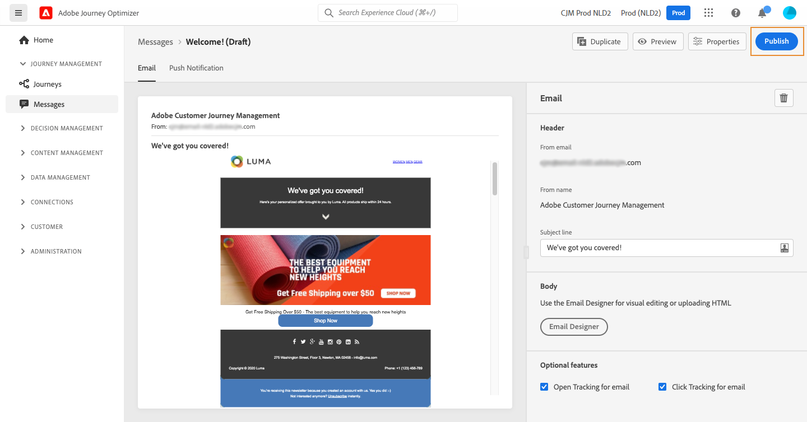
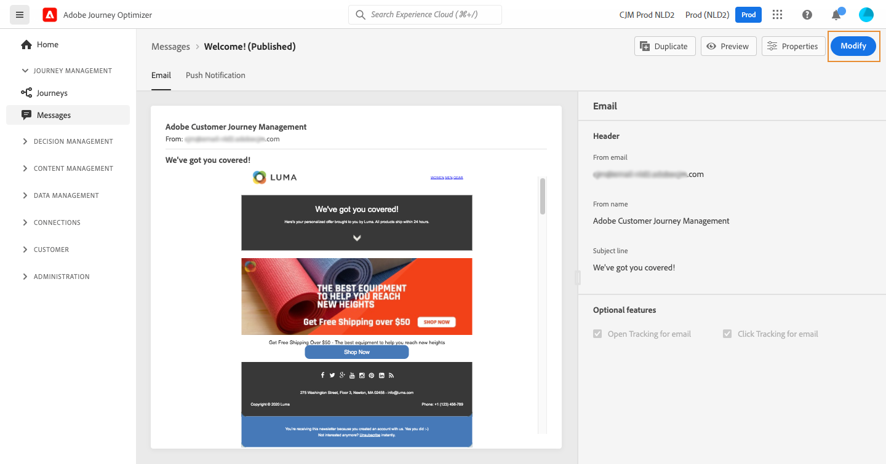

# Publicación de mensajes {#publish-manage-messages}

## Publicación de un mensaje {#publish-message}

Una vez creado el mensaje, puede publicarlo para que esté disponible para la ejecución.

>[!CAUTION]
>
>Antes de publicar, compruebe y resuelva las alertas. [Más información](alerts.md)

Una vez publicado el mensaje, se añade a la lista de mensajes con la variable **[!UICONTROL Published]** estado.

Ahora está listo para ser activado por uno o más [recorridos](../building-journeys/journey.md).

>[!NOTE]
>
>Al actualizar una oferta, una oferta de reserva, una recopilación de ofertas o una decisión de oferta a la que se hace referencia directa o indirectamente en un mensaje publicado, las actualizaciones ahora se reflejan automáticamente en el mensaje correspondiente, sin necesidad de volver a publicarlas. [Más información sobre las ofertas](../offers/get-started/starting-offer-decisioning.md)

## Actualizar un mensaje de solo lectura {#modify-message}

Después de la publicación, un mensaje está en modo de solo lectura. Aún puede actualizarlo creando un nuevo borrador de ese mensaje.

Esto le permite actualizar el contenido o corregir un problema, por ejemplo, sin volver a publicar el recorrido completo en el que se utiliza el mensaje.

>[!NOTE]
>
>La versión de borrador se puede editar mientras la versión publicada esté aún publicada y activa.

Para actualizar un mensaje publicado:

1. En la lista de mensajes, seleccione el mensaje para abrirlo.

1. Haga clic en **[!UICONTROL Modify]**.

   

1. Confirme la elección. Se crea una versión borrador del mensaje.

   

1. Edite el contenido o cambie la configuración como desee.
1. Haga clic en **[!UICONTROL Publish]**. Esta acción publica la nueva versión del mensaje que se utilizará para las próximas ejecuciones.

Tan pronto como se publique la nueva versión, tras la siguiente llamada de API, se generará una nueva ejecución de mensaje. El siguiente perfil entrante recibirá la nueva versión.

<!--For batch messages, the audience/segment being processed in the previous execution will not be affected by the new version. Only the next incoming API call with an audience/segment will generate a new message execution with the new version. -->
