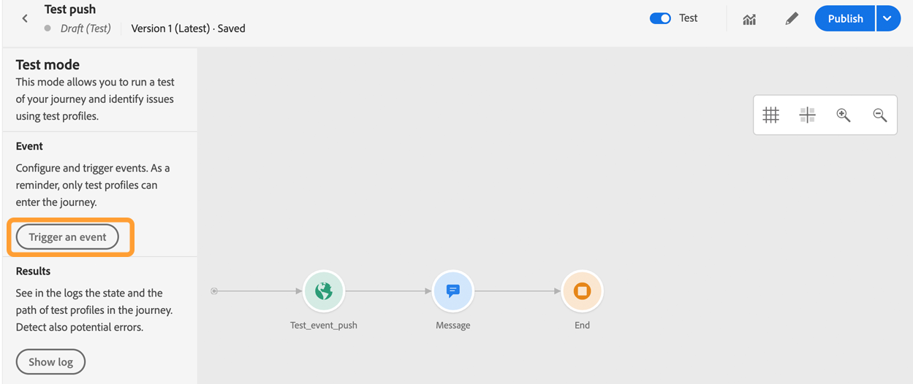

# Configurar el canal de notificaciones push {#push-notification-configuration}

[!DNL Journey Optimizer] [!DNL Journey Optimizer] [!DNL Adobe Journey Optimizer][](push-gs.md)

## Antes de empezar {#before-starting}

<!--
### Check provisioning

Your Adobe Experience Platform account must be provisioned to contain following schemas and datasets for push notification data flow to function correctly:

| Schema <br>Dataset                                                                       | Group of fields                                                                                                                                                                         | Operation                                                |
| -------------------------------------------------------------------------------------- | --------------------------------------------------------------------------------------------------------------------------------------------------------------------------------------- | -------------------------------------------------------- |
| CJM Push Profile Schema <br>CJM Push Profile Dataset                                     | Push Notification Details<br>Adobe CJM ExperienceEvent - Message Profile Details<br>Adobe CJM ExperienceEvent - Message Execution Details<br>Application Details<br>Environment Details | Register Push Token                                      |
| CJM Push Tracking Experience Event Schema<br>CJM Push Tracking Experience Event Dataset | Push Notification Tracking                                                                                                                                                              | Track interactions and provide data for the reporting UI |
-->

### Set up permissions {#setup-permissions}

Before creating a mobile application, you first need to make sure that you have or assign the correct user permissions for tags in Adobe Experience Platform. [](https://experienceleague.adobe.com/docs/experience-platform/tags/admin/user-permissions.html)

>[!CAUTION]
>
>Push configuration must be performed by an expert user. **** ****[](https://experienceleague.adobe.com/docs/experience-platform/tags/admin/user-permissions.html#platform-launch-permissions)

<!--ou need to your have access to perform following roles :

* Manage Datastreams
* Manage Client-side Properties
* Manage App Configurations
-->

********

1. **[!DNL Admin Console]**

1. **[!UICONTROL Products]****[!UICONTROL Adobe Experience Platform Launch]**

   

1. **[!UICONTROL Product Profile]****[!UICONTROL New profile]** **[!UICONTROL New profile]**[](https://experienceleague.adobe.com/docs/experience-platform/access-control/ui/create-profile.html#ui)

1. En la pestaña **[!UICONTROL Permissions]**, seleccione **[!UICONTROL Property rights]**.

   

1. Haga clic en **[!UICONTROL Add all]**. This will add the following right to your product profile:
   * **[!UICONTROL Approve]**
   * **[!UICONTROL Develop]**
   * **[!UICONTROL Manage Environments]**
   * **[!UICONTROL Manage Extensions]**
   * **[!UICONTROL Publish]**

   These permissions are required to install and publish the Adobe Journey Optimizer extension and publish the app property in Adobe Experience Platform Mobile SDK.

1. **[!UICONTROL Company rights]**

   

1. Add the following rights:

   * **[!UICONTROL Manage App Configurations]**
   * **[!UICONTROL Manage Properties]**

   ********

   

1. Haga clic en **[!UICONTROL Save]**.

**[!UICONTROL Product profile]**

1. **[!DNL Admin Console]**

1. **[!UICONTROL Products]****[!UICONTROL Adobe Experience Platform Launch]**

1. Seleccione el **[!UICONTROL Product profile]** configurado anteriormente.

1. En la pestaña **[!UICONTROL Users]**, haga clic en **[!UICONTROL Add user]**.

   

1. Type in your user&#39;s name or email address and select the user. A continuación, haga clic en **[!UICONTROL Save]**.

   >[!NOTE]
   >
   >[](https://helpx.adobe.com/enterprise/admin-guide.html/enterprise/using/manage-users-individually.ug.html#add-users)

   

### Configure your app {#configure-app}

The technical setup involves close collaboration between the app developer and business administrator. [!DNL Journey Optimizer][!DNL Adobe Experience Platform Data Collection]

Follow implementation steps detailed in the links below:

* ****[](https://developer.apple.com/documentation/usernotifications/registering_your_app_with_apns)
* ****[](https://firebase.google.com/docs/cloud-messaging/android/client)

### Integrate your mobile app with Adobe Experience Platform SDK {#integrate-mobile-app}

Adobe Experience Platform Mobile SDK provides client-side integration APIs for your mobiles via Android and iOS compatible SDKs. [](https://aep-sdks.gitbook.io/docs/getting-started/overview)

[!DNL Adobe Experience Platform Data Collection] You will typically create a mobile property for each mobile application you want to manage. [](https://aep-sdks.gitbook.io/docs/getting-started/create-a-mobile-property)


## Step 1: Add your app push credentials in Adobe Experience Platform Data Collection {#push-credentials-launch}

[!DNL Adobe Experience Platform Data Collection]

The mobile app push credential registration is required to authorize Adobe to send push notifications on your behalf. Refer to the steps detailed below:

1. [!DNL Adobe Experience Platform Data Collection]**[!UICONTROL App Surfaces]**

1. **[!UICONTROL Create App Surfaces]**

   

1. **[!UICONTROL Name]**

1. **[!UICONTROL Mobile Application Configuration]**

   * **Para iOS**

      

      1. ******[!UICONTROL App ID (iOS Bundle ID)]** ********

      1. **[!UICONTROL Push Credentials]**

      1. Drag and drop your .p8 Apple Push Notification Authentication Key file. ************

      1. **** This is a 10 character string assigned during the creation of p8 auth key. ****************

      1. **** This is a string value which can be found under the Membership tab.
   * ****

      

      1. **[!UICONTROL App ID (Android package name)]**`build.gradle`

      1. **[!UICONTROL Push Credentials]**

      1. Drag and drop the FCM push credentials. [](https://firebase.google.com/docs/admin/setup#initialize-sdk)


1. **[!UICONTROL Save]**

<!--
## Step 2: Set up a mobile property in Adobe Experience Platform Launch {#launch-property}

Setting up a mobile property allows the mobile app developer or marketer to configure the mobile SDKs attributes such as Session Timeouts, the [!DNL Adobe Experience Platform] sandbox to be targeted and the **[!UICONTROL Adobe Experience Platform Datasets]** to be used for mobile SDK to send data to.

For further details and procedures on how to set up a **[!UICONTROL Platform Launch property]**, refer to the steps detailed in [Adobe Experience Platform Mobile SDK documentation](https://aep-sdks.gitbook.io/docs/getting-started/create-a-mobile-property#create-a-mobile-property).


To get the SDKs needed for push notification to work you will need the following SDK extensions, for both Android and iOS:

* **[!UICONTROL Mobile Core]** (installed automatically)
* **[!UICONTROL Profile]** (installed automatically)
* **[!UICONTROL Adobe Experience Platform Edge]**
* **[!UICONTROL Adobe Experience Platform Assurance]**, optional but recommended to debug the mobile implementation.

Learn more about [!DNL Adobe Experience Platform Launch] extensions in [Adobe Experience Platform Launch documentation](https://experienceleague.adobe.com/docs/launch-learn/implementing-in-mobile-android-apps-with-launch/configure-launch/launch-add-extensions.html).
-->

## Step 2: Configure Adobe Journey Optimizer Extension in your mobile property {#configure-journey-optimizer-extension}

****

[](https://aep-sdks.gitbook.io/docs/using-mobile-extensions/adobe-journey-optimizer)


<!-- 
**[!UICONTROL Edge configuration]** is used by **[!UICONTROL Edge]** extension to send custom data from mobile device to [!DNL Adobe Experience Platform]. 
To configure [!DNL Adobe Experience Platform], you must provide the **[!UICONTROL Sandbox]** name and **[!UICONTROL Event Dataset]**.

For further details and procedures on how to create **[!UICONTROL Edge configuration]**, refer to the steps detailed in [Adobe Experience Platform Mobile SDK documentation](https://aep-sdks.gitbook.io/docs/getting-started/configure-datastreams).

1. From [!DNL Adobe Experience Platform Launch], select the **[!UICONTROL Edge Configurations]** tab and click **[!UICONTROL Edge Configurations]**.
    
1. Select **[!UICONTROL New Edge Configuration]** to add a new **[!UICONTROL Edge Configuration]**.
1. Enter a **[!UICONTROL Name]** and click **[!UICONTROL Save]**

1. Click the **[!UICONTROL Adobe Experience Platform]** toggle to enable it.

1. Fill in the **[!UICONTROL Sandbox]**, **[!UICONTROL Event dataset]** and **[!UICONTROL Profile Dataset]** fields. Then, click **[!UICONTROL Save]**.
    
    


1. From [!DNL Adobe Experience Platform Launch], ensure that **[!UICONTROL Client Side]** is selected in the drop-down menu.

1. select the **[!UICONTROL Properties]** tab and click **[!UICONTROL New Property]**.

    

1. Enter a **[!UICONTROL Name]** for your new property.

1. Select **[!UICONTROL Mobile]** as **[!UICONTROL Platform]**.

    

1. Click **[!UICONTROL Save]** to create your new property.

To configure **[!UICONTROL Adobe Experience Platform Edge Extension]** to send custom data from mobile devices to [!DNL Adobe Experience Platform].

1. Select your previously created property and select the **[!UICONTROL Extensions]** tab to view the extensions for this property.

    

1. Click **[!UICONTROL Configure]** under the **[!UICONTROL Adobe Experience Platform Edge]** Network' extension.

1. From the **[!UICONTROL Edge Configuration]** drop-down list, select the **[!UICONTROL Edge Configuration]** created in the previous steps. For more information on **[!UICONTROL Edge Configuration]**, refer to this [section](#edge-configuration).

1. Click **[!UICONTROL Save]**.

To configure **[!UICONTROL Adobe Experience Platform Messaging]** extension to send push profile and push interactions to the correct datasets, follow the same steps as above. Use **[!UICONTROL Sandbox]**, **[!UICONTROL Event dataset]** and **[!UICONTROL Profile Dataset]** created in the [Adobe Experience Platform setup](#edge-configuration).
-->

<!--
## Step 4: Publish the Property {#publish-property}

You now need to publish the property to integrate your configuration and to use it in the mobile app. 

To publish your property, refer to the steps detailed in [Adobe Experience Platform Mobile SDK documentation](https://aep-sdks.gitbook.io/docs/getting-started/create-a-mobile-property#publish-the-configuration)

## Step 5: Configure the ProfileDataSource {#configure-profiledatasource}

To configure the `ProfileDataSource`, use the `ProfileDCInletURL` from [!DNL Adobe Experience Platform] setup and add the following in the mobile app:

```
    MobileCore.updateConfiguration(
    mutableMapOf("messaging.dccs" to <ProfileDCSInletURL>)
```

-->

## Step 3: Test your mobile app with an event {#mobile-app-test}

[!DNL Adobe Experience Platform Data Collection] In this use case, we will create a journey to target our mobile app and set an event which will trigger the push notification.

<!--
You can use a test mobile app for this use case. For more on this, refer to this [page](https://wiki.corp.adobe.com/pages/viewpage.action?spaceKey=CJM&title=Details+of+setting+the+mobile+test+app) (internal use only).
-->

For this journey to work, you need to create an XDM schema. [](https://experienceleague.adobe.com/docs/experience-platform/xdm/schema/composition.html#schemas-and-data-ingestion)

1. **[!UICONTROL Schemas]**

1. **[!UICONTROL Create schema]****[!UICONTROL XDM ExperienceEvent]**

   

1. Seleccione **[!UICONTROL Create a new field group]**.

1. **[!UICONTROL Display Name]****[!UICONTROL Description]** Haga clic en **[!UICONTROL Add field groups]** cuando termine. [](https://experienceleague.adobe.com/docs/experience-platform/xdm/tutorials/create-schema-ui.html?lang=es)


   

1. On the left side, select the schema. In the right pane, enter the name of your schema and description. **[!UICONTROL Profile]**

   


1. On the left side, select the field group, then click the + icon to create a new field. **[!UICONTROL Field groups properties]****[!UICONTROL Field name]****[!UICONTROL Display name]****[!UICONTROL String]****[!UICONTROL Type]**

   

1. **[!UICONTROL Required]****[!UICONTROL Apply]**

1. Haga clic en **[!UICONTROL Save]**. Your schema is now created and can be used in an event.

You then need to set up an event.

1. **[!UICONTROL Configurations]** **[!UICONTROL Manage]****[!UICONTROL Events]**

1. **[!UICONTROL Create Event]**

   

1. Enter the name of your event. You can also add a description.

1. En el campo **[!UICONTROL Event ID type]**, seleccione **[!UICONTROL Rule Based]**.

1. **[!UICONTROL Parameters]**

   

1. In the list of fields, check that the field created in the schema field group is selected.

   

1. **[!UICONTROL Edit]****[!UICONTROL Event ID condition]** Drag and drop your previously added field to define the condition that will be used by the system to identify the events that will trigger your journey.

   

1. ****

   

1. **[!UICONTROL ECID]****[!UICONTROL Namespace]**

1. Haga clic en **[!UICONTROL Ok]** y luego en **[!UICONTROL Save]**.

Your event is now created and can now be used in a journey.

1. **[!UICONTROL Journeys]**

1. **[!UICONTROL Create Journey]**

1. Edite las propiedades del recorrido en el panel de configuración que se muestra en el lado derecho. Obtenga más información en esta [sección](../building-journeys/journey-gs.md#change-properties).

1. **[!UICONTROL Events]**

   

1. **[!UICONTROL Actions]****[!UICONTROL Message]**

1. Select a previously created message. [](create-message.md)

1. **[!UICONTROL End]**

1. **[!UICONTROL Test]****[!UICONTROL Trigger an event]**

   

1. **[!UICONTROL Key]******

   

1. Haga clic en **[!UICONTROL Send]**.

Your event will be triggered and you will receive your push notification to your mobile app.

## Step 4: Create a message preset for push{#message-preset}

[!DNL Adobe Experience Platform Data Collection]**[!DNL Journey Optimizer]**

[](../configuration/message-presets.md)

You are now ready to send push notifications with Journey Optimizer.

* [](create-push.md)
* [](../building-journeys/journeys-message.md)
