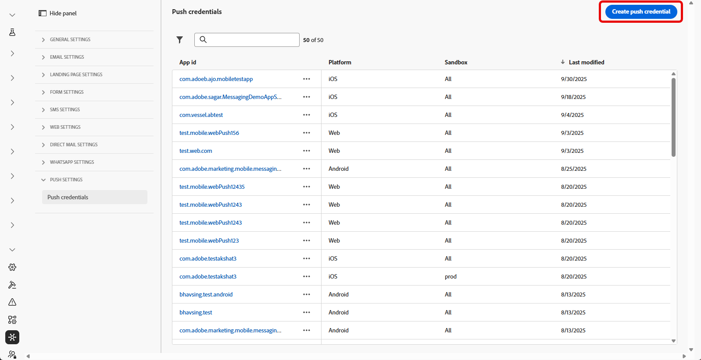

# Introducción a la configuración de actividades en directo {#mobile-live-config}

>[!BEGINSHADEBOX]

**En esta página:** configure sus credenciales push y la configuración del canal de actividad en directo para que pueda autorizar a Adobe Journey Optimizer a que entregue actualizaciones en tiempo real a su aplicación de iOS.

>[!ENDSHADEBOX]

Antes de enviar actividades en directo, debe configurar el entorno de Adobe Journey Optimizer. Para realizar esto:

## Paso 1: Añadir las credenciales push de la aplicación en Journey Optimizer (opcional){#push-credentials-launch}

Se requiere el registro de credenciales push de aplicaciones móviles para autorizar a Adobe a enviar notificaciones push en su nombre.

El paso 1 es opcional si ya se han configurado las credenciales de inserción, ya que se pueden reutilizar para la configuración del canal de actividad en directo. Si no se definen credenciales, debe crear nuevas credenciales push para la aplicación. Consulte los pasos detallados a continuación:

1. Acceda al menú **[!UICONTROL Canales]** > **[!UICONTROL Configuración push]** > **[!UICONTROL Credenciales push]**.

1. Haga clic en **[!UICONTROL Crear credencial push]**.

   

1. En el menú desplegable **[!UICONTROL Plataforma]**, seleccione el Sistema operativo:

1. Escriba la aplicación móvil **[!UICONTROL ID de aplicación]**.

   

1. Habilite la opción **[!UICONTROL Aplicar a todas las zonas protegidas]** para que estas credenciales push estén disponibles en todas las zonas protegidas. Si una zona protegida específica tiene sus propias credenciales para el mismo par de plataforma e ID de aplicación, esas credenciales específicas de la zona protegida tendrán prioridad.

1. Se ha activado el botón **[!UICONTROL Introducir credenciales de inserción manualmente]** para agregar sus credenciales.

1. Arrastre y suelte su archivo .p8 de clave de autenticación de notificaciones push de Apple. Esta clave se puede adquirir desde la página **Certificados**, **Identificadores** y **Perfiles**.

1. Proporcione la **ID de clave**. Es una cadena de 10 caracteres asignada durante la creación de la clave de autenticación p8. Se encuentra en la ficha **Claves** de la página **Certificados**, **Identificadores** y **Perfiles**.

1. Proporcione el **ID de equipo**. Es un valor de cadena que se puede encontrar en la pestaña Pertenencia.

1. Haga clic en **[!UICONTROL Enviar]** para crear la configuración de la aplicación.

## Paso 2: crear la configuración de actividad activa {#config-live-activity}

1. En el carril izquierdo, vaya a **[!UICONTROL Administración]** > **[!UICONTROL Canales]** y seleccione **[!UICONTROL Configuración general]** > **[!UICONTROL Configuraciones de canal]**. Haga clic en el botón **[!UICONTROL Crear configuración de canal]**.

   

1. Introduzca un nombre y una descripción (opcional) para la configuración y, a continuación, seleccione el canal de actividad Live.

   >[!NOTE]
   >
   > Los nombres deben comenzar por una letra (A-Z). Solo puede contener caracteres alfanuméricos. También puede utilizar caracteres de guion bajo `_`, punto `.` y guion `-`.

1. Seleccione **[!DNL Live activity]** como su canal.

   

1. Seleccione **[!UICONTROL Acciones de marketing]** para asociar directivas de consentimiento a los mensajes que usan esta configuración. Todas las políticas de consentimiento asociadas con la acción de marketing se aprovechan para respetar las preferencias de los clientes. Más información

1. Elija iOS como su **[!UICONTROL plataforma]**.

1. Seleccione en la lista desplegable el mismo **[!UICONTROL ID de aplicación]** que para la [credencial push](#push-credentials-launch) configurada arriba o elija una existente.

   

1. Una vez configurados todos los parámetros, haga clic en **[!UICONTROL Enviar]** para confirmar. También puede guardar la configuración de canal como borrador y reanudarla más adelante.

1. Una vez creada la configuración del canal, se muestra en la lista con el estado **[!UICONTROL Procesando]**.

   >[!NOTE]
   >
   >Si las comprobaciones no se realizan correctamente, obtenga más información sobre los posibles motivos de error en [esta sección](../configuration/channel-surfaces.md).

1. Una vez que las comprobaciones son correctas, la configuración del canal obtiene el estado **[!UICONTROL Activo]**. Está listo para utilizarse para enviar mensajes.

Ahora puede iniciar la integración con Adobe Experience Platform Mobile SDK para habilitar las actualizaciones dinámicas en tiempo real en la pantalla de bloqueo y Dynamic Island.

➡️ [Más información sobre la integración de SDK móvil de Adobe Experience Platform](mobile-live-configuration-sdk.md)

>[!TIP]
>
>Si encuentra problemas con la configuración o el envío de actividades en directo, consulte [Solucionar problemas de actividades en directo](troubleshoot-mobile-live.md) para ver los pasos de depuración.