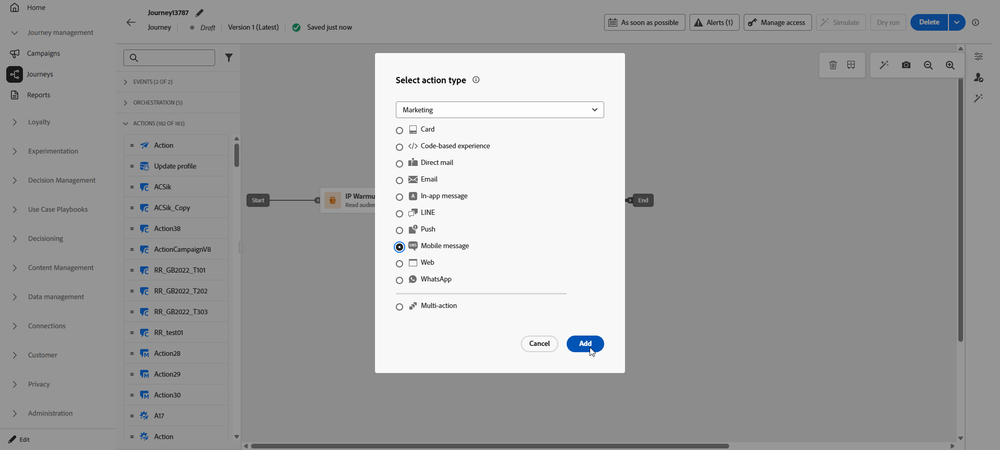

# Creación de un mensaje móvil {#create-sms}

>[!CONTEXTUALHELP]
>id="ajo_message_sms"
>title="Creación de un mensaje móvil"
>abstract="Para crear un mensaje móvil, añada una acción SMS en un recorrido o una campaña y comience a personalizarlo con el editor de personalización."

>[!AVAILABILITY]
>
>RCS no es un servicio compatible con HIPAA y no debe utilizarse para recopilar, almacenar ni procesar datos personales confidenciales, incluidos datos de salud permitidos, como información de salud personal, que de lo contrario su organización podría procesar en Journey Optimizer.

Puede diseñar y enviar mensajes de texto (SMS), de comunicación enriquecida (RCS) y multimedia (MMS) con Adobe Journey Optimizer. Primero debe agregar una acción de mensaje móvil en un recorrido o una campaña y luego definir el contenido del mensaje móvil, como se detalla a continuación. Adobe Journey Optimizer también ofrece funciones para probar los mensajes de Mobile antes de enviarlos, de modo que pueda comprobar el procesamiento, los atributos de personalización y cualquier otra configuración.

De acuerdo con las normas y regulaciones del sector, todos los mensajes de marketing SMS/RCS/MMS deben contener una forma para que los destinatarios puedan cancelar la suscripción fácilmente. Para ello, los destinatarios de SMS pueden responder con las palabras clave de inclusión y exclusión. [Aprenda a administrar la exclusión](../privacy/opt-out.md#opt-out-decision-management)

## Añadir un mensaje de Mobile {#create-sms-journey-campaign}

Examine las pestañas siguientes para aprender a añadir un mensaje móvil en una campaña o un recorrido.

>[!BEGINTABS]

>[!TAB Agregar un mensaje móvil a un Recorrido]

1. Abra el recorrido y arrastre y suelte una actividad **[!UICONTROL Action]** desde la sección **[!UICONTROL Actions]** de la paleta. Más información sobre la [actividad de acción](../building-journeys/journey-action.md).

   >[!IMPORTANT]
   >
   >Las actividades heredadas de canales nativos (correo electrónico, push, SMS, en la aplicación, web, experiencia basada en código y tarjeta de contenido) quedaron obsoletas a partir de la versión de marzo de 2026. Los recorridos existentes que utilizan estas actividades siguen funcionando sin ningún cambio; no se requiere ninguna migración.

1. Seleccione **[!UICONTROL Mensaje móvil]** como tipo de acción y haga clic en **[!UICONTROL Agregar]**.

   

1. Escriba una **[!UICONTROL etiqueta]** para identificar la acción en el lienzo de recorrido.

1. Haga clic en el botón **[!UICONTROL Configurar acción]**.

1. Se le dirigirá a la ficha **[!UICONTROL Acciones]**. A partir de ahí, seleccione o cree la configuración de mensaje móvil que desea utilizar. [Más información](mobile-configuration.md)

   

1. Además, puede aplicar reglas de límite a la acción de mensajes de Mobile seleccionando un conjunto de reglas en la lista desplegable **[!UICONTROL Reglas de negocio]**. [Más información](../conflict-prioritization/channel-capping.md)

1. Seleccione el botón **[!UICONTROL Editar contenido]** y cree el contenido como desee. [Más información](design-mobile.md)

1. Volver al lienzo de recorrido. Si es necesario, complete el flujo de recorrido arrastrando y soltando acciones o eventos adicionales. [Más información](../building-journeys/about-journey-activities.md)

Para obtener más información sobre cómo crear, configurar y publicar un recorrido, consulte [esta página](../building-journeys/journey-gs.md).

>[!TAB Agregar un mensaje móvil a una campaña]

1. Acceda al menú **[!UICONTROL Campañas]** y haga clic en **[!UICONTROL Crear campaña]**.

1. Seleccione el tipo de campaña que desea ejecutar

   * **Programado - Marketing**: ejecute la campaña inmediatamente o en una fecha especificada. Las campañas programadas están destinadas a enviar mensajes de marketing. Se configuran y ejecutan desde la interfaz de usuario de.

   * **Activado por API - Marketing/Transaccional**: ejecute la campaña mediante una llamada de API. Las campañas activadas por API están destinadas a enviar mensajes de marketing o transaccionales, es decir, mensajes enviados después de una acción realizada por un individuo: restablecimiento de contraseña, compra en el carro de compras, etc.

1. En la sección **[!UICONTROL Propiedades]**, edite el **[!UICONTROL Título]** y la **[!UICONTROL Descripción]** de su campaña.

1. En la ficha **[!UICONTROL Acción]**, haga clic en **[!UICONTROL Agregar acción]** y elija **[!UICONTROL Mensaje móvil]**. A continuación, seleccione o cree una nueva configuración.

   Obtenga más información acerca de la configuración del mensaje móvil en [esta página](mobile-configuration.md).

   

1. Haga clic en **[!UICONTROL Crear experimento]** para comenzar a configurar el experimento de contenido y crear tratamientos para medir su rendimiento e identificar la mejor opción para la audiencia objetivo. [Más información](../content-management/content-experiment.md)

1. En la sección **[!UICONTROL Seguimiento de acciones]**, especifique si desea rastrear los clics en los vínculos del mensaje de Mobile.

1. En la ficha **[!UICONTROL Audiencia]**, haga clic en el botón **[!UICONTROL Seleccionar audiencia]** para definir la audiencia a la que se dirigirá desde la lista de audiencias de Adobe Experience Platform disponibles. [Más información](../audience/about-audiences.md).

1. En el campo **[!UICONTROL Área de nombres de identidad]**, elija el área de nombres que desea usar para identificar a los individuos de la audiencia seleccionada. [Más información](../event/about-creating.md#select-the-namespace).

1. Desde la pestaña **[!UICONTROL Schedule]**, puede diseñar sus campañas para que se ejecuten en una fecha específica o en una frecuencia recurrente. Aprenda a configurar la **[!UICONTROL programación]** de su campaña en [esta sección](../campaigns/campaign-schedule.md#action-campaign-schedule).

1. En el menú **[!UICONTROL déclencheur de acción]**, elige la **[!UICONTROL Frecuencia]** de tu mensaje móvil:

   * Una vez
   * Diaria
   * Semanal
   * Month

Ahora puede empezar a diseñar el contenido de su mensaje móvil desde el botón **[!UICONTROL Editar contenido]**, como se detalla a continuación. [Más información](design-mobile.md)

Para obtener más información sobre cómo crear, configurar y activar una campaña, consulte [esta página](../campaigns/get-started-with-campaigns.md).

>[!ENDTABS]

**Temas relacionados**

* [Diseño de un mensaje móvil](design-mobile.md)
* [Añadir un mensaje en una campaña](../campaigns/create-campaign.md)
* [Previsualización, prueba y envío de un mensaje móvil](send-mobile-message.md)
* [Configuración del canal de mensajes móviles](mobile-configuration.md)
* [Informes de mensajes móviles](../reports/journey-global-report-cja-sms.md)

