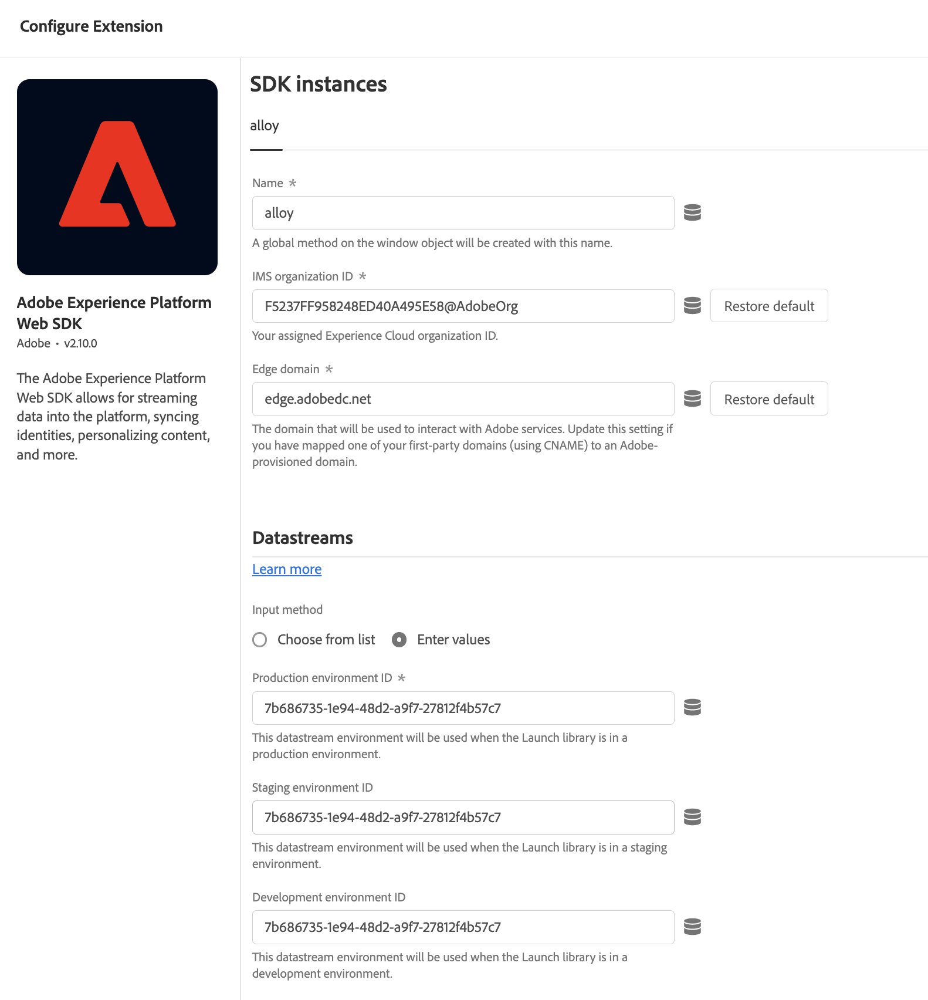

# Entrega de ofertas mediante la API de Edge Decisioning {#edge-decisioning-api}

## Introducción y requisitos previos {#edge-overview-and-prerequisites}

[Adobe Experience Platform Web SDK](https://experienceleague.adobe.com/docs/experience-platform/edge/home.html#video-overview) es una biblioteca JavaScript del lado del cliente que permite a los clientes de Adobe Experience Cloud interactuar con los distintos servicios de Experience Cloud a través de Experience Platform Edge Network.

Experience Platform Web SDK admite la consulta de las soluciones de personalización en Adobe, incluida la Gestión de decisiones, lo que le permite recuperar y procesar ofertas personalizadas creadas mediante API o la Biblioteca de ofertas. Para obtener instrucciones más detalladas, consulte la documentación sobre [creación de una oferta](../../get-started/starting-offer-decisioning.md).

Existen dos maneras de implementar la administración de decisiones con [Platform Web SDK](https://experienceleague.adobe.com/docs/experience-platform/edge/home.html#video-overview). Una forma está dirigida a los desarrolladores y requiere conocimientos de sitios web y programación. La otra forma es utilizar la interfaz de usuario de Adobe Experience Platform para configurar ofertas, lo que solo requiere que se haga referencia a un pequeño script en el encabezado de la página de HTML.

Consulte la documentación de Adobe Experience Platform sobre [administración de decisiones](https://experienceleague.adobe.com/docs/experience-platform/edge/personalization/offer-decisioning/offer-decisioning-overview.html#enabling-offer-decisioning) para obtener más información sobre cómo entregar ofertas personalizadas mediante Adobe Experience Platform Web SDK.

## SDK web de Adobe Experience Platform {#aep-web-sdk}

Platform Web SDK reemplaza los siguientes SDK:

* Visitor.js
* AppMeasurement.js
* AT.js
* DIL.js

SDK no combinó estas bibliotecas y es una nueva implementación desde cero. Para utilizarlo, primero debe seguir estos pasos:

1. Asegúrese de que su organización tiene los permisos adecuados para utilizar SDK y de que ha configurado los permisos correctamente.

   <!-- For more detailed instructions, refer to the documentation on using the [Adobe Experience Platform Web SDK](). -->

1. [Configure su secuencia de datos](https://experienceleague.adobe.com/docs/experience-platform/edge/fundamentals/datastreams.html?lang=es) en la ficha Recopilación de datos de su cuenta en Adobe Experience Cloud.

1. Instale SDK. Existen varios métodos para hacerlo, que se explican en [Instalar la página de SDK](https://experienceleague.adobe.com/docs/experience-platform/edge/fundamentals/installing-the-sdk.html). Esta página continuará con cada método de implementación diferente.

Para usar SDK, debe tener definidos un [esquema](../../../data/get-started-schemas.md) y un [conjunto de datos](../../../data/get-started-datasets.md).

<!-- ****TODO - Configure schema**** -->

Para personalizar ofertas, debe configurar por separado la personalización/perfiles.

<!-- Refer to the [doc](www.link.com) for detailed instructions.  -->

>[!NOTE]
>
>**Pasar datos de contexto en solicitudes de Edge Decisioning**
>
>Puede pasar datos de contexto (como tipo de dispositivo, ubicación o preferencias de usuario) en las solicitudes de Edge Decisioning para crear reglas de aceptación dinámicas y entregar ofertas personalizadas basadas en condiciones en tiempo real. [Más información sobre datos de contexto y solicitudes de Edge Decisioning](../../context-data-edge.md)

Para configurar SDK para la administración de decisiones, siga uno de estos dos pasos:

## Opción 1: Instalar la extensión de etiqueta y la implementación mediante Launch

Esta opción es más fácil de usar para las personas que pueden tener menos experiencia en la codificación.

1. [Crear una propiedad de etiqueta](https://experienceleague.adobe.com/docs/experience-platform/tags/admin/companies-and-properties.html)

1. [Agregar el código incrustado](https://experienceleague.adobe.com/docs/core-services-learn/implementing-in-websites-with-launch/configure-launch/launch-add-embed.html)

1. Instale y configure la extensión de Adobe Experience Platform Web SDK con la secuencia de datos que creó seleccionando la configuración en la lista desplegable &quot;Secuencia de datos&quot;. Consulte la documentación sobre [extensiones](https://experienceleague.adobe.com/docs/experience-platform/tags/ui/extensions/overview.html).

   

   

1. Cree los [elementos de datos](https://experienceleague.adobe.com/docs/experience-platform/tags/ui/data-elements.html) necesarios. Como mínimo, debe crear un mapa de identidad de Platform Web SDK y un elemento de datos de objeto XDM de Platform Web SDK.

   

   

1. Cree sus [reglas](https://experienceleague.adobe.com/docs/experience-platform/tags/ui/rules.html?lang=es):

   Agregue una acción Enviar evento de Platform Web SDK y agregue los ámbitos de decisión relevantes a la configuración de esa acción

   

   

1. [Cree y publique](https://experienceleague.adobe.com/docs/experience-platform/tags/publish/libraries.html) una biblioteca que contenga todas las reglas, elementos de datos y extensiones relevantes que haya configurado.

## Opción 2: Implementar manualmente con la versión independiente prediseñada

Estos son los pasos necesarios para utilizar la administración de decisiones mediante la instalación independiente prediseñada de Web SDK. En esta guía se da por hecho que es la primera vez que implementa SDK, por lo que es posible que no se le apliquen todos los pasos. Esta guía también supone cierta experiencia de desarrollo.

Incluya el siguiente fragmento de JavaScript de la opción 2: La versión independiente prediseñada en [esta página](https://experienceleague.adobe.com/docs/experience-platform/edge/fundamentals/installing-the-sdk.html) en la sección `<head>` de su página de HTML.

```
javascript
    <script>
        !function(n,o){o.forEach(function(o){n[o]||((n.__alloyNS=n.__alloyNS||
        []).push(o),n[o]=function(){var u=arguments;return new Promise(
        function(i,l){n[o].q.push([i,l,u])})},n[o].q=[])})}
        (window,["alloy"]);
    </script>
    <script src="https://cdn1.adoberesources.net/alloy/2.6.4/alloy.js" async></script>
```

Necesitará dos ID desde su cuenta de Adobe para configurar la configuración de SDK: su edgeConfigId y su orgId. edgeConfigId es el mismo que el ID de su secuencia de datos, que debería haber configurado en Requisitos previos.

Para encontrar el ID de edgeConfigID/secuencia de datos, vaya a Recopilación de datos y seleccione la secuencia de datos. Para encontrar su orgId, vaya a su perfil.

Configure SDK en JavaScript siguiendo las instrucciones de esta página. Siempre utilizará edgeConfigId y orgId en la función de configuración. La documentación también describe qué parámetros opcionales existen para la configuración. La configuración final puede tener un aspecto similar al siguiente:

```
javascript
    alloy("configure", {
        "edgeConfigId": "12345678-0ABC-DEF-GHIJ-KLMNOPQRSTUV",                            
        "orgId":"ABCDEFGHIJKLMNOPQRSTUVW@AdobeOrg",
        "debugEnabled": true,
        "edgeDomain": "edge.adobedc.net",
        "clickCollectionEnabled": true,
        "idMigrationEnabled": true,
        "thirdPartyCookiesEnabled": true,
        "defaultConsent":"in"  
    });
```

Instale la extensión de Chrome de Debugger para utilizarla con la depuración. Se puede encontrar aquí: <https://chrome.google.com/webstore/detail/adobe-experience-platform/bfnnokhpnncpkdmbokanobigaccjkpob>

A continuación, inicie sesión en su cuenta desde Debugger. A continuación, vaya a Registros y asegúrese de que está conectado al espacio de trabajo correcto. Ahora, copie la versión codificada en base64 del ámbito de decisión de su oferta.

Al editar el sitio web, incluya el script con la configuración y la función `sendEvent` para enviar el ámbito de decisión a Adobe.

**Ejemplo**:

```
javascript
    alloy("sendEvent", {
        "decisionScopes": 
        [
        "eyJ4ZG06YWN0aXZpdHlJZCI6Inhjb3JlOm9mZmVyLWFjdGl2aXR5OjE0ZWE4MDhhZjJjZDM1NzQiLCJ4ZG06cGxhY2VtZW50SWQiOiJ4Y29yZTpvZmZlci1wbGFjZW1lbnQ6MTRjNGFmZDI2OTXXXXXXXXXX"
        ]
    });
```

Consulte lo siguiente para ver un ejemplo sobre cómo gestionar la respuesta:

```
javascript
    alloy("sendEvent", {
        "decisionScopes":
        [
        "eyJ4ZG06YWN0aXZpdHlJZCI6Inhjb3JlOm9mZmVyLWFjdGl2aXR5OjE0ZWE4MDhhZjJjZDM1NzQiLCJ4ZG06cGxhY2VtZW50SWQiOiJ4Y29yZTpvZmZlci1wbGFjZW1lbnQ6MTRjNGFmZDI2OTXXXXXXXXXX"
        ]
    }).then(function(result) {
        Object.entries(result).forEach(([key, value]) => {
            console.log(key, value);
        });
    });
```

Puede utilizar el depurador para comprobar que se ha conectado correctamente a la red de Edge.

>[!NOTE]
>
>Si no ve una conexión al perímetro de en los registros, es posible que tenga que deshabilitar el bloqueador de anuncios.

Consulte cómo creó la oferta y el formato utilizado. En función de los criterios cumplidos en la decisión, se le devolverá una oferta que contiene la información especificada al crearla en Adobe Experience Platform.

En este ejemplo, el JSON que se va a devolver es:

```
json
{
   "name":"ABC Test",
   "description":"This is a test offer", 
   "link":"https://sampletesting.online/",
   "image":"https://sample-demo-URL.png"
}
```

Administre el objeto response y analice los datos que necesite. Dado que puede enviar varios ámbitos de decisión en una llamada de `sendEvent`, la respuesta podría ser ligeramente diferente.

```
json
    {
        "id": "abrxgl843d913",
        "scope": "eyJ4ZG06YWN0aXZpdHlJZCI6Inhjb3JlOm9mZmVyLWFjdGl2aXR5OjE0ZWE4MDhhZjJjZDM1NzQiLCJ4ZG06cGxhY2VtZW50SWQiOiJ4Y29yZTpvZmZlci1wbGFjZW1lbnQ6MTRjNGFmZDI2OTVlNWRmOSJ9",
        "items": 
        [
            {
                "id": "xcore:fallback-offer:14ea7f1ea26ebd0a",
                "etag": "1",
                "schema": "https://ns.adobe.com/experience/offer-management/content-component-json",
                "data": {
                    "id": "xcore:fallback-offer:14ea7f1ea26ebd0a",
                    "format": "application/json",
                    "language": [
                        "en-us"
                    ],
                    "content": "{\"name\":\"ABC Test\",\"description\":\"This is a test offer\", \"link\":\"https://sampletesting.online/\",\"image\":\"https://sample-demo-URL.png\"}"
                }
            }
        ]
    }
]
}
```

```
json
{
    "propositions": 
    [
    {
        "renderAttempted": false,
        "id": "e15ecb09-993e-4b66-93d8-0a4c77e3d913",
        "scope": "eyJ4ZG06YWN0aXZpdHlJZCI6Inhjb3JlOm9mZmVyLWFjdGl2aXR5OjE0ZWE4MDhhZjJjZDM1NzQiLCJ4ZG06cGxhY2VtZW50SWQiOiJ4Y29yZTpvZmZlci1wbGFjZW1lbnQ6MTRjNGFmZDI2OTVlNWRmOSJ9",
        "items": 
        [
            {
                "id": "xcore:fallback-offer:14ea7f1ea26ebd0a",
                "etag": "1",
                "schema": "https://ns.adobe.com/experience/offer-management/content-component-json",
                "data": {
                    "id": "xcore:fallback-offer:14ea7f1ea26ebd0a",
                    "format": "application/json",
                    "language": [
                        "en-us"
                    ],
                    "content": "{\"name\":\"Claire Hubacek Test\",\"description\":\"This is a test offer\", \"link\":\"https://sampletesting.online/\",\"image\":\"https://sample-demo-URL.png\"}"
                }
            }
        ]
    }
    ]
}
```

En este ejemplo, la ruta necesaria para gestionar y utilizar los detalles específicos de la oferta en la página web era: `result['decisions'][0]['items'][0]['data']['content']`

Para establecer las variables de JS:

```
javascript
const offer = JSON.parse(result['decisions'][0]['items'][0]['data']['content']);

let offerURL = offer['link'];
let offerDescription = offer['description'];
let offerImageURL = offer['image'];

document.getElementById("offerDescription").innerHTML = offerDescription;
document.getElementById('offerImage').src = offerImageURL;
```

<!--## Limitations

Some offer constraints are currently not supported with the mobile Experience Edge workflows, for example Capping. The Capping field value specifies the number of times an offer can be presented across all users. For more details, see [Add constraints to an offer](../../offer-library/add-constraints.md#capping).-->
