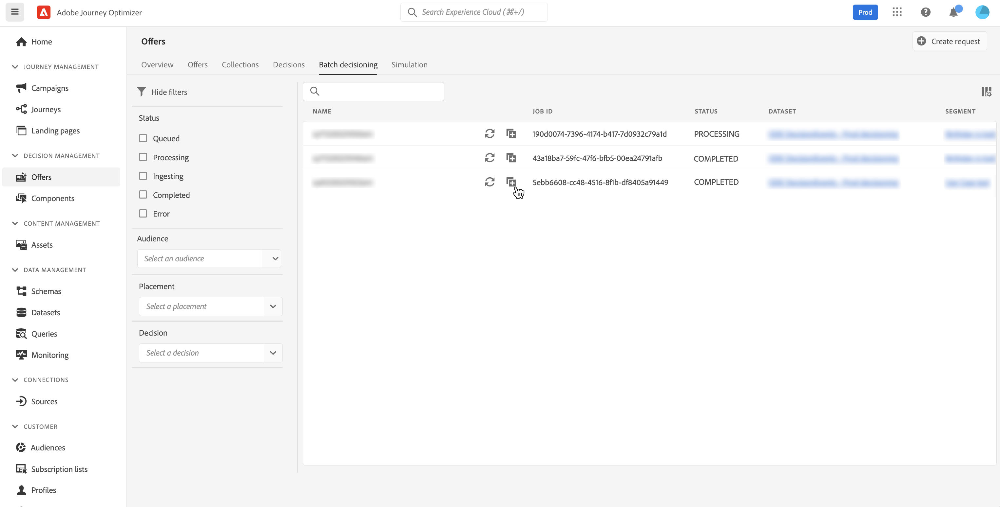

# Decisiones por lotes {#deliver}

## Introducción a la toma de decisiones por lotes {#start}

Journey Optimizer le permite ofrecer decisiones de oferta a todos los perfiles de un segmento de Adobe Experience Platform determinado.

Para ello, debe crear una solicitud de trabajo en Journey Optimizer que contenga información sobre el segmento a destinatario y la decisión de oferta que se va a utilizar. El contenido de la oferta para cada perfil del segmento se coloca luego en un conjunto de datos de Adobe Experience Platform donde está disponible para flujos de trabajo por lotes personalizados.

La entrega por lotes también se puede realizar mediante API. Para obtener más información, consulte [Documentación de la API de decisiones por lotes](api-reference/offer-delivery-api/batch-decisioning-api.md).

## Requisitos previos {#prerequisites}

Antes de configurar una solicitud de trabajo, asegúrese de que ha creado:

* **Un conjunto de datos** en Adobe Experience Platform. Este conjunto de datos se utilizará para almacenar el resultado de la decisión utilizando el esquema &quot;ODE Decidevents&quot;. Obtenga más información en la [Documentación de conjuntos de datos](https://experienceleague.adobe.com/docs/experience-platform/catalog/datasets/overview.html).

* **Un segmento** en Adobe Experience Platform. El segmento debe evaluarse y luego actualizarse. Obtenga información sobre cómo actualizar la evaluación de pertenencia a segmentos en la [Documentación del servicio de segmentación](http://www.adobe.com/go/segmentation-overview-en)

   >[!NOTE]
   >
   >Se ejecuta un trabajo por lotes de la instantánea de perfil que se produce una vez al día. La toma de decisiones por lotes limita la frecuencia y siempre carga perfiles de la instantánea más reciente.

* **Una decisión** en Adobe Journey Optimizer. [Aprenda a crear una decisión](offer-activities/create-offer-activities.md)

<!-- in API doc, remove these info and add ref here-->

## Crear una solicitud de trabajo

Para crear una nueva solicitud de trabajo, siga los pasos a continuación.

1. En el **[!UICONTROL Offers]** , abra **[!UICONTROL Batch decisioning]** a continuación, haga clic en **[!UICONTROL Create request]**.

   

1. Asigne un nombre a la solicitud de trabajo y seleccione el conjunto de datos al que se deben enviar los datos del trabajo.

1. Seleccione el segmento de Adobe Experience Platform al que desee dirigirse.

1. Seleccione uno o varios ámbitos de decisión de ofertas que desee utilizar para publicar ofertas en el segmento:
   1. Seleccione una colocación de la lista.
   1. Se muestran las decisiones disponibles para la colocación seleccionada. Seleccione la decisión que desee y haga clic en **[!UICONTROL Add]**.
   1. Repita la operación para agregar tantos ámbitos de decisión como desee.

   

1. De forma predeterminada, se devuelve una oferta del ámbito de decisión para cada perfil. Puede ajustar el número de ofertas devueltas mediante la variable **[!UICONTROL Request offer per profile]** . Por ejemplo, si selecciona 2, se mostrarán las 2 mejores ofertas para el ámbito de decisión seleccionado.

   >[!NOTE]
   >
   >Puede solicitar hasta 30 ofertas por ámbito de decisión.

1. Si desea incluir el contenido de la oferta en el conjunto de datos, active la opción **[!UICONTROL Include content]** en. Esta opción está desactivada de forma predeterminada.

1. Haga clic en **[!UICONTROL Create]** para ejecutar la solicitud de trabajo.

## Supervisar los trabajos por lotes

Se puede acceder a todos los trabajos por lotes solicitados desde la **[!UICONTROL Batch decisioning]** pestaña . Además, hay herramientas de búsqueda y filtrado disponibles para ayudarle a refinar la lista.

### Estados de solicitudes de trabajo

Una vez creada una solicitud de trabajo, el trabajo por lotes pasa por varios estados:

>[!NOTE]
>
>Para asegurarse de que está obteniendo la información más reciente sobre el estado de una solicitud de trabajo, utilice el botón elipse situado junto al trabajo para actualizarlo.

1. **[!UICONTROL Queued]**: La solicitud de trabajo se ha creado y se ha introducido en la cola de procesamiento. Se pueden ejecutar hasta 5 trabajos por lotes a la vez por conjunto de datos. Cualquier otra solicitud por lotes con el mismo conjunto de datos de salida se agrega a la cola. Un trabajo en cola se selecciona para procesarse una vez que el trabajo anterior ha terminado de ejecutarse.
1. **[!UICONTROL Processing]**: La solicitud de trabajo se está procesando
1. **[!UICONTROL Ingesting]**: Se ha ejecutado la solicitud de trabajo, los datos de resultado se están incorporando en el conjunto de datos seleccionado,
1. **[!UICONTROL Completed]**: La solicitud de trabajo se ha ejecutado y los datos de resultado ahora se almacenan en el conjunto de datos seleccionado.

   >[!NOTE]
   >
   >Puede acceder al conjunto de datos donde se almacenan los resultados de un trabajo haciendo clic en su nombre en la lista de trabajos.

Si se produce un error mientras se ejecuta la solicitud de trabajo, se obtiene la variable **[!UICONTROL Error]** estado. Intente duplicar el trabajo por lotes para crear una nueva solicitud. [Obtenga información sobre cómo duplicar un trabajo por lotes](#duplicate)

### Tiempo de procesamiento del trabajo por lotes

La hora de extremo a extremo de cada trabajo por lotes es la duración desde el momento en que se crea la carga de trabajo hasta el momento en que el resultado de la decisión está disponible en el conjunto de datos de salida.

El tamaño del segmento es el factor principal que afecta al tiempo de decisión del lote de extremo a extremo. Si la oferta apta tiene un límite de frecuencia global habilitado, la toma de decisiones por lotes tarda más en completarse. A continuación se presentan algunas aproximaciones del tiempo de procesamiento de extremo a extremo para sus respectivos tamaños de segmento, tanto con como sin límites de frecuencia para ofertas aptas:

Con el límite de frecuencia habilitado para las ofertas aptas:

| Tamaño del segmento | Tiempo de procesamiento completo |
|--------------|----------------------------|
| 10 000 perfiles o menos | 7 minutos |
| 1 millón de perfiles o menos | 30 minutos |
| 15 millones de perfiles o menos | 50 minutos |

Sin límite de frecuencia para ofertas aptas:

| Tamaño del segmento | Tiempo de procesamiento completo |
|--------------|----------------------------|
| 10 000 perfiles o menos | 6 minutos |
| 1 millón de perfiles o menos | 8 minutos |
| 15 millones de perfiles o menos | 16 minutos |

## Duplicar una solicitud de trabajo {#duplicate}

Puede reutilizar la información de un trabajo existente para crear una nueva solicitud.

Para ello, haga clic en el icono de duplicado, edite la información del trabajo si es necesario y, a continuación, haga clic en **[!UICONTROL Create]** para crear la nueva solicitud.

