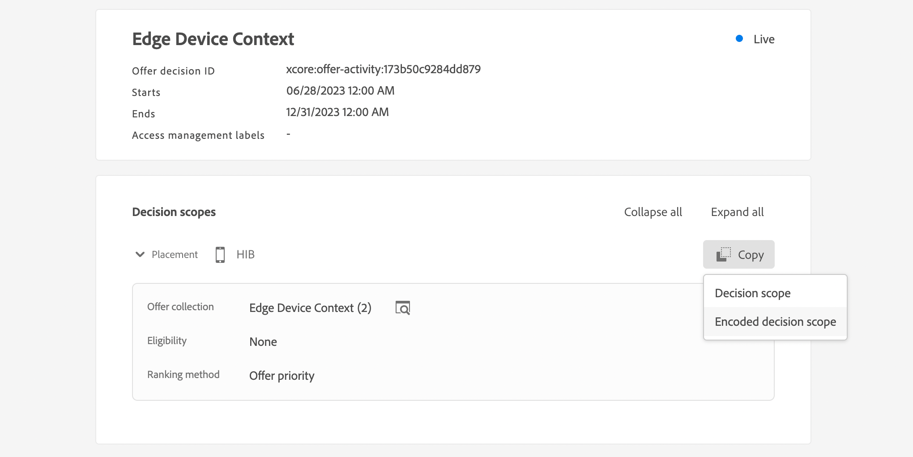

# Datos de contexto y solicitudes de Edge Decisioning {#edge}

Esta sección le guía a través del paso de datos de contexto en solicitudes de Edge Decisioning y su uso en reglas de elegibilidad. Exploraremos un caso de uso completo que muestra cómo ofrecer ofertas personalizadas en función del tipo de dispositivo que utilizan los clientes.

Este caso de uso implica varios pasos clave:

1. [Configurar requisitos previos](#prerequisites): Asegúrese de que se hayan completado todos los pasos necesarios para pasar los datos de contexto en sus solicitudes.
1. [Usar datos de contexto en reglas de idoneidad](#rules): cree reglas que determinen qué ofertas mostrar en función del tipo de dispositivo del usuario.
1. [Diseñar ofertas específicas del dispositivo](#offers): cree ofertas adaptadas para cada tipo de dispositivo y vincúlelas a las reglas correspondientes.
1. [Crear una colección de ofertas](#collection): Agrupe todas las ofertas en una colección estática.
1. [Configurar una decisión](#decision) : Cree una nueva decisión que aproveche el motor de decisión de ofertas para elegir la mejor oferta y presentarla a los usuarios según su tipo de dispositivo.
1. [Pasar datos de contexto en la solicitud de Edge Decisioning](#request): pase datos de contexto a través de su solicitud de API para recuperar y presentar las ofertas adecuadas a los usuarios.

>[!BEGINSHADEBOX]

Para ir más lejos, también puede aprovechar los datos de contexto en **fórmulas de clasificación** o **personalizar las representaciones de sus ofertas** de forma dinámica. Por ejemplo, se puede crear una sola oferta y utilizar campos de personalización para adaptar su representación en función de los datos de contexto. Por ejemplo, mostrar una imagen determinada si el usuario tiene un iphone y otra para los usuarios de ipad. Para obtener más información, consulte estas secciones:

* [Fórmulas de clasificación: aumente las ofertas basadas en datos de contexto](../offers/ranking/create-ranking-formulas.md#context-data)
* [Personalizar representaciones basadas en datos de contexto](../offers/offer-library/add-representations.md#context-data)

>[!ENDSHADEBOX]

## Requisitos previos para pasar datos de contexto en solicitudes de Edge Decisioning {#prerequisites}

A diferencia de pasar el contexto en un formato bastante libre mediante la API de decisiones, la carga útil de contexto de Edge Decisioning debe ser compatible con el evento de experiencia XDM. Para ello, el contexto debe definirse como parte del &quot;Evento de experiencia XDM&quot; que se utiliza para la recopilación de datos.

1. Defina un esquema de evento de experiencia. Para el propósito de este caso de uso, se crea un esquema &quot;Contexto de oferta&quot; y los campos del contexto de oferta forman parte de un grupo de campos &quot;Contexto de oferta&quot;. En realidad, el grupo de campos se agregaría al esquema de evento de experiencia utilizado para la recopilación de datos asociado al flujo de datos &quot;Edge Collection Network&quot;.

   >[!NOTE]
   >
   >El esquema del evento de experiencia del contexto de oferta debe formar parte del perfil, con un campo CUSTOMER_ID utilizado como identidad principal.

   En este ejemplo, el grupo de campos &quot;Contexto de oferta&quot; tiene dos propiedades: language y deviceType. Estas propiedades se utilizarán en la clasificación de ofertas y en las reglas de elegibilidad.

   {width="60%" align="center" zoomable="yes"}

   Aprenda a trabajar con esquemas en la guía de Adobe Experience Platform [Experience Data Model (XDM)](https://experienceleague.adobe.com/es/docs/experience-platform/xdm/home){target="_blank"}

1. Cree un conjunto de datos (aquí &quot;Contexto de la oferta&quot;) y asegúrese de que esté habilitado para el perfil.

1. Cree una nueva secuencia de datos a partir del menú **[!UICONTROL Recopilación de datos]** > **[!UICONTROL Secuencias de datos]**. Aprenda a crear y configurar flujos de datos en la [guía de flujos de datos](https://experienceleague.adobe.com/es/docs/experience-platform/datastreams/configure){target="_blank"} de Adobe Experience Platform

   Aquí, hemos creado un flujo de datos de &quot;Contexto de oferta&quot;, con el esquema de evento &quot;Contenido de oferta&quot; seleccionado.

   

1. Edite el conjunto de datos recién creado y seleccione &quot;Adobe Experience Platform&quot; como servicio y &quot;Contexto de oferta&quot; como conjunto de datos de evento.

   

1. Guarde la secuencia de datos y copie su ID. Este ID se utilizará en el punto final de su solicitud de API. [Aprenda a crear la llamada de API](#request)

   

## Uso de datos de contexto en reglas de idoneidad {#rules}

Cree reglas de aceptación que determinen qué ofertas mostrar en función del tipo de dispositivo del usuario:


* regla de dispositivo iphone:

   * Nombre de regla: &quot;Edge Context Rule - iphone&quot;
   * Configuración: deviceType = &#39;iphone&#39;
   * Sintaxis de PQL:

     ```
     select _Any1 from xEvent where _Any1._experienceplatform.offerContextData.deviceType.equals("iphone", false)
     ```

* regla de dispositivo ipad:

   * Nombre de regla: &quot;Edge Context Rule - ipad&quot;
   * Configuración: deviceType = &#39;ipad&#39;
   * Sintaxis de PQL

     ```
     select _Any1 from xEvent where _Any1._experienceplatform.offerContextData.deviceType.equals("ipad", false)
     ```

## Crear ofertas {#offers}

Cree una oferta para cada tipo de dispositivo y vincúlela a la regla de elegibilidad correspondiente creada anteriormente:

* Oferta para usuarios de iphone:

   * Nombre de la oferta : &quot;Edge Context - iPhone Offer Content&quot;
   * Regla asociada: &quot;Regla de contexto de Edge: iphone&quot;

* Oferta para usuarios de ipad:

   * Nombre de la oferta: Contexto de Edge - Contenido de la oferta de iPad
   * Regla asociada: &quot;Regla de contexto de Edge - ipad&quot;

Además, cree una oferta de reserva (aquí &quot;Contenido de reserva de contexto&quot;) para que se muestre si no se cumplen criterios específicos de dispositivo.

## Agregar ofertas en una colección {#collection}

Añada las ofertas creadas anteriormente a una colección estática llamada aquí &quot;Edge Device Context&quot;. Esta colección es donde la decisión de oferta elegirá las ofertas elegibles para presentarlas a los clientes.


## Crear decisión de oferta {#decision}

Cree una nueva decisión que aproveche el motor de decisión de ofertas para elegir la mejor oferta que se presentará a los usuarios según su tipo de dispositivo con la oferta de &quot;reserva de contexto&quot; seleccionada como oferta de reserva.


>[!NOTE]
>
>Para ir más lejos, puede aprovechar los datos de contexto en fórmulas de clasificación y asignarlos a su decisión. AÑADIR INFORMACIÓN

## Paso de datos de contexto en la solicitud de Edge Decisioning {#request}

### Punto de conexión

En el extremo, use el identificador de [secuencia de datos](#prerequisites) creada anteriormente.

`https://edge.adobedc.net/ee/irl1/v1/interact?configId=f3c47f2a-c484-4908-87a5-a82b55039e22`

### Carga útil

Este es un ejemplo de una solicitud que pasa datos de contexto.

* Se pasa información sobre el tipo de dispositivo en el nodo `xdm:ContextData`.
* En el nodo `decisionScopes`, copie y pegue el ámbito de decisión de la [decisión de oferta](#decision) configurada anteriormente.

  +++Dónde recuperar el ámbito de decisión

  

  +++

```
{
    "events": [{
        "xdm": {
            "identityMap": {
                "customerId": [{
                    "id": "0000158216",
                    "authenticatedState": "authenticated",
                    "primary": true
                }]
            },
            "_experienceplatform": {
                "identity": {
                    "core": {
                        "customerId": "0000158216"
                    }
                },
                "offerContextData" : {
                    "language" : "NL",
                    "deviceType" : "iphone"
                }
            }
        }
    }],
    "query": {
        "personalization": {
            "decisionScopes": ["eyJ4ZG06YWN0aXZpdHlJZCI6Inhjb3JlOm9mZmVyLWFjdGl2aXR5OjE3M2I1MGM5Mjg0ZGQ4NzkiLCJ4ZG06cGxhY2VtZW50SWQiOiJ4Y29yZTpvZmZlci1wbGFjZW1lbnQ6MTZhMzQxZWQ4ZDYyMzc2MSJ9"]
        }
    }
}
```

### Respuesta

Este es un ejemplo de respuesta:

```
{
    "requestId": "14a2d3f5-a6fa-494e-b42c-cc65a845284a",
    "handle": [
        {
            "payload": [
                {
                    "id": "1eafc831-4819-4800-8e25-c9e9f0838e09",
                    "scope": "eyJ4ZG06YWN0aXZpdHlJZCI6Inhjb3JlOm9mZmVyLWFjdGl2aXR5OjE3M2I1MGM5Mjg0ZGQ4NzkiLCJ4ZG06cGxhY2VtZW50SWQiOiJ4Y29yZTpvZmZlci1wbGFjZW1lbnQ6MTZhMzQxZWQ4ZDYyMzc2MSJ9",
                    "activity": {
                        "id": "xcore:offer-activity:173b50c9284dd879",
                        "etag": "1",
                        "name": "Edge Device Context"
                    },
                    "placement": {
                        "id": "xcore:offer-placement:16a341ed8d623761",
                        "etag": "1",
                        "name": "HIB",
                        "channel": "https://ns.adobe.com/xdm/channel-types/mobile",
                        "componentType": "https://ns.adobe.com/experience/offer-management/content-component-json"
                    },
                    "items": [
                        {
                            "id": "xcore:personalized-offer:173b4e05676d87f5",
                            "etag": "3",
                            "name": "Edge Context - iPhone Offer",
                            "priority": 0,
                            "schema": "https://ns.adobe.com/experience/offer-management/content-component-json",
                            "data": {
                                "id": "xcore:personalized-offer:173b4e05676d87f5",
                                "format": "application/json",
                                "language": [
                                    "en-gb"
                                ],
                                "content": "{\n    \"name\" : \"iphone offer\"\n}"
                            }
                        }
                    ]
                }
            ],
            "type": "personalization:decisions",
            "eventIndex": 0
        },
        {
            "payload": [],
            "type": "activation:pull",
            "eventIndex": 0
        },
        {
            "payload": [],
            "type": "personalization:decisions",
            "eventIndex": 0
        },
        {
            "payload": [
                {
                    "scope": "Target",
                    "hint": "37",
                    "ttlSeconds": 1800
                },
                {
                    "scope": "AAM",
                    "hint": "6",
                    "ttlSeconds": 1800
                },
                {
                    "scope": "EdgeNetwork",
                    "hint": "irl1",
                    "ttlSeconds": 1800
                }
            ],
            "type": "locationHint:result"
        },
        {
            "payload": [
                {
                    "key": "kndctr_907075E95BF479EC0A495C73_AdobeOrg_identity",
                    "value": "CiY0MDAwMDgyMjMzNTEzNzU1OTcwMjQ0NDcyNjU1MTAyMDEwNDQ3MVIRCNnE4Y6QMRABGAEqBElSTDHwAdnE4Y6QMQ==",
                    "maxAge": 34128000
                },
                {
                    "key": "kndctr_907075E95BF479EC0A495C73_AdobeOrg_cluster",
                    "value": "irl1",
                    "maxAge": 1800
                }
            ],
            "type": "state:store"
        }
    ]
}
```
