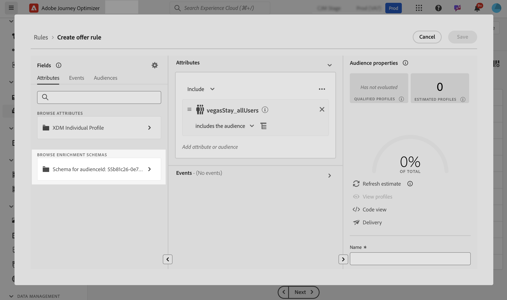

# Aprovechamiento de los públicos de carga personalizados para la toma de decisiones {#custom-upload-decisioning}

>[!TIP]
>
>Decisioning, la nueva funcionalidad de toma de decisiones de [!DNL Adobe Journey Optimizer], ya está disponible a través de los canales de experiencia basada en código y de correo electrónico. [Más información](../experience-decisioning/gs-experience-decisioning.md)

Con [!DNL Journey Optimizer] puede aprovechar los datos de las audiencias creadas mediante la carga personalizada (archivo CSV) en [!DNL Adobe Experience Platform]. Estos datos admiten los flujos de trabajo de Administración de decisiones. Esto resulta especialmente útil cuando los datos no se necesitan en el perfil, pero siguen siendo esenciales para la toma de decisiones.

Los datos de las audiencias de carga personalizadas se pueden aprovechar en Administración de decisiones para lo siguiente:

1. Criterios de idoneidad en ofertas y decisiones.
2. Personalización del contenido en representaciones de oferta.

Para obtener más información sobre las audiencias de carga personalizada, consulte las secciones:

* [Introducción a audiencias y Journey Optimizer](../audience/about-audiences.md)
* [Importación de una audiencia en Adobe Experience Platform](https://experienceleague.adobe.com/en/docs/experience-platform/segmentation/ui/audience-portal#import-audience){target="_blank"}

## Lectura obligatoria {#must-read}

* **Solo administración de decisiones**: esta funcionalidad solo se admite en Administración de decisiones, no en Decisioning (anteriormente conocida como &quot;Experience Decisioning&quot;).
* **Solo API de decisiones (Hub)**: está disponible exclusivamente a través de solicitudes de API de decisiones (Hub) y no es compatible con la API de decisiones de Edge ni con la toma de decisiones por lotes.
* **Indicador de API necesario para datos de enriquecimiento**: cuando utilice una audiencia de carga personalizada (CSV) y desee recuperar datos de enriquecimiento en la respuesta de decisión de oferta, debe incluir `"xdm:enrichedAudience": true` en la carga útil de solicitud de API. Sin este indicador, no se devolverán los atributos de enriquecimiento de la audiencia cargada en CSV. [Más información sobre la API de decisiones](api-reference/offer-delivery-api/decisioning-api.md)

## Usar una audiencia de carga personalizada como criterio de idoneidad {#eligibilty}

Puede utilizar una audiencia de carga personalizada como criterio de idoneidad tanto en el nivel de oferta como en el de decisión. Una vez añadidos, estos criterios pueden excluir de la idoneidad las ofertas o colecciones de ofertas. Estas son las distintas ubicaciones en las que puede aprovechar las audiencias de carga personalizada para refinar la elegibilidad de las ofertas y decisiones:

* Cree una regla de decisión con una audiencia de carga personalizada:

   1. Al crear una regla, accede a la pestaña **Audiencias** y busca tu audiencia CSV en la lista. Arrastre y suelte la audiencia en el lienzo de reglas.
   1. Utilice la ficha **Atributos** y navegue hasta los esquemas de enriquecimiento vinculados a la audiencia seleccionada. Esto le permite acceder a todos los datos del archivo CSV y utilizarlos en la regla. [Aprenda a crear una regla de decisión](../offers/offer-library/creating-decision-rules.md)
   1. Guarde la regla. Una vez creada la regla, se puede utilizar en los niveles de oferta y decisión para restringir su idoneidad.

  

* Utilice las audiencias de carga personalizadas como restricción de la oferta. [Aprenda a agregar restricciones a una oferta](../offers/offer-library/add-constraints.md)

  Al crear una oferta, en el paso **Agregar restricciones** puede:

   * Utilice la audiencia de carga personalizada para definir la idoneidad de la oferta,
   * Aplique una regla que aproveche la audiencia de carga personalizada.

  

* Usar audiencias de carga personalizadas en el nivel de decisión.

  Al configurar una decisión, en el paso **Agregar ámbito de decisión**, puede usar Audiencias de carga personalizadas como criterio de evaluación para una colección de ofertas. [Obtenga información sobre cómo definir el ámbito de decisión](../offers/offer-activities/create-offer-activities.md#add-decision-scopes)

  

## Utilice una audiencia de carga personalizada para personalizar las representaciones de las ofertas

Las audiencias de carga personalizadas también se pueden utilizar para personalizar el contenido de las representaciones de ofertas haciendo referencia a los datos del archivo CSV. [Aprenda a agregar representaciones a una oferta](../offers/offer-library/add-representations.md)

Para aprovechar los atributos de una audiencia de carga personalizada para la personalización, primero debe agregar la audiencia personalizada como restricción. Para ello, durante la creación de una oferta, en el paso **Añadir restricciones**, añada la audiencia como restricciones o seleccione una regla que aproveche la audiencia de carga personalizada.

Una vez añadida la audiencia como restricción, se pueden utilizar sus atributos para personalizar el contenido de representación. Para ello, acceda a la pestaña **Atributos de perfil** y busque la audiencia de carga personalizada. Seleccione los atributos relevantes de la audiencia para personalizar el contenido de la oferta.

