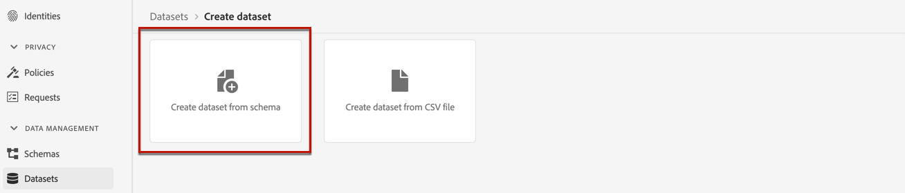

# Crear un conjunto de datos para recopilar eventos {#create-dataset}

Para recopilar eventos de experiencia, primero debe crear un conjunto de datos al que se envíen estos eventos.

Comience creando el esquema que se utilizará en el conjunto de datos:

1. Desde el **[!UICONTROL Administración de datos]** menú, seleccione **[!UICONTROL Esquema]**, vaya a la **[!UICONTROL Examinar]** y haga clic en **[!UICONTROL Crear esquema]**.

   

1. Elegir **[!UICONTROL ExperienceEvent de XDM]**.

   

   >[!NOTE]
   >
   >Obtenga más información sobre los esquemas XDM y los grupos de campos en la [Documentación de información general del sistema XDM](https://experienceleague.adobe.com/docs/experience-platform/xdm/home.html?lang=es){target="_blank"}.

1. Desde el **[!UICONTROL Grupos de campos]** en la parte izquierda, seleccione **[!UICONTROL Añadir]**.

   

1. En el **[!UICONTROL Buscar]** , escriba &quot;interacción de la propuesta&quot; y seleccione el campo **[!UICONTROL Evento de experiencia: interacciones de propuesta]** grupo de campos.

   

   >[!CAUTION]
   >
   >El esquema que se utilizará en el conjunto de datos debe tener el **[!UICONTROL Evento de experiencia: interacciones de propuesta]** grupo de campos asociado a él. De lo contrario, no podrá utilizarlo en su estrategia de clasificación.

1. Clic **[!UICONTROL Adición de grupos de campos]**.

   

   >[!NOTE]
   >El grupo de campos se conocía anteriormente como mixin.

1. Escriba un nombre y guarde el esquema.

>[!NOTE]
>
>Obtenga más información sobre la creación de esquemas en [Conceptos básicos de composición de esquemas](https://experienceleague.adobe.com/docs/experience-platform/xdm/schema/composition.html?lang=en#understanding-schemas){target="_blank"}.

Ya está listo para crear un conjunto de datos con este esquema. Para realizar esto, siga los pasos a continuación:

1. Desde el **[!UICONTROL Administración de datos]** menú, seleccione **[!UICONTROL Conjuntos de datos]**, vaya a la **[!UICONTROL Examinar]** y haga clic en **[!UICONTROL Crear conjunto de datos]**.

   

1. Seleccione **[!UICONTROL Crear conjunto de datos a partir de esquema]**.

   

1. Seleccione el esquema que acaba de crear en la lista.

   

1. Haga clic en **[!UICONTROL Siguiente]**.

1. Proporcione un nombre único para el conjunto de datos en la **[!UICONTROL Nombre]** y haga clic en **[!UICONTROL Finalizar]**.

   

>[!NOTE]
>
>Ahora se puede seleccionar este conjunto de datos para recopilar datos de evento cuando [creación de una estrategia de clasificación](#create-ranking-strategy).
