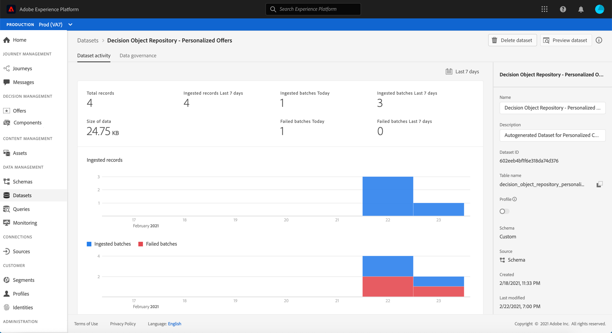

# Acceder al catálogo de ofertas exportado {#access-exported-catalog}

Se puede acceder al catálogo de ofertas exportado desde el menú Adobe Experience Platform **[!UICONTROL Datasets]** . Se crea un conjunto de datos para cada objeto de la biblioteca de ofertas.

Haga clic en un conjunto de datos para acceder a sus detalles.

El botón **[!UICONTROL Preview dataset]** le permite mostrar el lote de éxito más reciente en el conjunto de datos. El panel izquierdo proporciona información sobre los tipos de datos que se han exportado.

Para obtener más información sobre cómo examinar y utilizar conjuntos de datos, consulte [documentación de conjuntos de datos de Adobe Experience Platform](https://experienceleague.adobe.com/docs/experience-platform/catalog/datasets/user-guide.html?lang=en#getting-started).
