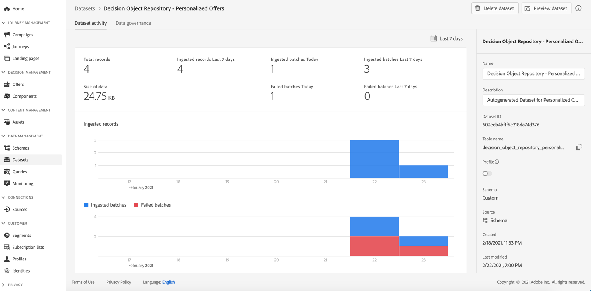

# Acceder al catálogo de ofertas exportado {#access-exported-catalog}

>[!TIP]
>
>Decisioning, la nueva funcionalidad de toma de decisiones de [!DNL Adobe Journey Optimizer], ya está disponible a través de los canales de experiencia basada en código y de correo electrónico. [Más información](../../experience-decisioning/gs-experience-decisioning.md)

Se puede acceder al catálogo de ofertas exportado desde el menú **[!UICONTROL Conjuntos de datos]** de Adobe Experience Platform. Se crea un conjunto de datos para cada objeto de la biblioteca de ofertas.

Haga clic en un conjunto de datos para acceder a sus detalles.

El botón **[!UICONTROL Vista previa del conjunto de datos]** le permite mostrar el lote exitoso más reciente en el conjunto de datos.

Para obtener más información sobre cómo examinar y utilizar conjuntos de datos, consulte [esta página](../../data/get-started-datasets.md).
