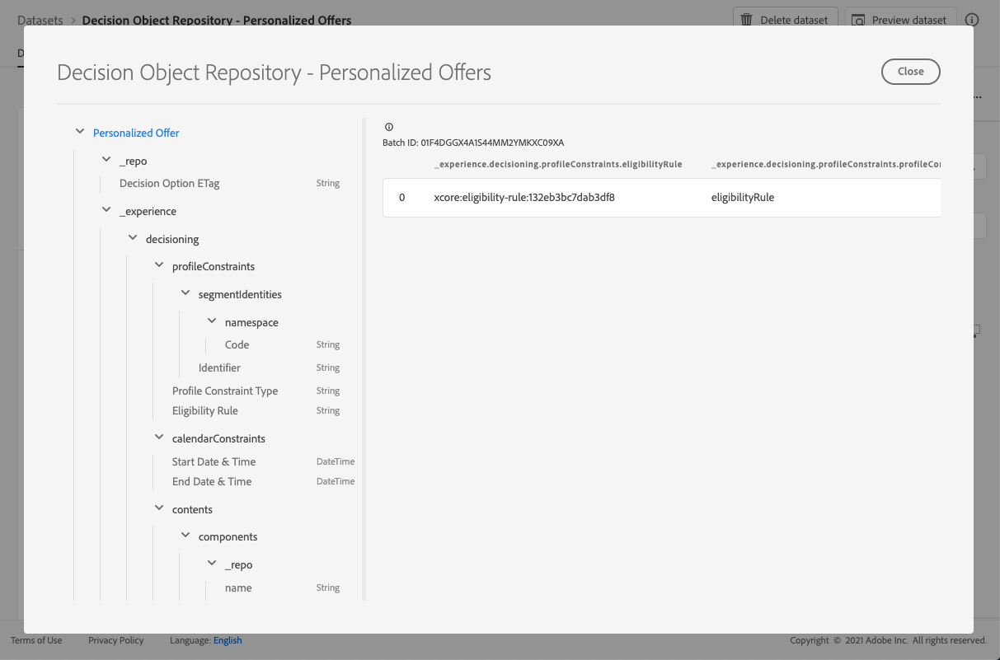

# Conjunto de datos de ofertas personalizadas {#offers-dataset}

Cada vez que se modifica una oferta, se actualiza el conjunto de datos generado automáticamente para ofertas de contenido personalizado.

El lote correcto más reciente del conjunto de datos se muestra a la derecha. La vista jerárquica del esquema para el conjunto de datos se muestra en el panel izquierdo.

>[!NOTE]
>
>Obtenga información sobre cómo acceder a los conjuntos de datos exportados para cada objeto de la biblioteca de ofertas en [esta sección](../export-catalog/access-dataset.md).

Esta es la lista de todos los campos que se pueden utilizar en el conjunto de datos **[!UICONTROL Decision Object Repository - Personalized Offers]**.

<!--Personalized offers form the set of choices for a decision. The objective for decisioning is to take a large inventory of items and apply numerous constraint rules to that inventory to narrow it down and then to rank the qualifying options according to a criteria. The resulting propositions assemble and personalize the experience for specific individuals.-->

## Identificador

**Campo:**  _id 
**Título:** Identificador 
**Descripción:**  Identificador único del registro.
**Tipo:** cadena

## _experiencia

**Campo:** _experience 
**Type:** object

### _experiencia > decisiones

**Campo:** 
**tipo de decisión:** objeto

#### _experience > decisiones > calendarConstraints

**Campo:** calendarioRestricciones 
**Título:** Detalles de restricción del calendario 
**Descripción:**  Las restricciones del calendario deciden si una opción de decisión es válida en un intervalo de fechas. Fuera de ese intervalo de fechas, no se puede proponer la opción .
**Tipo:** objeto

* **Fecha y hora de finalización**

   **Campo:** endDate
   **Título:** Fecha y hora de finalización
   **Descripción:** La fecha de finalización de la validez de las opciones de decisión. Las opciones que han pasado su fecha de finalización ya no se pueden proponer en el proceso de toma de decisiones.
   **Tipo:** cadena

* **Fecha y hora de inicio**

   **Campo:** startDate
   **Título:** Fecha y hora de inicio
   **Descripción:** La fecha de inicio de la validez de las opciones de decisión. Las opciones que aún no han alcanzado su fecha de inicio no se pueden proponer en el proceso de toma de decisiones.
   **Tipo:** cadena

#### _experiencia > decisiones > características

**Campo:** características 
**Título:** Características de la opción de decisión 
**Descripción:** Propiedades o atributos adicionales que pertenecen a esta opción de decisión en particular. Las diferentes instancias pueden tener características diferentes (claves en el mapa). Las características son pares de valor de nombre que se utilizan para distinguir una opción de decisión de otras. Las características se utilizan como valores en el contenido que representa esta opción de decisión y como características para analizar y optimizar el rendimiento de una opción. Cuando cada instancia tiene el mismo atributo o propiedad, ese aspecto debe modelarse como un esquema de extensión que se derive del detalle de la opción de decisión.
**Tipo:** objeto

#### _experience > decisioning > content

**Campo:** contenido 
**Título:** Detalles de contenido 
**Descripción:** Elementos de contenido para procesar el elemento de decisión en diferentes contextos. Una sola opción de decisión puede tener varias variantes de contenido. El contenido es información dirigida a una audiencia para su consumo en una experiencia (digital). El contenido se entrega a través de canales en una ubicación determinada.
**Tipo:** matriz

**_experience > decisioning > content > components**

**Campo:** componentes 
**Descripción:** Los componentes del contenido que representan la opción de decisión, incluidas todas sus variantes de idioma. Los componentes específicos se encuentran en &quot;dx:format&quot;, &quot;dc:subject&quot; y &quot;dc:language&quot; o en una combinación de ellos. Estos metadatos se utilizan para localizar o representar el contenido asociado a una oferta e integrarlos según el contrato de colocación.
**Tipo:** matriz 
**requerida:** &quot;_type&quot;, &quot;_dc&quot;  <!--TBC?-->

* **_experience > decisioning > content > components > Content Component Type**

   **Campo:** _type
   **Título:** Tipo de componente de contenido
   **Descripción:** Un conjunto enumerado de URIs donde cada valor se asigna a un tipo dado al componente de contenido. Algunos consumidores de las representaciones de contenido esperan que el valor @type sea una referencia al esquema que describe propiedades adicionales del componente de contenido.
   **Tipo:** cadena

* **_experience > decisioning > content > components > _dc**

   **Campo:** _dc
   **Tipo:** objeto
   **Requerido:** &quot;format&quot;

   * **Formato**

      **Campo:formato** 
      **Título:** Formato
      **Descripción:** La manifestación física o digital del recurso. Normalmente, Format debe incluir el tipo de medio del recurso. El formato puede utilizarse para determinar el software, el hardware u otro equipo necesario para visualizar o utilizar el recurso. Una práctica recomendada es seleccionar un valor de un vocabulario controlado (por ejemplo, la lista de [Internet Media Types](http://www.iana.org/assignments/media-types/) que define los formatos multimedia del equipo).
      **Tipo:** cadena
      **Ejemplo:**  &quot;application/vnd.adobe.photoshop&quot;

   * **Idioma**
      **Campo:** idioma
      **Título:** Idioma
      **Descripción:** El idioma o los idiomas del recurso. \nLos idiomas se especifican en el código de idioma tal como se define en [IETF RFC 3066](https://www.ietf.org/rfc/rfc3066.txt), que forma parte de BCP 47, que se utiliza en otras partes en XDM.
      **Tipo:** matriz
      **Ejemplos:** &quot;\n&quot;, &quot;pt-BR&quot;, &quot;es-ES&quot;

* **_experience > decisioning > content > components > _repo**

   **Campo:** _repo
   **Tipo:** objeto

   * **id**

      **Campo:** id
      **Descripción:**  Identificador único opcional para hacer referencia al recurso en un repositorio de contenido. Cuando se usan las API de plataforma para recuperar la representación, el cliente puede esperar que una propiedad adicional \&quot;repo:resolveUrl\&quot; recupere el recurso.
      **Tipo:** cadena
      **Ejemplo:** &quot;urn:aaid:sc:US:6dc33479-13ca-4b19-b25d-c805eff8a69e&quot;

   * **name**

      **Campo:** nombre
      **Descripción:** Algunas sugerencias sobre dónde localizar el repositorio que almacena el recurso externo por \&quot;repo:id\&quot;.
      **Tipo:** cadena

   * **repositoryID**

      **Campo:** repositoryID
      **Descripción:**  Identificador único opcional para hacer referencia al recurso en un repositorio de contenido. Cuando se usan las API de plataforma para recuperar la representación, el cliente puede esperar que una propiedad adicional \&quot;repo:resolveUrl\&quot; recupere el recurso.
      **Tipo:** cadena
      **Ejemplo:**  &quot;C87932A55B06F7070A49412D@AdobeOrg&quot;

   * **resolveURL**

      **Campo:** resolveURL
      **Descripción:** Un localizador de recursos único opcional para leer el recurso en un repositorio de contenido. Esto facilitará la obtención del recurso sin que el cliente entienda dónde se administra el recurso y qué API llamar. Esto es similar a un vínculo HAL, pero la semántica es más simple y tiene más propósito.
      **Tipo:** cadena
      **Ejemplo:**  &quot;https://plaftform.adobe.io/resolveByPath?path=&quot;/mycorp/content/projectx/fragment/prod/herobanners/banner14.html3&quot;&quot;

* **_experience > decisioning > content > components > content**

   **Campo:** contenido
   **Descripción:** Campo opcional para incluir contenido directamente. En lugar de hacer referencia al contenido en un repositorio de recursos, el componente puede incluir contenido simple directamente. Este campo no se utiliza para recursos de contenido compuesto, complejo y binario.
   **Tipo:** cadena

* **_experience > decisioning > content > components > deliveryURL**

   **Campo:** deliveryURL
   **Descripción:** Un localizador de recursos único opcional para obtener el recurso de una red de entrega de contenido o de un extremo de servicio. Esta URL la utiliza un agente de usuario para acceder al recurso públicamente.
   **Tipo:** cadena
   **Ejemplo:**  &quot;https://cdn.adobe.io/content/projectx/fragment/prod/static/1232324wd32.jpeg&quot;

* **_experience > decisioning > content > components > linkURL**

   **Campo:** linkURL
   **Descripción:** Un localizador de recursos único opcional para las interacciones del usuario. Esta URL se utiliza para remitir al usuario final a en un agente de usuario y se puede realizar un seguimiento.
   **Tipo:** cadena
   **Ejemplo:**  &quot;https://cdn.adobe.io/tracker?code=23432&amp;redirect=/content/projectx/fragment/prod/static/1232324wd32.jpeg&quot;

**_experience > decisioning > content > Placement**

**Campo:** 
**Título de ubicación:** 
**Descripción de ubicación:** Colocación para cumplir. El valor es el URI (@id) de la ubicación de la oferta a la que se hace referencia. Consulte esquema https://ns.adobe.com/experience/decisioning/placement.
**Tipo:** cadena

#### _experience > decisiones > Estado del ciclo vital

**Campo:** lifecycleStatus 
**Título:** Estado del ciclo vital 
**Descripción:**  El estado del ciclo vital permite que los flujos de trabajo se lleven a cabo con un objeto. El estado puede afectar a los lugares en los que un objeto es visible o se considera relevante. Los cambios de estado los realizan los clientes o servicios que utilizan los objetos.
**Tipo:** cadena 
**Valores posibles:** &quot;Borrador&quot; (predeterminado), &quot;Aprobado&quot;, &quot;Activo&quot;, &quot;Completado&quot;, &quot;Archivado&quot;

#### _experience > decisioning > Nombre de la opción de decisión

**Campo:** nombre 
**Título:** Nombre de opción de decisión 
**Descripción:** Nombre de opción que se muestra en varias interfaces de usuario.
**Tipo:** cadena

#### _experience > decisiones > profileConstraints

**Campo:** profileConstraints 
**Título:** Detalles de restricción de perfil 
**Descripción:**  Las restricciones de perfil deciden si una opción es apta para esta identidad de perfil, en este momento, en este contexto. Si la restricción de perfil no necesita tener en cuenta los valores de cada una de las opciones, es decir, no tiene en cuenta las opciones de la selección de opciones, la restricción de perfil que se evalúa como &quot;false&quot; cancela toda la selección de opciones. Por otro lado, se evalúa una regla de restricción de perfil que toma una opción como parámetro para cada opción de calificación de la selección de opciones.
**Tipo:** objeto

**_experience > decisiones > profileConstraints > Descripción**

**Campo:** descripción 
**Título:** Descripción 
**Descripción:** Descripción de restricción de perfil. Se utiliza para transmitir intenciones legibles sobre cómo o por qué se construyó esta restricción de perfil y/o qué opción incluirá o excluirá.
**Tipo:** cadena

**_experience > decisiones > profileConstraints > Regla de elegibilidad**

**Campo:** título de regla de idoneidad:
**** descripción de regla de idoneidad:
****  referencia a una regla de decisión que se evalúa como true o false para un perfil determinado u otros objetos XDM contextuales dados. La regla se utiliza para decidir si la opción cumple los requisitos de un perfil determinado. El valor es el URI (@id) de la regla de decisión a la que se hace referencia. Consulte esquema https://ns.adobe.com/experience/decisioning/rule.
**Tipo:** cadena

**_experience > decisioning > profileConstraints > Tipo de restricción de perfil**

**Campo:** profileConstraintType 
**Título:** Tipo de restricción de perfil 
**Descripción:**  Determina si hay restricciones establecidas actualmente y cómo se expresan las restricciones. Podría ser a través de una regla o a través de una o más suscripciones a segmentos.
**Tipo:** cadena 
**Valores posibles:**
* &quot;none&quot; (predeterminado)
* &quot;eligibilityRule&quot;: &quot;La restricción de perfil se expresa como una regla única que debe evaluarse como verdadera antes de permitir la acción restringida.&quot;
* &quot;anySegments&quot;: &quot;La restricción de perfil se expresa como uno o más segmentos y el perfil debe ser miembro de al menos uno de ellos antes de permitir la acción restringida.&quot;
* &quot;allSegments&quot;: &quot;La restricción de perfil se expresa como uno o más segmentos y el perfil debe ser miembro de todos ellos antes de permitir la acción restringida.&quot;
* &quot;reglas&quot;: &quot;La restricción de perfil se expresa como una serie de reglas diferentes, por ejemplo, idoneidad, aplicabilidad, idoneidad, que todos deben evaluar como true antes de permitir la acción restringida.&quot;

**_experience > decisiones > profileConstraints > Identificadores de segmentos**

**Campo:** segmentIdentities 
**Título:** Identificadores de segmento 
**Descripción:** Identificadores del 
**tipo de segmento:** matriz

* **Identificador**

   **Campo:** _id
   **Título:** Identificador
   **Descripción:** Identidad del segmento en el área de nombres relacionada.
   **Tipo:** cadena

* **Área de nombres**

   **Campo:** área de nombres
   **Título:** Área de nombres
   **Descripción:** El área de nombres asociado al  `xid` atributo.
   **Tipo:** objeto
   **Requerido:** &quot;code&quot;

   * **Código**

      **Campo:** código
      **Título:** Código
      **Descripción:** El código es un identificador legible por el ser humano para el espacio de nombres y se puede utilizar para solicitar el id de espacio de nombres técnico que se utiliza para el procesamiento de gráficos de identidad.
      **Tipo:** cadena

* **Identificador de experiencia**

   **Campo:** xid
   **Título:** Identificador de experiencia
   **Descripción:** Cuando está presente, este valor representa un identificador de área de nombres cruzada que es único en todos los identificadores de área de nombres en todos los espacios de nombres.
   **Tipo:** cadena

#### _experiencia > decisiones > clasificación

**Campo:** clasificación 
**Título:** Detalles de clasificación 
**Descripción:** Clasificación (prioridad). Define lo que se considera la \&quot;mejor acción\&quot; dado el contexto del criterio de decisión. Entre todas las opciones seleccionadas que cumplan la restricción de elegibilidad, el orden de clasificación decidirá las opciones superiores (o superiores N) que se propongan.
**Tipo:** objeto

**_experience > decisioning > ranking > Evaluación de pedidos**

**Campo:** 
**Título de pedido:** Evaluación de pedido 
**Descripción:** Evaluación de un orden relativo de una o más opciones de decisión. Las opciones con valores de ordinal más altos se seleccionan sobre cualquier opción con valores de ordinal más bajos. Los valores determinados por este método se pueden ordenar, pero no se pueden medir las distancias entre ellos ni se pueden calcular sumas ni productos. La mediana y el modo son las únicas medidas de tendencia central que pueden utilizarse para los datos ordinales.
**Tipo:** objeto

* **Función de puntuación**

   **Campo: función** 
   **Título:** Función de puntuación
   **Descripción:** Referencia a una función que calcula una puntuación numérica para esta opción de decisión. Las opciones de decisión se ordenarán (clasificarán) según esa puntuación. El valor de esta propiedad es el URI (@id) de la función que se va a invocar con la opción on a la vez. Consulte esquema https://ns.adobe.com/experience/decisioning/function.
   **Tipo:** cadena

* **Tipo de evaluación de pedido**

   **Campo:** orderEvaluationType
   **Título:** Tipo de evaluación de pedido
   **Descripción:** Especifica qué mecanismo de evaluación de pedidos se utiliza, prioridad estática de las opciones de decisión, función de puntuación que calcula un valor numérico para cada opción o estrategia de clasificación que recibe una lista para solicitarla.
   **Tipo:** cadena
   **Valores posibles:** &quot;static&quot;, &quot;scoringFunction&quot;, &quot;rankingStrategy&quot;

* **Estrategia de clasificación**

   **Campo:** rankingStrategy
   **Título:** Estrategia de clasificación
   **Descripción:** Referencia a una estrategia que clasifica una lista de opciones de decisión. Las opciones de decisión se devolverán en una lista ordenada. El valor de esta propiedad es el URI (@id) de la función que se va a invocar con la opción on a la vez. Consulte esquema https://ns.adobe.com/experience/decisioning/rankingStrategy.
   **Tipo:** cadena

**_experience > decisiones > clasificación > Prioridad**

**Campo:** prioridad 
**Título:** Prioridad 
**Descripción:** La prioridad de una opción de decisión única en relación con el resto de opciones. Las opciones para las que no se ha dado ninguna función de orden se priorizan usando esta propiedad. Las opciones con valores de prioridad más altos se seleccionan antes que las opciones con prioridad más baja. Si dos o más opciones cualificadas comparten el valor de prioridad más alto, se elige uno de forma aleatoria uniforme y se utiliza para la propuesta de decisión.
**Tipo:** entero 
**Valor mínimo:** 0 
**Valor predeterminado:** 0

#### _experience > decisiones > etiquetas

**Campo:** etiquetas 
**Título:** Etiquetas 
**Descripción:** El conjunto de etiquetas asociadas a esta entidad. Las etiquetas se utilizan en expresiones de filtro para restringir el inventario general a un subconjunto (categoría).
**Tipo:** matriz

<!--Field without name under tags: Description: An identifier of a tag object. The value is the @id of the tag that is referenced. See tag schema: https://ns.adobe.com/experience/decisioning/tag. Type: string-->

## _repo

**Campo:** _repo 
**Tipo:** objeto

### _repo > Opción de decisión ETag

**Campo:** Etiqueta 
**Título:** Opción de decisión ETag 
**Descripción:**  La revisión en la que se encontraba el objeto de opción de decisión cuando se tomó la instantánea.
**Tipo:** cadena

