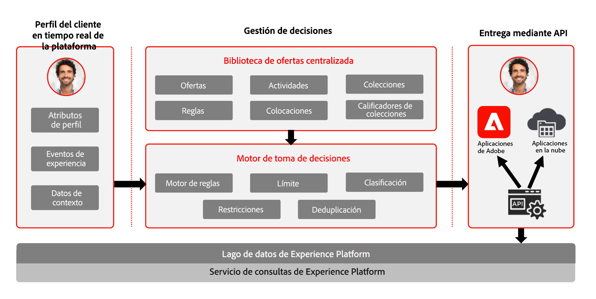
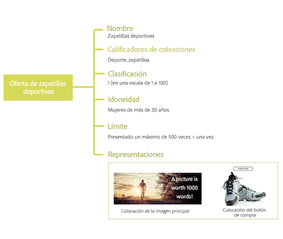

# Acerca de la gestión de decisiones {#about-decision-management}

Uso [!DNL Journey Optimizer] para ofrecer la mejor oferta y experiencia a sus clientes en todos los puntos de contacto en el momento adecuado. Una vez diseñadas, las audiencias se segmentarán con ofertas personalizadas.

La administración de decisiones facilita la personalización con una biblioteca central de ofertas de marketing y un motor de decisión que aplica reglas y restricciones a perfiles enriquecidos y en tiempo real creados por Adobe Experience Platform para ayudarle a enviar a sus clientes la oferta correcta en el momento adecuado.

La capacidad de gestión de decisiones consta de dos componentes principales:

* La variable **Biblioteca de ofertas centralizada** que es la interfaz en la que se crean y administran los distintos elementos que componen las ofertas y se definen sus reglas y restricciones.
* La variable **Motor de decisión de oferta** que aprovecha los datos de Adobe Experience Platform y los perfiles de cliente en tiempo real, junto con la biblioteca de ofertas, para seleccionar el momento, los clientes y los canales adecuados a los que se enviarán las ofertas.

Los beneficios incluyen:

* Se ha mejorado el rendimiento de las campañas al ofrecer ofertas personalizadas en varios canales,
* Flujos de trabajo mejorados: en lugar de crear varias entregas o campañas, los equipos de marketing pueden mejorar los flujos de trabajo creando una única entrega y variar las ofertas en diferentes partes de la plantilla,
* Controle la cantidad de veces que se muestra una oferta entre campañas y clientes.

➡️ [Obtenga más información sobre la administración de decisiones en estos vídeos](#video)

>[!NOTE]
>
>Si es [Adobe Experience Platform](https://experienceleague.adobe.com/docs/experience-platform/landing/home.html){target=&quot;_blank&quot;} usuario que aprovecha el **Offer Decisioning** servicio de aplicación, se le aplicarán todas las funciones de Administración de decisiones descritas en esta sección.

## Acerca de las ofertas y las decisiones {#about-offers-and-decisions}

Un **Oferta** está formado por contenido, reglas de idoneidad y restricciones que definen las condiciones en las que se presentan a los clientes.

Se crea utilizando la variable **Biblioteca de ofertas**, que proporciona un catálogo de ofertas central donde puede asociar reglas de aceptación y restricciones con varios fragmentos de contenido para crear y publicar ofertas (consulte [Interfaz de usuario de la Biblioteca de ofertas](../get-started/user-interface.md)).

Una vez que la Biblioteca de ofertas se haya enriquecido con las ofertas, puede integrar las ofertas en **decisiones**.

Las decisiones son contenedores para sus ofertas que aprovechan el motor de decisión de ofertas para elegir la mejor oferta que se debe entregar según el objetivo de la entrega.

## Casos de uso comunes {#common-use-cases}

Las funciones de administración de decisiones y la integración con Adobe Experience Platform le permiten cubrir numerosos casos de uso para ayudarle a aumentar la participación y la conversión de los clientes.

* Se muestran en las ofertas de página de inicio del sitio web que coincidirán con el punto de interés del cliente visitante, según los datos de Adobe Experience Platform.

   

* Si los clientes se acercan a una de las tiendas, envíeles notificaciones push recordándoles las ofertas disponibles según sus atributos (nivel de lealtad, sexo, compras anteriores...).

   

* La administración de decisiones también le ayuda a mejorar la experiencia de sus clientes al ponerse en contacto con su equipo de asistencia. Las API de administración de decisiones le permiten mostrar en el portal de los agentes del centro de llamadas información sobre las mejores ofertas y las ofertas canjeadas del cliente.

   

## Concesión de acceso a Administración de decisiones {#granting-acess-to-decision-management}

Los permisos para acceder y utilizar las capacidades de toma de decisiones se administran mediante la variable [Adobe Admin Console](https://helpx.adobe.com/enterprise/managing/user-guide.html){target=&quot;_blank&quot;}.

Para conceder acceso a la funcionalidad de Administración de decisiones, debe crear una **[!UICONTROL Product profile]** y asigne los permisos correspondientes a sus usuarios. Más información sobre la administración [!DNL Journey Optimizer] usuarios y permisos en [esta sección](../../administration/permissions.md).

Los permisos específicos de Administración de decisiones se enumeran en [esta sección](../../administration/high-low-permissions.md#decisions-permissions).

## Glosario {#glossary}

A continuación se muestra la lista de los conceptos principales con los que trabajará al utilizar la gestión de decisiones.

* **Restricción** o **Restricción de frecuencia**: La restricción se utiliza como restricción para definir cuántas veces se presenta una oferta. Existen dos tipos de límites, la cantidad de veces que se puede proponer una oferta en la audiencia de destino combinada, también conocida como &quot;límites totales&quot; y la cantidad de veces que se puede proponer una oferta al mismo usuario final, también conocida como &quot;límite de perfil&quot;.

* **Colecciones**: Las colecciones son subconjuntos de ofertas basados en condiciones predefinidas definidas definidas por un especialista en marketing, como la categoría de la oferta.

* **Decisión**: Una decisión contiene la lógica que indica la selección de una oferta.

* **Regla de decisión**: Las reglas de decisión son restricciones agregadas a una oferta personalizada y aplicadas a un perfil para determinar la idoneidad.

* **Oferta apta**: Una oferta apta cumple las restricciones definidas por adelantado que se pueden ofrecer de forma coherente a un perfil.

* **Administración de decisiones**: Permite crear y ofrecer experiencias de oferta personalizadas del usuario final en varios canales y aplicaciones mediante la lógica empresarial y las reglas de decisión.

* **Ofertas de reserva**: Una oferta de reserva es la oferta predeterminada que se muestra cuando un usuario final no es apto para ninguna de las ofertas personalizadas de la colección.

* **Oferta**: Una oferta es un mensaje de marketing que puede tener reglas asociadas que especifican quién puede ver la oferta.

* **Biblioteca de ofertas**: La biblioteca de ofertas es una biblioteca central que se utiliza para administrar ofertas, reglas de decisión y decisiones personalizadas y de reserva.

* **Ofertas personalizadas**: Una oferta personalizada es un mensaje de marketing personalizable basado en reglas y restricciones de idoneidad.

* **Ubicaciones**: Una ubicación es la ubicación o el contexto en el que aparece una oferta para un usuario final.

* **Prioridad**: La prioridad se utiliza para clasificar las ofertas que cumplen todas las restricciones, como la idoneidad, el calendario y el límite.

* **Representaciones**: Una representación es la información que utiliza un canal, como la ubicación o el idioma para mostrar una oferta.

## Vídeos explicativos{#video}

>[!NOTE]
>
>Estos vídeos se aplican al servicio de aplicaciones Offer Decisioning creado en Adobe Experience Platform y no son específicos de [!DNL Adobe Journey Optimizer]. No obstante, proporcionan directrices genéricas para utilizar la gestión de decisiones en el contexto de [!DNL Journey Optimizer].

### ¿Qué es la gestión de decisiones? {#what-is-offer-decisioning}

El siguiente vídeo proporciona una introducción a las funciones clave de Administración de decisiones, arquitectura y casos de uso:

>[!VIDEO](https://video.tv.adobe.com/v/326961?quality=12&learn=on)

### Defina y administre ofertas {#use-offer-decisioning}

El siguiente vídeo muestra cómo utilizar Administración de decisiones para definir y administrar sus ofertas y aprovechar los datos de clientes en tiempo real.

>[!VIDEO](https://video.tv.adobe.com/v/326841?quality=12&learn=on)

