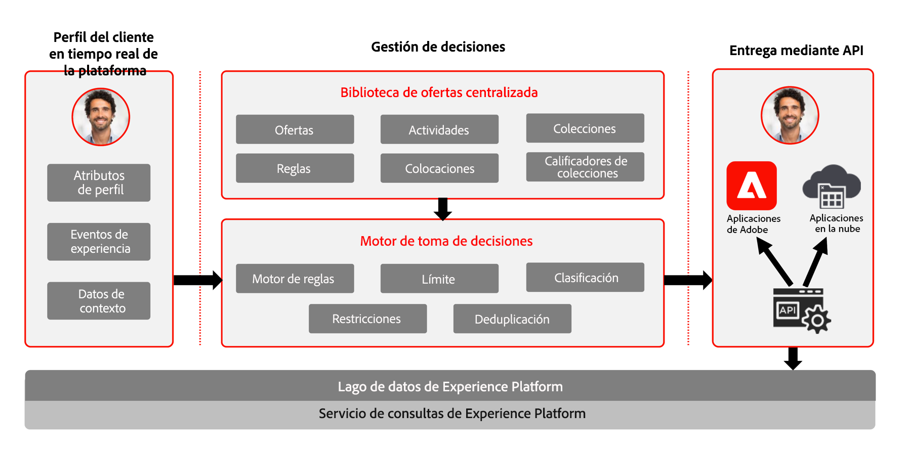
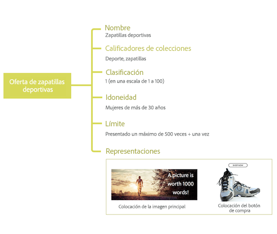
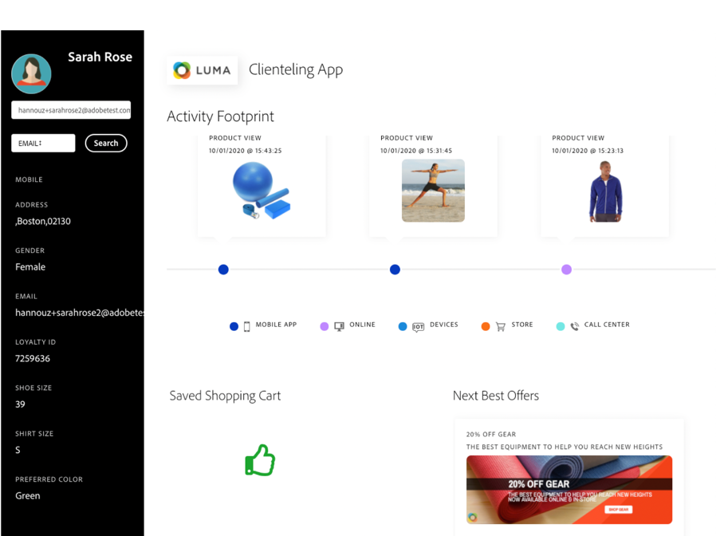

# Introducción a la gestión de decisiones {#about-decision-management}

Utilice [!DNL Journey Optimizer] para ofrecer la mejor oferta y experiencia a sus clientes en todos los puntos de contacto y en el momento adecuado. Una vez diseñados, los públicos se segmentarán con ofertas personalizadas.

La administración de decisiones facilita la personalización con una biblioteca central de ofertas de marketing y un motor de decisión que aplica reglas y restricciones a perfiles enriquecidos en tiempo real creados por Adobe Experience Platform para ayudarle a enviarles a sus clientes la oferta correcta en el momento adecuado.

La capacidad Gestión de decisiones consta de dos componentes principales:

* La **Biblioteca de ofertas centralizada** es la interfaz en la que se crean y administran los diferentes elementos que componen las ofertas y se definen sus reglas y restricciones.
* El **Motor de decisión de ofertas** aprovecha los datos de Adobe Experience Platform y los perfiles del cliente en tiempo real, junto con la Biblioteca de ofertas, para seleccionar el momento, los clientes y los canales adecuados a los que se enviarán las ofertas.

Los beneficios incluyen:

* Se ha mejorado el rendimiento de las campañas al ofrecer ofertas personalizadas en varios canales,
* Flujos de trabajo mejorados: En lugar de crear varios envíos o campañas, los equipos de marketing pueden mejorar los flujos de trabajo creando un único envío y variar las ofertas en diferentes partes de la plantilla,
* Controle la cantidad de veces que se muestra una oferta entre campañas y clientes.

➡️ [Obtenga más información sobre la gestión de decisiones en estos vídeos](#video)

>[!NOTE]
>
>Si es un usuario de [Adobe Experience Platform](https://experienceleague.adobe.com/docs/experience-platform/landing/home.html?lang=es){target="_blank"} que aprovecha la aplicación **Offer Decisioning**, también puede utilizar todas las funciones de gestión de decisiones que se describen en esta sección.

## Acerca de las ofertas y las decisiones {#about-offers-and-decisions}

Una **oferta** está formada por contenido, reglas de elegibilidad y restricciones que definen las condiciones en las que se presenta a sus clientes.

Se crea mediante la **Biblioteca de ofertas**, que proporciona un catálogo de ofertas central donde puede asociar reglas de elegibilidad y restricciones con varios fragmentos de contenido para crear y publicar ofertas (consulte la [interfaz de usuario de la Biblioteca de ofertas](../get-started/user-interface.md)).

Una vez que la Biblioteca de ofertas se haya enriquecido con ofertas, puede integrar las ofertas en **decisiones**.

Las decisiones son contenedores para sus ofertas que aprovecharán el motor de decisión de ofertas para elegir la mejor y ofrecerla según el destinatario de la entrega.

## Casos de uso comunes {#common-use-cases}

Las funciones y la integración de Gestión de decisiones con Adobe Experience Platform le permiten cubrir numerosos casos de uso para ayudarle a aumentar la participación y la conversión de los clientes.

* Muestre ofertas en la página de inicio del sitio web que coincidan con el punto de interés del cliente visitante según los datos de Adobe Experience Platform.

  

* Si los clientes se acercan a una de las tiendas, envíeles notificaciones push recordándoles las ofertas disponibles según sus atributos (nivel de lealtad, género, compras anteriores...).

  

* Gestión de decisiones también le ayuda a mejorar la experiencia de sus clientes al ponerse en contacto con su equipo de asistencia. Las API de Gestión de decisiones permiten mostrar en el portal de los agentes del centro de llamadas información acerca de las mejores ofertas y las ofertas canjeadas del cliente.

  

## Concesión de acceso a la gestión de decisiones {#granting-acess-to-decision-management}

Los permisos para acceder y utilizar las funcionalidades de toma de decisiones solo se administran mediante [Adobe Admin Console](https://helpx.adobe.com/es/enterprise/managing/user-guide.html){target="_blank"}.

Para conceder acceso a la funcionalidad de Gestión de decisiones, debe crear un **[!UICONTROL Perfil de producto]** y asignar los permisos correspondientes a sus usuarios. Más información sobre la administración de usuarios y permisos de [!DNL Journey Optimizer] en [esta sección](../../administration/permissions.md).

Los permisos específicos de Gestión de decisiones se enumeran en [esta sección](../../administration/high-low-permissions.md#decisions-permissions).

## Glosario {#glossary}

A continuación, se muestra la lista de los conceptos principales con los que trabajará al utilizar la gestión de decisiones.

* **Límite** o **Restricción de frecuencia**: el límite se utiliza como restricción para definir cuántas veces se presenta una oferta. Existen dos tipos de límite: el número de veces que se puede proponer una oferta al público destinatario combinado, también conocida como “Límites totales”, y el número de veces que se puede proponer una oferta al mismo usuario final, también conocida como “Límite de perfil”.

* **Colecciones**: las colecciones son subconjuntos de ofertas basados en condiciones predefinidas establecidas por un experto en marketing, como la categoría de la oferta.

* **Decisión**: una decisión contiene la lógica que indica la selección de una oferta.

* **Regla de decisión**: las reglas de decisión son restricciones añadidas a una oferta personalizada y aplicadas a un perfil para determinar la idoneidad.

* **Oferta elegible**: una oferta elegible cumple con las restricciones definidas por adelantado que pueden ofrecerse de forma coherente a un perfil.

* **Gestión de decisiones**: Permite crear y ofrecer experiencias de oferta personalizadas para el usuario final en varios canales y aplicaciones mediante la lógica empresarial y las reglas de decisión.

* **Ofertas de reserva**: una oferta de reserva es la oferta predeterminada que se muestra cuando un usuario final no cumple los requisitos para ninguna de las ofertas personalizadas de la colección.

* **Oferta**: una oferta es un mensaje de marketing que puede tener reglas asociadas que especifican quién puede ver la oferta.

* **Biblioteca de ofertas**: La biblioteca de ofertas es una biblioteca central que se utiliza para administrar ofertas de reserva y personalizadas, reglas de decisión y decisiones.

* **Ofertas personalizadas**: una oferta personalizada es un mensaje de marketing personalizable basado en reglas de elegibilidad y restricciones.

* **Ubicaciones**: una ubicación es la ubicación o el contexto en el que aparece una oferta para un usuario final.

* **Prioridad**: la prioridad se utiliza para clasificar ofertas que cumplen todas las restricciones, como idoneidad, calendario y límite.

* **Representaciones**: una representación es información utilizada por un canal, como la ubicación o el idioma para mostrar una oferta.

## Vídeotutoriales{#video}

### ¿Qué es la gestión de decisiones? {#what-is-offer-decisioning}

El siguiente vídeo proporciona una introducción a las funciones clave, la arquitectura y los casos de uso de Gestión de decisiones:

>[!VIDEO](https://video.tv.adobe.com/v/340419?captions=spa&quality=12&learn=on)

### Definición y administración de ofertas {#use-offer-decisioning}

El siguiente vídeo muestra cómo utilizar Gestión de decisiones para definir y administrar sus ofertas, así como para aprovechar los datos de clientes en tiempo real.

>[!VIDEO](https://video.tv.adobe.com/v/340359?captions=spa&quality=12&learn=on)

