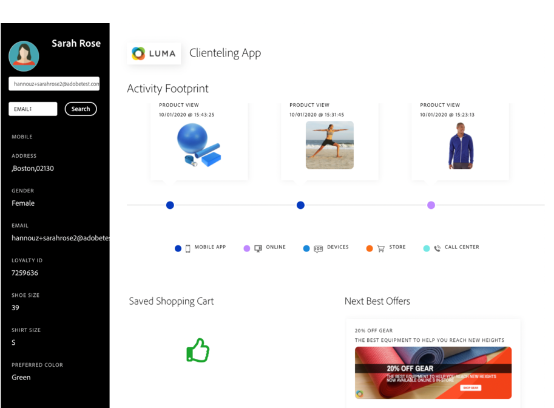

# Acerca de Administración de decisiones {#about-offer-decision}

Utilice [!DNL Journey Optimizer] para ofrecer la mejor oferta y experiencia a sus clientes en todos los puntos de contacto y en el momento adecuado. Una vez diseñadas, las audiencias se segmentarán con ofertas personalizadas.

La capacidad Administración de decisiones consta de dos componentes principales:

* La **Biblioteca de ofertas centralizada** es la interfaz en la que se crean y administran los diferentes elementos que componen las ofertas y se definen sus reglas y restricciones.
* El **Motor de decisión de ofertas** aprovecha los datos de Adobe Experience Platform y los perfiles del cliente en tiempo real, junto con la Biblioteca de ofertas, para seleccionar el momento, los clientes y los canales adecuados a los que se enviarán las ofertas.

Los beneficios incluyen:

* Se ha mejorado el rendimiento de las campañas al ofrecer ofertas personalizadas en varios canales,
* Flujos de trabajo mejorados: En lugar de crear varios envíos o campañas, los equipos de marketing pueden mejorar los flujos de trabajo creando un único envío y variar las ofertas en diferentes partes de la plantilla,
* Controle la cantidad de veces que se muestra una oferta entre campañas y clientes.

➡️ [Vea estos tutoriales en vídeo](#tutorial-videos) para obtener más información sobre Administración de decisiones.

## Acerca de las ofertas y las decisiones {#offers-offer-activities}

Una **oferta** está formada por contenido, reglas de elegibilidad y restricciones que definen las condiciones en las que se presenta a sus clientes.

Se crea mediante la **Biblioteca de ofertas**, que proporciona un catálogo de ofertas central donde puede asociar reglas de elegibilidad y restricciones con varios fragmentos de contenido para crear y publicar ofertas (consulte la [interfaz de usuario de la Biblioteca de ofertas](../get-started/user-interface.md)).

Una vez que la Biblioteca de ofertas se haya enriquecido con ofertas, puede integrarlas en **decisiones** (antes llamadas “actividades de oferta”).

Las decisiones son contenedores para sus ofertas que aprovecharán el motor de decisión de ofertas para elegir la mejor y ofrecerla según el objetivo de la entrega.

## Casos de uso comunes

Las funciones y la integración de Administración de decisiones con Adobe Experience Platform le permiten cubrir numerosos casos de uso para ayudarle a aumentar la participación y la conversión de los clientes.

* Muestre ofertas en la página de inicio del sitio web que coincidan con el punto de interés del cliente visitante según los datos de Adobe Experience Platform.

   

* Si los clientes se acercan a una de las tiendas, envíeles notificaciones push recordándoles las ofertas disponibles según sus atributos (nivel de lealtad, sexo, compras anteriores...).

   

* Administración de decisiones también le ayuda a mejorar la experiencia de sus clientes al ponerse en contacto con su equipo de asistencia. Las API de Administración de decisiones permiten mostrar en el portal de los agentes del centro de llamadas información acerca de las mejores ofertas y las ofertas canjeadas del cliente.

   

## Glosario {#glossary}

A continuación, se muestra la lista de los conceptos principales con los que trabajará al utilizar la gestión de decisiones.

* **Límite** o **Restricción de frecuencia**: el límite se utiliza como restricción para definir cuántas veces se presenta una oferta. Existen dos tipos de límite: la cantidad de veces que se puede proponer una oferta en la audiencia de destinatario combinada, también conocida como &quot;Límites totales&quot; y la cantidad de veces que se puede proponer una oferta al mismo usuario final, también conocida como &quot;Límite de perfil&quot;.

* **Colecciones**: las colecciones son subconjuntos de ofertas basados en condiciones predefinidas definidas por un experto en marketing, como la categoría de la oferta.

* **Decisión** (anteriormente conocida como Actividad de oferta): Una decisión contiene la lógica que indica la selección de una oferta.

* **Regla de decisión**: las reglas de decisión son restricciones agregadas a una oferta personalizada y aplicadas a un perfil para determinar la elegibilidad.

* **Oferta elegible**: una oferta elegible cumple con las restricciones definidas por adelantado que pueden ofrecerse de forma coherente a un perfil.

* **Administración de decisiones**: Permite crear y ofrecer experiencias de oferta personalizadas para el usuario final en varios canales y aplicaciones mediante la lógica empresarial y las reglas de decisión.

* **Ofertas de reserva**: una oferta de reserva es la oferta predeterminada que se muestra cuando un usuario final no cumple los requisitos para ninguna de las ofertas personalizadas de la colección.

* **Oferta**: una oferta es un mensaje de marketing que puede tener reglas asociadas que especifican quién puede ver la oferta.

* **Biblioteca de ofertas**: La biblioteca de ofertas es una biblioteca central que se utiliza para administrar ofertas de reserva y personalizadas, reglas de decisión y decisiones.

* **Ofertas personalizadas**: una oferta personalizada es un mensaje de marketing personalizable basado en reglas de elegibilidad y restricciones.

* **Ubicaciones**: una ubicación es la ubicación o el contexto en el que aparece una oferta para un usuario final.

* **Prioridad**: la prioridad se utiliza para clasificar ofertas que cumplen todas las restricciones, como elegibilidad, calendario y límite.

* **Representaciones**: una representación es la información que usa un canal, como la ubicación o el idioma para mostrar una oferta.

## Tutoriales en vídeo {#tutorial-videos}

>[!NOTE]
>
>Estos vídeos se aplican al servicio de aplicaciones de Offer Decisioning creado en Adobe Experience Platform y no son específicos de [!DNL Adobe Journey Optimizer]. Sin embargo, proporciona una guía genérica para utilizar Administración de decisiones en el contexto de [!DNL Journey Optimizer].

### ¿Qué es Administración de decisiones? {#what-is-offer-decisioning}

El siguiente vídeo proporciona una introducción a las funciones clave, la arquitectura y los casos de uso de Administración de decisiones:

>[!VIDEO](https://video.tv.adobe.com/v/326961?quality=12&learn=on)

### Definición y administración de ofertas {#use-offer-decisioning}

El siguiente vídeo muestra cómo utilizar Administración de decisiones para definir y administrar sus ofertas, así como para aprovechar los datos de clientes en tiempo real.

>[!VIDEO](https://video.tv.adobe.com/v/326841?quality=12&learn=on)
