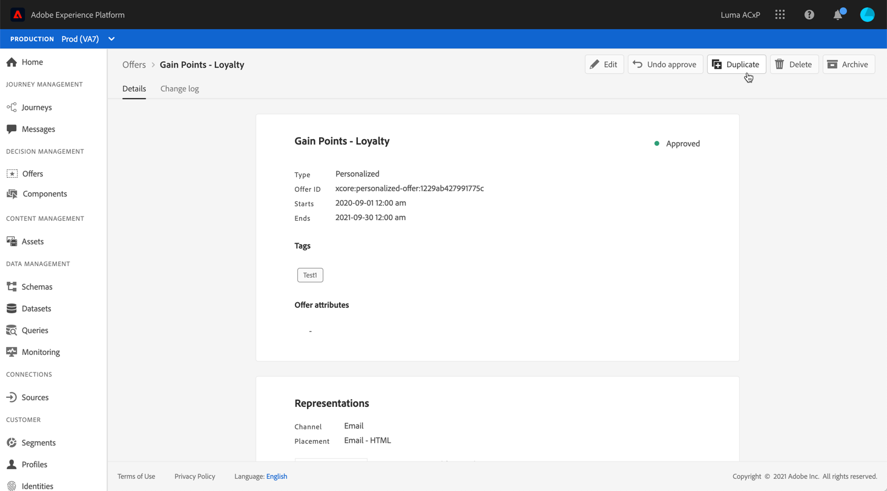

# Interfaz de usuario {#user-interface}

La biblioteca de ofertas permite crear y administrar sus ubicaciones y ofertas en un solo lugar, así como acceder a todas las decisiones creadas (anteriormente conocidas como actividades de oferta).

>[!NOTE]
>
>Si tiene problemas para acceder a la Biblioteca de ofertas o a algunas de sus funciones, compruebe con un usuario administrador que se le han concedido los derechos necesarios. Consulte [Concesión de acceso a Administración de decisiones](starting-offer-decisioning.md#granting-acess-to-decision-management).

Utilice el menú **[!UICONTROL Offers]** para administrar ofertas personalizadas y de reserva, organizarlas en colecciones y entregarlas creando decisiones:

* **[!UICONTROL Overview]**: Nuevo en [!DNL Offer Decisioning]? Siga los pasos que aparecen en la pantalla para empezar a configurar ubicaciones, ofertas y colecciones. Cuando ya esté familiarizado con [!DNL Offer Decisioning], obtenga información general sobre las ofertas, colecciones y decisiones más recientes. Consulte [Información general](#overview).

* **[!UICONTROL Offers]**: Acceda a sus ofertas personalizadas y de reserva o cree otras nuevas. Consulte [Creación de una oferta](../offer-library/creating-personalized-offers.md) y [Creación de una oferta de reserva](../offer-library/creating-fallback-offers.md).

* **[!UICONTROL Collections]**: Cree y administre colecciones de ofertas estáticas y dinámicas. Consulte [Acerca de las colecciones de ofertas](../offer-library/creating-collections.md).

* **[!UICONTROL Decisions]**: Cree y administre decisiones para entregar sus ofertas. Consulte [Creación de decisiones](../offer-activities/create-offer-activities.md).

Utilice el menú **[!UICONTROL Components]** para administrar los componentes necesarios para crear ofertas:

* **[!UICONTROL Placements]**: Cree y administre ubicaciones en las que se mostrarán sus ofertas. Consulte [Creación de ubicaciones](../offer-library/creating-placements.md).

* **[!UICONTROL Tags]**: Cree y administre etiquetas para organizar y filtrar sus ofertas. Consulte [Creación de etiquetas](../offer-library/creating-tags.md).

* **[!UICONTROL Rules]**: Administre las condiciones en las que se presentan las ofertas. Consulte [Creación de una regla de decisión](../offer-library/creating-decision-rules.md).

* **[!UICONTROL Rankings]**: Cree y administre fórmulas de clasificación para determinar qué oferta se debe presentar primero para una ubicación determinada. Consulte [Creación de fórmulas de clasificación](../offer-library/create-ranking-formulas.md).

## Información general {#overview}

Cuando es nuevo en [!DNL Offer Decisioning], el **[!UICONTROL Overview]** le guía a través de los pasos principales necesarios para empezar a crear su primera decisión de oferta.

Siga los pasos que aparecen en la pantalla para empezar a crear ubicaciones, ofertas y colecciones.

Una vez que haya completado estos primeros pasos, se le pedirá que cree decisiones de oferta (anteriormente conocidas como actividades de oferta).

>[!NOTE]
>
>Los pasos principales para crear ofertas y utilizarlas en una decisión se presentan en [esta sección](../offer-library/key-steps.md).

Cuando esté más familiarizado con [!DNL Offer Decisioning] y ya ha creado al menos una decisión de oferta, la variable **[!UICONTROL Overview]** muestra las ofertas, colecciones y decisiones más recientes.

Haga clic en una oferta o en una decisión para acceder directamente a los detalles del elemento seleccionado.

Haga clic en el **[!UICONTROL View all]** para acceder a las listas de ofertas, colecciones o decisiones.

## Búsqueda y filtrado de información {#search-and-filter-information}

Utilice la **barra de búsqueda** para encontrar un elemento específico.

También se puede acceder a **Filtros** haciendo clic en el icono de filtro en la parte superior izquierda de la lista. Permite filtrar los elementos mostrados según diferentes criterios. Por ejemplo, puede filtrar las ubicaciones que se han creado para el canal de comunicación de correo electrónico y el contenido de tipo de imagen.

## Personalización de la información mostrada {#customize-displayed-information}

Las listas de los menús de Administración de decisiones se pueden personalizar mediante el botón de configuración en la parte superior derecha de las listas.

Esto le permite elegir la información que se mostrará según sus necesidades.

Tenga en cuenta que la personalización de columnas se guarda para cada usuario.

## Panel de información {#information-pane}

En las distintas listas, seleccione un elemento para mostrar un panel de información que le permitirá recuperar información y realizar acciones básicas en el elemento.

Las listas de ofertas y decisiones de oferta ahora permiten realizar acciones masivas en varios elementos. Para ello, seleccione las ofertas o decisiones que desee y, a continuación, seleccione la acción que desee realizar en el panel de información.

Tenga en cuenta que también puede duplicar una oferta o decisiones existentes para crear una copia con el estado **[!UICONTROL Draft]**. Esto se puede realizar desde el panel de información, desde una oferta o desde la vista detallada de una decisión.

## Registros de cambios de ofertas y decisiones {#changes-logs}

La biblioteca de ofertas permite visualizar todos los cambios realizados en una oferta o una decisión. Para ello, abra la oferta o decisión haciendo clic en su nombre en la lista y, a continuación, seleccione la pestaña **[!UICONTROL Change log]**.

Todos los cambios realizados se muestran en esta pantalla, así como el nombre del usuario que realizó los cambios.

