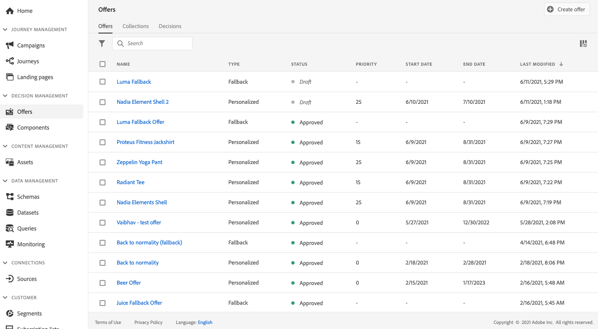
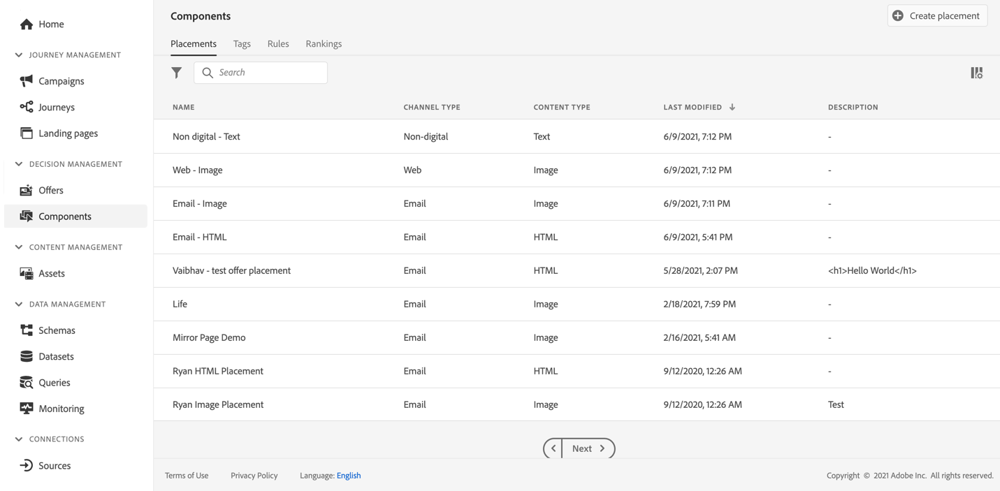
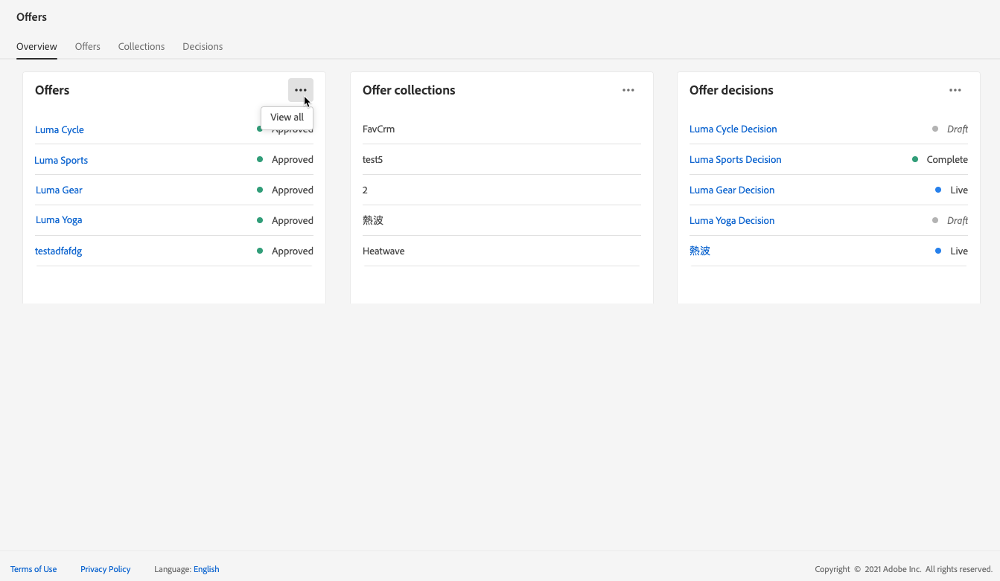
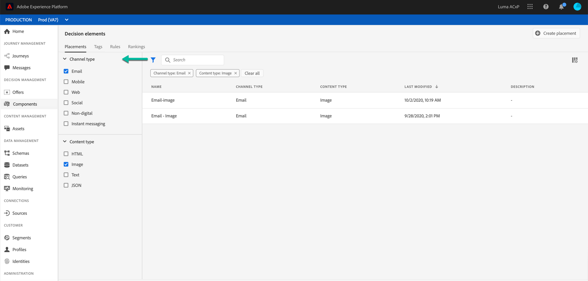
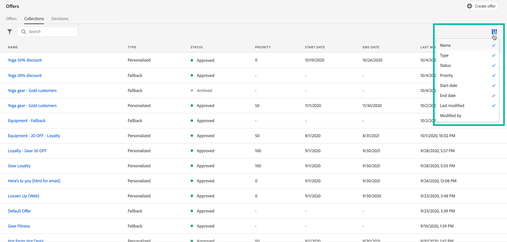
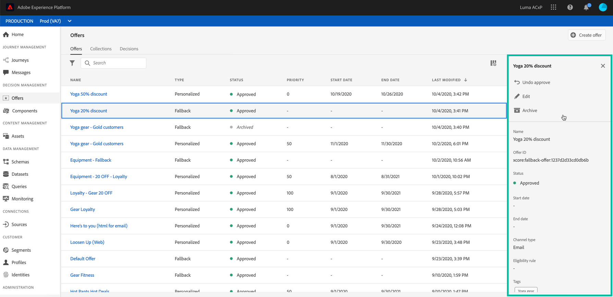

# Interfaz de usuario de biblioteca de ofertas {#user-interface}

>[!TIP]
>
>La nueva capacidad de toma de decisiones de [!DNL Adobe Journey Optimizer] ya está disponible a través de la experiencia basada en código y los canales de correo electrónico. [Más información](../../experience-decisioning/gs-experience-decisioning.md)

La sección **[!UICONTROL Administración de decisiones]** del carril izquierdo proporciona dos menús que le proporcionan acceso a las capacidades de administración de decisiones:

Utilice el menú **[!UICONTROL Ofertas]** para administrar y entregar sus ofertas:

* **[!UICONTROL Información general]**: ¿Es nuevo en [!DNL decision management]? Siga los pasos que aparecen en pantalla para empezar a configurar ubicaciones, ofertas y colecciones. Cuando ya esté familiarizado con [!DNL decision management], obtenga información general sobre las ofertas, colecciones y decisiones más recientes. [Más información](#overview)
* **[!UICONTROL Ofertas]**: cree y acceda a sus ofertas personalizadas y de reserva. Aprenda a crear [ofertas](../offer-library/creating-personalized-offers.md) y [ofertas de reserva](../offer-library/creating-fallback-offers.md)
* **[!UICONTROL Colecciones]**: organice sus ofertas en colecciones estáticas y dinámicas. [Más información](../offer-library/creating-collections.md)
* **[!UICONTROL Decisiones]**: crea y administra decisiones para entregar tus ofertas. [Más información](../offer-activities/create-offer-activities.md)
* **[!UICONTROL Toma de decisiones por lotes]**: Enviar decisiones de oferta a todos los perfiles de una audiencia de Adobe Experience Platform determinada. [Más información](../batch-delivery.md)
* **[!UICONTROL Simulación]**: Valide la lógica de toma de decisiones simulando qué ofertas se enviarán a un perfil de prueba para una ubicación determinada. [Más información](../offer-activities/simulation.md)

Utilice el menú **[!UICONTROL Componentes]** para crear y administrar los componentes necesarios para crear ofertas y decisiones:

* **[!UICONTROL Ubicaciones]**: cree y administre ubicaciones en las que se mostrarán sus ofertas. [Más información](../offer-library/creating-placements.md)
* **[!UICONTROL Calificadores de colección]**: cree y administre calificadores de colección (anteriormente conocidos como &quot;etiquetas&quot;) para organizar y filtrar sus ofertas. [Más información](../offer-library/creating-tags.md)
* **[!UICONTROL Reglas]**: administra las condiciones en las que se presentan las ofertas. [Más información](../offer-library/creating-decision-rules.md)
* **[!UICONTROL Clasificación]**: cree y administre fórmulas de clasificación para determinar qué oferta se debe presentar primero para una ubicación determinada. [Más información](../ranking/create-ranking-formulas.md)

>[!NOTE]
>
>Si tiene problemas para acceder a la administración de decisiones o a algunas de sus funciones, consulte con un usuario administrador que se le hayan concedido los derechos necesarios. Consulte [Conceder acceso a Administración de decisiones](starting-offer-decisioning.md#granting-acess-to-decision-management).

## Información general {#overview}

Cuando sea nuevo en [!DNL decision management], la ficha **[!UICONTROL Información general]** le guiará por los pasos principales necesarios para comenzar a crear su primera decisión de oferta. Siga los pasos que aparecen en pantalla para empezar a crear ubicaciones, ofertas y colecciones. Una vez completados estos primeros pasos, se le pedirá que cree decisiones de oferta.

>[!NOTE]
>
>Los pasos principales para crear ofertas y utilizarlas en una decisión se presentan en [esta sección](../offer-library/key-steps.md).

Cuando esté más familiarizado con [!DNL decision management] y ya haya creado al menos una decisión de oferta, la pestaña **[!UICONTROL Información general]** mostrará las ofertas, colecciones y decisiones más recientes.

Haga clic en una oferta o una decisión para acceder directamente a los detalles del elemento seleccionado.

Haga clic en el botón **[!UICONTROL Ver todo]** para acceder a las listas de ofertas, colecciones o decisiones.

## Búsqueda y filtrado de información {#search-and-filter-information}

Use la **barra de búsqueda** para encontrar un elemento específico.

También se puede obtener acceso a **Filters** haciendo clic en el icono de filtro en la parte superior izquierda de la lista. Permiten filtrar los elementos mostrados según diferentes criterios. Por ejemplo, puede filtrar las ubicaciones que se han creado para el canal de comunicación de correo electrónico y el contenido de tipo de imagen.

## Personalización de la información mostrada {#customize-displayed-information}

Las listas de los menús de Administración de decisiones se pueden personalizar mediante el botón de configuración en la parte superior derecha de las listas.

Esto le permite elegir la información que se mostrará según sus necesidades.

Tenga en cuenta que la personalización de columnas se guarda para cada usuario.

## Panel de información {#information-pane}

En las distintas listas, seleccione un elemento para mostrar un panel de información que le permitirá recuperar información y realizar acciones básicas en el elemento.

Las listas de ofertas y decisiones de oferta también permiten realizar acciones masivas en varios elementos. Para ello, seleccione las ofertas o decisiones que desee y, a continuación, seleccione la acción que desee realizar en el panel de información.

Tenga en cuenta que también puede duplicar una oferta o decisiones existentes para crear una copia con el estado **[!UICONTROL Borrador]**. Esto se puede realizar desde el panel de información, desde una oferta o desde la vista detallada de una decisión.

## Registros de cambios de ofertas y decisiones {#changes-logs}

[!DNL Journey Optimizer] le permite visualizar todos los cambios realizados en una oferta o una decisión. Para ello, accede al menú **[!UICONTROL Auditorías]** desde el menú de la izquierda. [Obtenga información sobre cómo auditar acciones en recursos](../../privacy/audit-logs.md)
