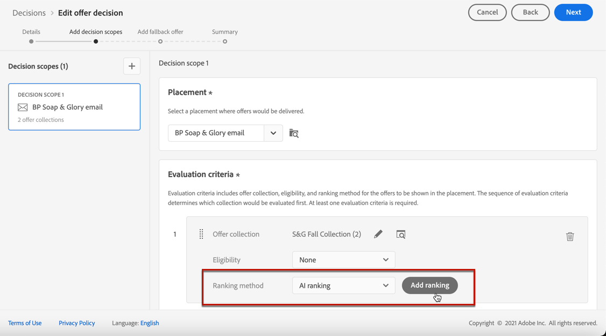

# Configurar selección de ofertas en decisiones {#offers-selection-in-decisions}

Si se pueden seleccionar varias ofertas para una ubicación determinada, puede elegir el método que seleccione la mejor oferta para cada perfil al configurar una decisión. Puede clasificar ofertas por:
* Prioridad de ofertas
* Fórmula de clasificación
* [Clasificación de IA](#use-ranking-strategy)

## Prioridad de ofertas {#offer-priority}

De forma predeterminada, cuando varias ofertas son aptas para una ubicación determinada en una decisión, las ofertas con la más alta **priority** primero se entregarán a los clientes.

Las puntuaciones de prioridad de las ofertas se asignan al crear una oferta. Obtenga información sobre cómo crear una oferta personalizada en [esta sección](../offer-library/creating-personalized-offers.md).

## Fórmula de clasificación {#assign-ranking-formula}

Además de la prioridad de oferta, Journey Optimizer permite crear **clasificación de fórmulas**. Son fórmulas que determinan qué oferta debe presentarse primero para una ubicación determinada, en lugar de tener en cuenta las puntuaciones de prioridad de las ofertas.

Por ejemplo, puede aumentar la prioridad de todas las ofertas en las que la fecha de finalización sea inferior a 24 horas a partir de ahora o aumentar las ofertas de la categoría &quot;en ejecución&quot; si el punto de interés del perfil es &quot;en ejecución&quot;.

Obtenga información sobre cómo crear una fórmula de clasificación en [esta sección](../ranking/create-ranking-formulas.md).

Una vez creada una fórmula, puede asignarla a una ubicación de una decisión. Para realizar esto, siga los pasos a continuación:

1. Cree una decisión o edite una existente. Consulte [Creación de decisiones](../offer-activities/create-offer-activities.md).

1. Añada las ubicaciones que contendrán sus ofertas. Consulte [Crear ubicaciones](../offer-library/creating-placements.md).

1. Para cada ubicación, agregue una colección. Consulte [Creación de colecciones](../offer-library/creating-collections.md).

1. Seleccionar **[!UICONTROL Fórmula]** como método de clasificación y haga clic en **[!UICONTROL Agregar clasificación]**.

   

1. Seleccione la fórmula que desee y haga clic en **[!UICONTROL Seleccionar]**.

   

La fórmula de clasificación ahora está asociada a la ubicación.

Si se pueden presentar varias ofertas en esta ubicación, la decisión utilizará la fórmula seleccionada para calcular qué oferta se entregará primero.

## Clasificación de IA {#use-ranking-strategy}

<!--If you are an [Adobe Experience Platform](https://experienceleague.adobe.com/docs/experience-platform/landing/home.html){target="_blank"} user leveraging the **Offer Decisioning** application service,-->

También puede utilizar un sistema de modelos entrenado que clasifique automáticamente las ofertas para un perfil determinado seleccionando un modelo de IA. Obtenga información sobre cómo crear un modelo de IA en [esta sección](../ranking/create-ranking-strategies.md).

Una vez creado un modelo de IA, puede asignarlo a una ubicación en una decisión. Para ello, siga los pasos a continuación:

1. Cree una decisión o edite una existente. Consulte [Creación de decisiones](../offer-activities/create-offer-activities.md).

1. Añada las ubicaciones que contendrán sus ofertas. Consulte [Crear ubicaciones](../offer-library/creating-placements.md).

1. Para cada ubicación, agregue una colección. Consulte [Creación de colecciones](../offer-library/creating-collections.md).

1. Elegir clasificar ofertas por **[!UICONTROL Clasificación de IA]** en la lista desplegable y haga clic en **[!UICONTROL Agregar clasificación]**.

   

1. Seleccione el modelo de IA que ha creado. Se muestran todos los detalles del modelo.

   

1. Haga clic en **[!UICONTROL Seleccionar]**. El modelo de IA ahora está asociado a la ubicación.

Si se admiten varias ofertas, el sistema de modelos entrenado determinará qué oferta debe presentarse primero para una ubicación determinada.

