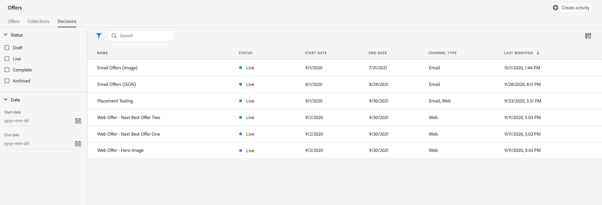
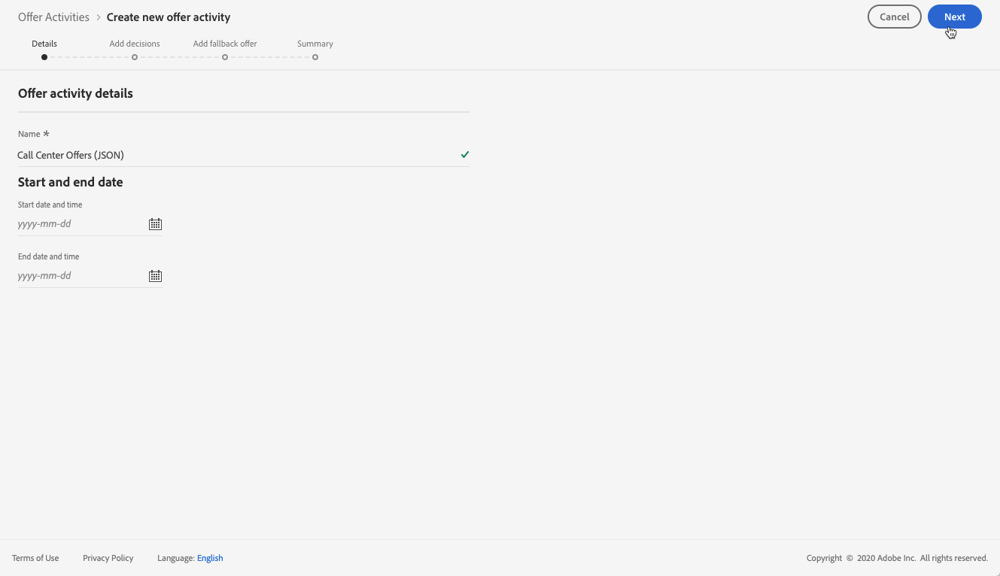
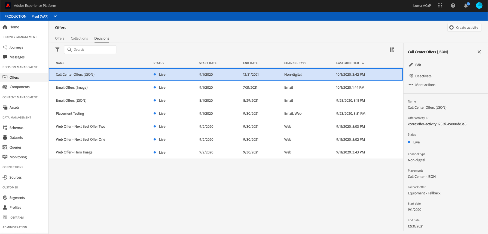

# Crear decisiones {#create-offer-activities}

Las decisiones (anteriormente conocidas como actividades de oferta) son contenedores para sus ofertas que aprovecharán el motor de decisión de ofertas para elegir la mejor oferta que se debe entregar, según el destinatario del envío.

 [Descubra esta función en vídeo](#video)

Se puede acceder a la lista de decisiones desde la pestaña **[!UICONTROL Offers]** menu / **[!UICONTROL Decisions]** . Los filtros están disponibles para ayudarle a recuperar las decisiones según su estado o las fechas de inicio y finalización.

Antes de crear una decisión, asegúrese de que los componentes siguientes se hayan creado en la Biblioteca de ofertas:

* [Ubicaciones](../offer-library/creating-placements.md),
* [Colecciones](../offer-library/creating-collections.md),
* [Ofertas personalizadas](../offer-library/creating-personalized-offers.md),
* [Ofertas de reserva](../offer-library/creating-fallback-offers.md).

## Cree la decisión {#create-activity}

1. Acceda a la lista de decisiones y haga clic en **[!UICONTROL Create activity]**.

1. Especifique el nombre de la decisión, así como su fecha y hora de inicio y finalización y, a continuación, haga clic en **[!UICONTROL Next]**.

   

## Agregar decisiones {#add-decisions}

1. Arrastre y suelte una ubicación de la lista para agregarla a la decisión y, a continuación, haga clic en **[!UICONTROL Add collection]**.

   

1. Seleccione la colección que contiene las ofertas que desea tener en cuenta y haga clic en **[!UICONTROL Add]**.

   

1. Las ofertas seleccionadas se añaden a la ubicación. En este ejemplo, seleccionamos dos ofertas que se mostrarán en una ubicación de tipo JSON con el fin de presentar ofertas en una solución de centro de llamadas.

   

1. De forma predeterminada, si varias ofertas son elegibles para esta ubicación, las ofertas con la puntuación de prioridad más alta se entregarán al cliente.

   Si desea utilizar una fórmula específica para elegir qué oferta apta para entregar, seleccione una fórmula de clasificación en la lista desplegable **[!UICONTROL Rank offers by]**. Para obtener más información, consulte [esta sección](../offer-activities/configure-offer-selection.md).

1. El campo **[!UICONTROL Constraint]** restringe la selección de ofertas para esta ubicación. Esta restricción se puede aplicar utilizando una regla de decisión o uno o varios segmentos de Adobe Experience Platform.

   Para restringir la selección de ofertas a los miembros de un segmento de Adobe Experience Platform, seleccione **[!UICONTROL Segments]** y haga clic en **[!UICONTROL Add segments]**.

   

   Agregue uno o varios segmentos del panel izquierdo, combínelos con los operadores lógicos **[!UICONTROL And]** / **[!UICONTROL Or]** y haga clic en **[!UICONTROL Select]** para confirmar.

   Para obtener más información sobre cómo trabajar con segmentos, consulte la [Documentación del servicio de segmentación](https://experienceleague.adobe.com/docs/experience-platform/segmentation/home.html).

   

   Si desea agregar una restricción de selección para esta ubicación mediante una regla de decisión, seleccione la opción **[!UICONTROL Decision rule]** y, a continuación, arrastre la regla deseada del panel izquierdo al área **[!UICONTROL Decision rule]**. Para obtener más información sobre cómo crear una regla de decisión, consulte [esta sección](../offer-library/creating-decision-rules.md).

   

## Agregar una oferta de reserva {#add-fallback}

Seleccione la oferta de reserva que se presentará como último recurso a los clientes que no coincidan con las reglas y restricciones de idoneidad de las ofertas y, a continuación, haga clic en **[!UICONTROL Next]**.

## Revisar y guardar la decisión {#review}

Si todo está configurado correctamente y su decisión está lista para utilizarse para presentar ofertas a los clientes, haga clic en **[!UICONTROL Finish]** y seleccione **[!UICONTROL Save and activate]**.

También puede guardar la decisión como borrador para editarla y activarla más adelante.

La decisión se muestra en la lista con los estados **[!UICONTROL Live]** o **[!UICONTROL Draft]**, dependiendo de si lo activó o no en el paso anterior.

Ahora está listo para utilizarse para ofrecer ofertas a los clientes. Puede seleccionarlo para mostrar sus propiedades y editarlo o suprimirlo.

Para obtener más información sobre la entrega de ofertas, consulte estas secciones:

* [Añadir ofertas personalizadas en mensajes](../../deliver-personalized-offers.md)
* [Enviar ofertas mediante API](../api-reference/decisions-api/deliver-offers.md)

>[!NOTE]
>
>Una vez que se ha creado una decisión, puede hacer clic en su nombre en la lista para acceder a información detallada y visualizar todos los cambios que se le han realizado mediante la pestaña **[!UICONTROL Change log]** (consulte [Registro de cambios de ofertas y decisiones](../get-started/user-interface.md#changes-log)).

## Tutorial en vídeo {#video}

>[!NOTE]
>
>Este vídeo se aplica al servicio de aplicaciones de Offer decisioning creado en Adobe Experience Platform. Sin embargo, proporciona una guía genérica para utilizar Offer en el contexto de Journey Optimizer.

>[!VIDEO](https://video.tv.adobe.com/v/329606?quality=12)
