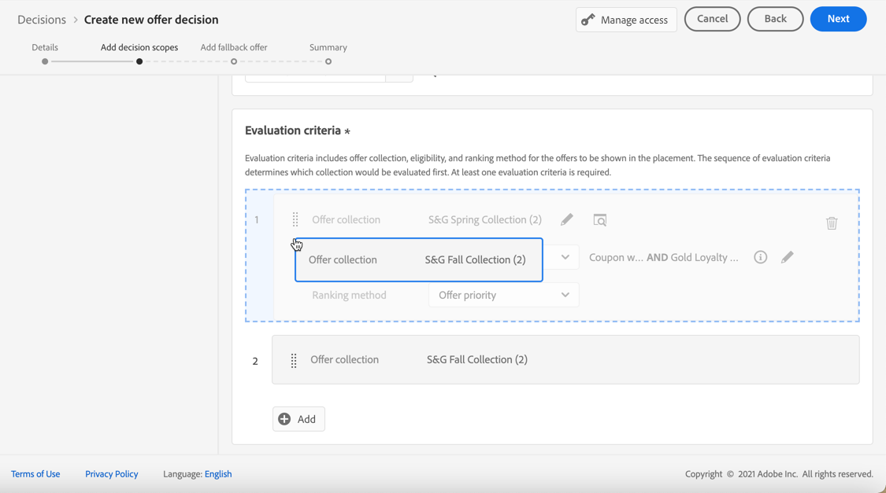
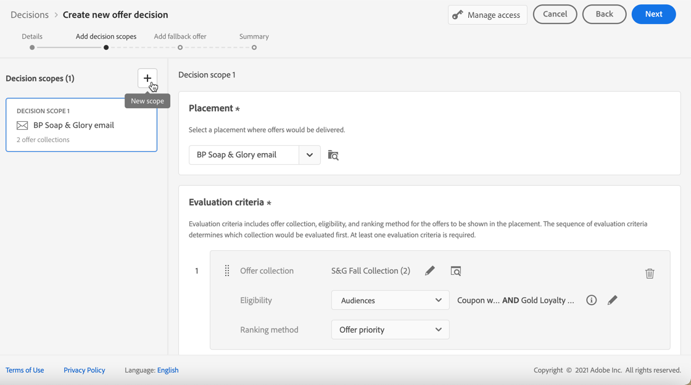
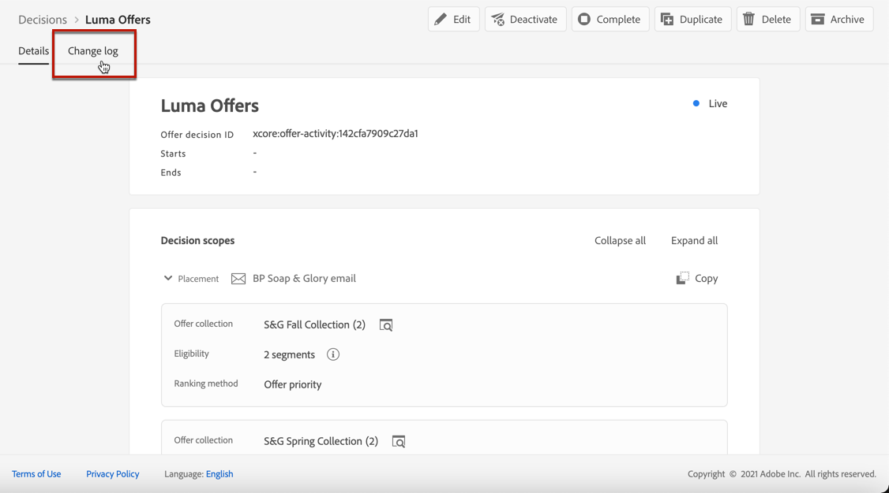

# Crear decisiones {#create-offer-activities}

Las decisiones son contenedores para sus ofertas que aprovecharán el motor de decisión de ofertas para elegir la mejor y ofrecerla, según el objetivo de la entrega.

➡️ [Aprenda a crear actividades de oferta en este vídeo](#video)

Se puede acceder a la lista de decisiones en el menú **[!UICONTROL Ofertas]** > pestaña **[!UICONTROL Decisiones]**. Los filtros están disponibles para ayudarle a recuperar decisiones según su estado o fechas de inicio y finalización.

Antes de crear una decisión, asegúrese de que los componentes siguientes se hayan creado en la Biblioteca de ofertas:

* [Ubicaciones](../offer-library/creating-placements.md)
* [Colecciones](../offer-library/creating-collections.md)
* [Ofertas personalizadas](../offer-library/creating-personalized-offers.md)
* [Ofertas de reserva](../offer-library/creating-fallback-offers.md)

## Crear la decisión {#create-activity}

>[!CONTEXTUALHELP]
>id="ajo_decisioning_decision_details"
>title="Detalles de la decisión de oferta"
>abstract="Especifique el nombre de la decisión y defina una fecha y hora de inicio y finalización si es necesario. Para asignar etiquetas de uso de datos principales o personalizadas a la decisión, seleccione **[!UICONTROL Administrar acceso]**."

1. Acceda a la lista de decisiones y haga clic en **[!UICONTROL Crear decisión]**.

1. Especifique el nombre de la decisión.

1. Defina una fecha y hora de inicio y finalización si es necesario y luego haga clic en **[!UICONTROL Siguiente]**.

   

1. Para asignar etiquetas de uso de datos principales o personalizadas a la decisión, selecciona **[!UICONTROL Administrar acceso]**. [Más información acerca del Control de acceso de nivel de objeto (OLAC)](../../administration/object-based-access.md)

## Definir ámbitos de decisión {#add-decision-scopes}

>[!CONTEXTUALHELP]
>id="ajo_decisioning_decision_scopes"
>title="Ámbitos de decisión"
>abstract="Configure uno o varios ámbitos para la decisión de oferta a fin de determinar las ofertas que se mostrarán. Para ello, seleccione una ubicación y los criterios de evaluación asociados a ella."

>[!CONTEXTUALHELP]
>id="ajo_decisioning_decision_placement"
>title="Ubicación"
>abstract="Seleccione una ubicación a la que se enviarán las ofertas."

>[!CONTEXTUALHELP]
>id="ajo_decisioning_decision_evaluation"
>title="Criterios de evaluación"
>abstract="Los criterios de evaluación consisten en una colección de ofertas asociada con una restricción de idoneidad y un método de clasificación para determinar las ofertas que se mostrarán en la ubicación. La secuencia de los criterios de evaluación determina qué colección se evaluará primero. Se requiere al menos un criterio de evaluación."

1. Seleccione una ubicación en la lista desplegable. Se añadirá al primer ámbito de decisión de la decisión.

   

1. Haga clic en **[!UICONTROL Agregar]** para seleccionar los criterios de evaluación para esta ubicación.

   

   Cada criterio consiste en una colección de ofertas asociada con una restricción de elegibilidad y un método de clasificación para determinar las ofertas que se mostrarán en la ubicación.

   >[!NOTE]
   >
   >Se requiere al menos un criterio de evaluación.

1. Seleccione la colección de ofertas que contiene las ofertas que se van a considerar y haga clic en **[!UICONTROL Agregar]**.

   

   >[!NOTE]
   >
   >Puede hacer clic en el vínculo **[!UICONTROL Abrir colecciones de ofertas]** para mostrar la lista de colecciones en una nueva pestaña, lo que le permite examinar las colecciones y las ofertas que contienen.

   La colección seleccionada se agrega a los criterios.

   

1. Utilice el campo **[!UICONTROL Elegibilidad]** para restringir la selección de ofertas para esta ubicación.

   Esta restricción se puede aplicar usando una **regla de decisión** o una o varias **audiencias de Adobe Experience Platform**. Ambos se detallan en [esta sección](../offer-library/add-constraints.md#segments-vs-decision-rules).

   * Para restringir la selección de ofertas a los miembros de una audiencia de Experience Platform, selecciona **[!UICONTROL Audiencias]** y luego haz clic en **[!UICONTROL Agregar audiencias]**.

     

     Agregue una o varias audiencias del panel izquierdo y combínelas con los operadores lógicos **[!UICONTROL And]** / **[!UICONTROL Or]**.

     

     Aprenda a trabajar con audiencias en [esta sección](../../audience/about-audiences.md).

   * Si desea agregar una restricción de selección con una regla de decisión, use la opción **[!UICONTROL Regla de decisión]** y seleccione la regla que desee.

     

     Aprenda a crear una regla de decisión en [esta sección](../offer-library/creating-decision-rules.md).

1. Al seleccionar audiencias o reglas de decisión, puede ver información sobre los perfiles cualificados estimados. Haga clic en **[!UICONTROL Actualizar]** para actualizar los datos.

   >[!NOTE]
   >
   >Las estimaciones de perfil no están disponibles cuando los parámetros de regla incluyen datos que no están en el perfil, como datos de contexto. Por ejemplo, una regla de idoneidad que requiere que el clima actual sea de ≥80 grados.

   

1. Defina el método de clasificación que desee utilizar para seleccionar la mejor oferta para cada perfil. [Más información](../offer-activities/configure-offer-selection.md).

   

   * De manera predeterminada, si se pueden seleccionar varias ofertas para esta ubicación, el método **[!UICONTROL Prioridad de ofertas]** usa el valor definido en las ofertas: la oferta con la puntuación de prioridad más alta se enviará al usuario.

   * Si desea usar una puntuación calculada específica para elegir qué oferta apta para entregar, seleccione **[!UICONTROL Fórmula]** o **[!UICONTROL modelo de IA]**. [Más información](../offer-activities/configure-offer-selection.md).

1. Haga clic en **[!UICONTROL Agregar]** para definir más criterios para la misma ubicación.

   

1. Cuando se añaden varios criterios, estos se evalúan en un orden específico. La primera colección que se añadió a la secuencia se evaluará primero, y así sucesivamente. [Más información](#evaluation-criteria-order)

   Para cambiar la secuencia predeterminada, puede arrastrar y soltar las colecciones para reordenarlas como desee.

   

1. También puede evaluar varios criterios al mismo tiempo. Para ello, arrastre y suelte la colección encima de otra.

   

   Ahora tienen el mismo rango y, por lo tanto, se evaluarán al mismo tiempo. [Más información](#evaluation-criteria-order)

   

   >[!CAUTION]
   >
   >* Si se usa [modelo de IA](../ranking/ai-models.md) en un grupo de criterios de evaluación, todos los criterios de evaluación de ese grupo deben usar el método de clasificación de IA y deben usar el mismo modelo de IA específico.
   >
   >* Solo un grupo de criterios de evaluación puede utilizar el modelo de IA. Cualquier otro grupo dentro de un ámbito de decisión debe utilizar otros métodos de clasificación (prioridad o fórmula). [Más información sobre los métodos de clasificación](../offer-activities/configure-offer-selection.md)

1. Para agregar otra ubicación para sus ofertas como parte de esta decisión, use el botón **[!UICONTROL Nuevo ámbito]**. Repita los pasos anteriores para cada ámbito de decisión.

   

   >[!NOTE]
   >
   >Al agregar varios ámbitos de decisión, el orden de los criterios de evaluación se verá afectado. [Más información](#multiple-scopes)

### Orden de criterios de evaluación {#evaluation-criteria-order}

Como se ha descrito anteriormente, un criterio de evaluación consta de una colección, restricciones de elegibilidad y un método de clasificación. Puede establecer el orden secuencial que desee para que se evalúen los criterios de evaluación, pero también puede combinar varios criterios de evaluación para que se evalúen juntos y no por separado.

#### Con un ámbito {#one-scope}

Dentro de un único ámbito de decisión, varios criterios y su agrupación determinan la prioridad de los criterios y la clasificación de las ofertas aptas. El primer criterio tiene la prioridad más alta y los criterios combinados dentro del mismo &quot;grupo&quot; tienen la misma prioridad.

Por ejemplo, tiene dos colecciones, una en los criterios de evaluación A y otra en los criterios de evaluación B. La solicitud es para que se devuelvan dos ofertas. Digamos que hay dos ofertas elegibles de los criterios de evaluación A y tres ofertas elegibles de los criterios de evaluación B.

* Si los dos criterios de evaluación son **no combinados** y/o en orden secuencial (1 y 2), las dos ofertas elegibles principales de los criterios de evaluación se devolverán en la primera fila. Si no hay dos ofertas aptas para los primeros criterios de evaluación, el motor de decisión pasará al siguiente criterio de evaluación en secuencia para encontrar tantas ofertas que aún se necesiten y, finalmente, devolverá una reserva si es necesario.

  

* Si las dos colecciones se **evalúan al mismo tiempo**, ya que hay dos ofertas elegibles de los criterios de evaluación A y tres ofertas elegibles de los criterios de evaluación B, las cinco ofertas se apilarán en base al valor determinado por los métodos de clasificación respectivos. Se solicitan dos ofertas, por lo que se devolverán las dos ofertas aptas principales de estas cinco ofertas.

  

+++ **Ejemplo con varios criterios**

Veamos un ejemplo en el que tiene varios criterios para un único ámbito dividido en diferentes grupos.

Ha definido tres criterios. Los criterios 1 y 2 se combinan en el grupo 1 y el criterio 3 es independiente (grupo 2).

Las ofertas elegibles para cada criterio y su prioridad (utilizadas en la evaluación de la función de clasificación) son las siguientes:

* Grupo 1:
   * Criterios 1 - (Oferta 1, Oferta 2, Oferta 3) - Prioridad 1
   * Criterios 2 - (Oferta 3, Oferta 4, Oferta 5) - Prioridad 1

* Grupo 2:
   * Criterios 3 - (Oferta 5, Oferta 6) - Prioridad 0

Las ofertas de criterios de mayor prioridad se evalúan primero y se añaden a la lista de ofertas clasificadas.

**Iteración 1:**

Las ofertas de Criterios 1 y Criterio 2 se evalúan juntas (Oferta 1, Oferta 2, Oferta 3, Oferta 4, Oferta 5). Digamos que el resultado es:

Oferta 1 - 10
Oferta 2 - 20
Oferta 3 - 30 de Criterios 1, 45 de Criterios 2. Se tendrá en cuenta el más alto de ambos, por lo que se tienen en cuenta 45.
Oferta 4 - 40
Oferta 5 - 50

Las ofertas clasificadas ahora son las siguientes: Oferta 5, Oferta 3, Oferta 4, Oferta 2, Oferta 1.

**Iteración 2:**

Se evalúan las ofertas de Criterios 3 (oferta 5, oferta 6). Digamos que el resultado es:

* Oferta 5: no se evaluará porque ya existe en el resultado anterior.
* Oferta 6 - 60

Las ofertas clasificadas ahora son las siguientes: Oferta 5 , Oferta 3, Oferta 4, Oferta 2, Oferta 1, Oferta 6.

+++

#### Con varios ámbitos {#multiple-scopes}

**Si la duplicación está desactivada**

Cuando se agregan varios ámbitos de decisión a una decisión y no se permite la duplicación entre ubicaciones, las ofertas aptas se seleccionan secuencialmente en el orden de los ámbitos de decisión de la solicitud.

>[!NOTE]
>
>El parámetro **[!UICONTROL Permitir duplicados entre ubicaciones]** se ha establecido en el nivel de ubicación. Si la duplicación se establece en &quot;False&quot; para cualquier ubicación en una solicitud de toma de decisiones, todas las ubicaciones de la solicitud heredarán la configuración &quot;False&quot;. [Más información sobre el parámetro de duplicación](../offer-library/creating-placements.md)

Veamos un ejemplo en el que agregó dos ámbitos de decisión como:

* Ámbito 1: hay cuatro ofertas aptas (Oferta 1, Oferta 2, Oferta 3, Oferta 4) y la solicitud es de dos ofertas para enviarse de vuelta.
* Ámbito 2: hay cuatro ofertas aptas (Oferta 1, Oferta 2, Oferta 3, Oferta 4) y la solicitud es de dos ofertas para enviarse de vuelta.

+++ **Ejemplo 1**

La selección es la siguiente:

1. Se devolverán las dos ofertas principales aptas del ámbito 1 (Oferta 1, Oferta 2).
1. Se devolverán las dos ofertas principales elegibles restantes del ámbito 2 (oferta 3, oferta 4).

+++

+++ **Ejemplo 2**

En este ejemplo, la oferta 1 ha alcanzado su límite de frecuencia. [Más información sobre la restricción de frecuencia](../offer-library/add-constraints.md#capping)

La selección es la siguiente:

1. Se devolverán las dos ofertas principales elegibles restantes del ámbito 1 (oferta 2, oferta 3).
1. Se devuelve la oferta elegible restante del ámbito 2 (oferta 4).

+++

+++ **Ejemplo 3**

En este ejemplo, la oferta 1 y la oferta 3 alcanzaron su límite de frecuencia. [Más información sobre la restricción de frecuencia](../offer-library/add-constraints.md#capping)

La selección es la siguiente:

1. Se devolverán las dos ofertas principales elegibles restantes del ámbito 1 (oferta 2, oferta 4).
1. No quedan ofertas elegibles para el ámbito 2, por lo que se devuelve la [oferta de reserva](#add-fallback).

+++

**Si la duplicación está activada**

Cuando se permite la duplicación en todas las ubicaciones, la misma oferta se puede proponer varias veces en diferentes ubicaciones. Si se habilita, el sistema considerará la misma oferta para varias ubicaciones. [Más información sobre el parámetro de duplicación](../offer-library/creating-placements.md)

Veamos el mismo ejemplo que arriba, donde agregó dos ámbitos de decisión, como:

* Ámbito 1: hay cuatro ofertas aptas (Oferta 1, Oferta 2, Oferta 3, Oferta 4) y la solicitud es de dos ofertas para enviarse de vuelta.
* Ámbito 2: hay cuatro ofertas aptas (Oferta 1, Oferta 2, Oferta 3, Oferta 4) y la solicitud es de dos ofertas para enviarse de vuelta.

+++ **Ejemplo 1**

La selección es la siguiente:

1. Se devolverán las dos ofertas principales aptas del ámbito 1 (Oferta 1, Oferta 2).
1. Se devolverán las dos mismas ofertas principales aptas del ámbito 2 (Oferta 1, Oferta 2).

+++

+++ **Ejemplo 2**

En este ejemplo, la oferta 1 ha alcanzado su límite de frecuencia. [Más información sobre la restricción de frecuencia](../offer-library/add-constraints.md#capping)

La selección es la siguiente:

1. Se devolverán las dos ofertas principales elegibles restantes del ámbito 1 (oferta 2, oferta 3).

1. Se devolverán las dos ofertas principales elegibles restantes del ámbito 2 (oferta 2, oferta 3).

+++

+++ **Ejemplo 3**

En este ejemplo, la oferta 1 y la oferta 3 alcanzaron su límite de frecuencia. [Más información sobre la restricción de frecuencia](../offer-library/add-constraints.md#capping)

La selección es la siguiente:

1. Se devolverán las dos ofertas principales elegibles restantes del ámbito 1 (oferta 2, oferta 4).

1. Se devolverán las dos ofertas principales elegibles restantes del ámbito 2 (oferta 2, oferta 4).

+++

## Añadir una oferta de reserva {#add-fallback}

>[!CONTEXTUALHELP]
>id="ajo_decisioning_decision_fallback"
>title="Añadir una oferta de reserva"
>abstract="Una vez definidos los ámbitos de decisión, defina la oferta de reserva que se presentará como último recurso a los clientes que no coincidan con las restricciones y reglas de elegibilidad de las ofertas."

Una vez definidos los ámbitos de decisión, defina la oferta de reserva que se presentará como último recurso a los clientes que no coincidan con las restricciones y reglas de elegibilidad de las ofertas.

Para ello, selecciónela en la lista de ofertas de reserva disponibles para las ubicaciones definidas en la decisión y, a continuación, haga clic en **[!UICONTROL Siguiente]**.

>[!NOTE]
>
>Puede hacer clic en el vínculo **[!UICONTROL Abrir biblioteca de ofertas]** para mostrar la lista de ofertas en una nueva pestaña.

## Revise y guarde la decisión {#review}

Si todo está configurado correctamente, se muestra un resumen de las propiedades de la decisión.

1. Asegúrese de que la decisión esté lista para utilizarse para presentar ofertas a los clientes. Se muestran todos los ámbitos de decisión y la oferta de reserva que contiene.

   

1. Puede expandir o contraer cada ubicación. Puede previsualizar las ofertas disponibles, los detalles de idoneidad y la clasificación de cada ubicación. También puede mostrar información sobre los perfiles cualificados estimados. Haga clic en **[!UICONTROL Actualizar]** para actualizar los datos.

   

1. Haga clic en **[!UICONTROL Finalizar]**.
1. Seleccione **[!UICONTROL Guardar y activar]**.

   

   También puede guardar la decisión como borrador para editarla y activarla más adelante.

La decisión se muestra en la lista con el estado **[!UICONTROL Activo]** o **[!UICONTROL Borrador]**, en función de si lo activó o no en el paso anterior.

Ahora está listo para utilizarse para entregar ofertas a los clientes.

## Lista de decisiones {#decision-list}

En la lista de decisiones, puede seleccionar la decisión para mostrar sus propiedades. Desde allí, también puede editarla, cambiar su estado (**Borrador**, **Activo**, **Completado**, **Archivado**), duplicar la decisión o eliminarla.

Seleccione el botón **[!UICONTROL Editar]** para volver al modo de edición de decisión, donde puede modificar los [detalles](#create-activity), los [ámbitos de decisión](#add-decision-scopes) y la [oferta de reserva](#add-fallback) de la decisión.

>[!IMPORTANT]
>
>Si se realizan cambios en una decisión de oferta que se utiliza en el mensaje de un recorrido, se debe cancelar la publicación del recorrido y volver a publicarlo.  Esto garantizará que los cambios se incorporen al mensaje del recorrido y que el mensaje sea coherente con las últimas actualizaciones.

Seleccione una decisión activa y haga clic en **[!UICONTROL Desactivar]** para establecer el estado de la decisión en **[!UICONTROL Borrador]**.

Para volver a establecer el estado en **[!UICONTROL Activo]**, seleccione el botón **[!UICONTROL Activar]** que ahora se muestra.

El botón **[!UICONTROL Más acciones]** habilita las acciones que se describen a continuación.

* **[!UICONTROL Completado]**: establece el estado de la decisión en **[!UICONTROL Completado]**, lo que significa que ya no se puede llamar a la decisión. Esta acción solo está disponible para decisiones activadas. La decisión aún está disponible en la lista, pero no puedes volver a establecer su estado en **[!UICONTROL Borrador]** o **[!UICONTROL Aprobado]**. Solo puede duplicarlo, eliminarlo o archivarlo.

* **[!UICONTROL Duplicate]**: crea una decisión con las mismas propiedades, ámbitos de decisión y ofertas de reserva. De manera predeterminada, la nueva decisión tiene el estado **[!UICONTROL Borrador]**.

* **[!UICONTROL Eliminar]**: elimina la decisión de la lista.

  >[!CAUTION]
  >
  >Ya no se podrá acceder a la decisión ni a su contenido. Esta acción no se puede deshacer.
  >
  >Si la decisión se utiliza en otro objeto, no se puede eliminar.

* **[!UICONTROL Archivo]**: establece el estado de la decisión en **[!UICONTROL Archivado]**. La decisión aún está disponible en la lista, pero no puedes volver a establecer su estado en **[!UICONTROL Borrador]** o **[!UICONTROL Aprobado]**. Solo puede duplicarlo o eliminarlo.

También puede eliminar o cambiar el estado de varias decisiones al mismo tiempo seleccionando las casillas de verificación correspondientes.

Si desea cambiar el estado de varias decisiones con diferentes estados, solo se cambiarán los estados relevantes.

Una vez creada una decisión, puede hacer clic en su nombre desde la lista.

Esto le permite acceder a información detallada para esa decisión. Seleccione la ficha **[!UICONTROL Registro de cambios]** para [supervisar todos los cambios](../get-started/user-interface.md#changes-log) que se han realizado en la decisión.

## Vídeo práctico{#video}

Obtenga información sobre cómo crear actividades de oferta en administración de decisiones.

>[!VIDEO](https://video.tv.adobe.com/v/329606?quality=12)

