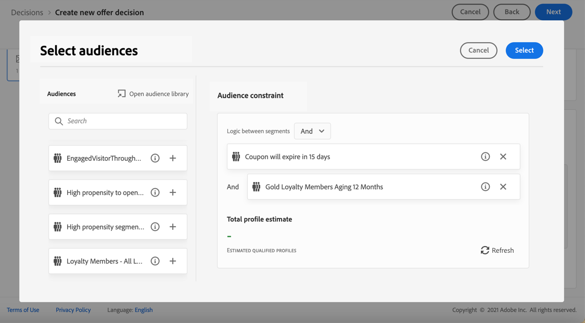
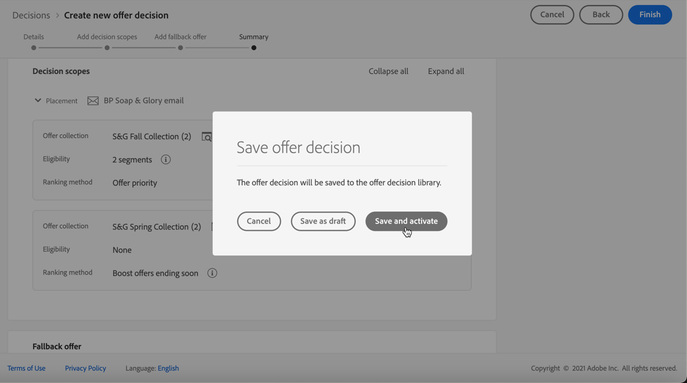

# Crear decisiones {#create-offer-activities}

Las decisiones son contenedores para sus ofertas que aprovechan el motor de decisión de ofertas para elegir la mejor oferta que se debe entregar, según el objetivo del envío.

➡️ [Aprenda a crear actividades de oferta en este vídeo](#video)

La lista de decisiones puede consultarse en la **[!UICONTROL Ofertas]** menú > **[!UICONTROL Decisiones]** pestaña . Los filtros están disponibles para ayudarle a recuperar las decisiones según su estado o las fechas de inicio y finalización.

Antes de crear una decisión, asegúrese de que los componentes siguientes se hayan creado en la Biblioteca de ofertas:

* [Ubicaciones](../offer-library/creating-placements.md)
* [Colecciones](../offer-library/creating-collections.md)
* [Ofertas personalizadas](../offer-library/creating-personalized-offers.md)
* [Ofertas de reserva](../offer-library/creating-fallback-offers.md)

## Cree la decisión {#create-activity}

1. Acceda a la lista de decisiones y haga clic en **[!UICONTROL Crear decisión]**.

1. Especifique el nombre de la decisión.

1. Defina una fecha y hora de inicio y de finalización si es necesario y haga clic en **[!UICONTROL Siguiente]**.

   

1. Para asignar etiquetas de uso de datos principales o personalizadas a la decisión, seleccione **[!UICONTROL Administrar acceso]**. [Más información sobre Control de acceso a nivel de objeto (OLAC)](../../administration/object-based-access.md)

## Definir ámbitos de decisión {#add-decision-scopes}

1. Seleccione una colocación en la lista desplegable. Se agregará al ámbito de la primera decisión en su decisión.

   

1. Haga clic en **[!UICONTROL Agregar]** para seleccionar criterios de evaluación para esta ubicación.

   

   Cada criterio consiste en una colección de ofertas asociada con una restricción de elegibilidad y un método de clasificación para determinar las ofertas que se mostrarán en la colocación.

   >[!NOTE]
   >
   >Se requiere al menos un criterio de evaluación.

1. Seleccione la colección de ofertas que contiene las ofertas que se deben tener en cuenta y haga clic en **[!UICONTROL Agregar]**.

   

   >[!NOTE]
   >
   >Puede hacer clic en el botón **[!UICONTROL Abrir colecciones de ofertas]** vínculo para mostrar la lista de colecciones en una nueva pestaña, que le permite examinar las colecciones y las ofertas que contienen.

   La colección seleccionada se agrega al criterio.

   

1. Utilice la variable **[!UICONTROL Elegibilidad]** para restringir la selección de ofertas para esta ubicación.

   Esta restricción se puede aplicar utilizando una **regla de decisión**, o una o varias **Segmentos de Adobe Experience Platform**. Ambas se detallan en [esta sección](../offer-library/add-constraints.md#segments-vs-decision-rules).

   * Para restringir la selección de ofertas a los miembros de un segmento de Experience Platform, seleccione **[!UICONTROL Segmentos]** y haga clic en **[!UICONTROL Añadir segmentos]**.

      

      Añada uno o varios segmentos del panel izquierdo y combínelos utilizando la variable **[!UICONTROL Y]** / **[!UICONTROL O]** operadores lógicos.

      

      Aprenda a trabajar con segmentos en [esta sección](../../segment/about-segments.md).

   * Si desea agregar una restricción de selección con una regla de decisión, utilice la variable **[!UICONTROL Regla de decisión]** y seleccione la regla que desee.

      

      Obtenga información sobre cómo crear una regla de decisión en [esta sección](../offer-library/creating-decision-rules.md).

1. Al seleccionar segmentos o reglas de decisión, puede ver información sobre los perfiles cualificados estimados. Haga clic en **[!UICONTROL Actualizar]** para actualizar los datos.

   >[!NOTE]
   >
   >Las estimaciones de perfil no están disponibles cuando los parámetros de regla incluyen datos que no están en el perfil, como los datos de contexto. Por ejemplo, una regla de aceptación que requiera que el clima actual sea ≥ 80 grados.

   

1. Defina el método de clasificación que desea utilizar para seleccionar la mejor oferta para cada perfil.

   

   * De forma predeterminada, si se cumplen los criterios de varias ofertas para esta ubicación, la oferta con la puntuación de prioridad más alta se envía al cliente.

   * Si desea utilizar una fórmula específica para elegir qué oferta apta para entregar, seleccione **[!UICONTROL Fórmula de clasificación]**. Aprenda a clasificar ofertas en [esta sección](../offer-activities/configure-offer-selection.md).

1. Haga clic en **[!UICONTROL Agregar]** para definir más criterios para la misma ubicación.

   

1. Cuando agregue varios criterios, se evaluarán en un orden específico. La primera colección agregada a la secuencia se evaluará primero, y así sucesivamente.

   Para cambiar la secuencia predeterminada, puede arrastrar y soltar las colecciones para reordenarlas como desee.

   

1. También puede evaluar varios criterios al mismo tiempo. Para ello, arrastre y suelte la colección sobre otra.

   

   Ahora tienen la misma clasificación y, por lo tanto, se evaluarán al mismo tiempo.

   

1. Para añadir otra ubicación a las ofertas como parte de esta decisión, use el **[!UICONTROL Nuevo ámbito]** botón. Repita los pasos anteriores para cada ámbito de decisión.

   

## Añadir una oferta de reserva {#add-fallback}

Una vez definidos los ámbitos de decisión, defina la oferta de reserva que se presentará como último recurso a los clientes que no coincidan con las reglas y restricciones de idoneidad de las ofertas.

Para ello, selecciónela en la lista de ofertas de reserva disponibles para las ubicaciones definidas en la decisión y, a continuación, haga clic en **[!UICONTROL Siguiente]**.

>[!NOTE]
>
>Puede hacer clic en el botón **[!UICONTROL Abrir la biblioteca de ofertas]** para mostrar la lista de ofertas en una nueva pestaña.

## Revisar y guardar la decisión {#review}

Si todo está configurado correctamente, se muestra un resumen de las propiedades de decisión.

1. Asegúrese de que la decisión esté lista para utilizarse para presentar ofertas a los clientes. Se muestran todos los ámbitos de decisión y la oferta de reserva que contiene.

   

1. Puede expandir o contraer cada ubicación. Puede obtener una vista previa de las ofertas disponibles, los requisitos y los detalles de clasificación de cada ubicación. También puede mostrar información sobre los perfiles cualificados estimados. Haga clic en **[!UICONTROL Actualizar]** para actualizar los datos.

   

1. Haga clic en **[!UICONTROL Finalizar]**.
1. Select **[!UICONTROL Guardar y activar]**.

   

   También puede guardar la decisión como borrador para editarla y activarla más adelante.

La decisión se muestra en la lista con la variable **[!UICONTROL Activo]** o **[!UICONTROL Borrador]** , dependiendo de si lo activó o no en el paso anterior.

Ahora está listo para utilizarse para ofrecer ofertas a los clientes.

## Lista de decisiones {#decision-list}

En la lista de decisión, puede seleccionar la decisión para mostrar sus propiedades. Desde allí también puede editarlo, cambiar su estado (**Borrador**, **Activo**, **Completar**, **Archivado**), duplicar la decisión o eliminarla.

Seleccione el **[!UICONTROL Editar]** para volver al modo de edición de decisiones, donde puede modificar el [detalles](#create-activity), [ámbitos de decisión](#add-decision-scopes) y [oferta de reserva](#add-fallback).

Seleccione una decisión activa y haga clic en **[!UICONTROL Desactivar]** para volver a establecer el estado de decisión en **[!UICONTROL Borrador]**.

Para volver a establecer el estado en **[!UICONTROL Activo]**, seleccione **[!UICONTROL Activar]** que se muestra ahora.

La variable **[!UICONTROL Más acciones]** activa las acciones que se describen a continuación.

* **[!UICONTROL Completar]**: establece el estado de la decisión en **[!UICONTROL Completar]**, lo que significa que la decisión ya no se puede invocar. Esta acción solo está disponible para decisiones activadas. La decisión sigue estando disponible en la lista, pero no puede volver a establecer su estado en **[!UICONTROL Borrador]** o **[!UICONTROL Aprobado]**. Solo puede duplicarlo, eliminarlo o archivarlo.

* **[!UICONTROL Duplicar]**: crea una decisión con las mismas propiedades, ámbitos de decisión y oferta de reserva. De forma predeterminada, la nueva decisión tiene la variable **[!UICONTROL Borrador]** estado.

* **[!UICONTROL Eliminar]**: elimina la decisión de la lista.

   >[!CAUTION]
   >
   >La decisión y su contenido ya no serán accesibles. Esta acción no se puede deshacer.
   >
   >Si la decisión se utiliza en otro objeto, no se puede eliminar.

* **[!UICONTROL Archivo]**: establece el estado de decisión en **[!UICONTROL Archivado]**. La decisión sigue estando disponible en la lista, pero no puede volver a establecer su estado en **[!UICONTROL Borrador]** o **[!UICONTROL Aprobado]**. Solo puede duplicarlo o eliminarlo.

También puede eliminar o cambiar el estado de varias decisiones al mismo tiempo seleccionando las casillas de verificación correspondientes.

Si desea cambiar el estado de varias decisiones con estados diferentes, solo se cambiarán los estados relevantes.

Una vez creada la decisión, puede hacer clic en su nombre desde la lista.

Esto le permite acceder a información detallada para esa decisión. Seleccione el **[!UICONTROL Registro de cambios]** para [supervisar todos los cambios](../get-started/user-interface.md#changes-log) que se hayan adoptado en la decisión.

## Vídeo explicativo{#video}

Aprenda a crear actividades de oferta en la administración de decisiones.

>[!VIDEO](https://video.tv.adobe.com/v/329606?quality=12)

