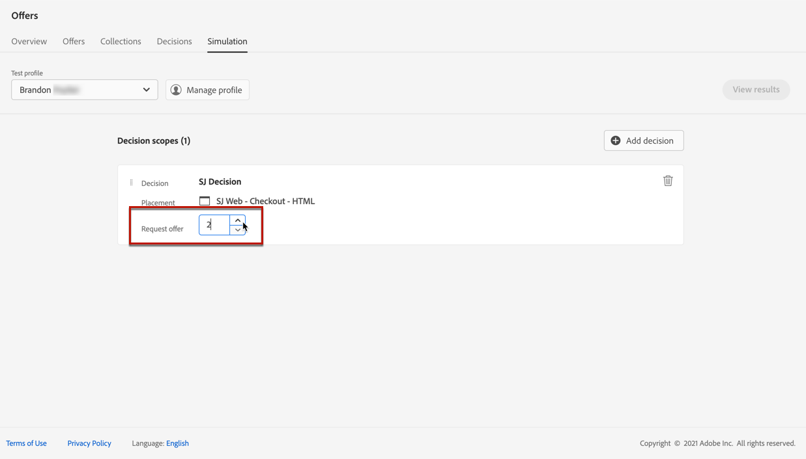
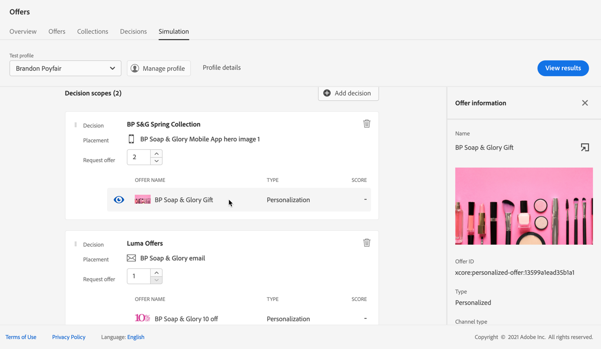
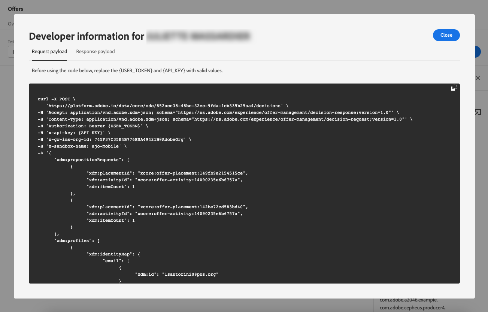

# Creación de simulaciones {#create-simulations}

## Acerca de la simulación {#about-simulation}

Para validar la lógica de decisiones, puede simular qué ofertas se enviarán a un perfil de prueba para una ubicación determinada.

<!--Simulation allows you to view the results of offer decisions as a selected profile.-->

Esto permite probar y perfeccionar varias versiones de las ofertas sin afectar a los destinatarios objetivo.

>[!NOTE]
>
>Esta capacidad simula una sola solicitud al [!DNL Decisions] API. Más información sobre [Enviar ofertas mediante la API de decisiones](../api-reference/decisions-api/deliver-offers.md).

Para acceder a esta función, seleccione la opción **[!UICONTROL Simulation]** en la ficha **[!UICONTROL Decision management]** > **[!UICONTROL Offers]** para abrir el Navegador.

<!--
➡️ [Discover this feature in video](#video)
-->

## Seleccionar perfiles de prueba {#select-test-profiles}

Primero debe seleccionar los perfiles de prueba que va a utilizar para la simulación.

1. Haga clic en **[!UICONTROL Manage profile]**.

   

1. Seleccione el área de nombres de identidad que desea utilizar para identificar los perfiles de prueba. En este ejemplo, utilizaremos la variable **Correo electrónico** espacio de nombres.

   >[!NOTE]
   >
   >Un área de nombres de identidad define el contexto de un identificador, como una dirección de correo electrónico o un ID de CRM. Obtenga más información sobre las áreas de nombres de identidad de Adobe Experience Platform [en esta sección](../../start/get-started-identity.md){target=&quot;_blank&quot;}.

1. Introduzca el valor de identidad y haga clic en **[!UICONTROL View]** para enumerar los perfiles disponibles.

   

1. Añada otros perfiles si desea probar diferentes datos de perfil y guarde la selección.

   

1. Una vez añadidos, todos los perfiles se enumeran en la lista desplegable debajo de **[!UICONTROL Test profile]**. Puede cambiar entre los perfiles de prueba guardados para mostrar los resultados de cada perfil seleccionado.

   

   >[!NOTE]
   >
   >Los perfiles seleccionados permanecerán enumerados como perfiles de prueba en la variable **[!UICONTROL Simulation]** de sesión en sesión hasta que se eliminen utilizando **[!UICONTROL Manage profile]**.

1. Puede hacer clic en el botón **[!UICONTROL Profile details]** vínculo para mostrar los datos de perfil seleccionados.

<!--Learn more on [selecting test profiles](messages/preview.md#select-test-profiles)-->

## Agregar ámbitos de decisión {#add-decision-scopes}

Ahora, seleccione las decisiones de oferta que desee simular en los perfiles de prueba.

1. Seleccione **[!UICONTROL Add decision scope]**.

   

1. Seleccione una colocación de la lista.

   

1. Se muestran las decisiones disponibles.

   * Puede utilizar el campo de búsqueda para restringir la selección.
   * Puede hacer clic en el botón **[!UICONTROL Open offer decisions]** para abrir la lista de todas las decisiones que ha creado. Más información sobre [decisiones](create-offer-activities.md).

   Seleccione la decisión que desee y haga clic en **[!UICONTROL Add]**.

   

1. El ámbito de decisión que acaba de definir se muestra en el espacio de trabajo principal.

   Puede ajustar el número de ofertas que desea solicitar. Por ejemplo, si selecciona 2, se mostrarán las dos mejores ofertas para este ámbito de decisión.

   

   >[!NOTE]
   >
   >Puede solicitar hasta 30 ofertas.

1. Repita los pasos anteriores para agregar tantas decisiones como necesite.

   

   >[!NOTE]
   >
   >Aunque defina varios ámbitos de decisión, solo se simula una solicitud de API.

## Definición de la configuración de simulación {#define-simulation-settings}

Para editar la configuración predeterminada de las simulaciones, siga los pasos a continuación.

1. Haga clic en **[!UICONTROL Settings]**.

   

1. En el **[!UICONTROL Deduplication]** , puede elegir permitir ofertas duplicadas entre decisiones o ubicaciones. Significa que se puede asignar la misma oferta a varias decisiones/ubicaciones.

   

   >[!NOTE]
   >
   >De forma predeterminada, todos los indicadores de deduplicación están habilitados para la simulación, lo que significa que el motor de decisión permite duplicados y, por lo tanto, puede realizar la misma propuesta en múltiples decisiones/colocaciones. Obtenga más información sobre [!DNL Decisions] Propiedades de solicitud de API en [esta sección](../api-reference/decisions-api/deliver-offers.md).

1. En el **[!UICONTROL Response format]** , puede elegir incluir metadatos en la vista de código. Marque la opción correspondiente y seleccione los metadatos que desee. Se muestran en las cargas útiles de solicitud y respuesta al seleccionar **[!UICONTROL View code]**. Obtenga más información en la [Ver resultados de simulación](#simulation-results) para obtener más información.

   

   >[!NOTE]
   >
   >Al activar la opción, se seleccionan todos los elementos de forma predeterminada.

1. Haga clic en **[!UICONTROL Save]**.

>[!NOTE]
>
>Actualmente, para los datos de simulación solo puede utilizar la variable **[!UICONTROL Hub]** API.

<!--
In the **[!UICONTROL API for simulation]** section, select the API you want to use: **[!UICONTROL Hub]** or **[!UICONTROL Edge]**.
Hub and Edge are two different end points for simulation data.

In the **[!UICONTROL Context data]** section, you can add as many elements as needed.

    >[!NOTE]
    >
    >This section is hidden if you select Edge API in the section above. Hub allows the use of Context data, Edge does not.

Context data allows the user to add contextual data that could affect the simulation score.
For instance, let's say the customer has an offer for a discount on ice cream. In the rules for that offer, it can have logic that would rank it higher when the temperature is above 80 degrees. In simulation, the user could add context data: temperature=65 and that offer would rank lower, of they could add temperature=95 and that would rank higher.
-->

## Ver resultados de simulación {#simulation-results}

Una vez agregado el ámbito de decisión y seleccionado un perfil de prueba, puede ver los resultados.

1. Haga clic en **[!UICONTROL View results]**.

   

1. Las mejores ofertas disponibles se muestran según el perfil seleccionado para cada decisión.

   Seleccione una oferta para mostrar sus detalles.

   

1. Haga clic en **[!UICONTROL View code]** para mostrar las cargas útiles de solicitud y respuesta. [Más información](#view-code)

1. Seleccione otro perfil de la lista para mostrar los resultados de las decisiones de oferta para un perfil de prueba diferente.

1. Puede agregar, quitar o actualizar los ámbitos de decisión tantas veces como sea necesario.

>[!NOTE]
>
>Cada vez que cambia perfiles o actualiza los ámbitos de decisión, debe actualizar los resultados utilizando la variable **[!UICONTROL View results]** botón.

## Ver código {#view-code}

1. Utilice la variable **[!UICONTROL View code]** para mostrar las cargas útiles de solicitud y respuesta.

   

   La vista de código muestra la información de desarrollador para el usuario actual. De forma predeterminada, la variable **[!UICONTROL Response payload]** se muestra.

   

1. Haga clic en **[!UICONTROL Response payload]** o **[!UICONTROL Request payload]** para desplazarse entre las dos pestañas.

   

1. Para utilizar la carga útil de la solicitud fuera de [!DNL Journey Optimizer] - para solucionar problemas, por ejemplo, cópielo utilizando la variable **[!UICONTROL Copy to clipboard]** en la parte superior de la vista de código.

   

   <!--You cannot copy the response payload. ACTUALLY YES YOU CAN > to confirm with PM/dev? -->

   >[!NOTE]
   >
   >Al copiar las cargas de solicitud o respuesta en su propio código, asegúrese de reemplazar {USER_TOKEN} y {API_KEY} con valores válidos. Obtenga información sobre cómo recuperar estos valores en la variable [API de Adobe Experience Platform](https://experienceleague.adobe.com/docs/experience-platform/landing/platform-apis/api-authentication.html)documentación de {target=&quot;_blank&quot;}.

