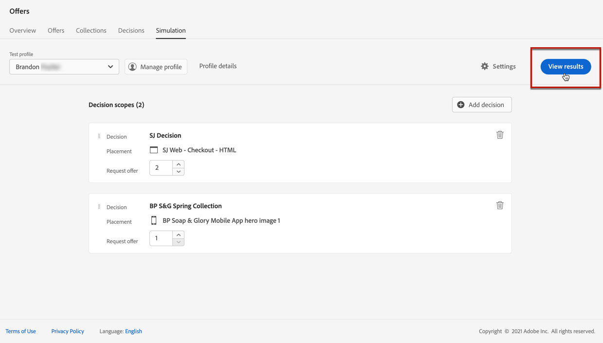
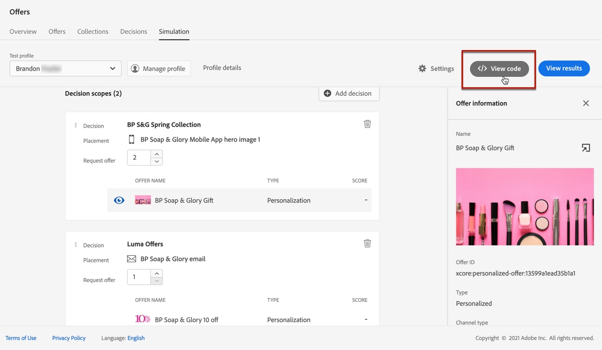

# Creación de simulaciones {#create-simulations}

>[!CONTEXTUALHELP]
>id="ajo_decisioning_simulation"
>title="Simulación de decisiones de oferta"
>abstract="La simulación permite simular qué ofertas se enviarán a un perfil de prueba para una ubicación determinada. Esto permite probar y perfeccionar varias versiones de las ofertas sin afectar a los destinatarios objetivo."

## Acerca de la simulación {#about-simulation}

Para validar la lógica de toma de decisiones, puede simular qué ofertas se enviarán a un perfil de prueba para una ubicación determinada.

<!--Simulation allows you to view the results of offer decisions as a selected profile.-->

Esto permite probar y perfeccionar varias versiones de las ofertas sin afectar a los destinatarios objetivo.

>[!NOTE]
>
>Esta capacidad simula una sola solicitud al [!DNL Decisioning] API. Más información sobre [Entrega de ofertas mediante la API de decisiones](../api-reference/offer-delivery-api/decisioning-api.md).

Para acceder a esta función, seleccione la **[!UICONTROL Simulación]** de la pestaña **[!UICONTROL Administración de decisiones]** > **[!UICONTROL Ofertas]** menú.

>[!NOTE]
>
>Como la simulación no genera ningún evento de decisión, la variable [límite](../offer-library/creating-personalized-offers.md#capping) el recuento de no se ve afectado.

<!--
➡️ [Discover this feature in video](#video)
-->

## Seleccionar perfiles de prueba {#select-test-profiles}

>[!CONTEXTUALHELP]
>id="ajo_decisioning_simulation_test_profile"
>title="Añadir perfiles de prueba"
>abstract="Puede añadir un perfil de prueba seleccionando un área de nombres de identidad y un valor de identidad correspondiente. Debe tener perfiles de prueba ya disponibles para poder utilizarlos en la simulación."
>additional-url="https://experienceleague.adobe.com/docs/journey-optimizer/using/audiences-profiles-identities/profiles/creating-test-profiles.html?lang=es" text="Creación de perfiles de prueba"

En primer lugar, se deben seleccionar los perfiles de prueba que se van a utilizar para la simulación.

>[!CAUTION]
>
>Debe tener perfiles de prueba disponibles para simular qué ofertas se les enviarán. Obtenga información sobre cómo [creación de perfiles de prueba](../../audience/creating-test-profiles.md).

1. Clic **[!UICONTROL Administrar perfil]**.

   

1. Seleccione el área de nombres de identidad que desee utilizar para identificar los perfiles de prueba. En este ejemplo, utilizaremos la variable **Correo electrónico** namespace.

   >[!NOTE]
   >
   >Un área de nombres de identidad define el contexto de un identificador, como una dirección de correo electrónico o un ID de CRM. Más información sobre las Áreas de nombres de identidad de Adobe Experience Platform [en esta sección](../../audience/get-started-identity.md){target="_blank"}.

1. Introduzca el valor de identidad y haga clic en **[!UICONTROL Ver]** para enumerar los perfiles disponibles.

   

1. Añada otros perfiles si desea probar diferentes datos de perfil y guarde la selección.

   

1. Una vez añadidos, todos los perfiles se enumeran en la lista desplegable debajo de **[!UICONTROL Perfil de prueba]**. Puede cambiar entre los perfiles de prueba guardados para mostrar los resultados de cada perfil seleccionado.

   

   >[!NOTE]
   >
   >Los perfiles seleccionados permanecerán enumerados como perfiles de prueba en la **[!UICONTROL Simulación]** tabulador de sesión en sesión hasta que se eliminan mediante **[!UICONTROL Administrar perfil]**.

1. Puede hacer clic en **[!UICONTROL Detalles del perfil]** vínculo para mostrar los datos de perfil seleccionados.

<!--Learn more on [selecting test profiles](messages/preview.md#select-test-profiles)-->

## Agregar ámbitos de decisión {#add-decision-scopes}

Ahora, seleccione las decisiones de oferta que desee simular en los perfiles de prueba.

1. Seleccionar **[!UICONTROL Agregar ámbito de decisión]**.

   

1. Seleccione una ubicación de la lista.

   

1. Se muestran las decisiones disponibles.

   * Puede utilizar el campo de búsqueda para restringir la selección.
   * Puede hacer clic en **[!UICONTROL Abrir decisiones de oferta]** para abrir la lista de todas las decisiones que ha creado. Más información sobre [decisiones](create-offer-activities.md).

   Seleccione la decisión que desee y haga clic en **[!UICONTROL Añadir]**.

   

1. El ámbito de decisión que acaba de definir se muestra en el espacio de trabajo principal.

   Puede ajustar el número de ofertas que desea solicitar. Por ejemplo, si selecciona 2, se mostrarán las 2 mejores ofertas para este ámbito de decisión.

   

   >[!NOTE]
   >
   >Puede solicitar hasta 30 ofertas.

1. Repita los pasos anteriores para agregar tantas decisiones como necesite.

   

   >[!NOTE]
   >
   >Incluso si define varios ámbitos de decisión, solo se simula una solicitud de API.

## Definición de ajustes de simulación {#define-simulation-settings}

Para editar la configuración predeterminada de las simulaciones, siga los pasos a continuación.

1. Clic **[!UICONTROL Configuración]**.

   

1. En el **[!UICONTROL Deduplicación]** , puede elegir permitir ofertas duplicadas entre decisiones o ubicaciones. Significa que se pueden asignar varias decisiones o ubicaciones a la misma oferta.

   

   >[!NOTE]
   >
   >De forma predeterminada, todos los indicadores de deduplicación están habilitados para la simulación, lo que significa que el motor de decisión permite duplicados y, por lo tanto, puede realizar la misma propuesta en varias decisiones/ubicaciones. Obtenga más información sobre [!DNL Decisioning] Propiedades de solicitud de API en [esta sección](../api-reference/offer-delivery-api/decisioning-api.md).

1. En el **[!UICONTROL Formato de respuesta]** , puede optar por incluir metadatos en la vista de código. Marque la opción correspondiente y seleccione los metadatos que desee. Se muestran en las cargas útiles de solicitud y respuesta al seleccionar **[!UICONTROL Ver código]**. Obtenga más información en la [Ver resultados de simulación](#simulation-results) sección.

   

   >[!NOTE]
   >
   >Al activar la opción, todos los elementos se seleccionan de forma predeterminada.

1. Haga clic en **[!UICONTROL Guardar]**.

>[!NOTE]
>
>Actualmente, para los datos de simulación solo puede utilizar el **[!UICONTROL Hub]** API.

<!--
In the **[!UICONTROL API for simulation]** section, select the API you want to use: **[!UICONTROL Hub]** or **[!UICONTROL Edge]**.
Hub and Edge are two different end points for simulation data.

In the **[!UICONTROL Context data]** section, you can add as many elements as needed.

    >[!NOTE]
    >
    >This section is hidden if you select Edge API in the section above. Hub allows the use of Context data, Edge does not.

Context data allows the user to add contextual data that could affect the simulation score.
For instance, let's say the customer has an offer for a discount on ice cream. In the rules for that offer, it can have logic that would rank it higher when the temperature is above 80 degrees. In simulation, the user could add context data: temperature=65 and that offer would rank lower, of they could add temperature=95 and that would rank higher.
-->

## Ver resultados de simulación {#simulation-results}

Una vez agregado el ámbito de decisión y seleccionado el perfil de prueba, puede ver los resultados.

1. Clic **[!UICONTROL Ver resultados]**.

   

1. Las mejores ofertas disponibles se muestran según el perfil seleccionado para cada decisión.

   Seleccione una oferta para mostrar sus detalles.

   

1. Clic **[!UICONTROL Ver código]** para mostrar las cargas útiles de solicitud y respuesta. [Más información](#view-code)

1. Seleccione otro perfil de la lista para mostrar los resultados de las decisiones de oferta para un perfil de prueba diferente.

1. Puede agregar, quitar o actualizar los ámbitos de decisión tantas veces como sea necesario.

>[!NOTE]
>
>Cada vez que cambie perfiles o actualice ámbitos de decisión, debe actualizar los resultados mediante la variable **[!UICONTROL Ver resultados]** botón.

## Ver código {#view-code}

1. Utilice el **[!UICONTROL Ver código]** para mostrar las cargas útiles de solicitud y respuesta.

   

   La vista de código muestra la información del desarrollador para el usuario actual. De forma predeterminada, la variable **[!UICONTROL Carga de respuesta]** se muestra.

   

1. Clic **[!UICONTROL Carga de respuesta]** o **[!UICONTROL Solicitar carga útil]** para desplazarse entre las dos pestañas.

   

1. Para utilizar la carga útil de la solicitud fuera de [!DNL Journey Optimizer] : para solucionar problemas, por ejemplo, cópielo utilizando **[!UICONTROL Copiar al portapapeles]** en la parte superior de la vista de código.

   

   <!--You cannot copy the response payload. ACTUALLY YES YOU CAN > to confirm with PM/dev? -->

   >[!NOTE]
   >
   >Al copiar las cargas útiles de solicitud o respuesta en su propio código, asegúrese de reemplazar {USER_TOKEN} y {API_KEY} con valores válidos. Obtenga información sobre cómo recuperar estos valores en la [API de Adobe Experience Platform](https://experienceleague.adobe.com/docs/experience-platform/landing/platform-apis/api-authentication.html?lang=es){target="_blank"} documentación.

