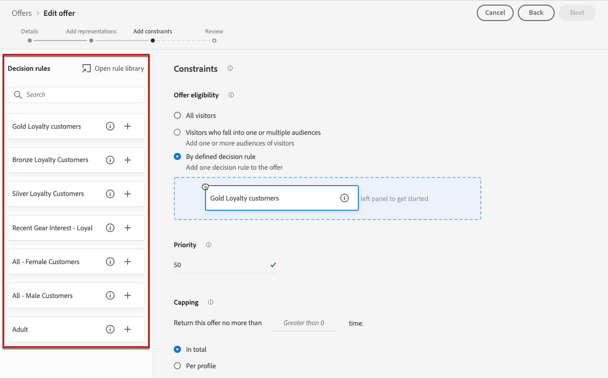

# Adición de restricciones a una oferta {#add-constraints}

>[!CONTEXTUALHELP]
>id="od_offer_constraints"
>title="Acerca de las restricciones de oferta"
>abstract="Con las restricciones, se puede especificar cómo se prioriza la oferta y cómo se presenta al usuario en comparación con otras ofertas."

>[!CONTEXTUALHELP]
>id="od_offer_priority"
>title="Acerca de la prioridad de las ofertas"
>abstract="En este campo, se puede especificar la configuración de prioridad de la oferta. Priority es un número que se usa para clasificar ofertas que cumplen con todas las restricciones, como elegibilidad, fechas y restricciones."

>[!CONTEXTUALHELP]
>id="ajo_decisioning_priority"
>title="Prioridad"
>abstract="La prioridad ayuda a definir la prioridad de la oferta en comparación con otras si el usuario cumple los requisitos para más de una oferta. Cuanto mayor sea la prioridad de una oferta, mayor será su prioridad en comparación con otras ofertas."

Las restricciones permiten definir las condiciones en las que se mostrará una oferta.

1. Configure las variables **[!UICONTROL Offer eligibility]**. [Más información](#eligibility)

   

1. Defina el **[!UICONTROL Priority]** de la oferta comparada con otras si el usuario cumple los requisitos para más de una oferta. Cuanto mayor sea la prioridad de una oferta, mayor será su prioridad en comparación con otras ofertas.

   

1. Especifique los **[!UICONTROL Capping]**, lo que significa el número de veces que se presentará la oferta. [Más información](#capping)

   

1. Haga clic en **[!UICONTROL Next]** para confirmar todas las restricciones definidas.

Por ejemplo, si establece las siguientes restricciones:

* La oferta se tendrá en cuenta para los usuarios que coincidan únicamente con la regla de decisión &quot;Clientes de Lealtad Dorada&quot;.
* La prioridad de la oferta se establece en &quot;50&quot;, lo que significa que la oferta se presentará antes que las ofertas con una prioridad entre 1 y 49, y después las que tengan una prioridad de al menos 51.
* La oferta se presentará solo una vez por usuario en todas las ubicaciones.

## Elegibilidad {#eligibility}

>[!CONTEXTUALHELP]
>id="ajo_decisioning_eligibility"
>title="Elegibilidad"
>abstract="La idoneidad de la oferta le permite restringir la oferta a perfiles específicos que defina mediante segmentos o reglas de decisión."

>[!CONTEXTUALHELP]
>id="od_offer_eligibility"
>title="Acerca de la idoneidad de la oferta"
>abstract="En esta sección, puede utilizar reglas de decisión para determinar qué usuarios son elegibles para la oferta."
>additional-url="https://video.tv.adobe.com/v/329373" text="Ver vídeo de demostración"

La variable **[!UICONTROL Offer eligibility]** le permite restringir la oferta a perfiles específicos que defina mediante segmentos o reglas de decisión.

>[!NOTE]
>
>Obtenga más información sobre el uso de **segmentos** versus **reglas de decisión** en [esta sección](#segments-vs-decision-rules).

* De forma predeterminada, la variable **[!UICONTROL All visitors]** está seleccionada, lo que significa que cualquier perfil puede presentarse como oferta.

   

* También puede limitar la presentación de la oferta a los miembros de una o varias [Segmentos de Adobe Experience Platform](../../segment/about-segments.md).

   Para ello, active la variable **[!UICONTROL Visitors who fall into one or multiple segments]** , luego agregue uno o varios segmentos del panel izquierdo y combínelos usando la opción **[!UICONTROL And]** / **[!UICONTROL Or]** operadores lógicos.

   

* Si desea asociar un [regla de decisión](../offer-library/creating-decision-rules.md) a la oferta, seleccione **[!UICONTROL By defined decision rule]** y, a continuación, arrastre la regla que desee desde el panel izquierdo hasta la **[!UICONTROL Decision rule]** .

   

   >[!CAUTION]
   >
   >Actualmente, las ofertas basadas en eventos no son compatibles con [!DNL Journey Optimizer]. Si crea una regla de decisión basada en un [evento](https://experienceleague.adobe.com/docs/experience-platform/segmentation/ui/segment-builder.html?lang=en#events){target=&quot;_blank&quot;}, no podrá aprovecharlo en una oferta.

### Uso de segmentos frente a reglas de decisión {#segments-vs-decision-rules}

Para aplicar una restricción, puede restringir la selección de ofertas a los miembros de una o varias **Segmentos de Adobe Experience Platform** o puede usar un **regla de decisión**, ambas soluciones corresponden a diferentes usos.

Básicamente, el resultado de un segmento es una lista de perfiles, mientras que una regla de decisión es una función ejecutada bajo demanda contra un solo perfil durante el proceso de toma de decisiones. A continuación se detalla la diferencia entre estos dos usos.

* **Segmentos**

   Por un lado, los segmentos son un grupo de perfiles de Adobe Experience Platform que coinciden con una lógica determinada basada en atributos de perfil y eventos de experiencia. Sin embargo, Administración de ofertas no vuelve a calcular el segmento, el cual puede no estar actualizado al presentar la oferta.

   Obtenga más información sobre los segmentos en [esta sección](../../segment/about-segments.md).

* **Reglas de decisión**

   Por otro lado, una regla de decisión se basa en los datos disponibles en Adobe Experience Platform y determina a quién se puede mostrar una oferta. Una vez seleccionada en una oferta o una decisión para una ubicación determinada, la regla se ejecuta cada vez que se toma una decisión, lo que garantiza que cada perfil obtenga la oferta más reciente y la mejor.

   Obtenga más información sobre las reglas de decisión en [esta sección](creating-decision-rules.md).

## Restricción de frecuencia {#capping}

>[!CONTEXTUALHELP]
>id="od_offer_globalcap"
>title="Acerca de la restricción de ofertas"
>abstract="En este campo, se puede especificar cuántas veces se puede presentar la oferta."

>[!CONTEXTUALHELP]
>id="ajo_decisioning_capping"
>title="Restricción"
>abstract="El límite se utiliza como una restricción para definir el número máximo de veces que se puede presentar una oferta."

El límite se utiliza como una restricción para definir el número máximo de veces que se puede presentar una oferta.

Limitar el número de veces que los usuarios obtienen ofertas específicas le permite evitar saturar a sus clientes y, por lo tanto, optimizar cada punto de contacto con la mejor oferta.

Para definir el límite, siga los pasos a continuación.

1. Defina el número de veces que se puede presentar la oferta.

   

   >[!NOTE]
   >
   >El número debe ser un número entero bueno a 0.

1. Especifique si desea que el límite se aplique a todos los usuarios o a un perfil específico:

   

   * Select **[!UICONTROL In total]** para definir cuántas veces se puede proponer una oferta en la audiencia de destino combinada, es decir, en todos los usuarios.

      Por ejemplo, si es un minorista de electrónica que tiene una &quot;oferta de proveedor de televisión&quot;, desea que la oferta solo se devuelva 200 veces en todos los perfiles.

   * Select **[!UICONTROL Per profile]** para definir cuántas veces se puede proponer una oferta al mismo usuario.

      Por ejemplo, si es un banco con una oferta de &quot;tarjeta de crédito Platinum&quot;, no desea que esta oferta se muestre más de 5 veces por perfil. De hecho, cree que si el usuario ha visto la oferta 5 veces y no ha actuado en ella, tiene más posibilidades de actuar en la siguiente mejor oferta.

1. Si ha definido varias [representaciones](#representations) para la oferta, especifique si desea aplicar restricciones **[!UICONTROL Across all placements]** o **[!UICONTROL For each placement]**.

   

   * **[!UICONTROL Across all placements]**: los recuentos de límite totales calcularán todas las decisiones en las ubicaciones asociadas a la oferta.

      Por ejemplo, si una oferta tiene una **Correo electrónico** ubicación y **Web** ubicación y establezca el límite en **2 por perfil en todas las ubicaciones**, cada perfil podría recibir la oferta hasta 2 veces en total, independientemente de la combinación de ubicación.

   * **[!UICONTROL For each placement]**: los recuentos de límite aplicarán recuentos de decisión para cada ubicación por separado.

      Por ejemplo, si una oferta tiene una **Correo electrónico** ubicación y **Web** ubicación y establezca el límite en **2 por perfil para cada ubicación**, cada perfil podría recibir la oferta hasta 2 veces para la ubicación del correo electrónico y otras 2 veces para la ubicación web.

1. Una vez guardada y aprobada, si la oferta se ha presentado el número de veces que ha especificado en este campo según los criterios definidos, su entrega se detendrá.

El número de veces que se propone una oferta se calcula en el momento de la preparación del correo electrónico. Por ejemplo, si prepara un mensaje de correo electrónico con una serie de ofertas, esos números se cuentan hasta el límite máximo, independientemente de si se envía o no el correo electrónico.

<!--If an email delivery is deleted or if the preparation is done again before being sent, the capping value for the offer is automatically updated.-->

>[!NOTE]
>
>Los contadores de límite se restablecerán cuando la oferta caduque o 2 años después de la fecha de inicio de la oferta, lo que suceda primero. Aprenda a definir la fecha de una oferta en [esta sección](creating-personalized-offers.md#create-offer).

### Influencia del cambio de fechas en el límite {#capping-change-date}

>[!CONTEXTUALHELP]
>id="ajo_decisioning_offer_change_date"
>title="Cambiar la fecha puede tener un impacto en el límite"
>abstract="Si se aplica un límite a esta oferta, este puede verse afectado al cambiar la fecha de inicio o de finalización."

Se debe tener cuidado al cambiar la fecha de una oferta, ya que esto puede tener un impacto en el límite si se cumplen las siguientes condiciones:

* La oferta es [aprobado](#review).
* [Restricción](#capping) ya se aplica a la oferta.
* El límite se define por perfil.

>[!NOTE]
>
>Aprenda a definir la fecha de una oferta en [esta sección](creating-personalized-offers.md#create-offer).

El límite de frecuencia por perfil almacena los recuentos de límite de cada perfil. Al cambiar la fecha de inicio y finalización de una oferta aprobada, el recuento de límite de algunos perfiles podría verse afectado según los diferentes escenarios que se describen a continuación.

Estos son los escenarios posibles cuando **cambio de la fecha de inicio de una oferta**:

| Escenario: Si... | Qué sucede: entonces... | Posible impacto en el recuento de límite |
|--- |--- |--- |
| ... la fecha de inicio de la oferta se actualiza antes de que comience la fecha de inicio de la oferta original, | ... el recuento de límite empezará en la nueva fecha de inicio. | No |
| ... la nueva fecha de inicio es anterior a la fecha de finalización actual, | ... el límite continuará con una nueva fecha de inicio y el recuento de límite anterior para cada perfil seguirá adelante. | No |
| ... la nueva fecha de inicio es posterior a la fecha de finalización actual, | ... el límite actual caducará y el nuevo recuento de límite volverá a empezar desde 0 para todos los perfiles en la nueva fecha de inicio. | Sí |

Estos son los escenarios posibles cuando **ampliación de la fecha de finalización de una oferta**:

| Escenario: Si... | Qué sucede: entonces... | Posible impacto en el recuento de límite |
|--- |--- |--- |
| ... se produce una solicitud de toma de decisiones antes de la fecha de finalización de la oferta original, | ... el recuento de límite se actualizará y el recuento de límite anterior para cada perfil se mantendrá. | No |
| ... no se produce ninguna solicitud de toma de decisiones antes de la fecha de finalización original, | ... el recuento de límite se restablecerá en la fecha de finalización original de cada perfil. El nuevo recuento de límite vuelve a empezar desde 0 para cualquier nueva solicitud de toma de decisiones que se produzca después de la fecha de finalización original. | Sí |

**Ejemplo**

Supongamos que tiene una oferta con una fecha de inicio original configurada como **Enero de 1**, caducando el **31 de enero**.

1. La oferta se presenta con los perfiles X, Y y Z.
1. Activado **Enero de 10**, la fecha de finalización de la oferta cambia a **15 de febrero**.
1. **Del 11 de enero al 31 de enero**, solo se presenta la oferta en el perfil Z.

   * Debido a que se produjo una solicitud de toma de decisiones antes de la fecha de finalización original **para el perfil Z**, la fecha de finalización de la oferta se puede ampliar a **15 de febrero**.
   * Sin embargo, como no se produjo ninguna actividad antes de la fecha de finalización original de **perfiles X e Y**, sus contadores caducarán y sus recuentos de límite se restablecerán a 0 en **31 de enero**.

