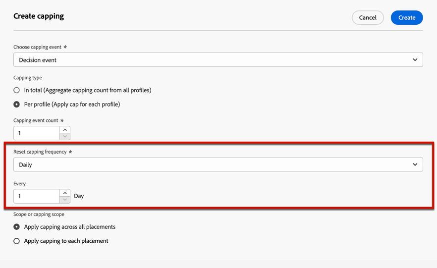

# Añadir restricciones a una oferta {#add-constraints}

>[!CONTEXTUALHELP]
>id="od_offer_constraints"
>title="Acerca de las restricciones de oferta"
>abstract="Con las restricciones, se puede especificar cómo se prioriza la oferta y cómo se presenta al usuario en comparación con otras ofertas."

>[!CONTEXTUALHELP]
>id="ajo_decisioning_constraints"
>title="Acerca de las restricciones de oferta"
>abstract="Con las restricciones, se puede especificar cómo se prioriza la oferta y cómo se presenta al usuario en comparación con otras ofertas."

>[!CONTEXTUALHELP]
>id="od_offer_priority"
>title="Acerca de la prioridad de las ofertas"
>abstract="En este campo, se puede especificar la configuración de prioridad de la oferta. La prioridad es un número que se utiliza para clasificar ofertas que cumplen todas las restricciones, como idoneidad, fechas y límite."

>[!CONTEXTUALHELP]
>id="ajo_decisioning_priority"
>title="Establecer prioridad"
>abstract="La prioridad ayuda a definir la prioridad de la oferta en comparación con otras si el usuario cumple los requisitos para más de una oferta. Cuanto mayor sea la prioridad de una oferta, mayor será su prioridad en comparación con otras ofertas."

Las restricciones permiten definir las condiciones en las que se mostrará una oferta.

1. Configurar la **[!UICONTROL idoneidad de la oferta]**. [Más información](#eligibility)

   

1. Defina la **[!UICONTROL Prioridad]** de la oferta en comparación con otras si el usuario cumple los requisitos para más de una oferta. Cuanto mayor sea la prioridad de una oferta, mayor será su prioridad en comparación con otras ofertas.

   

   >[!NOTE]
   >
   >La prioridad de oferta debe ser un valor entero (sin decimales).

1. Especifique la **[!UICONTROL restricción]** de la oferta, es decir, el número de veces que se presentará la oferta. [Más información](#capping)

   

1. Haga clic en **[!UICONTROL Siguiente]** para confirmar todas las restricciones que definió.

Por ejemplo, si establece las restricciones siguientes:

* La oferta se considerará para los usuarios que coincidan únicamente con la regla de decisión &quot;Clientes de fidelidad de oro&quot;.
* La prioridad de la oferta se establece en &quot;50&quot;, lo que significa que la oferta se presentará antes que las ofertas con una prioridad entre 1 y 49 y después de las que tienen una prioridad de al menos 51.
* La oferta se presentará solo una vez al mes por usuario en todas las ubicaciones.

## Idoneidad {#eligibility}

>[!CONTEXTUALHELP]
>id="ajo_decisioning_eligibility"
>title="Definir idoneidad"
>abstract="Por defecto, cualquier perfil podrá recibir la oferta, pero puede utilizar públicos o reglas de decisión para reservarla a perfiles específicos."

>[!CONTEXTUALHELP]
>id="od_offer_eligibility"
>title="Acerca de la idoneidad de la oferta"
>abstract="En esta sección, puede utilizar reglas de decisión para determinar qué usuarios podrán recibir la oferta."

<!--additional-url="https://video.tv.adobe.com/v/329373" text="Watch demo video"-->

>[!CONTEXTUALHELP]
>id="ajo_decisioning_total_profile_estimate"
>title="Estimación de perfiles totales"
>abstract="Al seleccionar públicos o reglas de decisión, puede ver información sobre los perfiles calificados estimados."

La sección **[!UICONTROL idoneidad de la oferta]** le permite restringir la oferta a perfiles específicos que defina mediante audiencias o reglas de decisión.

>[!NOTE]
>
>Obtenga más información sobre cómo usar **audiencias** en comparación con **reglas de decisión** en [esta sección](#segments-vs-decision-rules).

* De manera predeterminada, la opción **[!UICONTROL Todos los visitantes]** está seleccionada, lo que significa que cualquier perfil podrá recibir la oferta.

  

* También puede limitar la presentación de la oferta a los miembros de una o varias [audiencias de Adobe Experience Platform](../../audience/about-audiences.md).

  Para ello, active la opción **[!UICONTROL Visitantes que pertenecen a una o varias audiencias]**, luego agregue una o varias audiencias desde el panel izquierdo y combínelas con los operadores lógicos **[!UICONTROL And]** / **[!UICONTROL Or]**.

  

* Si desea asociar una [regla de decisión](../offer-library/creating-decision-rules.md) específica a la oferta, seleccione **[!UICONTROL Por regla de decisión definida]** y luego arrastre la regla deseada del panel izquierdo al área **[!UICONTROL Regla de decisión]**.

  

  >[!CAUTION]
  >
  >Actualmente no se admiten ofertas basadas en eventos en [!DNL Journey Optimizer]. Si crea una regla de decisión basada en un [evento](https://experienceleague.adobe.com/docs/experience-platform/segmentation/ui/segment-builder.html#events){target="_blank"}, no podrá aprovecharla en una oferta.

Al seleccionar audiencias o reglas de decisión, puede ver información sobre los perfiles cualificados estimados. Haga clic en **[!UICONTROL Actualizar]** para actualizar los datos.

>[!NOTE]
>
>Las estimaciones de perfil no están disponibles cuando los parámetros de regla incluyen datos que no están en el perfil, como datos de contexto. Por ejemplo, una regla de idoneidad que requiere que el clima actual sea de ≥80 grados.

### Uso de audiencias o reglas de decisión {#segments-vs-decision-rules}

Para aplicar una restricción, puede restringir la selección de ofertas a los miembros de una o varias **audiencias de Adobe Experience Platform**, o puede usar una **regla de decisión**, ambas soluciones correspondientes a usos diferentes.

Básicamente, el resultado de una audiencia es una lista de perfiles, mientras que una regla de decisión es una función ejecutada a petición en un único perfil durante el proceso de toma de decisiones. A continuación se detalla la diferencia entre estos dos usos.

* **Públicos**

  Por un lado, las audiencias son un grupo de perfiles de Adobe Experience Platform que coinciden con una lógica determinada en función de atributos de perfil y eventos de experiencia. Sin embargo, Administración de ofertas no vuelve a calcular la audiencia, que puede no estar actualizada al presentar la oferta.

  Puede obtener más información sobre los públicos en [esta sección](../../audience/about-audiences.md).

* **Reglas de decisión**

  Por otro lado, una regla de decisión se basa en los datos disponibles en Adobe Experience Platform y determina a quién se puede mostrar una oferta. Una vez seleccionada en una oferta o una decisión para una ubicación determinada, la regla se ejecuta cada vez que se toma una decisión, lo que garantiza que cada perfil obtenga la última y la mejor oferta.

  Obtenga más información acerca de las reglas de decisión en [esta sección](creating-decision-rules.md).

## Límite {#capping}

>[!CONTEXTUALHELP]
>id="od_offer_globalcap"
>title="Acerca del límite de ofertas"
>abstract="En este campo, se puede especificar cuántas veces se puede presentar la oferta."

>[!CONTEXTUALHELP]
>id="ajo_decisioning_capping"
>title="Usar límite"
>abstract="Para evitar solicitar en exceso a sus clientes, utilice la restricción para definir el número máximo de veces que se puede presentar una oferta. Se pueden crear hasta 10 reglas de límite para una oferta determinada."
>additional-url="https://experienceleague.adobe.com/en/docs/journey-optimizer/using/decisioning/offer-decisioning/managing-offers-in-the-offer-library/configure-offers/add-constraints#capping" text="Cambiar las fechas puede afectar al límite"

El límite se utiliza como restricción para definir el número máximo de veces que se puede presentar una oferta. Limitar el número de veces que los usuarios obtienen ofertas específicas le permite evitar solicitar en exceso a sus clientes y, por lo tanto, optimizar cada punto de contacto con la mejor oferta.

Se pueden añadir hasta 10 reglas de límite para una oferta determinada. Para establecer una regla de límite, haga clic en el botón **[!UICONTROL Crear límite]** y siga los pasos a continuación.

1. Defina qué **[!UICONTROL evento de límite]** se tendrá en cuenta para aumentar el contador. [Más información](#capping-event)

1. Elija si desea que el límite se aplique a todos los usuarios o solo a un perfil. [Más información](#capping-type)

1. Defina el número de veces que se puede presentar la oferta. [Más información](#capping-count)

1. Establezca la **[!UICONTROL Frecuencia]** para definir la frecuencia con la que se restablecerá el recuento límite. [Más información](#frequency-capping)

1. Si ha definido varias [representaciones](add-representations.md) para su oferta, especifique si desea aplicar un límite de **en todas las ubicaciones** o **a cada ubicación**. [Más información](#placements)

1. Una vez guardada y aprobada, si la oferta se ha presentado el número de veces especificado en este campo según los criterios y el periodo de tiempo definido, se detendrá su entrega.

El número de veces que se propone una oferta se calcula en el momento de la preparación del correo electrónico. Por ejemplo, si prepara un mensaje de correo electrónico con una serie de ofertas, esos números se cuentan hasta el límite máximo, independientemente de si se envía o no el correo electrónico.

<!--If an email delivery is deleted or if the preparation is done again before being sent, the capping value for the offer is automatically updated.-->

>[!NOTE]
>
>Los contadores de límite se restablecerán cuando la oferta caduque o 2 años después de la fecha de inicio de la oferta, lo que ocurra primero. Aprenda a definir la fecha de una oferta en [esta sección](creating-personalized-offers.md#create-offer).

### Evento de límite {#capping-event}

>[!CONTEXTUALHELP]
>id="ajo_decisioning_frequency_capping_impression"
>title="Impresión"
>abstract="El uso de impresiones como eventos de límite solo está disponible para canales entrantes."

El campo **[!UICONTROL Elegir evento de límite]** le permite definir qué evento se tendrá en cuenta para aumentar el contador:

* **[!UICONTROL Evento de decisión]** (valor predeterminado): Número máximo de veces que se puede presentar una oferta.
* **[!UICONTROL Clics]**: Número máximo de veces que un usuario puede hacer clic en la oferta.
* **[!UICONTROL Impresión]**: Número máximo de veces que la oferta se puede mostrar a un usuario.

  >[!NOTE]
  >
  >El uso de impresiones como eventos de límite solo está disponible para **canales entrantes**.

* **[!UICONTROL Evento personalizado]**: puede definir un evento personalizado que se utilizará para limitar el número de ofertas enviadas. Por ejemplo, puede limitar el número de canjes hasta que sean iguales a 10 000 o hasta que un perfil determinado se haya canjeado 1 vez. Para ello, use [esquemas XDM](https://experienceleague.adobe.com/docs/experience-platform/xdm/home.html?lang=es){target="_blank"} de Adobe Experience Platform para generar una regla de evento personalizada.

  <!--For example, you can cap on the number of redemptions so that the offer can be shown until redemptions equal 10,000. You can only select XDM ExperienceEvents. -->

  En el siguiente ejemplo, desea limitar el número de cierres de compra.

   1. Seleccione **[!UICONTROL Custom Event]** de la lista y use el botón **[!UICONTROL Agregar evento personalizado]**.

   1. Use el generador **[!UICONTROL Crear reglas de evento personalizadas]** para seleccionar el evento correspondiente. Puede elegir cualquier acción del usuario sobre la que desee limitar las ofertas.

      Aquí elige **[!UICONTROL Commerce]** > **[!UICONTROL Cierres de compra]** > **[!UICONTROL Value]** y selecciona **[!UICONTROL exists]** en la lista desplegable.

      

   1. Una vez creada la regla, se muestra en el campo **[!UICONTROL Consulta de evento personalizado]**.

      

>[!CAUTION]
>
>Para todos los eventos de límite, excepto el evento de decisión, es posible que los comentarios de la administración de decisiones no se recopilen automáticamente, lo que podría provocar que el contador de límite no se incremente correctamente. [Más información](../data-collection/data-collection.md)
>
>Para asegurarse de que se rastrea y contabiliza cada evento de límite en el contador de límite, asegúrese de que el esquema utilizado para recopilar eventos de experiencia incluya el grupo de campos correcto para ese evento. [Más información](../data-collection/schema-requirement.md)

### Tipo de límite {#capping-type}

Puede especificar si desea que el límite se aplique a todos los usuarios o a un perfil específico:

* Seleccione **[!UICONTROL En total]** para definir cuántas veces se puede proponer una oferta en la audiencia de destinatario combinada, es decir, en todos los usuarios.

  Por ejemplo, si es un retailer de electrónica con una &quot;oferta de venta de televisores&quot;, quiere que la oferta solo se devuelva 200 veces en todos los perfiles.

* Seleccione **[!UICONTROL Por perfil]** para definir cuántas veces se puede proponer una oferta al mismo usuario.

  Por ejemplo, si es un banco con una oferta de &quot;tarjeta de crédito Platinum&quot;, no desea que esta oferta se muestre más de 5 veces por perfil. De hecho, cree que si el usuario ha visto la oferta 5 veces y no ha actuado en consecuencia, tiene una mayor oportunidad de actuar en la siguiente mejor oferta.

### Recuento límite {#capping-count}

El campo **[!UICONTROL Límite de recuento de límite]** le permite especificar la cantidad de veces que se puede presentar la oferta.

>[!NOTE]
>
>El número debe ser un número entero mayor que 0.

Por ejemplo, ha definido un evento de límite personalizado como, por ejemplo, el número de cierres de compra que se tiene en cuenta. Si introduce 10 en el campo **[!UICONTROL Límite de recuento de límite]**, no se enviarán más ofertas después de 10 cierres de compra.

### Restricción de frecuencia {#frequency-capping}

>[!CONTEXTUALHELP]
>id="ajo_decisioning_frequency_capping"
>title="Definir la frecuencia de límite"
>abstract="Puede elegir restablecer el contador de límite de ofertas de forma diaria, semanal o mensual. Tenga en cuenta que después de publicar la oferta con la restricción de frecuencia habilitada, no podrá cambiar la frecuencia que ha sido definida."

El campo **[!UICONTROL Restablecer frecuencia límite]** le permite definir la frecuencia con la que se restablece el recuento límite. Para ello, defina el periodo de tiempo para el recuento (diario, semanal o mensual) e introduzca el número de días/semanas/meses de su elección. Por ejemplo, si desea que el recuento límite se restablezca cada 2 semanas, seleccione **[!UICONTROL Semanalmente]** en la lista desplegable correspondiente y escriba **2** en el otro campo.

* El restablecimiento del contador de límite de frecuencia se produce a las **12 a. m. UTC**, el día que haya definido o el primer día de la semana o del mes, según corresponda. El día de inicio de la semana es **domingo**. Cualquier duración que elija no puede exceder de **2 años** (es decir, el número correspondiente de meses, semanas o días).

* Después de publicar la oferta, no podrá cambiar el período de tiempo (mensual, semanal o diario) seleccionado para la frecuencia. Puede seguir editando la restricción de frecuencia si la oferta tiene el estado **[!UICONTROL Borrador]** y nunca antes se había publicado con la restricción de frecuencia habilitada.

* Puede haber un tiempo de búfer de hasta 15 minutos antes de que los eventos se contabilicen como restricciones de límite de frecuencia, ya sea cuando se aprueba la oferta o cuando se crea el límite, lo que ocurra en último lugar.

+++ **Lectura obligatoria: límite de frecuencia y API de administración de decisiones**

El contador de restricción de frecuencia se ha actualizado y está disponible en una decisión de la [API de Edge Decisioning](../api-reference/offer-delivery-api/start-offer-delivery-apis.md#edge) en menos de 3 segundos.

Cada región concentradora está asociada con una o más regiones perimetrales. Las reglas de límite de frecuencia se generan y exportan desde cada región de concentrador a sus regiones de límite asociadas. Siempre que se toma una decisión mediante la API de Edge Decisioning, el sistema aplica las reglas disponibles en la misma región perimetral:

* Si hay una regla que coincida, se incrementa el contador de límite de frecuencia del perfil.
* De lo contrario, no se crea ningún contador para el perfil y no se aplica la regla de límite de frecuencia. Por lo tanto, el perfil seguirá recibiendo ofertas personalizadas incluso si se supera el umbral de límite.

Por ejemplo, consideremos la región central de su organización como *NLD2* y está enviando una solicitud de toma de decisiones desde Europa (*IRL1* región perimetral). En este escenario, la solicitud de toma de decisiones incrementará el contador del perfil, ya que las reglas están disponibles en la región *IRL1* de (Irlanda). Sin embargo, si la solicitud de toma de decisiones se origina en una región como Japón (*JPN3*), que no es una región perimetral vinculada a la región concentradora *NLD2* de (Países Bajos), no se creará ningún contador y no se aplicarán las reglas de límite de frecuencia.

>[!NOTE]
>
>Cuando los contadores se propagan de un extremo a otro o de una región a otra, puede producirse un retraso de hasta 30 minutos.

Para obtener más información sobre las regiones de concentrador y perimetral asociadas a su organización, póngase en contacto con su representante de Adobe.

Con las otras API, el contador de límite de frecuencia se actualiza de la siguiente manera:

* En una decisión de la [API de decisiones](../api-reference/offer-delivery-api/start-offer-delivery-apis.md#decisioning), el contador de límite de frecuencia se puede actualizar con unos minutos de retraso, según el tráfico.

* En una decisión de la [API de decisiones por lotes](../api-reference/offer-delivery-api/batch-decisioning-api.md), se usan instantáneas donde el contador de límite de frecuencia permanece fijo. Siempre que se utilice la misma instantánea, el contador permanece sin cambios.

+++

### Límite y ubicaciones {#placements}

Si ha definido varias [representaciones](add-representations.md) para la oferta, especifique si desea aplicar un límite en todas las ubicaciones o en cada una de ellas.

* **[!UICONTROL Aplicar límite en todas las ubicaciones]**: el recuento de límite totalizará todas las decisiones en las ubicaciones asociadas con la oferta.

  Por ejemplo, si una oferta tiene una ubicación **Email** y **Web**, y establece el límite en **2 por perfil en todas las ubicaciones**, entonces cada perfil podría recibir la oferta hasta dos veces en total, independientemente de la combinación de ubicaciones.

* **[!UICONTROL Aplicar límite a cada ubicación]**: los recuentos de límite aplicarán recuentos de decisión para cada ubicación por separado.

  Por ejemplo, si una oferta tiene una ubicación **Email** y **Web**, y establece el límite en **2 por perfil para cada ubicación**, cada perfil podría recibir la oferta hasta 2 veces por la ubicación de correo electrónico y otras 2 veces por la ubicación web.

### Impacto del cambio de fechas en el límite {#capping-change-date}

>[!CONTEXTUALHELP]
>id="ajo_decisioning_offer_change_date"
>title="Cambiar las fechas puede afectar al límite"
>abstract="Si se aplica un límite a esta oferta, este se puede ver afectado al cambiar la fecha de inicio o de finalización."

Debe proceder con cuidado al cambiar la fecha de una oferta, ya que esto puede tener un impacto en el límite si se cumplen las siguientes condiciones:

* La oferta está [aprobada](#review).
* [El límite](#capping) ya se ha aplicado a la oferta.
* El límite se define por perfil.

>[!NOTE]
>
>Aprenda a definir la fecha de una oferta en [esta sección](creating-personalized-offers.md#create-offer).

Límite por perfil almacena los recuentos de límite de cada perfil. Al cambiar la fecha de inicio y finalización de una oferta aprobada, el recuento de límite de algunos perfiles podría verse afectado según los diferentes escenarios que se describen a continuación.

Estos son los escenarios posibles cuando **se cambia la fecha de inicio de una oferta**:

| Escenario: Si... | Qué sucede: entonces... | Posible impacto en el recuento de límite |
|--- |--- |--- |
| ... la fecha de inicio de la oferta se actualiza antes de que comience la fecha de inicio de la oferta original, | ... el recuento límite comienza en la nueva fecha de inicio. | No |
| ... la nueva fecha de inicio es anterior a la fecha de finalización actual, | ... el límite seguirá con una nueva fecha de inicio y se arrastrará el recuento de límite anterior de cada perfil. | No |
| ... la nueva fecha de inicio es posterior a la fecha de finalización actual, | ... el límite actual caducará y el nuevo recuento de límite volverá a empezar desde 0 para todos los perfiles en la nueva fecha de inicio. | Sí |

Estos son los posibles escenarios al **ampliar una fecha de finalización de oferta**:

| Escenario: Si... | Qué sucede: entonces... | Posible impacto en el recuento de límite |
|--- |--- |--- |
| ... se produce una solicitud de toma de decisiones antes de la fecha de finalización de la oferta original, | ... se actualizará el recuento de límite y se arrastrará el recuento de límite anterior de cada perfil. | No |
| ... no se produce ninguna solicitud de toma de decisiones antes de la fecha de finalización original, | ... el recuento de límite se restablecerá en la fecha de finalización original de cada perfil. El nuevo recuento de límite volverá a empezar desde 0 para cualquier nueva solicitud de toma de decisiones que se produzca después de la fecha de finalización original. | Sí |

**Ejemplo**

Supongamos que tiene una oferta con una fecha de inicio original establecida en **Enero de 1** y que caduca el **31 de enero**.

1. Los perfiles X, Y y Z se presentan en la oferta.
1. El **10 de enero**, la fecha de finalización de la oferta cambia al **15 de febrero**.
1. **Del 11 de enero al 31 de enero**, solo se presenta la oferta en el perfil Z.

   * Debido a que se produjo una solicitud de toma de decisiones antes de la fecha de finalización original **para el perfil Z**, la fecha de finalización de la oferta se puede ampliar al **15 de febrero**.
   * Sin embargo, como no se produjo ninguna actividad antes de la fecha de finalización original de los **perfiles X e Y**, sus contadores caducarán y sus recuentos de límite se restablecerán a 0 el **31 de enero**.

